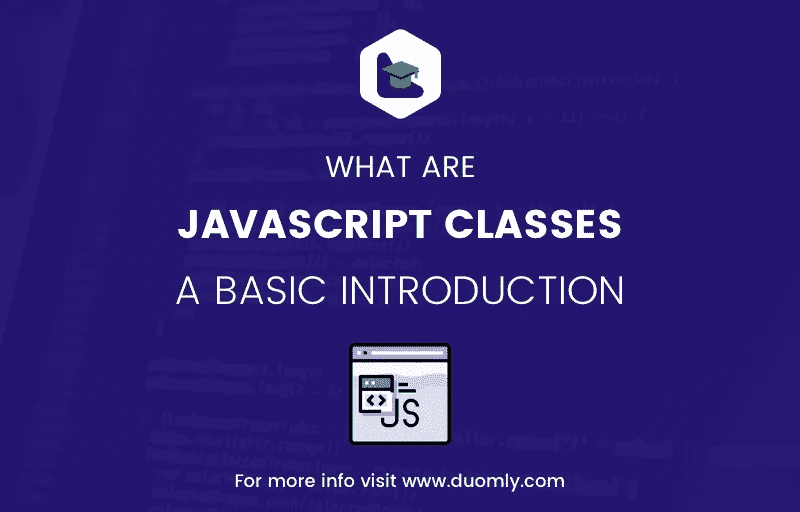

# 什么是 Javascript 类？基本介绍

> 原文：<https://medium.com/duomly-blockchain-online-courses/what-are-javascript-classes-a-basic-introduction-ad24914ec8f0?source=collection_archive---------5----------------------->



[Duomly — programming online courses](https://www.duomly.com)

本文最初发布于:[https://www . blog . duomly . com/what-are-JavaScript-classes-and-how-to-use-them/](https://www.blog.duomly.com/what-are-javascript-classes-and-how-to-use-them/)

类是面向对象编程中的一个基本概念，在许多编程语言中都有使用，但在 Javascript 中却不是这样。在 ecmascript 2015(ES6)之前，JS 中不存在类。在 2015 年的更新中，引入了类作为现有原型继承模型的语法糖。类为对象和继承带来了更舒适、更易读的语法。

Javascript 中的 Class 是函数的一种类型，但不是用 function 关键字初始化，而是使用 class 关键字。

在这篇文章中，我将试着介绍什么是类以及我们如何使用它们。它将解释:

*   定义类，
*   构造函数方法，
*   定义方法，
*   扩展类和超级关键字，
*   getters 和 setters。

开始吧！

**要检查代码执行情况，请在浏览器中打开控制台并尝试执行代码(如果您使用的是谷歌浏览器，请在页面上右键单击并选择调查)*

# 1.定义类别

要定义一个类，我们必须从一个类关键字开始，然后是类名，然后是名字后面的花括号。接下来，在已定义的类中，我们设置一个分配了属性的构造函数，每当初始化一个类时都会调用它。让我们来看一个代码示例:

```
class Person {
    constructor(name,age){
        this.name=name;
        this.age=age;
    }
}
```

在上面的代码示例中，使用构造函数定义了 Person 类，我们在其中设置了 name 和 age 属性。为了初始化这个类，我们必须使用一个带有类名的新关键字，像它这样的参数与对象一起工作。让我们看看代码示例:

```
var person = new Person('Peter', 25);
```

在上面的代码中，我们用两个参数 name= "Peter "和 age= "25 "初始化了一个类，并将它赋给了变量 person。

值得一提的是，虽然类是函数，但在这种情况下，提升不起作用。这意味着每个类都必须首先定义，然后初始化。否则会出现参考误差。此外，记住类中的代码处于“严格模式”是很好的。它将抛出更多的错误，并帮助我们避免键入错误或语法错误。

# 2.构造函数方法

在定义类时，我们使用了构造函数。现在我们来解释一下什么是 Javascript 类中的构造函数。当我们定义一个类时，它是一个必须包含在类中的方法，它是一个将属性分配给类的作用域的方法。构造函数需要新的关键字才能工作。这意味着如果我们像上面的例子那样初始化类，构造函数也将被初始化。此外，每个类只能使用一个构造函数。如果你没有在你的类中添加一个构造函数，Javascript 会用一个空的来帮你做这个:**构造函数(){}**

# 3.定义方法

在一个类中，我们可以定义不同于构造函数的方法。让我们看看它在代码中的样子:

```
class Person {
  constructor(name, age) {
    this.name = name;
    this.age = age;
  } introduceYourself() {
    return 'Hello, my name is ' + this.name;
  }
}var person = new Person('Mark', 30);
person.introduceYourself(); // returns 'Hello, my name is Mark'
```

在上面的例子中，我在 Person 类中创建了一个新方法，名为**自我介绍**。此方法采用 this.name 并返回字符串。如您所见，创建方法类似于创建函数，但不使用函数关键字。在代码示例中，您可以看到如何调用方法。

也有可能在类中创建静态方法。区别在于静态方法只能从类中访问，而不能从类创建的对象中访问。让我们检查代码示例，了解如何定义静态方法:

```
class Person {
  constructor(name, age) {
    this.name = name;
    this.age = age;
  } static howAreYou() {
    return 'I am okey, and you?';
  }
}Person.howAreYou(); // returns 'I am okey, and you?';
var person = new Person('Mark', 30);
person.howAreYou(); // returns an error
```

为了让类知道我们定义的方法应该是静态的，我们必须在方法定义的开头添加一个 static 关键字。然后，你可以看到，如果你试图调用它来形成对象，它将返回一个错误，如果你直接从类中访问它，那么没问题，结果将是预期的。

# 4.扩展类和超级关键字

有时我们想“复制”这个类，并给它添加一些新的方法或参数。在这种情况下，扩展类非常方便。我们可以访问父类的所有特性，还可以添加一些新的特性。为了从父类创建子类，我们使用 extend 关键字。让我们看看它在示例中是如何工作的:

```
class Person {
  constructor(name, age) {
    this.name = name;
    this.age = age;
  } yourAge() {
    return 'I am ' + this.age;
  }
}class Kid extends Person {
  howOldAreYou() {
    return super.yourAge() + '. I am a child';
  } isAdult() {
    if (this.age >= 18) {
      return true;
    } else {
      return false;
    }
  }
}var child = new Kid('Mary', 12);
child.howOldAreYou(); // returns 'I am 12\. I am a child';
child.isAdult(); // returns false;
```

在上面的代码中，我们将 Person 类扩展为 Kid 类，并在 Kid 类 howOldAreYou()中使用了 yourAge()方法，该方法与一个 super 关键字一起使用，该关键字允许在 child 类中使用 parent 方法。this.age 属性也用于检查 isAdult()函数中的条件。

# 5.Getters 和 setters

像类中的对象一样，我们也可以使用 getters 和 setters。Getter 是用 get 关键字创建的，setter 是用 set 关键字创建的。当我们想在将值赋给对象之前检查或修改它时，使用 getters 和 setters 是个好主意。让我们检查一下代码，看看它是如何工作的:

```
class Person {
  constructor(name) {
    // setter is called
    this._name = name;
  } get name() {
    return this._name;
  } set name(value) {
    this._name = value;
  }
}var newPerson = new Person('Mary');
newPerson.name; // returns 'Mary'
newPerson.name = 'Peter';
newPerson.name; // returns 'Peter'
```

在上面的例子中，我们可以看到 name 属性的 getter 和 setter。在构造函数中，当此。_name 时，将调用 setter 来设置名称。Getter 和 setter 不能与它们设置或获取的属性同名。此外，如果您想使用 setter 来设置新的属性值，请像属性一样使用不带括号的 setter。

# 结论

Javascript 中的类特性相对较新，但是类的功能一直存在，比如原型继承模型和构造函数。现在，语法更加友好，创建清晰易读的代码也更加容易。在本文中，我介绍了关于 Javascript 类的最重要的信息，从定义类开始，经过构造函数和方法，扩展类，最后使用 getters 和 setters。我希望这篇文章中的知识将阐明 Javascript 中类的用法，并帮助您使用类语法实现您的代码。我认为类的实现对开发人员来说非常方便，但是没有它也可以实现同样的功能。

你认为在 ES6 中实现一个类特性是个好主意吗？


[Duomly — programming online courses](https://www.duomly.com)

感谢您的阅读。

本文由我们的队友安娜提供。