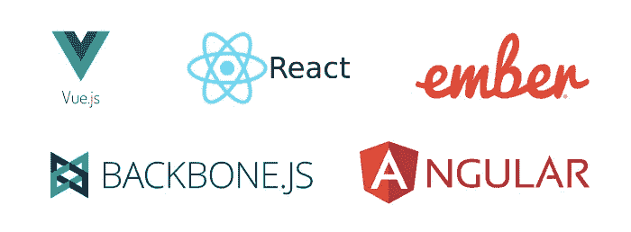
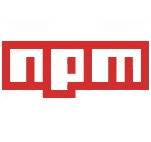
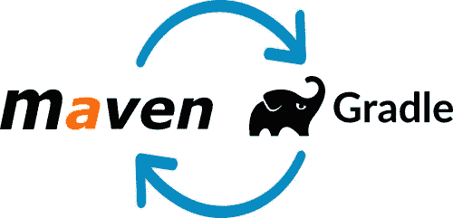
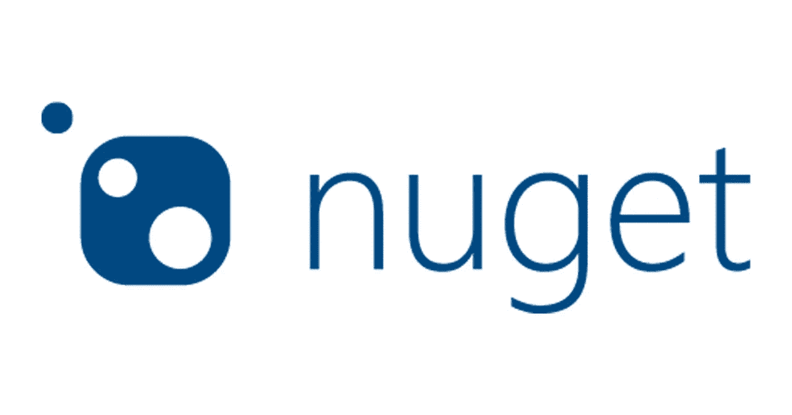

# 什么是库、框架和包？

> 原文：<https://medium.com/quick-code/what-are-libraries-frameworks-and-packages-b614b5f3e67f?source=collection_archive---------3----------------------->

我们都听说过 Angular、React、Vue、Node 包，你们中的许多人甚至会经常使用这些包。



但是通常我们真的不清楚这些是什么，为什么我们首先需要这些。

# 所以，一个库基本上是一个程序的集合或者一堆别人为你写的方便的代码，你可以在你的程序中使用它们。一个框架通常是一堆库，有时(但不总是)是一些外部工具，都是为了解决一个特定的任务。比如制作网站(web 框架)，或者展示用户界面(UI 框架)等。
一个包意味着一些代码，这些代码已经从其他代码中分离出来，这样当有人创建了他们自己的库、框架后，他们可以很容易地将它们打包并在其他人之间分发。

总之，这些包含可重用的代码片段，任何人都可以将它们合并到他们的项目中，这样他们就不会浪费时间重新发明轮子，而是专注于我们项目的主要目标。

例如，如果你正在编写一个程序，其中你将处理整数，你将需要在你的代码中多次执行加法和减法。

```
def calc(num1, num2, operand): 
if(operand == '+'): 
  return (num1 + num2) 
else: 
  return (num1 - num2)
```

恭喜，你刚刚创建了一个图书馆。现在，对于剩下的代码，你需要做的就是在每次需要执行加法或减法时调用这个函数。

现在问题来了，我们如何为我们的代码找到这些包和框架？就像当我们需要搜索 Android 应用程序时，我们会去 play store，对于 iOS 应用程序，我们有 AppStore，类似地，对于管理框架和包，我们有“包管理器”。

我们有以下通用编程语言的包管理器:



2. **Python**
pip 或 PyPI 是所有 Python 包的中央存储库。我们通常使用命令“pip install …”来合并这些包。

3. **Java**
Maven 是 Java 包的行业标准。与此相反，即使是 Gradle 也是一个相对较新的软件包管理器，但它正迅速受到欢迎。



4.**。NET/ C#**
*NuGet* 是. NET 的*包*管理器，微软维护和管理. NET 的包。



所以现在你可能已经对包、框架如何工作以及它们在哪里维护有了一个基本的概念。你能想到一些想法或一段代码可以被其他开发者重用吗？

如果是的话，那就继续吧，编写你的库或者框架，然后作为一个包发布！😊

*原载于 2020 年 3 月 27 日*[*http://madhureshgupta . home . blog*](https://madhureshgupta.home.blog/2020/03/27/what-are-libraries-frameworks-and-packages/)*。*