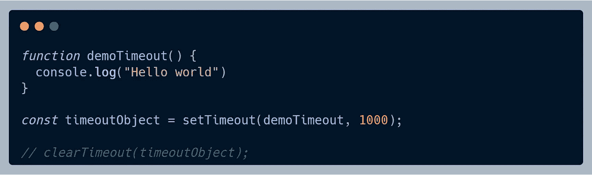

# 事件循环中的微观任务和宏观任务是什么？

> 原文：<https://medium.com/globant/what-are-micro-tasks-and-macro-tasks-in-the-event-loop-29bc0abdd445?source=collection_archive---------0----------------------->

Photo by [Maxime Lebrun](https://unsplash.com/@flub?utm_source=medium&utm_medium=referral) on [Unsplash](https://unsplash.com?utm_source=medium&utm_medium=referral)

既然你来到了这个页面，我假设你是一个 JavaScript 开发者，并且想知道更多关于事件循环是如何工作的。

> 我不打算讨论事件循环的阶段。我将向您简要介绍所有的异步函数，任何 JavaScript 开发人员，无论是前端开发人员(React.js)还是后端开发人员(Node.js)，在他们的一生中都必须至少使用过一次。

读完这篇博客后，你将能够回答这些问题:-

1.  JavaScript 如何一次处理多件事？
2.  事件循环如何区分下一个要执行的任务的优先级？
3.  这一过程涉及哪些组件？
4.  最后，何时使用什么？

让我们开始吧…

# 事件循环

事件循环就是一个无限循环。JavaScript 并不是第一个使用事件循环概念的地方。 [Python](https://docs.python.org/3/library/asyncio-eventloop.html#event-loop) 、 [Netty](https://livebook.manning.com/book/netty-in-action/chapter-7/) 和 [TCL](http://www.tcl.tk/about/netserver.html) 是另外几个使用它的地方。现在我将坚持使用 JavaScript 事件循环。无论您在浏览器还是 Node.js 上运行 JavaScript 代码，都会有一个事件循环负责处理异步任务。

我将在这篇博客中频繁使用异步这个词。我所说的异步是指您希望在以后某个时间点执行的代码的某个部分。异步函数的一些例子有 setTimeout、回调、承诺、处理事件、网络请求等。JavaScript 使用事件循环，通过单线程处理所有这些类型的异步任务。

事件循环涉及**调用栈、宏任务和微任务。**

Macro and micro task queue in event loop

# **调用堆栈**

调用栈是后进先出栈。这是从宏任务队列或微任务队列添加任务的地方。您将在以下段落中找到关于微任务和宏任务的详细信息。

> JavaScript 引擎从调用堆栈中选择要执行的任务。事件循环不断检查调用堆栈中需要运行的任何函数。

# 宏任务

你会发现宏任务队列在互联网上的一些资源中被称为任务队列。任务队列和宏任务队列是同一个概念。

> 宏任务是由标准机制(如事件回调、间隔或超时)安排运行的任何 JavaScript 代码。

所有这些都被安排在宏任务队列中。宏任务的一些示例如下:

1.  *setTimeout()*
2.  *setImmediate()*
3.  *setInterval()*
4.  *requestAnimationFrame()*
5.  输入－输出
6.  用户界面渲染

## 

*每个 JavaScript 开发人员一生中肯定至少使用过一次 *setTimeout()* 。它只是一个实用函数，接受第一个参数作为函数回调，第二个参数作为以毫秒为单位的时间。一旦定时器到期，它就执行函数回调。*

**setTimeout()* 返回 Timeout 对象，该对象可用于引用所设置的超时。这个超时对象也可以用来取消超时。虽然 *setTimeout()* 是一个异步函数，但是您不能使用它来暂停其他函数的执行。*

**

*Example of **setTimeout()***

* [## setTimeout()示例

### 单击此处运行 setTimeout()示例

www.mycompiler.io](https://www.mycompiler.io/view/Ay5qramNAIo) 

由 *setTimeout()* 执行的代码从与调用 *setTimeout()* 的函数不同的执行上下文中调用。如果你没有在调用中或者用 apply 或 bind 函数为这个设置一个值，它将默认为全局对象。

在代码片段中，我有一个名为 *demoTimeout()* 的函数。我只是在那个函数中打印“Hello world”。我将 *demoTimeout()* 作为第一个参数传递，这不过是对 *setTimeout()* 的回调。该函数的第二个参数是毫秒数，在我们的例子中是 1000 毫秒。根据 setTimeout()的概念， *demoTimeout()* 理想情况下将在 1000 毫秒后被调用。

## [setImmediate()](https://developer.mozilla.org/en-US/docs/Web/API/Window/setImmediate)

setImmediate() 是 Node.js 提供的另一个实用函数，当您希望尽可能快地异步执行某段代码时，它可以是选项之一。

*setTimeout()* 和 *setImmediate()* 类似，但是根据调用的时间不同，行为方式也不同。 *setImmediate()* 用于在事件循环的轮询阶段完成后执行脚本。 *setTimeout()* 调度在经过最小阈值(毫秒)后运行的脚本。

计时器的执行顺序将根据调用它们的上下文而变化。如果两者都是从主模块中调用的，那么时间将受到进程性能的限制。

*setImmediate()* 返回即时对象，可用于取消预定的即时。

Example of **setImmediate()**

 [## setImmediate 示例

### 单击此处运行 setImmediate()示例

www.mycompiler.io](https://www.mycompiler.io/view/8RSgZN5NvZH) 

在上面的代码片段中，我在主模块中编写了 *setTimeout()* 和 *setImmediate()* 。两个定时器的执行顺序取决于进程的性能。但是，如果在一个 I/O 周期内移动这两个调用， *setImmediate()* callback 将总是首先执行。下面，我在 I/O 循环中添加了 *setTimeout()* 和 *setImmediate()* 。

setTimeout() and setImmediate() in I/O cycle

 [## I/O 周期中的 setImmediate()

### 单击此处以在 I/O 周期中运行 setImmediate()

www.mycompiler.io](https://www.mycompiler.io/view/HOvxIRrhRJx) 

## [setInterval()](https://developer.mozilla.org/en-US/docs/Web/API/setInterval)

如果一段代码需要重复执行，那么 *setInterval()* 可以用来调度这段代码的重复执行。类似于 *setTimeout()* ，以回调函数为第一参数，以毫秒数为第二参数。

*setTimeout()* 和 *setInterval()* 的区别在于， *setTimeout()* 只会执行一次给定的回调函数， *setInterval()* 会无限次执行回调函数。

和 *setTimeout()* 一样， *setInterval()* 也返回 Timeout 对象，这个对象可以用来引用和修改已经设置好的时间间隔。

Example of **setInterval()**

 [## setInterval()示例

### 单击此处运行 setInterval()示例

www.mycompiler.io](https://www.mycompiler.io/view/Dtyb8uJwD47) 

在上面的代码片段中，我有一个每隔 1000 毫秒执行一次的函数回调。我正在增加*计数*直到 5，然后清除间隔。这将停止回调函数的重复执行。

我觉得这三个例子足够理解宏观任务了。*requestAnimationFrame()*、I/O、UI 渲染是宏任务的几个其他例子。

# 微任务

宏观和微观任务之间的区别似乎很小。它们都被放在调用堆栈中，并在适当的时间运行。事件循环从调用堆栈中一个接一个地拾取任务。它以不同的方式对待微观任务。

> 所有的微任务都将在事件循环的一次循环中执行。一个微任务可以调度另一个微任务。

事件循环连续运行所有的微任务。您需要谨慎对待递归添加微任务的方式。一些微任务的例子是:

1.  承诺
2.  *process.nextTick()*
3.  *queueMicrotask()*

## [承诺](https://www.w3.org/2001/tag/doc/promises-guide)

承诺表示异步操作的最终结果。承诺是处理异步代码的一种方式。异步函数在幕后使用承诺。

与 promise 交互的主要方式是通过它的 *then* 函数，该函数注册一个回调来接收 promise 的最终值或 Promise 无法实现的原因。一旦承诺被调用，它将开始处于待定状态。这意味着调用函数将继续执行，直到承诺得到解决。所创造的承诺最终会以一种解决的状态或拒绝的状态结束。

Example of **Promise**

 [## 承诺范例

### 单击此处运行承诺示例

www.mycompiler.io](https://www.mycompiler.io/view/KDel5GQLDDd) 

在上面的代码片段中，我在 I/O 模块中有 *setImmediate()* ，setTimeout()和 main 模块中的两个承诺。承诺回调被添加到承诺队列。承诺队列将在同一个迭代中执行。但是，宏任务会在事件循环的下一次迭代中执行。在我们的例子中，承诺将首先被执行，因为承诺是微任务的一部分，并且比宏任务的 *setTimeout()* 和 *setImmediate()* 具有更高的优先级。

## [process.nextTick()](https://nodejs.dev/learn/understanding-process-nexttick)

在 Node.js 中，事件循环的每次迭代称为一个 tick。传递给 *process.nextTick()* 的回调将在事件循环的当前阶段执行。 *process.nextTick()* 虽然是异步 API 的一部分，但不是事件循环的一部分。

*process.nextTick()* 将在设置的任何即时变量以及任何计划的 I/O 之前运行。 *process.nextTick()* 不可清除。一旦代码被 *process.nextTick()* 调度执行，就不能停止执行。

任何时候，在给定的阶段调用 *process.nextTick()* ，传递给它的所有回调都将在事件循环继续之前得到解决。这可能会造成一些不好的情况，因为它允许您通过进行递归的 *process.nextTick()* 调用来耗尽 I/O。

Example of **process.nextTick()**

 [## process.nextTick()示例

### 单击此处运行 process.nextTick()示例

www.mycompiler.io](https://www.mycompiler.io/view/7XydtfydMgr) 

在上面的代码片段中，我们有两个回调函数，一个用于 *process.nextTick()* ，另一个用于 promise。正如我上面已经提到的， *process.nextTick()* 将在任何 immediates 之前执行。首先执行传递给 *process.nextTick()* 的回调，然后执行传递给 promise 的回调。

## [queueMicrotask()](https://developer.mozilla.org/en-US/docs/Web/API/HTML_DOM_API/Microtask_guide)

*queueMicrotask()* 会显式地把一个任务放到微任务队列中。这就是承诺兑现时的情况。回调函数在微任务中排队。如果链接多个 then 语句，它们的所有回调都将被添加到微任务队列中，并保证在将控制权交还给事件循环之前得到执行。如果您一直将任务排队到微任务队列中，您的浏览器/服务器将变得没有响应。

*queueMicrotask()* 在浏览器平台上可用。在版本 11 之前，它在 Node.js 上不可用，但现在我们也可以在 Node.js 上使用它。

Example of **queueMicrotask()**

 [## queueMicrotask()示例

### 单击此处运行 queueMicrotask()示例

www.mycompiler.io](https://www.mycompiler.io/view/1rVQmlfAAl1) 

在上面的代码片段中，我们调用了 *queueMicrotask()* ，它再次调用 *queueMicrotask()* 并将回调添加到微任务队列中。它们在序列中被调用。

# 什么时候用什么

每当你想推迟某段代码的执行时，你应该执行一个宏任务。但是，如果你想让 JavaScript 同步运行，那就去做微任务吧。不建议在代码中过度使用微任务。它将阻塞事件循环的执行，对于应用程序的用户来说，这将是一个非常糟糕的体验。

## **资源**

 [## JS 可视化工具 9000

### JavaScript 可视化工具

www.jsv9000.app](https://www.jsv9000.app/?code=c2V0VGltZW91dChmdW5jdGlvbiBhKCkgewogIGNvbnNvbGUubG9nKCJmaXJzdCBtYWNyb3Rhc2siKTsKfSwgMCk7CgpQcm9taXNlLnJlc29sdmUoKS50aGVuKGZ1bmN0aW9uIGIoKSB7CiAgY29uc29sZS5sb2coImZpcnN0IG1pY3JvdGFzayIpOwp9KTsKCnNldFRpbWVvdXQoZnVuY3Rpb24gYygpIHsKICBjb25zb2xlLmxvZygic2Vjb25kIG1hY3JvdGFzayIpOwp9LCAwKTsKClByb21pc2UucmVzb2x2ZSgpLnRoZW4oZnVuY3Rpb24gZCgpIHsKICBjb25zb2xlLmxvZygic2Vjb25kIG1pY3JvdGFzayIpOwp9KTs%3D) 

JavaScript visualizer 是一个在线工具，用于可视化事件循环中一些宏和微任务的执行。我建议逐步了解所有任务的执行顺序。

灵感来自以下链接

*   [究竟什么是事件循环？菲利普·罗伯特](https://youtu.be/8aGhZQkoFbQ) s
*   [https://javascript.info/event-loop](https://javascript.info/event-loop)
*   [https://nodejs.dev/learn/the-nodejs-event-loop](https://nodejs.dev/learn/the-nodejs-event-loop)
*   [https://nodejs . org/en/docs/guides/event-loop-timers-and-next tick/](https://nodejs.org/en/docs/guides/event-loop-timers-and-nexttick/)

我已经将上述所有示例添加到一个 git 存储库下。下面给出了链接:

 [## GitHub-ajitfawade/macro tasks-micro tasks:事件中宏任务和微任务的例子…

github.com](https://github.com/ajitfawade/macrotasks-microtasks) 

暂时就这样了。*