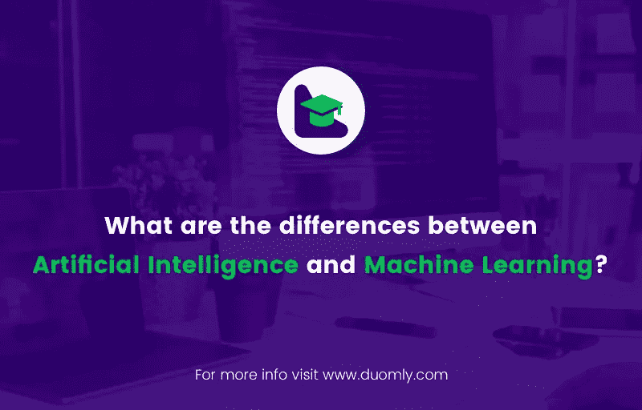

# 人工智能和机器学习有什么区别？

> 原文：<https://medium.com/duomly-blockchain-online-courses/what-are-the-differences-between-artificial-intelligence-and-machine-learning-585dfeaef956?source=collection_archive---------1----------------------->

[Duomly — programming online courses](https://www.duomly.com/)

本文最初发表于:
[https://www . blog . duomly . com/differences-between-artificial-intelligence-and-machine-learning-and-why-its-important-for us/](https://www.blog.duomly.com/differences-between-artificial-intelligence-and-machine-learning-and-why-its-important-for-us/)

人工智能(AI)在我们周围无处不在:脸书或推特上的图像识别和联系人建议，自动驾驶汽车，击败象棋和围棋冠军的软件，亚马逊、谷歌搜索、苹果 Siri 和微软 Cortana 上的书籍推荐，等等。它成为我们生活中非常重要的一个方面。它的重要性提高了，我们每天越来越依赖人工智能，希望它能改善我们的福祉。

人工智能经常与机器学习(ML)混淆，这是另一个与之密切相关的非常重要的概念。

考虑到人工智能和人工智能日益增长的重要性，本文试图解释两者之间的区别和联系。

# 什么是人工智能？

AI 的定义有很多。约翰·麦卡锡在这里以简洁而全面的方式定义了它，强调制造智能机器的过程。根据这个定义，人工智能可能但不一定要使用基于人类智能运作方式的方法。同一篇文章定义了智力，将它与现实世界目标实现的能力联系起来，并得出结论，我们仍然缺乏一个与人类无关的智力定义。

简而言之，我们可以将人工智能视为一个概念，其中机器和设备(尤其是计算机)能够执行对人类重要的不同任务。

人工智能的应用众多且不断增加:自动驾驶汽车、图像识别、医疗诊断、自然语言处理和翻译、垃圾邮件过滤、智能建筑、预测能源消耗、金融和银行、军事、广告、艺术、视频游戏等等。

人工智能有三个层次:

狭义智能——限于狭窄范围的任务和动作，
广义智能——涵盖人类能够执行的相同范围的任务和动作，
超智能——超过人类的智能。人工智能可以使用几种方法。例如，它可能依赖于逻辑和所提供的一组严格的指令，或者试图模仿人脑的功能或。ML 就是这样一种方法。

# 什么是机器学习？

根据维基百科，ML 是人工智能的一个子集。

它实际上是一套技术，通过观察关系和模式，使计算机能够从数据中学习，而不是给它们如何执行任务的具体指令。这些技术依赖于微积分、线性代数、数学最优化、概率论、统计学等。最大似然模型可以具有确定性或概率性。

ML 方法通常分为以下三类:

监督学习，
无监督学习，
强化学习。
最常用的一些 ML 方法有线性、多项式和逻辑回归、决策树和随机森林、支持向量机、最近邻、贝叶斯网络、k-means 和层次聚类、频繁项集挖掘和关联规则学习等。人工神经网络(ann)是一套用于监督和非监督学习的模型和技术，试图模仿人脑的功能。它们非常受欢迎，在解决广泛的问题方面非常有效。

计算能力和可用数据量的显著增加，以及算法的进步，使得所谓的深度神经网络(DNNs)非常有效和有前途。DNNs 是一种特殊的人工神经网络，具有额外的复杂性和能力。深度学习是机器学习的一个子集，它依赖于应用 DNNs、递归神经网络和深度信念网络。

# 结论

人工智能无处不在。我们每天都依赖它。这篇文章解释了人工智能和机器学习之间的关系。

简而言之，人工智能是一个更广泛的概念，而机器学习是它的子集或用于创建人工智能的方法之一。深度学习是一种强大而有前途的机器学习，它应用特定类型的人工神经网络，如深度神经网络、递归神经网络和深度信念网络。

[Duomly — programming online courses](https://www.duomly.com/)

感谢您的阅读。

内容由我们的队友米尔科提供。