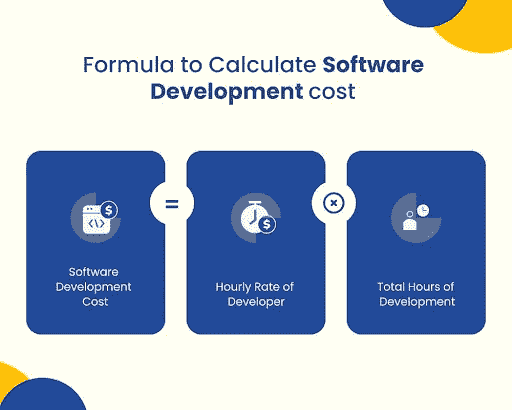
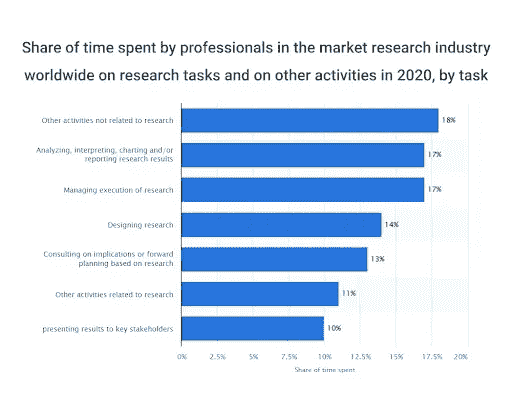
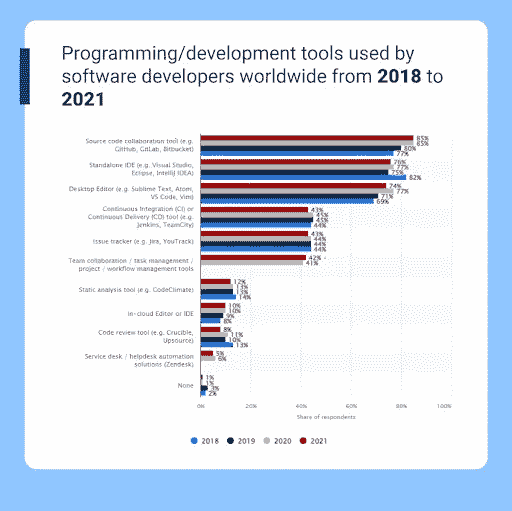
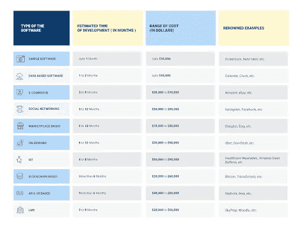
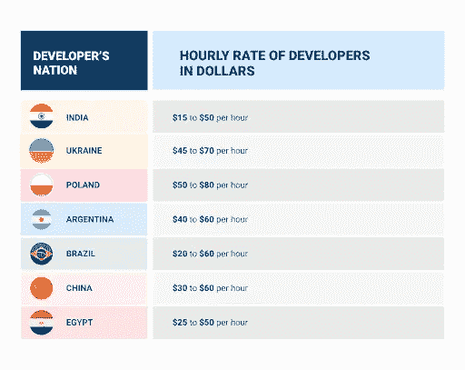

# 定制软件开发意味着什么&定制软件开发的成本是多少？

> 原文：<https://medium.com/quick-code/what-does-custom-software-development-means-amp-how-much-does-custom-software-development-cost-518dd99f3b29?source=collection_archive---------4----------------------->

当您的业务增长并开始处理更多的客户、销售和数据时，您可能会发现您以前使用的软件不再高效或有效。这就是定制软件开发的用武之地。

根据 Businesswire 的数据，定制软件开发的 CAGR 为 7.93%，到 2025 年的潜在增长率为 317.6 亿美元。

越来越多的企业在定制数字解决方案方面碰运气，市场前景可观。然而，这是一件昂贵的事情，需要周密的计划和投资。

为了帮助您分析定制开发的定义和成本，我们将在本文中讨论以下内容:

*   什么是定制软件开发？
*   定制软件开发的 7 个阶段
*   定制软件开发的总成本是多少？快速回答:
*   影响软件开发价格的因素
*   定制软件开发费用估算的标准方法

让我们从第一个也是最重要的查询开始。

# 什么是定制软件开发？

定制软件开发意味着您的企业可以获得一个专门设计的程序来做您需要它做的事情。因此，它节省了时间和金钱，同时提高了效率，消除了令人头痛的问题。从技术上讲，定制软件开发是任何非现成软件的东西。但是当我们谈论定制软件时，我们通常指的是定制代码。

你看，买软件有两种方式。第一种方法是购买现有代码的许可证，并在您的产品或业务中使用它。这个软件被创造了一次，然后随着越来越多的人得到它而被多次出售。Lucid 的例子有 Adobe Acrobat，Microsoft Office，Canva 等。

它被称为现成的软件，因为它被创建的主要原因是它可以随时被使用。然而，有时企业需要一些特定的东西——一些他们自己找不到的东西——不得不去别处寻找。

这就是定制软件发挥作用的地方。只需要为他们做少量的编程，或者他们可以让其他人来完成已经写好的作品。定制软件降低了成本，使您的生活更加轻松，并允许您随着业务的发展而发展。

但是它与现成解决方案的区别在于它的灵活性。您不仅可以选择您想要(和不想要)的功能，还可以控制它们如何协同工作——而不是几千英里之外的某个公司。您的新系统将允许员工比以往任何时候都更好地协作，因为它是专门为您的公司设计的。

这里有一个信息图，看看:

**Source**: [**CodersDaddy**](https://www.codersdaddy.com/)

软件开发通常比购买现成的东西更耗时，但是如果操作正确，其卓越的功能可以通过提高效率和协作来帮助您节省时间！在软件开发中，软件开发生命周期( **SDLC** )阶段因公司而异，但大多数行业和公司都同意七个主要步骤。

理解这些步骤很重要，这样你就知道在这个过程中会发生什么，并且可以与你的团队就此进行更详细的交流。这将有助于您更好地准备您希望在项目中实现的结果。

# 以下是定制软件开发的 7 个阶段

**第一阶段:创意产生&可行性研究**

当你想到一个新应用的想法时，很容易被它的潜力所吸引，而忘记是否有人会使用它。确定你的概念是否可行的第一步是头脑风暴，为软件产生尽可能多的想法。因为即使是坏主意也可能对以后有帮助，头脑风暴允许你创造性地思考，而不受软件应该是什么的传统观念的限制。

资料来源:[统计-花在研究上的时间](https://www.statista.com/statistics/876040/market-research-industry-share-of-time-spent-on-analysis-tasks/)

注意:创意产生和可行性研究是软件开发中最重要的方面。Statista 说专家们花了 17%的项目时间在项目的想法研究和可行性研究上。

**第二阶段:规划**

一个**软件开发公司**创建一个详细的开发计划，并确定实现每个里程碑所需的资源。创业公司大部分时间都在做规划，需要好几个月才能达到一个逻辑终点。在这个阶段，初创公司为每一步设定时间表，并设定具体目标，评估相关风险。这个阶段的主要目标是通过软件产品开发来创建一个可行的商业模型。

**第三阶段:设计**

一旦你有了自己的想法，写了一份商业计划，就该开始设计你的产品了。无论你是用纸和笔还是用软件包来设计你的产品，确保你对你所创造的东西有一个清晰的愿景。你的设计从第一天开始就定义得越清晰，就越容易创造出你想要的东西。虽然马上开始编码感觉很棒，但是要忍住！在前进之前，使用模型或草图来产生想法和讨论。或者，你也可以使用线框工具对你的软件有一个具体的想法。

**第四阶段:编码**

编码阶段是大多数软件工程师所熟悉的，也是你花费大部分时间的地方。如果一个项目一开始没有正确编码，那么之后的所有工作都将是徒劳的。Failory 说，在软件开发中，花在编码和调试上的时间从 40%到 70%不等，甚至更多。这很大程度上取决于你是从头开始构建，利用库和框架，还是维护一个现有的产品。

来源:[Statista-编程工具](https://www.statista.com/statistics/869106/worldwide-software-developer-survey-tools-in-use/)

**第五阶段:测试**

在开发的每个阶段，验证您没有引入任何错误是非常重要的。在软件测试期间尤其如此，一旦一个新的软件产品被完全编码，就会发生这种情况。一个专业的测试人员会在测试过程中分析每一个代码，并验证一切都按预期运行。如果你没有正确地测试你的软件，它可能会有灾难性的后果。

**第六阶段:部署**

一旦你的软件为用户准备好了，你需要确保它能被容易地部署，无论是手动的还是自动的。它包括确保所有必要的支持文件都已准备就绪，并且有更新文档。开发人员的团队在部署上花费了大量时间——这不一定要一蹴而就，但最终肯定会发生。因此，现在就通过思考和创建这些部署机制来尝试取得成功吧！

**第七阶段:维护**

维护阶段是指软件应用程序在发布和部署之后。如果没有错误或问题，您可以说您的软件处于维护模式。解决软件维护的几种方法包括性能管理、故障排除、升级和添加新的特性/功能。

# 定制软件开发的费用是多少？快速回答:

软件开发成本取决于许多因素，包括项目的规模和复杂程度。例如，根据功能的不同，开发一个简单的 iOS 或 Android 移动应用程序或一个简单的软件需要 5000 美元至 50，000 美元。而创建一个具有许多功能的复杂企业级系统可能要花费数百万美元。此外，固定价格不适用于大多数软件开发项目。

**这里有一张信息图，可以帮助你估算项目成本**

随着时间的推移，由于需求和范围的变化，项目成本通常会发生变化。因此，准确估计软件开发成本通常很棘手。你的项目的规模、复杂性和新颖性直接影响到它的成本，你必须额外工作几个小时来满足紧迫的最后期限可能会增加费用。参与一个项目的人数和他们的技能水平也是需要考虑的因素。所有这些成本加起来会推高软件价格。如果你想在定制软件开发上有一个好的交易，你需要货比三家，从一些不同的提供商或自由职业者那里寻找报价。

由于这些因素在每个项目中都有很大的不同，所以没有一种通用的方法来为定制软件项目定价；你需要先考虑你的需求，然后在评估报价时研究类似项目的价格。

# 影响软件开发成本的因素

**软件的功能特性**

定制软件的成本取决于多种因素，包括您想要和需要多少功能。为了确定你应该为定制软件支付多少钱，你必须决定需要多少功能来满足你的业务需求。列出这些需求并将其作为预算指南可能会有所帮助。如果一个特性不是关键的，考虑把它从你的需求列表中删除，直到你有足够的资金或资源来开发它。确保你的软件满足 90%的需求，然后再添加只会增加成本的额外软件。

**软件的复杂程度**

复杂度增加，成本就上去了，开发者可以用很低的价格在几个月内完成一个简单的软件项目。相比之下，具有多个模块、持续维护需求和各种平台的复杂项目可能需要数年时间才能完成，成本高昂。还有，记住复杂的软件需要有经验的开发者，你会比一个新手开发者为专业人士付出更多。因此，在设计项目之前，先弄清楚它的挑战性。

**内部团队 v/s 外包**

内部团队的成本更高，因为他们有自己的基础设施，即办公场所、电脑、桌子、椅子等。相比之下，外包开发公司为您节省了这些成本，因为他们没有任何基础设施。因此，当项目外包给开发商而不是内部员工时，整体价格会更低。但是假设你的公司已经有了大量的员工。在这种情况下，最好使用内部开发人员，因为您可以轻松地管理他们，并根据您的要求控制他们的工作，而无需支付额外费用。

然而，如果你没有任何固定员工，并且正在寻求长期发展，那就选择外包战略。所以总体成本因素也取决于你的要求和市场情况。

# 选定的发展国家

地理位置会影响你的成本，因为一般来说，在印度和东欧开发软件更便宜。然而，许多公司正试图挑战这一标准，并以较低的成本建立自己的内部开发团队。“美国的成本更高有几个原因，包括劳动力、生活费用和技术基础设施。随着你离开硅谷或纽约市，能以可承受的价格完成高质量工作的软件工程师越来越少”。

最重要的是，美国公司的医疗保险费几乎比其他任何国家都高。另一方面，像印度和印度尼西亚这样的亚洲发展中国家由于低廉的开发成本而成为首选的离岸外包国家。

**开发所需的总时间**

开发定制软件所需的时间取决于几个因素，例如您想要多少功能，您是否需要业务分析和功能规范方面的帮助，以及您的团队的技术水平如何。一般政策总有例外，但一般来说，大多数企业将不得不为定制软件开发做长达六个月的预算。相比之下，如果你只是在寻找一个简单的没有很多花哨功能的应用程序，那么开发一个应用程序只需要两周时间。

应用程序的定价通常比定制软件低得多，因为开销更少(没有前期投资)，所以在考虑软件开发时要记住这一点。

**选好订婚模特**

外包可能是开发定制软件的一种令人兴奋且经济高效的方式，但选择平台是复杂的。影响成本的因素很多，但有一个方面经常被忽略:参与模式。每种模式都有不同的好处，在你加入一家公司之前，了解这些好处是非常重要的。例如，一些平台根据开发时间收费，而另一些平台根据任务收费。确保您全面分析了您的选项，以选择最适合您需求的平台。流行的参与模式包括以下三种:

**增员模式:**

只有关键技能被外包，而开发活动，如需求收集、设计、编码和测试，则由您的员工执行。这导致了成本的降低和灵活性的提高，因为离岸团队是为你分配的项目工作的。

**专用团队模式**:

这种模式需要你付出比自由职业者更多的开发费用。此外，一个专门的团队拥有其内部技能和专门的流程。它导致了一个已建立的工作流和增加的管理监督，但是每个开发人员也有他们擅长的特定专业领域。它有助于避免多个开发人员在一个项目的不同部分工作，但没有任何与其他方面相关的知识或经验的问题。

**小时模式:**

许多企业主没有意识到离岸软件开发提供商(印度)使用的是按小时计费的模式。这意味着他们按小时收费，这可能会误导使用固定成本估算的小企业。当您得到为您的企业构建定制软件的预算时，您可能会考虑每月甚至每年的成本。

然而，在现实中，你将不得不为开发者在你的项目上花费的每一个小时付费。无论你是经理还是开发人员，回答一个软件项目要花多少钱这个问题从来都不容易。有许多不同的方法来估算项目的成本，每种方法都有其优点和缺点。

**为了帮助你分析哪种方法效果最好，这里有一些软件成本估算常用方法的概述。**

**基于类比的估算:**

它可以在你的项目和另一个类似的项目之间建立一个类比。这些最多只是猜测，但在某些情况下，它们可以帮助获得一个粗略的估计——即使这样，也只有在你熟悉这两个项目并能进行相关比较的情况下。

**自上而下的评估:**

这也称为数量级估计。它需要对每次迭代中有多少功能或特性进行有根据的猜测，并将它们乘以各自的估计值。例如，如果有 12 个特性，开发一个部件需要三周时间，那么完成所有 12 个特性需要 36 周(12*3)。

**自下而上的估计:**

在自下而上的估算中，您将把项目的所有活动分解成尽可能小的组成部分，然后估算它们的成本。一个简单的例子:如果你打算雇佣一名软件工程师，你必须考虑他们的时间，每小时 20 美元。如果您知道完成任何给定的活动需要十个人-小时，您也可以应用自下而上的估计。

**参数估计:**

要创建参数估计，您需要对每个项目阶段进行估计，然后根据您对每个活动需要多长时间的假设进行推断。创建这些评估所需的唯一数据点是完成一项任务所需的时间。如果你认为某件事要花两倍的时间，那就加两个小时；如果你认为会有一半长，那就除以二。

**三点估算:**三点估算是一种考虑三个因素并将它们相乘的简单方法。这些因素是:

1)最好的情况，

2)最坏的情况，以及

3)1 和 2 之间的中间点。

根据偏好，中点可能被选择为高于或低于任一数字 25%。最后，将这些数字相乘。

**最后的话**

软件成本估算最可靠的方法是参数估算，即工程师分析他们已经完成的实际项目。以下最好是自上而下或自下而上的估计。相比之下，基于类比和三点的估计因数据不足而不准确。但是这些方法仍然可以作为定制软件开发中总成本估算过程的一部分。

我希望这篇文章能帮助你分析你的项目开发成本。或者，您可以连接[**定制软件开发公司**](https://www.pixelcrayons.com/custom-software-development-services) 进行精确的项目成本分析，咨询费用为零。

**常见问题**

**问:哪种成本估算方法最合适？**

**回答:**费用估算方式以自上而下为主，其次为参数估计。

**问:全球最大的离岸外包国是哪个国家？**

**答:**根据[统计数据](https://www.statista.com/statistics/329766/leading-countries-in-offshore-business-services-worldwide/#:~:text=Leading%20countries%20in%20offshore%20business%20services%20worldwide%202021&text=Owing%20to%20its%20financial%20attractiveness,this%20survey%20conducted%20in%202021.)，前五位离岸外包国家包括:

*   印度
*   中国
*   马来西亚
*   印度尼西亚
*   巴西

**问:哪种是最合适的 SDLC 模型？**

**答:**SDLC 模型不胜枚举。但是，最常用的包括以下内容:

*   DevOps
*   敏捷
*   瀑布
*   混乱
*   看板法

**退房服务:**

## [Web 应用程序开发服务](https://www.codersdaddy.com/website-app-development-company-agency)、[移动应用程序开发服务](https://www.codersdaddy.com/mobile-app-development)、[印度 UI UX 设计服务](https://www.codersdaddy.com/ui-ux-design-service-company)、[印度 IT 员工扩充服务](https://www.codersdaddy.com/it-staff-resource-augmentation)、[网站维护&支持服务](https://www.codersdaddy.com/website-app-maintenance-support)、[雇佣专门的软件程序员](https://www.codersdaddy.com/hire-developer-engineer-programmer/)、[雇佣印度 Android 应用程序开发人员](https://www.codersdaddy.com/hire-developer-engineer-programmer/android-app)、[雇佣印度 iPhone 应用程序开发人员](https://www.codersdaddy.com/hire-developer-engineer-programmer/ios-iphone-app)、[雇佣印度 PHP 开发人员](https://www.codersdaddy.com/hire-developer-engineer-programmer/php-web)、  [雇佣印度. Net 开发者](https://www.codersdaddy.com/hire-developer-engineer-programmer/dot-net)，[雇佣印度 Laravel 开发者](https://www.codersdaddy.com/hire-developer-engineer-programmer/laravel)，[数字营销服务](https://www.codersdaddy.com/digital-marketing-agency-company-firm)，[印度 SEO 服务](https://www.codersdaddy.com/seo-service-company-agency-firm)，[印度 ORM 服务](https://www.codersdaddy.com/online-reputation-management-service-company)，[印度 SEO 内容写作服务](https://www.codersdaddy.com/content-writing)，[雇佣印度 WordPress 开发者](https://www.codersdaddy.com/hire-developer-engineer-programmer/wordpress-web)，[雇佣印度 Drupal 开发者](https://www.codersdaddy.com/hire-developer-engineer-programmer/drupal)，[雇佣印度 Angular 开发者](https://www.codersdaddy.com/hire-developer-engineer-programmer/angular-js)，