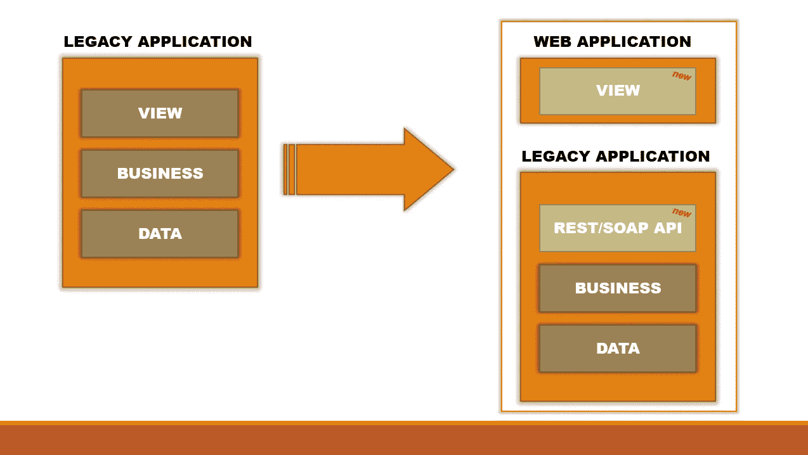
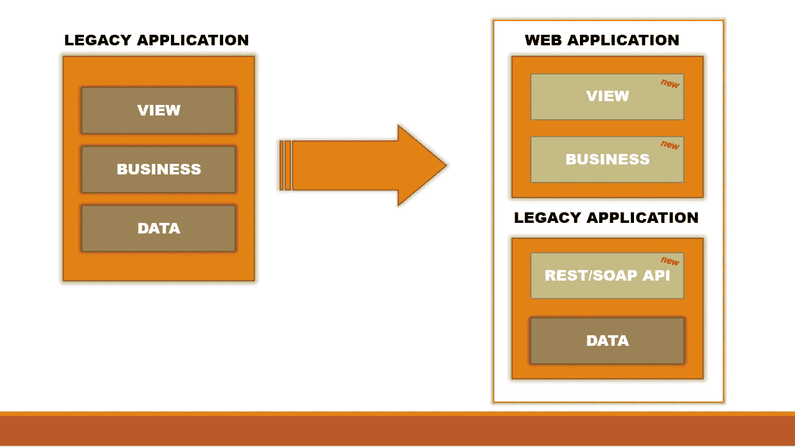
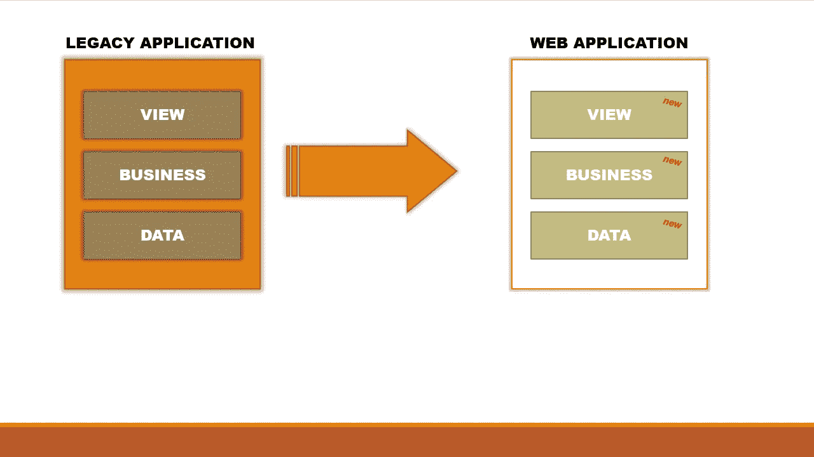

# 遗留应用程序的未来如何？

> 原文：<https://medium.com/quick-code/what-future-for-the-legacy-applications-61b6d36ed089?source=collection_archive---------0----------------------->

## 保存和处理之间的遗留应用程序的未来

Photo by [Kevin Noble](https://unsplash.com/@nobleshots?utm_source=medium&utm_medium=referral) on [Unsplash](https://unsplash.com?utm_source=medium&utm_medium=referral)

# 介绍

在技术飞速发展的时代，遗留应用程序保持了它们的地位和作用。

许多公司在 80 年代和 90 年代花费了时间和金钱来实现大型遗留应用程序，这些应用程序被证明是保持增长的正确选择。

今天，同样是这些公司问自己，这是否是追求的正确方式，或者是时候去创新了。

在这个故事中，我将尝试分析一些转换遗留应用程序的方法。

***走吧！***

# 方法

许多遗留应用程序在大型机上运行，并且实现了运行 20 年或更长时间的业务逻辑。

对于公司来说，当管理成本增加时，很难选择应用程序的未来。

根据我的经验，可以从以下三个层面攻击遗留应用程序:

*   **视图**:用新的视图替换视图，维护代码和数据的核心
*   **业务**:替换视图，重构业务逻辑，但是保持数据的结构
*   **数据**:替换视图、业务逻辑和数据

在攻击层的基础上更新遗留应用程序的可能方法有:

*   逻辑的保存
*   重构
*   移民

这些继续进行的方法可能会有不同的成本和应用程序的影响，并建议在开始遵循一种方法之前进行良好的评估。

现在我将尝试详细解释这些方法。

# 逻辑的保存

第一种方法是由维护遗留应用程序中包含的大部分业务逻辑的思想决定的。

Block diagram for preservation of logic approach

通常认为当前的实现是稳定的并且没有错误，因此决定维护数据库和包含业务逻辑的软件层。

这种方法提供了当前通过 web 服务(例如 SOAP 或 REST 服务)实现的业务逻辑，并在创建新的前端层以消除旧的可视化模型之后。

重构业务层和数据层的成本很低，因为开发人员唯一要做的就是公开当前代码的 web 服务:个性化代码以公开和实现 web 服务。

另一方面，视图实现的成本可能会很高，因为可能很难从新的前端协调将在没有任何修改的情况下公开的旧功能。

原样功能的展示允许保留大部分代码，但是使前端的开发活动复杂化:在遗留应用程序上节省成本，但是在视图上花费更多。

这种方法的好处是，新应用程序的开发和上线可以与旧的遗留应用程序的利用并行进行。

# 重构

最常见的方法是实现一个新的维护数据层的 web 应用程序。

Block diagram for refactoring approach

考虑一个新的前端很容易，实现一个新的业务层也很容易(如果您有功能规范)，但是在许多情况下，很难考虑将数据库迁移到一个新的模型。

在设计阶段，可以决定创建一个直接访问数据层的业务层，或者在数据库和业务层之间创建一个 API 层，以分离这两个层，并提供对持久化信息的 web 访问(在可能的情况下也可以是异步的)。

可选地，可以实现 API 服务层，以允许通过 web 应用直接访问数据，将数据库的旧技术与更高层的新技术分离。

这种方法的成本太高:需要创建一个新的前端，重构和实现新的业务层，如果合适的话，还需要一个新的 API 层。

这种方法的一个好处可能是技术和应用技术的彻底改变。

通过对遗留应用程序进行深入评估，可以调查架构中是否存在缺陷或功能流程中是否存在 bug，从而避免在新应用程序中出现这些问题。

# 数据迁移

最后一种方法被认为是更新遗留应用程序的所有层。

Block diagram for data migration approach

采用这种方式来更新遗留应用程序的公司受到以下原因的推动:管理成本上升、迫使使用新技术的内部 IT 决策、招聘了解遗留应用程序编程语言的人员的困难和/或许多其他动机。

在许多情况下，传统应用程序是多年前开发的，并且多年来保持稳定，但随着时间的推移，已经暴露出漏洞和限制，只有完全更新软件堆栈才能修复这些漏洞和限制。

将遗留应用程序的整个堆栈迁移到新架构的决策可以从定义新数据模型开始，新数据模型将迁移当前数据库。下一步可能是设计新业务层的架构，例如实现可由新前端调用的 API，最后但同样重要的是新前端的设计和实现。

这种方法要求公司配备许多具有特定技能的特定专业人员，例如:

*   **数据库架构师**:推荐合适的数据库技术，建议采用关系型而非非关系型，并设计实体的数据模型；
*   **后端架构师**:提出要采用的编程语言，设计后端架构，组织要使用的模式；
*   **前端架构师**:除了前端技术，与后端架构师有严格的联系；
*   **UX 设计师**:设计新的用户体验，安装在新的网络应用之上；
*   **DevOps 架构师**:设计测试自动化、包创建和软件部署的新工作流程；
*   **前端和后端开发人员**:每一个在现实中转化想法的项目的真实劳动力；
*   **更多其他人员**:最后，迁移还需要其他资源，如测试架构师、安全专家、基础设施和网络专家等。

这些资源的存在和数量可以根据项目的大小而变化。

# 结论

当任何人提出这个问题时，这一时刻的欢乐就会消失:

> 遗留应用程序是否太旧，以至于我们需要放弃？

许多遗留应用程序太大，因此会发现更新成本高于管理成本，并通常会决定按原样维护应用程序。

更新的步骤可能是部分的或全部的，具有成本和影响。在迈出这一大步之前，强烈建议进行深入评估，以确定新应用程序的成本并假设其优势。

当我们将所有这些信息都可以张贴在规模板，看看规模 pend，但直到这一刻的申请更新将仍然只是一个想法。

***感谢您的宝贵时间！***