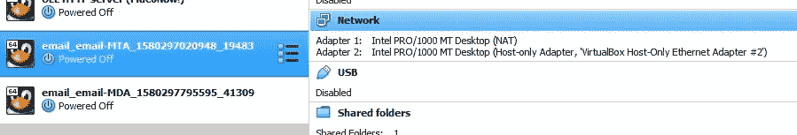

# 流浪多机和 Oracle VirtualBox，遇到纯主机联网会怎么样？

> 原文：<https://medium.com/oracledevs/what-happens-when-vagrant-multi-machines-and-oracle-virtualbox-meet-host-only-networking-d459b48ce87c?source=collection_archive---------4----------------------->


如果您只想运行一台虚拟机，那么通常会希望它能够连接到主机。如果您有多个虚拟机，您会希望它们能够连接到主机和其他虚拟机。

支持虚拟机连接是通过纯主机网络实现的。

使用 Oracle VirtualBox 进行漫游是管理多个虚拟机的一种很好的方式，但是仅主机联网也可以单独使用 Oracle VirtualBox 来建立。

首先，作为一项预先检查，确定主机上是否存在其它仅限主机的网络很有帮助。只需用 VBoxManage 命令查询 Oracle VirtualBox。

```
> VBoxManage list hostonlyifs
```

如果存在现有的纯主机网络，您可以像这样删除它们:

```
> VBoxManage hostonlyif remove "VirtualBox Host-Only Ethernet Adapter"
0%...10%...20%...30%...40%...50%...60%...70%...80%...90%...100%>
```

由于我们将创建一个仅包含主机的网络，请确保参与其中的虚拟机已关闭。一旦创建了网络，虚拟机将只参与启动。

如果使用 vagger，则使用以下命令关闭活动的虚拟机:

```
> vagrant halt
==> email-MDA: Attempting graceful shutdown of VM...
==> email-MTA: Attempting graceful shutdown of VM...>
```

Oracle VirtualBox CLI 将告诉您虚拟机的运行状态。这将验证虚拟机是否已关闭。

```
>VBoxManage list runningvms>
```

此外，Oracle Virtual Box GUI 将显示虚拟机的运行状态。


现在，我们准备在主机上从 VirtualBox 创建仅主机网络。

```
> VBoxManage hostonlyif create
0%...10%...20%...30%...40%...50%...60%...70%...80%...90%...100%
Interface 'VirtualBox Host-Only Ethernet Adapter #2' was successfully created>
```

Oracle VirtualBox 将选择主机专用网络的名称。您通常会看到类似“VirtualBox 主机专用以太网适配器”的网络名称。在上面的例子中，接口被命名为“VirtualBox 主机专用以太网适配器#2”。

下一步是配置我们刚刚创建的仅限主机的网络。我们在配置中指定的 IP 地址将是该网络主机的 IP 地址。我们使用网络 ID 192 . 168 . 1 . 0，因此主机 IP 地址将变为 192.168.1.1。

```
> VBoxManage hostonlyif ipconfig "VirtualBox Host-Only Ethernet Adapter #2" --ip 192.168.1.1 --netmask 255.255.255.0>
```

从 Oracle VirtualBox 中，我们可以确认这个特定网络的主机 IP 地址是 192.168.1.1。

```
> VBoxManage list hostonlyifs
Name:            VirtualBox Host-Only Ethernet Adapter
GUID:            775f4a47-d503-4c28-a266-4e8f05662d68
DHCP:            Disabled
IPAddress:       192.168.1.1
NetworkMask:     255.255.255.0
IPV6Address:     fe80::5dcc:2878:a2ae:1d40
IPV6NetworkMaskPrefixLength: 64
HardwareAddress: 0a:00:27:00:00:0e
MediumType:      Ethernet
Wireless:        No
Status:          Up
VBoxNetworkName: HostInterfaceNetworking-VirtualBox Host-Only Ethernet Adapter>
```

同样，在主机命令行中使用 ipconfig 命令，我们可以确认该网络的主机 IP 地址是 192.168.1.1。

```
> ipconfigWindows IP Configuration..Ethernet adapter VirtualBox Host-Only Network #2:Connection-specific DNS Suffix  . :
   Link-local IPv6 Address . . . . . : fe80::30f6:6255:ec99:62f4%13
   IPv4 Address. . . . . . . . . . . : 192.168.1.1
   Subnet Mask . . . . . . . . . . . : 255.255.255.0
   Default Gateway . . . . . . . . . :..>
```

在启动虚拟机之前，我们需要确保 VirtualBox 网络主机专用设置与我们刚刚创建的网络相匹配。因此，对于我们打算添加到网络中的所有虚拟机，设置需要是“VirtualBox 主机专用以太网适配器#2”。



现在我们已经准备好启动虚拟机了。

```
> vagrant up
```

这些多机的漫游文件预先设置了静态 IP 地址，如下所示:

*   主机名“email-MDA”(IP 地址= 192.168.1.10)
*   主机名“电子邮件-MTA”(IP 地址= 192.168.1.9)

虚拟机启动后，只需登录其中一台机器:

```
> vagrant ssh email-MDAWelcome to Oracle Linux Server release 8.0 (GNU/Linux package kernel-uek is not installed)The Oracle Linux End-User License Agreement can be viewed here:* /usr/share/eula/eula.en_USFor additional packages, updates, documentation and community help, see:* [http://yum.oracle.com/](http://yum.oracle.com/)Last login: Sat Feb  1 03:23:36 2020 from 10.0.2.2
[vagrant@smtp-mda ~]$
```

现在执行 ping 操作，确认纯主机网络已经启用了虚拟机之间的连接。

```
[vagrant@smtp-mda ~]$ ping 192.168.1.9 -c 1
PING 192.168.1.9 (192.168.1.9) 56(84) bytes of data.
64 bytes from 192.168.1.9: icmp_seq=1 ttl=64 time=0.414 ms--- 192.168.1.9 ping statistics ---
1 packets transmitted, 1 received, 0% packet loss, time 0ms
rtt min/avg/max/mdev = 0.414/0.414/0.414/0.000 ms
[vagrant@smtp-mda ~]$ 
```

现在 ping 主机，证明它也是仅包含主机的网络的一部分，并且具有连通性。

```
[vagrant@smtp-mda ~]$ ping 192.168.1.1 -c 1
PING 192.168.1.1 (192.168.1.1) 56(84) bytes of data.
64 bytes from 192.168.1.1: icmp_seq=1 ttl=128 time=1.07 ms--- 192.168.1.1 ping statistics ---
1 packets transmitted, 1 received, 0% packet loss, time 0ms
rtt min/avg/max/mdev = 1.067/1.067/1.067/0.000 ms
[vagrant@smtp-mda ~]$ exit
logout
Connection to 127.0.0.1 closed.>
```

有 2 台虚拟机，让我们在另一台虚拟机上执行类似的连接测试。

```
> vagrant ssh email-MTAWelcome to Oracle Linux Server release 8.0 (GNU/Linux package kernel-uek is not installed)The Oracle Linux End-User License Agreement can be viewed here:* /usr/share/eula/eula.en_USFor additional packages, updates, documentation and community help, see:* [http://yum.oracle.com/](http://yum.oracle.com/)Last login: Sat Feb  1 03:35:27 2020 from 10.0.2.2
[vagrant@smtp-mta ~]$
```

现在对备用虚拟机执行 ping 操作。

```
[vagrant@smtp-mta ~]$ ping 192.168.1.10 -c 1
PING 192.168.1.10 (192.168.1.10) 56(84) bytes of data.
64 bytes from 192.168.1.10: icmp_seq=1 ttl=64 time=1.99 ms--- 192.168.1.10 ping statistics ---
1 packets transmitted, 1 received, 0% packet loss, time 0ms
rtt min/avg/max/mdev = 1.986/1.986/1.986/0.000 ms
[vagrant@smtp-mta ~]$ 
```

像之前一样 Ping 主机。

```
[vagrant@smtp-mta ~]$ ping 192.168.1.1 -c 1
PING 192.168.1.1 (192.168.1.1) 56(84) bytes of data.
64 bytes from 192.168.1.1: icmp_seq=1 ttl=128 time=0.974 ms--- 192.168.1.1 ping statistics ---
1 packets transmitted, 1 received, 0% packet loss, time 0ms
rtt min/avg/max/mdev = 0.974/0.974/0.974/0.000 ms
[vagrant@smtp-mta ~]$ exit
logout
Connection to 127.0.0.1 closed.>
```

虚拟机已启动，纯主机网络将所有设备连接在一起。

Oracle VirtualBox 和纯主机网络让这一切成为现实！

Paul Guerin 是一名专注于 Oracle 数据库的国际顾问。Paul 在东南亚的全球交付中心工作，但他的客户来自澳大利亚、欧洲、亚洲和北美。此外，他还出席了一些世界领先的甲骨文会议，包括甲骨文 2013 年世界开放大会。自 2015 年以来，他的工作一直是 IOUG 最佳实践技巧小册子以及 AUSOUG、Oracle Technology Network 和 Oracle Developers (Medium)出版物的主题。2019 年，他被授予 My Oracle 支持社区最有价值贡献者。他是一名 DBA OCP，并将继续参与 Oracle ACE 计划。