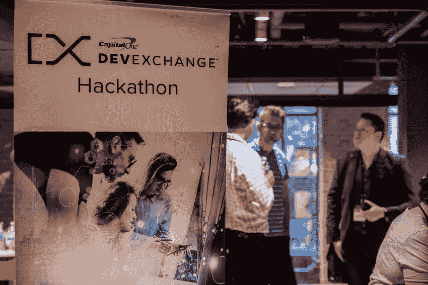

# 关于我们的 API，托管黑客马拉松教会了我们什么

> 原文：<https://medium.com/capital-one-tech/what-hosting-hackathons-taught-us-about-our-apis-b48d8304b74d?source=collection_archive---------7----------------------->

在我们的 2017 年黑客马拉松系列中，Capital One DevExchange 团队重申了我们最重要的信条之一——与我们的社区共同创造有助于每个人打造更好的产品。在七个大城市举办的七场活动中，我们邀请了开发人员、设计师和产品负责人加入我们为期一天的活动，用我们的 API 构建客户体验。不出所料，我们学到了很多关于 API 以及如何更好地支持开发人员使用它们的知识。

# 文档，文档，文档

人们普遍认为适当的文档是任何 API 的基本组成部分。无论我们谈论的是一个已经发布的成品 API，还是一个正在进行的实验 API，文档至少应该易于访问并且都在一个地方。在向与会者介绍这两种 API 的过程中，我们学到了一些关于 API 文档的东西:

*   不要让它太难接近肉。我们的一些文档需要整理和重组，以提高可读性。虽然这是一个普遍适用的问题，但黑客马拉松的压缩时间框架确实将它推到了前沿。
*   **OAuth 比我们想象的要难。**黑客马拉松吸引了不同经验水平的开发者。当初级和中级开发人员都在为某件事情奋斗时，你就要注意了。对于我们的一些 API，我们需要为 OAuth 提供更好的帮助，包括一些文档更新、代码样本等。例如， [Rewards API](https://developer.capitalone.com/products/rewards/homepage/) 文档现在包含了获取和刷新访问令牌步骤的代码示例。
*   **基于网络的文档>基于 PDF 的文档。我们的黑客马拉松通常混合了官方公开的 API 和预发布的实验 API。这些类型的 API 的文档有不同的格式——分别在我们的门户网站上和 PDF 文件中。我们的几个 API，包括 [Merchant Insights](https://developer.capitalone.com/products/merchant-insights/homepage/) 和[Digital Identity API](https://developer.capitalone.com/api-products/digital-identity/)，在其开发周期的两个阶段都出现在了黑客马拉松上。虽然他们的文档内容在不同格式之间保持相对一致，但用户很难从 PDF 格式中导航和剪切+粘贴代码示例。这肯定了我们对格式良好的基于 web 的文档的卓越可读性的信念。**
*   特定的用例导致特定的文档问题。当用户对文档有疑问时，他们通常会针对特定需求，例如如何在其现有基础设施的环境中连接或实施我们的 API。这对我们的 hackathon 用户和我们的集成合作伙伴同样适用。为了帮助我们的集成合作伙伴解决这一问题，我们的专业服务团队已经开始创建针对特定客户的集成指南，以解决特定的使用案例。对于某些 API 和用途，这是对更普遍适用的在线文档的一个非常必要的补充。

# 预览 API——好的、坏的和集成问题

今年，在正式发布之前，我们让我们的黑客马拉松参与者先睹为快。这允许我们在 API 发布周期的早期收集宝贵的反馈；创造更好的最终产品。

然而，我们通过这个过程了解到，在黑客马拉松上测试 API 可能很棘手。*在 2017 年的三次黑客马拉松中，我们预览了六个预发布的 API。*这包括:

*   [**波士顿黑客马拉松**](https://developer.capitalone.com/blog-post/devexchange-capital-one-cafs-celebrate-a-hackathon-first-in-boston/)**——我们预览了我们的[数字身份 API](https://developer.capitalone.com/api-products/digital-identity/)套件。**
*   **[**费城黑客马拉松**](https://developer.capitalone.com/blog-post/philly-hackathon-from-stuff-we-are-giving-to-stuff-we-are-developing/) —我们预览了 [Merchant Insights API](https://developer.capitalone.com/products/merchant-insights/homepage/) 和第二个基于实验数据的 API。**
*   **[**圣莫尼卡黑客马拉松**](https://developer.capitalone.com/blog-post/sun-surf-apis-at-the-devexchange-santa-monica-hackathon/)——我们预览了一个文档存储和处理 API。**

**波士顿是我们的第一个以发布和预发布 API 为特色的黑客马拉松，我们的参与者在试图在一个项目中使用这两种类型时遇到了一些障碍。这个问题的根源是 API 环境中的冲突——发布的 API 在我们的平台上被访问，而预发布的 API 在 GitHub 上被访问。在波士顿之后，我们了解到如果我们给与会者一个单独的易于使用的环境，为我们所有的 API 提供模拟服务，他们就更容易直接使用它们。**

**在我们的丹佛黑客马拉松上首次亮相，这个模拟环境使得集成预览 API 变得更加容易，帮助增加了将它们包含在项目中的团队数量。这提高了我们收到的反馈的质量和数量，因为更多的参与者现在将这些 API 应用到他们的黑客马拉松项目中。**

> *****“我们设计了一个轻量级的黑客马拉松环境，允许我们在 DevExchange 公共产品的同时，为开发者提供私有的和实验性的 API。我们已经看到这导致了创新的新应用想法，团队可以花更少的时间配置，花更多的时间编码。”****——*[大卫·本科](https://twitter.com/davidwbenko) *，专业服务***

# ***全面考虑我们的产品***

**当 DevExchange 平台在 2016 年 3 月推出时，我们最初的 API 都是独立的产品。随着[数字身份 API](https://developer.capitalone.com/api-products/digital-identity/)在我们的[波士顿黑客马拉松](https://developer.capitalone.com/blog-post/devexchange-capital-one-cafs-celebrate-a-hackathon-first-in-boston/)上的亮相，这一切都改变了。该套件由三个身份管理 API(注册、登录和验证)组成，旨在协同工作，提供优雅而安全的用户体验。**

**通过在我们的黑客马拉松上预览这些 API，我们发现需要更深入地解释这三个 API 之间的区别和关系。缺乏身份管理经验的与会者对用例以及 API 之间的相互关系感到困惑。这意味着许多第一批项目默认使用最简单的登录用例；完全忽略验证和注册。虽然潜在的集成合作伙伴可能在这方面有更多的知识，但它指出了对我们的 API 产品采取更全面的方法的需要。**

**在我们的 [Santa Monica Hackathon](https://developer.capitalone.com/blog-post/sun-surf-apis-at-the-devexchange-santa-monica-hackathon/) 上，当我们预览一个实验性的文档存储和处理 API 时，这些知识被放大了。许多开发人员对这个实验 API 如何与数字身份 API 一起工作有疑问。我们意识到，这些 API 不一定以对所有开发人员都显而易见的方式协同工作，这要求我们重新思考如何单独和整体地呈现它们。**

****

# **我们对黑客马拉松的承诺**

> **“参加黑客马拉松是“测试和学习”过程的一部分。在开发周期的早期获得反馈是至关重要的。它有助于证明(或推翻)假设。坐在我的产品经理泡泡里，只迭代我的想法，是制造一个糟糕产品的快捷方式。”——[*Brandee Shin*](https://www.linkedin.com/in/brandeeshin/)*，产品经理***

**2017 年见证了通过黑客马拉松参与开发社区的新承诺。随着 2018 年的到来，以及更多 API 的发布，我们将继续与该社区合作，帮助我们预览和测试我们的产品。**

*****有关即将举行的 DevExchange hackathons 的更多信息，请关注我们的*** [***活动页面***](https://developer.capitalone.com/events/) ***进行更新。*****

****

***披露声明:这些观点是作者的观点。除非本帖中另有说明，否则 Capital One 不属于所提及的任何公司，也不被其认可。使用或展示的所有商标和其他知识产权都是其各自所有者的所有权。本文为 2018***