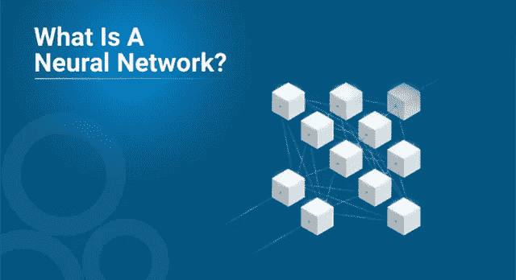
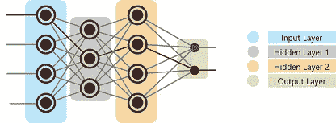
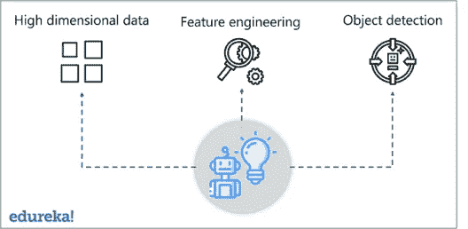
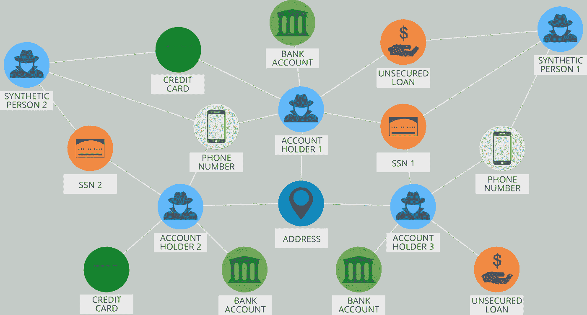
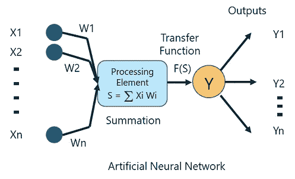
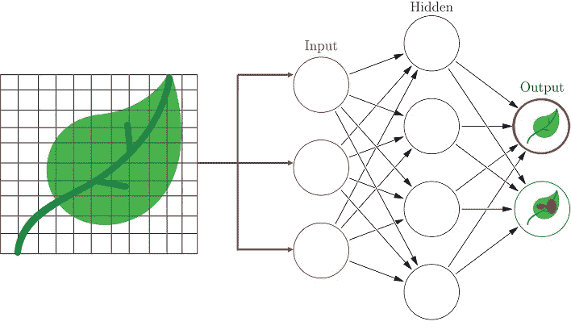

# 什么是神经网络？:人工神经网络 101 指南

> 原文：<https://medium.com/edureka/what-is-a-neural-network-56ae7338b92d?source=collection_archive---------0----------------------->

What is a Neural Network ?— Edureka

随着机器学习的进步，人工智能已经走上了一条很高的道路。深度学习被认为是为解决使用海量数据集的复杂问题而构建的最先进的技术。这篇关于什么是神经网络的博客将向您介绍神经网络的基本概念，以及它们如何解决复杂的数据驱动问题。

以下是本博客将涵盖的主题列表:

1.  什么是神经网络？
2.  什么是深度学习？
3.  AI，ML 和，DL 的区别
4.  对深度学习的需求
5.  深度学习用例
6.  神经网络是如何工作的？
7.  神经网络举例说明

# 神经网络的简单定义

根据人脑的模型，建立了一个*神经网络来模仿人脑*的功能。人脑是由多个神经元组成的神经网络，类似地，人工神经网络(ANN)是由多个感知器组成的(稍后解释)。

神经网络由三个重要的层组成:

*   **输入层:**顾名思义，这一层接受程序员提供的所有输入。
*   **隐藏层:**在输入层和输出层之间是一组被称为隐藏层的层。在这一层中，执行产生输出的计算。
*   **输出层:**输入通过隐藏层进行一系列转换，最终产生通过该层传递的输出。

在我们深入了解神经网络如何工作之前，让我们了解一下深度学习是什么。

# 什么是深度学习？

深度学习是机器学习的一个高级领域，它使用神经网络的概念来解决涉及多维数据分析的高计算性用例。它自动化了特征提取的过程，确保需要最少的人工干预。

那么深度学习到底是什么？

*深度学习是机器学习的一个高级子领域，它使用受大脑结构和功能启发的算法，称为人工神经网络。*

# AI、ML、DL 的区别(人工智能 vs 机器学习 vs 深度学习)

人们往往倾向于认为人工智能、机器学习和深度学习是相同的，因为它们有共同的应用。比如 Siri 就是 AI、机器学习、深度学习的一个应用。

那么这些技术是如何关联的呢？

*   ***人工智能*** *是让机器模仿人类行为的科学。*
*   ***机器学习*** *是人工智能(AI)的一个子集，专注于通过向机器提供数据来让它们做出决策。*
*   ***深度学习*** *是利用神经网络概念解决复杂问题的机器学习的子集。*

总结一下 AI，机器学习和深度学习是互联互通的领域。机器学习和深度学习通过提供一套算法和神经网络来解决数据驱动的问题，从而辅助人工智能。

现在你已经熟悉了基础知识，让我们来理解是什么导致了对深度学习的需求。

# 对深度学习的需求:传统机器学习算法和技术的局限性

机器学习是技术世界的一项重大突破，它导致了单调耗时任务的自动化，有助于解决复杂问题和做出更明智的决策。然而，机器学习中的一些缺点导致了深度学习的出现。

以下是机器学习的一些局限性:

1.  **无法处理高维数据:**机器学习只能处理包含一小组变量的小维度数据。如果你想分析包含 100 多个变量的数据，那么机器学习是无法使用的。
2.  **特征工程是手动的:**考虑一个用例，你有 100 个预测变量，你只需要缩小重要变量的范围。为此，您必须手动研究每个变量之间的关系，并找出哪些变量对预测输出很重要。对于开发人员来说，这项任务非常繁琐和耗时。
3.  **对执行物体检测和图像处理不理想:**由于物体检测需要高维数据，机器学习不能用于处理图像数据集，它只对特征数量有限的数据集比较理想。

在我们进入神经网络的深度之前，让我们考虑一个实现深度学习的真实世界用例。

# 深度学习用例/应用

您知道吗，PayPal 处理超过 1.7 亿客户的 40 亿笔交易，支付金额超过 2350 亿美元。它使用这些大量的数据来识别可能的欺诈活动以及其他原因。

在深度学习算法的帮助下，PayPal 从客户的购买历史中挖掘数据，此外还审查存储在其数据库中的可能欺诈模式，以预测特定交易是否欺诈。

该公司已经依赖深度学习和机器学习技术大约 10 年了。最初，欺诈监控团队使用简单的线性模型。但多年来，该公司转向了一种更先进的机器学习技术，称为深度学习。

王柯 PayPal 的欺诈风险经理和数据科学家引用了:

“我们从更现代、更先进的机器学习中享受到的是，它能够消耗更多的数据，处理一层又一层的抽象，并能够‘看到’更简单的技术无法看到的东西，甚至人类也可能看不到。”

一个简单的线性模型能够消耗大约 20 个变量。然而，通过深度学习技术，人们可以运行数千个数据点。因此，通过实施深度学习技术，PayPal 最终可以分析数百万笔交易，以识别任何欺诈活动。

现在让我们深入到神经网络的深处，了解它们是如何工作的。

# 神经网络是如何工作的？

为了理解神经网络，我们需要将其分解，并理解神经网络的最基本单元，即感知器。

## 什么是感知器？

感知器是用于分类线性数据的单层神经网络。它有 4 个重要组成部分:

1.  输入
2.  权重和偏差
3.  求和函数
4.  激活或转换功能

感知器背后的基本逻辑如下:

*从输入层接收的输入(x)乘以其分配的权重 w。然后将相乘的值相加以形成加权和。输入的加权和以及它们各自的权重然后被应用于相关的激活函数。激活功能将输入映射到相应的输出。*

## 深度学习中的权重和偏差

为什么我们必须给每个输入分配权重？

一旦一个输入变量被输入到网络，一个随机选择的值被指定为该输入的权重。每个输入数据点的权重表明该输入在预测结果中的重要性。

另一方面，偏差参数允许您调整激活函数曲线，以实现精确的输出。

## 求和函数

一旦输入被赋予某个权重，就取相应输入和权重的乘积。将所有这些乘积相加得到加权和。这是通过求和函数完成的。

## 激活功能

激活函数的主要目的是将加权和映射到输出。激活函数如 tanh、ReLU、sigmoid 等都是变换函数的例子。

在我们结束这篇博客之前，让我们举一个简单的例子来理解神经网络是如何工作的。

# 神经网络举例说明

考虑一个场景，其中您要构建一个人工神经网络(ANN ),将图像分为两类:

*   A 类:包含未患病叶片的图像
*   B 类:包含病叶图像

那么，如何创建一个神经网络来将叶子分为患病和非患病作物呢？

这个过程总是从以一种易于处理的方式处理和转换输入开始。在我们的例子中，每个叶子图像将根据图像的尺寸被分解成像素。

例如，如果图像由 30×30 像素组成，那么像素总数将是 900。这些像素被表示为矩阵，然后被输入到神经网络的输入层。

就像我们的大脑有帮助建立和连接思想的神经元一样，人工神经网络有接受输入并通过将输入从输入层传递到隐藏层并最终传递到输出层来处理输入的感知机。

当输入从输入层传递到隐藏层时，初始随机权重被分配给每个输入。然后，输入与它们相应的权重相乘，它们的和作为输入发送到下一个隐藏层。

这里，每个感知器被分配一个称为偏差的数值，它与每个输入的权重相关联。此外，每个感知器通过激活或转换功能，确定特定感知器是否被激活。

激活的感知器用于将数据传输到下一层。以这种方式，数据通过神经网络传播(前向传播),直到感知器到达输出层。

在输出层，导出一个概率，该概率决定数据属于 A 类还是 b 类。

听起来很简单，不是吗？嗯，神经网络背后的概念纯粹是基于人脑的功能。你需要深入了解各种数学概念和算法。

请留意本系列中的其他文章，它们将解释深度学习的各个其他方面。

> 1. [TensorFlow 教程](/edureka/tensorflow-tutorial-ba142ae96bca)
> 
> 2. [PyTorch 教程](/edureka/pytorch-tutorial-9971d66f6893)
> 
> 3.[感知器学习算法](/edureka/perceptron-learning-algorithm-d30e8b99b156)
> 
> 4.[神经网络教程](/edureka/neural-network-tutorial-2a46b22394c9)
> 
> 5.[什么是反向传播？](/edureka/backpropagation-bd2cf8fdde81)
> 
> 6.[卷积神经网络](/edureka/convolutional-neural-network-3f2c5b9c4778)
> 
> 7.[胶囊神经网络](/edureka/capsule-networks-d7acd437c9e)
> 
> 8.[递归神经网络](/edureka/recurrent-neural-networks-df945afd7441)
> 
> 9.[自动编码器教程](/edureka/autoencoders-tutorial-cfdcebdefe37)
> 
> 10.[受限玻尔兹曼机教程](/edureka/restricted-boltzmann-machine-tutorial-991ae688c154)
> 
> 11. [PyTorch vs TensorFlow](/edureka/pytorch-vs-tensorflow-252fc6675dd7)
> 
> 12.[用 Python 进行深度学习](/edureka/deep-learning-with-python-2adbf6e9437d)
> 
> 13.[人工智能教程](/edureka/artificial-intelligence-tutorial-4257c66f5bb1)
> 
> 14.[张量流图像分类](/edureka/tensorflow-image-classification-19b63b7bfd95)
> 
> 15.[人工智能应用](/edureka/artificial-intelligence-applications-7b93b91150e3)
> 
> 16.[如何成为一名人工智能工程师？](/edureka/become-artificial-intelligence-engineer-5ac2ede99907)
> 
> 17.[问学习](/edureka/q-learning-592524c3ecfc)
> 
> 18. [Apriori 算法](/edureka/apriori-algorithm-d7cc648d4f1e)
> 
> 19.[用 Python 实现马尔可夫链](/edureka/introduction-to-markov-chains-c6cb4bcd5723)
> 
> 20.[人工智能算法](/edureka/artificial-intelligence-algorithms-fad283a0d8e2)
> 
> 21.[机器学习的最佳笔记本电脑](/edureka/best-laptop-for-machine-learning-a4a5f8ba5b)
> 
> 22.[12 大人工智能工具](/edureka/top-artificial-intelligence-tools-36418e47bf2a)
> 
> 23.[人工智能(AI)面试问题](/edureka/artificial-intelligence-interview-questions-872d85387b19)
> 
> 24. [Theano vs TensorFlow](/edureka/theano-vs-tensorflow-15f30216b3bc)
> 
> 25.[tensor flow 中的对象检测](/edureka/tensorflow-object-detection-tutorial-8d6942e73adc)
> 
> 26.[模式识别](/edureka/pattern-recognition-5e2d30ab68b9)
> 
> 27.[人工智能中的阿尔法贝塔剪枝](/edureka/alpha-beta-pruning-in-ai-b47ee5500f9a)

*原载于 2019 年 8 月 28 日*[*https://www.edureka.co*](https://www.edureka.co/blog/what-is-a-neural-network/)*。*