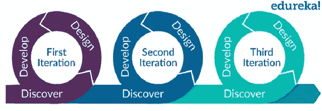

# 什么是敏捷方法——知道什么和如何做？

> 原文：<https://medium.com/edureka/what-is-agile-methodology-fe8ad9f0da2f?source=collection_archive---------0----------------------->

Agile Methodology — Edureka

使用传统软件开发模型如瀑布模型的日子已经一去不复返了。在当今快节奏的 IT 世界中，敏捷是一种新的前进方式。所以在这篇博客中，我将讨论什么是敏捷方法论。看完这篇博客，你对敏捷的理解会非常清晰。敏捷之后，下一步应该是学习 DevOps 及其认证课程。

在这篇博客中，我们将讨论以下主题:

1.  为什么我们需要敏捷方法？
2.  什么是敏捷方法论？
3.  敏捷方法的优势
4.  如何实施敏捷方法论？
5.  各种敏捷框架

因此，不浪费任何时间，让我们开始讨论。

# 为什么我们需要敏捷方法？

在敏捷出现之前，我们有软件开发的瀑布模型。瀑布模型可以定义为系统或软件开发中遵循自顶向下方法的顺序过程。这个模型是一个直截了当的线性模型。瀑布模型有不同的阶段，如需求收集、软件设计、实现、测试、部署和维护。

然而，这种模型有一些缺点，例如:

*   这个模型太费时间了。除非你完成了一个特定的阶段，否则你不能进入下一个阶段。
*   这个模型只适合于需求稳定的项目。
*   工作软件仅在模型的最后阶段完成后交付。
*   很难回到以前的阶段，做出一些你在初始阶段没有想过的改变。

由于瀑布模型的上述缺点，来自不同开发方法的领导者决定会面来寻找解决这些问题的方法。这些领导者同意一种轻量级的开发方法，并且他们也能够以宣言的形式给出相同的措辞。它被称为“敏捷软件开发宣言”。这份宣言包含 4 种价值观和 12 条原则。

# 什么是敏捷方法论？

现在让我们试着理解什么是敏捷。敏捷软件开发是一种方法，在这种方法下，需求和解决方案通过自组织和跨职能团队及其客户/最终用户的协作努力而发展。它提倡适应性计划、进化开发、早期交付和持续改进，并鼓励对变化做出快速灵活的反应。

敏捷软件开发允许团队更有效地合作开发复杂的项目。它由练习迭代和增量技术的实践组成，这些技术很容易被采用并显示出很好的结果。

敏捷宣言的 4 个价值观如下:

*   过程和工具之上的个人和交互
*   综合文档之上的工作软件
*   合同谈判中的客户协作
*   响应变化而不是遵循计划

***敏捷宣言中提到的 12 条原则如下:***

1.  通过早期和持续交付有价值的软件来满足客户。
2.  欢迎不断变化的需求，即使是在开发后期。
3.  经常交付工作软件(几周而不是几个月)
4.  业务人员和开发人员之间密切的日常合作
5.  项目是围绕有积极性的个人建立的，他们应该被信任
6.  面对面的交谈是最好的沟通方式(共处一地)
7.  工作软件是进步的主要衡量标准
8.  可持续发展，能够保持不变的速度
9.  持续关注技术优势和优秀设计
10.  简单——最大化未完成工作量的艺术——至关重要
11.  最好的架构、需求和设计来自自组织团队
12.  团队定期反思如何变得更有效，并做出相应的调整

# 敏捷方法的优势

敏捷方法提供的各种优势如下:

*   在敏捷中，软件的交付是持久的。
*   在每次冲刺之后，工作特性被交付给客户。这增加了他们的满意度。
*   客户可以看看开发的功能，并检查它们是否符合他们的期望。
*   如果客户有任何反馈，或者他们希望在特性上有任何改变，那么可以在产品的当前版本或者下一个版本中进行调整。
*   甚至在产品开发的后期阶段也可以进行更改。
*   在敏捷中，业务人员和产品开发人员每天都在互动。
*   产品的设计受到了极大的关注。

# 如何实施敏捷方法论？

敏捷方法可以借助各种框架来实施，如 Scrum、看板、极限编程(XP)、精益、水晶、适应性项目框架(APF)、特征驱动开发(FDD)、动态系统开发方法(DSDM)、敏捷统一过程(AUP)等等。

# 各种敏捷框架

在这个主题中，我们将讨论 5 大敏捷框架。

## 混乱

Scrum 是一个框架，人们可以在其中解决复杂的适应性问题，同时富有成效和创造性地交付尽可能高价值的产品。对于复杂产品的有效团队协作来说，这是一个简单的框架。这是最流行和最广泛遵循的敏捷方法。

Scrum 框架解决了软件开发的两个关键痛点。首先是软件开发的速度，其次是不断变化的客户需求。在这种方法中，软件开发项目是分阶段执行的，每个阶段称为一次冲刺。此外，还会创建由 5-6 名成员组成的小团队，他们共同努力实现预期的结果。

Scrum 方法允许客户在每个阶段都积极参与，这样任何需要的改变都可以立即得到解决并付诸行动。这确保了项目按时交付，并有效地满足客户需求。

## 极限编程

XP 是开发敏捷软件最成功的方法，因为它关注客户满意度。XP 需要最大限度的客户互动来开发软件。它将整个软件开发生命周期分成几个短的开发周期。在开发生命周期的任何阶段，它都欢迎并包含来自客户的变更或需求。

极限编程从收集用户需求开始。根据这些需求，整个开发过程被分成几个小的周期。所以下一个阶段是迭代计划，即决定循环的数量，对需求进行优先排序，并估计实现每个循环所需的工作量。

现在每次迭代都是使用结对编程开发的。在开发阶段，新的用户需求可能会出现，迭代计划应该据此进行调整。

下一步是测试最新开发的版本，如果检测到错误；这些错误将在下一次迭代中被删除。在每一次验收测试之后，都应该进行项目跟踪，从项目中获得反馈，说明已经完成了多少工作。XP 为开发人员引入了许多新事物，如结对编程、广泛的代码审查、代码重构和开放工作空间。

## 看板法

来自丰田的工程师大野泰一发明了看板框架。大约在 20 世纪 40 年代末，丰田公司的代表观察到超市是如何根据从货架上拿下来的东西重新进货的。因此，丰田想出了一个系统，在这个系统中，实际消费驱动生产计划。

看板的核心思想之一是避免生产过剩。这是通过使用看板卡和看板实现的。它们还用于可视化整个生产周期中的资源流动。这让每个人都能最大限度地了解这个过程。这也有助于管理人员实时解决过剩或短缺的问题。

看板系统还引入了“拉动”而非“推动”的概念，这意味着工人根据他们的能力来拉动工作，而不是通过传送带或待办事项清单的形式来完成工作。

## 倾斜

这种软件开发方法是基于“准时生产”的原则。精益的目的是提高软件开发的速度并降低其成本。总结精益发展的七个步骤如下:

1.  **删除不必要的东西**(凡是没有给客户项目带来有效价值的都删除)；
2.  **质量开发**(在开发中创造质量需要纪律和对创造的剩余数量的控制)；
3.  **创造知识**(团队被激励去记录整个基础设施，以便以后保留其价值)；
4.  **不同的承诺**(这一点鼓励团队在没有事先完全了解业务需求的情况下，不要过于专注于规划和预测想法)；
5.  **快速交付**(尽快向客户交付价值)；
6.  **尊重团队**(沟通和管理冲突是两个基本点)；
7.  **优化整个**(开发序列必须足够完善，以便能够删除代码中的错误，从而创建真正的价值流)。

## 透明的

水晶方法是软件开发方法的一个家族。阿利斯泰尔·考克伯恩从他的研究和对团队的采访中发展了这些方法。颜色编码的方法表示对人类生命的危险。例如，可能涉及人类生命风险的项目将使用水晶蓝宝石，而没有这种风险的项目将使用水晶。

Crystal 关注六个主要方面:人、互动、社区、沟通、技能和才能。认为过程是次要的。Crystal 还有七个共同的属性，表明成功的可能性更高，它们包括频繁交付、反射性改进、渗透交流和容易接触专家用户。

这些方法非常灵活，避免了僵化的流程，因为它们以人为动力或以人为中心。阿利斯泰尔·考克伯恩也是敏捷宣言的原始签署人之一。

水晶方法认为人是最重要的，所以过程应该被建模以满足团队的需求。它是自适应的，没有一套规定的工具和技术。它也是轻量级的，没有太多的文档、管理或报告。

项目环境和团队规模决定了方法的权重。例如，Crystal Clear 是一个由 6 名开发人员组成的团队在一个单独的工作空间中进行的短期项目

如果你想查看更多关于人工智能、Python、道德黑客等市场最热门技术的文章，那么你可以参考 [Edureka 的官方网站。](https://www.edureka.co/blog/?utm_source=medium&utm_medium=content-link&utm_campaign=devops-skills)

请留意本系列中的其他文章，它们将解释 DevOps 的各个方面。

> *1。* [*DevOps 教程*](/edureka/devops-tutorial-89363dac9d3f)
> 
> *2。* [*饭桶教程*](/edureka/git-tutorial-da652b566ece)
> 
> *3。* [*詹金斯教程*](/edureka/jenkins-tutorial-68110a2b4bb3)
> 
> *4。* [*Docker 教程*](/edureka/docker-tutorial-9a6a6140d917)
> 
> *5。* [*Ansible 教程*](/edureka/ansible-tutorial-9a6794a49b23)
> 
> *6。* [*傀儡教程*](/edureka/puppet-tutorial-848861e45cc2)
> 
> *7。* [*厨师教程*](/edureka/chef-tutorial-8205607f4564)
> 
> *8。* [*Nagios 教程*](/edureka/nagios-tutorial-e63e2a744cc8)
> 
> *9。* [*如何编排 DevOps 工具？*](/edureka/devops-tools-56e7d68994af)
> 
> *10。* [*连续交货*](/edureka/continuous-delivery-5ca2358aedd8)
> 
> *11。* [*持续集成*](/edureka/continuous-integration-615325cfeeac)
> 
> *12。* [*连续部署*](/edureka/continuous-deployment-b03df3e3c44c)
> 
> *13。* [*持续交付 vs 持续部署*](/edureka/continuous-delivery-vs-continuous-deployment-5375642865a)
> 
> *14。* [*CI CD 管道*](/edureka/ci-cd-pipeline-5508227b19ca)
> 
> *15。* [*Docker 作曲*](/edureka/docker-compose-containerizing-mean-stack-application-e4516a3c8c89)
> 
> *16。* [*码头工人群*](/edureka/docker-swarm-cluster-of-docker-engines-for-high-availability-40d9662a8df1)
> 
> *17。* [*Docker 联网*](/edureka/docker-networking-1a7d65e89013)
> 
> *18。* [*天穹*](/edureka/ansible-vault-secure-secrets-f5c322779c77)
> 
> *19。* [*可变角色*](/edureka/ansible-roles-78d48578aca1)
> 
> *20。* [*适用于 AWS*](/edureka/ansible-for-aws-provision-ec2-instance-9308b49daed9)
> 
> *21。* [*詹金斯管道*](/edureka/jenkins-pipeline-tutorial-continuous-delivery-75a86936bc92)
> 
> 22。 [*顶级 Docker 命令*](/edureka/docker-commands-29f7551498a8)
> 
> *23。*[*Git vs GitHub*](/edureka/git-vs-github-67c511d09d3e)
> 
> *24。* [*顶级 Git 命令*](/edureka/git-commands-with-example-7c5a555d14c)
> 
> 25。 [*DevOps 面试问题*](/edureka/devops-interview-questions-e91a4e6ecbf3)
> 
> *二十六。* [*谁是 DevOps 工程师？*](/edureka/devops-engineer-role-481567822e06)
> 
> *二十七。* [*DevOps 生命周期*](/edureka/devops-lifecycle-8412a213a654)
> 
> *28。*[*Git Reflog*](/edureka/git-reflog-dc05158c1217)
> 
> *29。* [*易变条款*](/edureka/ansible-provisioning-setting-up-lamp-stack-d8549b38dc59)
> 
> 30。 [*组织正在寻找的顶尖 DevOps 技能*](/edureka/devops-skills-f6a7614ac1c7)
> 
> *30。* [*瀑布 vs 敏捷*](/edureka/waterfall-vs-agile-991b14509fe8)
> 
> *31。* [*詹金斯小抄*](/edureka/jenkins-cheat-sheet-e0f7e25558a3)
> 
> *32。* [*Ansible 备忘单*](/edureka/ansible-cheat-sheet-guide-5fe615ad65c0)
> 
> *33。* [*Ansible 面试问答*](/edureka/ansible-interview-questions-adf8750be54)
> 
> *34。* [*50 码头工人面试问题*](/edureka/docker-interview-questions-da0010bedb75)
> 
> *35。* [*Maven 用于构建 Java 应用*](/edureka/maven-tutorial-2e87a4669faf)
> 
> *36。* [*詹金斯面试问题*](/edureka/jenkins-interview-questions-7bb54bc8c679)
> 
> *37。* [*Git 面试问题*](/edureka/git-interview-questions-32fb0f618565)
> 
> *38。* [*Docker 架构*](/edureka/docker-architecture-be79628e076e)
> 
> 39。[*devo PS 中使用的 Linux 命令*](/edureka/linux-commands-in-devops-73b5a2bcd007)
> 
> 40。 [*詹金斯 vs 竹子*](/edureka/jenkins-vs-bamboo-782c6b775cd5)
> 
> *41。* [*Nagios 教程*](/edureka/nagios-tutorial-e63e2a744cc8)
> 
> *42。* [*Nagios 面试问题*](/edureka/nagios-interview-questions-f3719926cc67)
> 
> 43。 [*DevOps 实时场景*](/edureka/jenkins-x-d87c0271af57)
> 
> 44。 [*詹金斯和詹金斯 X 的区别*](/edureka/jenkins-vs-bamboo-782c6b775cd5)
> 
> 45。[*Windows Docker*](/edureka/docker-for-windows-ed971362c1ec)
> 
> *46。*[*Git vs Github*](http://git%20vs%20github/)

*原载于 2019 年 8 月 13 日*[*https://www.edureka.co*](https://www.edureka.co/blog/what-is-agile-methodology/)*。*