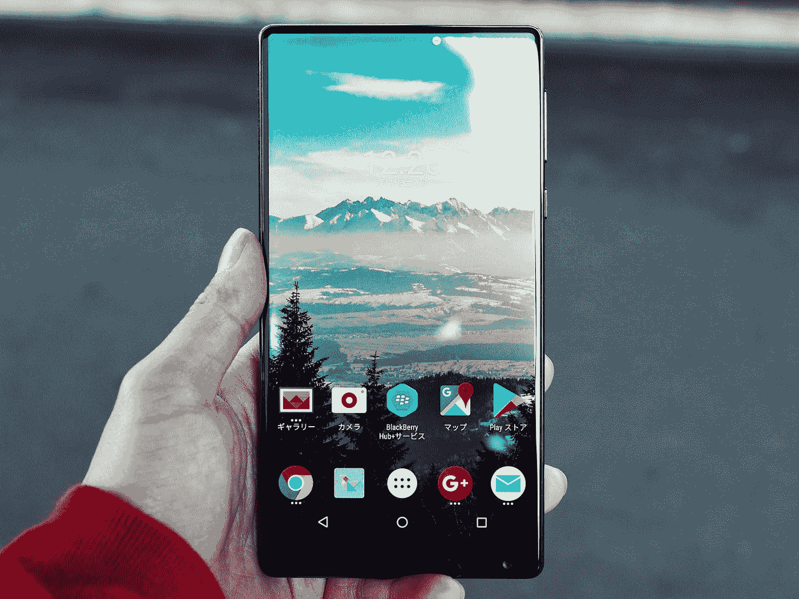

# 什么是。apk 和下载它的最佳方式

> 原文：<https://medium.com/quick-code/what-is-apk-and-the-best-way-to-download-it-3b952a0ba2d8?source=collection_archive---------0----------------------->

如果你想知道如何下载 apk 和最好的方法。

Photo by [Masakaze Kawakami](https://unsplash.com/@loli_oni?utm_source=medium&utm_medium=referral) on [Unsplash](https://unsplash.com?utm_source=medium&utm_medium=referral)

Android 是全球最大的智能手机操作系统，知道这个巧妙的技巧在未来的任何时候都会派上用场。

安卓如此受欢迎，以至于四分之三的人口袋里都有一部安卓手机，不要相信我，看看统计数据。