# 什么是 App 监控？

> 原文：<https://medium.com/globant/what-is-app-monitoring-9f6811bf07c5?source=collection_archive---------1----------------------->

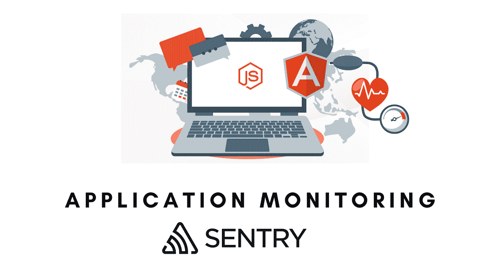

应用程序监控是测量应用程序性能、可用性和用户体验，并使用这些数据在应用程序问题影响客户之前识别和解决它们的过程。

这些问题包括:

*   渲染缓慢或屏幕滞后
*   不一致或无响应的用户体验
*   网络请求/API 错误

# 应用程序监控的重要性

在构建 web 应用程序时，我们希望最终用户能够在各种设备和浏览器中使用它们。在我们的行业中，事情必须快速发展，没有一个开发人员可以避免在项目中引入错误。另一个关键因素是，尤其是在使用 B2C 应用程序时，大多数最终用户不太可能报告错误。他们可能会忽略它们(如果它们不重要的话)或者更糟——甚至没有机会理解为什么就停止使用应用程序！另一方面，一些用户确实报告了错误，但是提供的信息通常是一般性的和不充分的。因此，很多时候我们都不知道真正的原因是什么，也不知道需要采取什么措施来重现问题。

客户端上的任何不一致、停机或错误都可能导致应用程序失去信任和可信度。所以，app 监控是开发必不可少的一部分。幸运的是，Sentry.io 是跟踪错误、记录问题和监控前端性能的最强大的工具。

# 让我们从 Angular 的 Sentry.io 开始吧

它是一款开源的错误监控工具，支持 Javascript、Java、PHP、Ruby、React、Rust、Unity 等多种语言和框架。

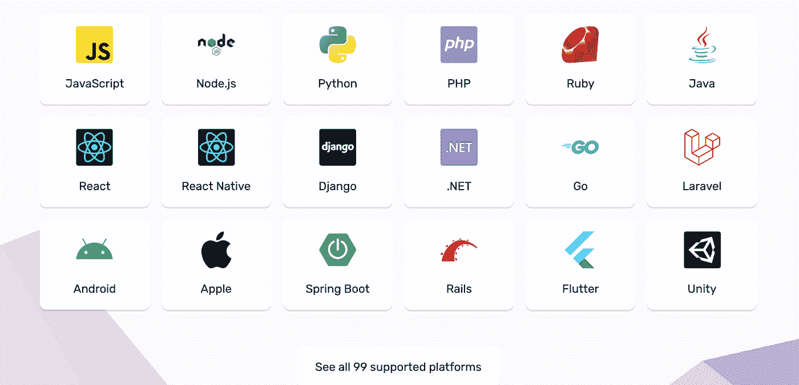

在本文中，让我们用 Sentry.io 设置并开始监控一个 Angular 应用程序。

# 步骤 1:建立一个哨兵项目

在 sentry.io 创建一个免费的 Sentry 账号，成功构建新账号后，点击**创建项目**按钮。

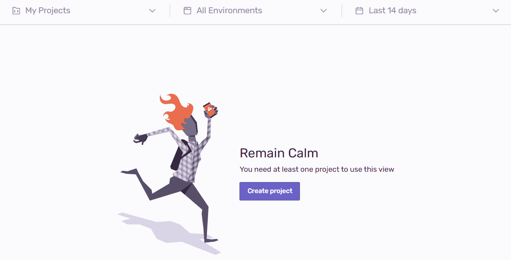

通过选择 Angular 作为平台并提供项目名称，我们将能够创建一个项目。

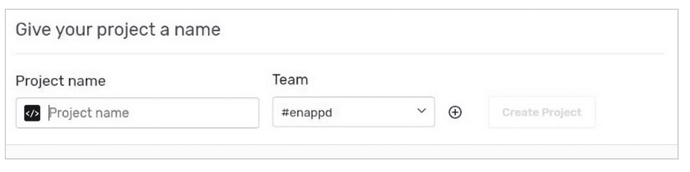

# 步骤 2:安装 Sentry SDK

```
npm install @sentry/browser — save
```

# 第三步:在 Angular app 中配置哨兵

为了让 Sentry 连接到我们的 angular 应用程序，我们需要用我们的客户端密钥配置我们的 SDK，也称为 Sentry DSN(数据源名称)值。

要检索客户端密钥，只需导航至**设置>项目>{您的项目名称}、**，如下图所示。

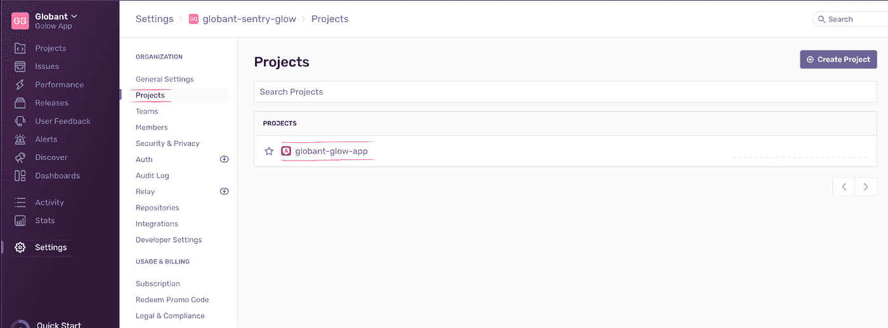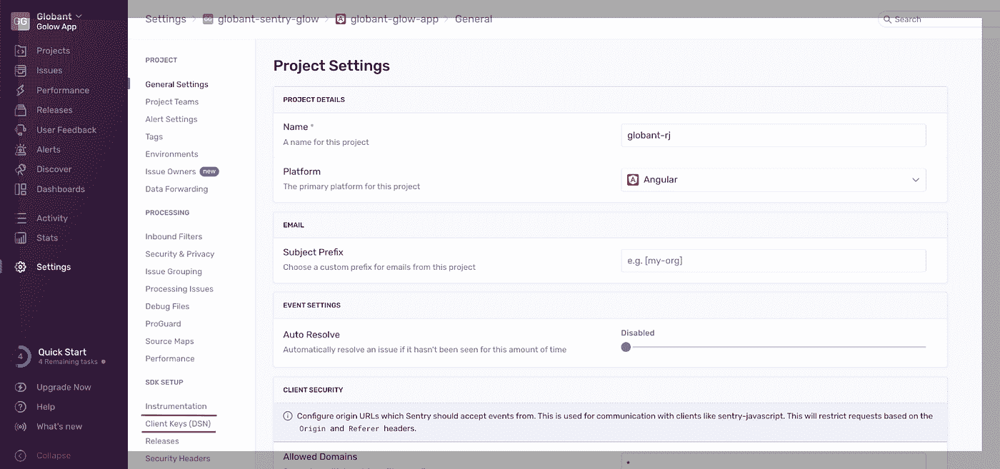

之后，点击**客户端密钥(DSN)** 并从客户端密钥中复制 DSN 值。

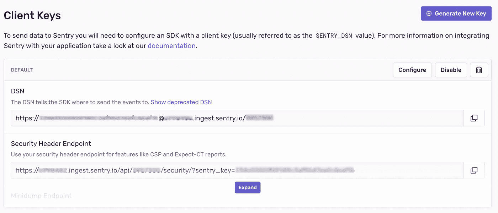

回到 AppModule 文件，我们必须初始化它。

```
import { NgModule, ErrorHandler, Injectable } from “@angular/core”;
import * as Sentry from “@sentry/browser”;**Sentry.init({
 dsn: <YOUR DSN, WHICH SENTRY GENERATES FOR YOU>,
 environment: environment.production ? ‘prod’ : ‘dev’
});****@Injectable()
export class SentryErrorHandler implements ErrorHandler {
 handleError(error) {
 Sentry.captureException(error.originalError || error);
 }
}**@NgModule({
 declarations: [ … ],
 imports: [ … ],
 providers: [{
 **provide: ErrorHandler, useClass: SentryErrorHandler**
 }],
 bootstrap: [AppComponent]
})
export class AppModule { }
```

# 步骤 4:测试 Sentry 集成

如果我们运行我们的应用程序，我们会得到一些错误，让我们看看这些错误是否在 Sentry.io 仪表板中被捕获。

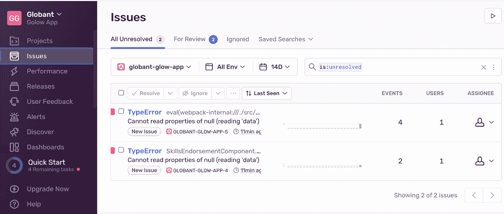

# 步骤 5:与 Sentry 的松弛集成

Sentry 提供各种应用程序/服务集成以获得效率，如吉拉、GitHub 等。你可以点击查看更多你喜欢的应用集成[。](https://sentry.io/integrations/)

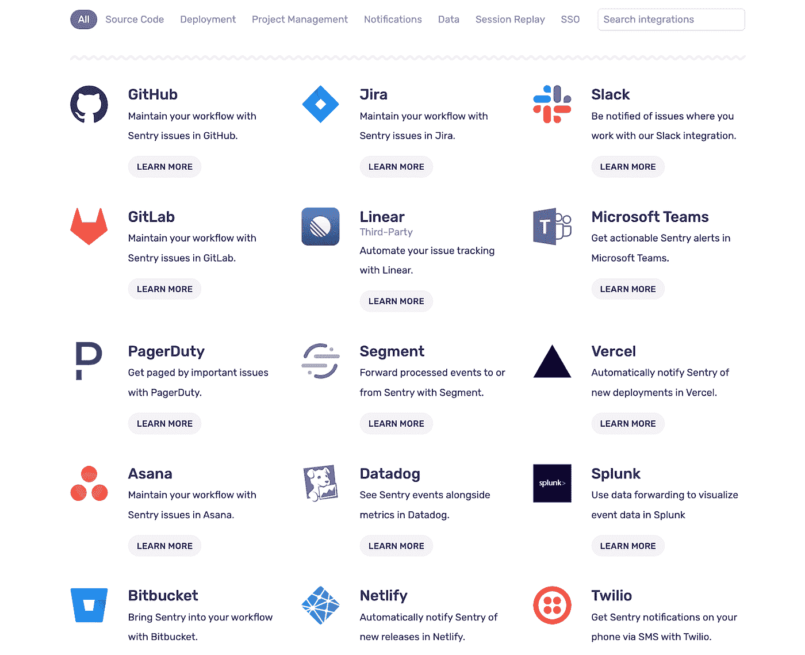

我们使用 Slack 作为一个消息应用程序，所以我们在 Slack 上集成了 Sentry.io 错误来通知错误。对于 slack 集成，我们需要安装 slack 应用程序，为此，我们可能需要 Sentry 所有者/经理的许可。

*   在 [Sentry.io](https://sentry.io/) 中，遍历到**设置>集成>松弛。**
*   单击“添加工作区”。

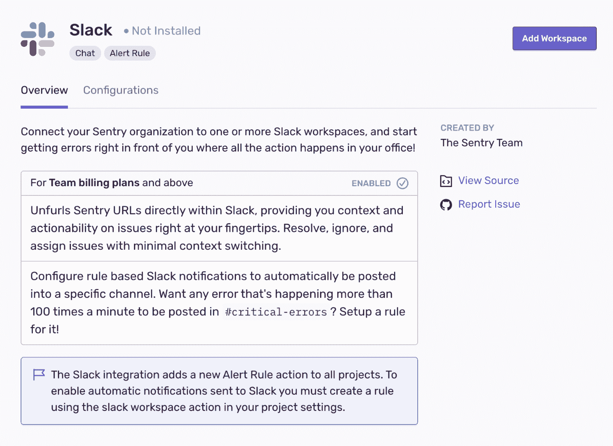

*   现在，我们应该使用 authentication 窗口右上角的下拉菜单切换到我们想要连接的 Slack 工作区。然后选择“允许”。如果我们要连接到多个工作区，请重复此过程。

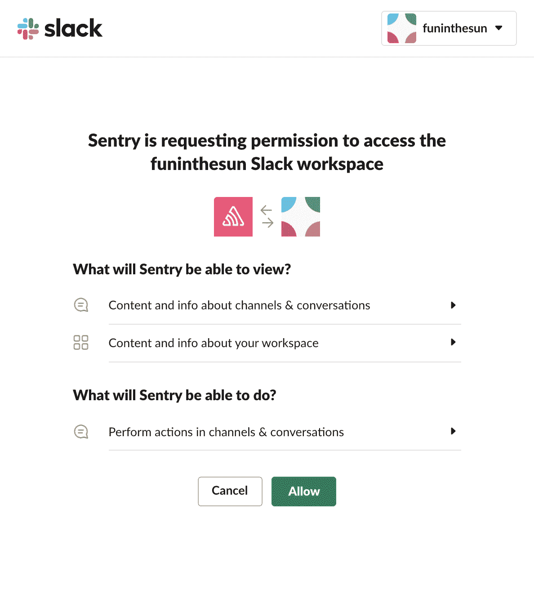

Sentry 集成已经完成，我们需要设置警报规则来实时获得 Slack 的通知。我们可以通过转到警报并单击“**创建警报”**来设置警报规则。在这里，我们可以配置警报，将通知路由到我们的松弛工作区。在[发布警报](https://docs.sentry.io/product/alerts/alert-types/#issue-alerts)页面中，选择“操作”下拉菜单中的“**发送松弛通知**”，然后选择您的工作区和渠道:

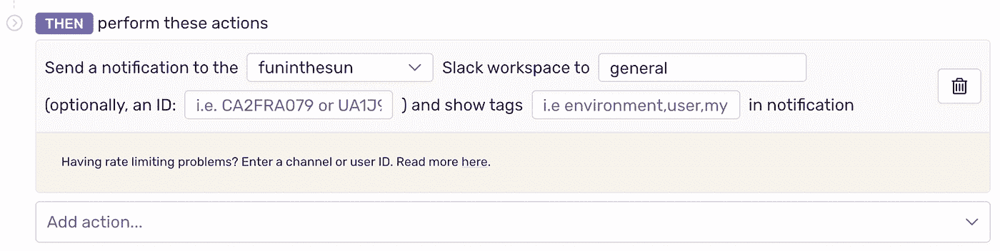

一旦我们收到问题警报的延期通知，我们可以使用“解决”、“忽略”或“分配”按钮来更新 Sentry 中的问题。

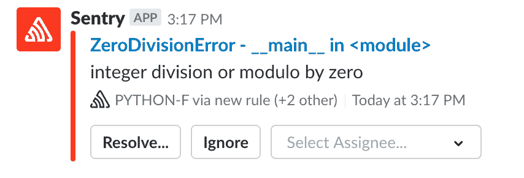

同样，如果你想整合你最喜欢的应用程序，一定要访问 [Sentry.io 网站](https://sentry.io/integrations)。

# 结论

当然，前端监控在今天的 web 开发实践中已经逐渐流行起来。Sentry 等强大的工具可以提供有用的见解和错误管理，以丰富最终用户体验。从长远来看，当我们的应用程序增长，引入更多的特性(和更多的 bug ),并开始带来更多的用户时，这是最容易察觉的。

我们可以集成多种应用/服务来提高工作效率。吉拉集成有助于直接从 Sentry.io 仪表板为团队成员分配/创建新的吉拉。同样，Sentry 提供了多种应用程序集成选项，几乎可以在所有框架上使用。我个人认为错误跟踪和监控是有价值的投资，可以为我们提供很多价值。