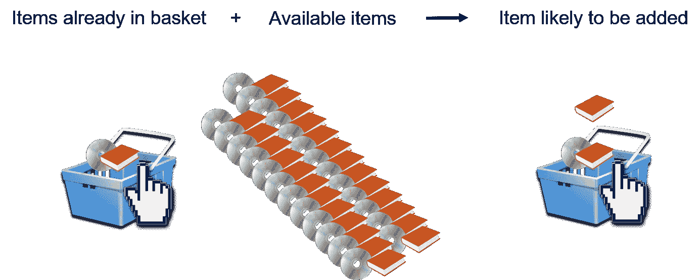

# 什么是关联规则挖掘？

> 原文：<https://medium.com/quick-code/what-is-association-rule-mining-f77e67a36377?source=collection_archive---------6----------------------->

## 了解什么是关联规则挖掘及其用途。

Association Rule Mining

关联规则挖掘是数据挖掘中非常重要的技术。关联规则是“如果-那么”语句。它有助于显示数据项之间关系的概率。

在数据科学中，关联规则挖掘用于从大型数据集中发现频繁模式、相关性、关联或因果结构。这些数据集可以在各种数据库中找到，例如关系数据库、事务数据库和其他形式的数据存储库。使用关联规则的行为被称为“关联规则挖掘”。

我们可以看到许多现实世界中的关联规则挖掘用例。如医药、零售、娱乐、用户体验(UX)设计等。

机器学习模型的使用包括在关联规则挖掘中分析数据库中的模式或事件的数据。

一个关联规则有两部分:一个 ***前件*** (if)和一个 ***后件*** (then)。前提是在数据中找到的项目。结果项是与先行项结合在一起的项。

*为了快速理解，考虑下面的关联规则:*

***“如果一个顾客买面包，他有 70%的可能买黄油。”***

*(给定关联规则中面包是前件，黄油是后件。)*

关联规则挖掘的一个典型例子是基于市场的分析。因为它的零售来源。关联规则显示项目集在事务中出现的频率。

对于零售商来说，关联规则挖掘提供了一种更好地理解顾客购买行为的方法。

**关联规则挖掘的好处-**

关联规则挖掘的强度或可靠性是一个需要考虑的非常重要的事情。当关联规则挖掘在大量数据项之间发现有趣的关联和关系时，它显示了一个项集在事务中出现的频率。

在数据挖掘中，关联规则对于分析和预测客户行为非常有用。

**关联规则挖掘的弊端-**

关联规则算法的主要缺点是获取的规则枯燥，发现的规则数量大，算法性能低。对于非数据挖掘专家来说，所采用的算法包含太多的参数，产生的规则太多，大部分都是无趣的，可理解性低。

评论任何事情，我期待着你的来信。更多内容请关注我。我感谢你的支持。

有时候收到几笔捐款也不错。或者，你可以请我喝杯咖啡。这将是我创作不同文章的灵感。

 [## Piyumi Premathilake 在 YouTube 上制作 DIY 视频，在媒体上写作。

### 嘿...我刚刚在这里创建了一个页面。现在你可以给我买杯咖啡了..

www.buymeacoffee.com](https://www.buymeacoffee.com/piyumi)