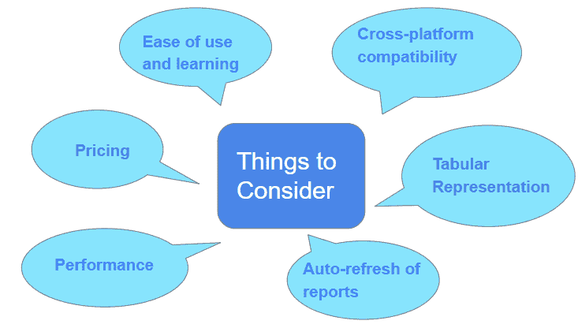
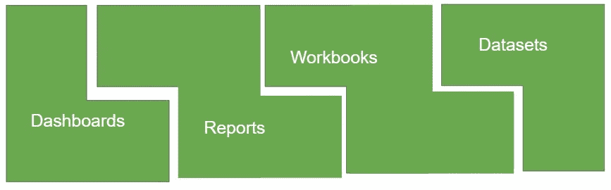
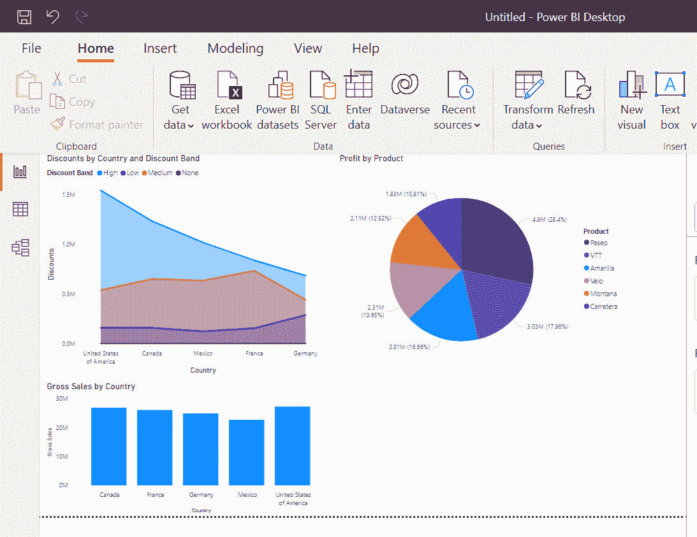
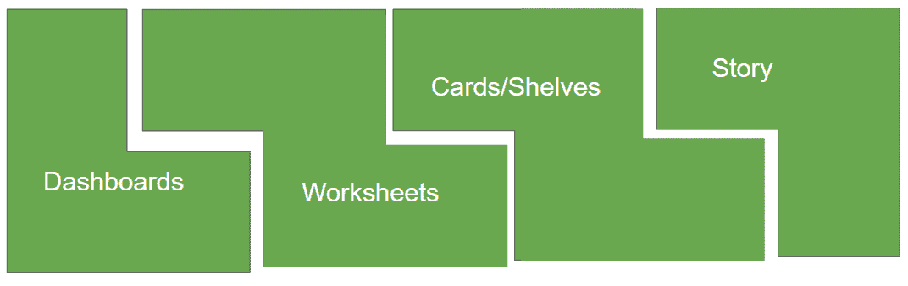
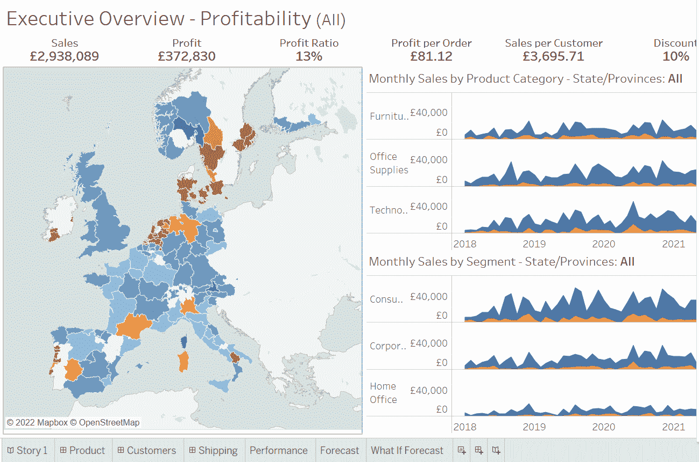

# 权力 BI 和画面哪个更好？

> 原文：<https://medium.com/globant/what-is-better-power-bi-or-tableau-b1e8fbf99e97?source=collection_archive---------0----------------------->

## 让您轻松选择最佳工具的 6 个核心因素。

处理数据时，使用正确的工具非常重要。合适的工具将有助于许多[商业智能(BI)](https://en.wikipedia.org/wiki/Business_intelligence) 活动。提取有价值的见解、创建可视化表示和分析数据等活动。话虽如此，如今有许多平台和 BI 工具可供使用。根据您的需求，选择合适的工具至关重要。为了让你做出明智的决定，我解释了 6 个因素。另外，这篇文章会让你对[的力量 BI](https://powerbi.microsoft.com/en-us/what-is-power-bi/) 和[的画面](https://www.tableau.com/why-tableau/what-is-tableau)有一个基本的了解。

# 选择商务智能工具:您需要考虑的因素

分析师可以使用 BI 工具生成报告、可视化和洞察。BI 工具提供与数据相关的活动，如从不同来源获取数据、准备数据以供分析以及创建图表。有许多商业智能工具可用。为了获得最佳工具，让我们关注核心因素。

**Fig 1\. Core Factors**

让我们更详细地检查每个因素。

*   **定价** 除了以下属性，在挑选工具的时候，这个属性是至关重要的。之前考虑这一点将有助于项目预算的规划。
*   **易用性和学习** 易用性取决于打算使用 BI 工具的人。有些工具需要专业技术知识，而有些则不需要。如果您打算将该工具用于数据分析师，那么很显然，这些分析师将具有技术专长。一些工具带有直观的界面。对于非技术用户很有帮助。
*   **跨平台兼容性** 跨平台兼容性是指在一个或多个软件平台上运行的能力。
*   **表格表示** 它是以行和列的方式对数据进行系统的排列。对于数据分析，一些用户考虑用表格表示。因此，了解这些限制有助于用户选择工具。
*   **报告的自动刷新** 一旦在初始数据集上创建了报告和视觉效果，这个因素就变得相关了。如果底层数据更新，我们也需要刷新基于它的报告。具有自动刷新能力减少了用户的手动工作。
*   **性能** 报告生成、可视化和数据分析速度因工具而异。对于某些工具来说，对于较小的数据量来说，这种性能是不错的，但是对于大量的数据来说，这种性能可能太慢了。基于用例，你需要决定使用什么工具。

现在，让我们了解一下这两种 BI 工具的基础。

# 功率 BI

Power BI 是一个数据可视化和分析工具。它可以处理来自各种来源的数据，并允许创建临时报告和仪表板。它利用了 SQL，这对于许多分析师来说是一个优势。拖放功能和许多连接器使其易于使用。下图显示了 Power BI 中的基本组件。

**Fig 2: Basic Components of Power BI**

以下是 Power BI 基本组件的详细列表。

*   **仪表板** 仪表板是画布，您可以在其中创建可视化效果。这些可视化是瓷砖。选择一个单幅图块会将您重定向到报告。最佳实践是在仪表板上只包括用例中最重要的元素。下图显示了包含 3 个图块的仪表板。

**Fig.3: Sample of Dashboard**

*   **报表** 报表是数据分析的可视化表示。用户决定报告中可视化的数量。当后端数据发生变化时，会刷新报告。
*   **工作簿** 工作簿是 Excel 文件。您可以像浏览电子表格一样浏览工作簿中的数据。否则，您可以将数据转换成数据集，然后用它来创建报告。对于大部分报告依赖于 Excel 的公司来说，像 Excel 这样的工作簿是有益的。
*   **数据集** Power BI 数据集包含导入平台的数据。要开始构建报告，需要将所有数据放在一个地方。这就是 Power BI 使用数据集所做的事情。数据集可以是许多报表的一部分。这些数据集是 Power BI 的核心部分。它们是数据就绪的。这意味着您可以使用它们来创建报告和可视化。

# 制品

让我们来了解一下 Power BI 提供的各种[产品。](https://powerbi.microsoft.com/en-us/)

*   **Power BI Desktop** :这是一款免费下载的应用。这对于以下任务很有用
    a .使用查询编辑器
    连接到各种数据源 b .将源数据转换、整形和建模为数据集。用于分析、可视化和报告
    这是一个完整的工具，可以实现商业智能的最高效率
*   **电力 BI 服务** 电力 BI 服务属于软件即服务。这有利于协作、共享和分发报告。除了分析数据集和创建报告，Power BI 服务还提供有限的建模功能。
*   Power BI Mobile
    Power BI 为 iOS、Android 和 Windows 等各种平台提供这项服务。您可以使用它来连接您的云数据或内部数据。该平台允许您查看报告和仪表板并与之交互。
*   **Power BI Report Builder** 这是 Power BI 提供的一项服务，用于创建分页报表。这是一个详细的报告定义。它包括哪些数据用于创建报告，以及您计划如何显示这些数据。当您开始执行报表时，报表生成器的工作就是执行定义。
*   **Power BI 报告服务器** 它是一个具有 web 门户的本地报告服务器。可以说 Power BI 服务是 Power BI 报告服务器的超集。请参考链接了解更多详情。[https://docs . Microsoft . com/en-us/power-bi/report-server/compare-report-server-service](https://docs.microsoft.com/en-us/power-bi/report-server/compare-report-server-service)
*   **Power BI Embedded** 这是另一项高级服务。它帮助利益相关者在 web 应用程序或网站中嵌入报告、仪表板和图块

现在让我们来看看 Tableau。

# （舞台上由人扮的）静态画面

Tableau 是一个 BI 工具。它帮助用户创建有效的仪表板和可视化。它带有询问数据功能。其基于自动数据可视化向用户提供相关结果。下图显示了 Tableau 中的基本组件。

**Fig 4\. Basic Components of Tableau**

以下是 Tableau 的基本组件和详细信息列表。

*   **仪表板
    仪表板是一组视图的集合。视图是报告。用户根据用例对报告进行分类。例如，如果您创建了一个仪表板，用于查看各种品牌的市场趋势。所有品牌在仪表盘上都有单独的视图，便于查看。**
*   **工作表** 工作表由单个视图组成。它可以包括各种卡片和架子。它由可视化的高级视图组成。
*   **卡片和货架** 工作表由卡片和货架组成。它们是数据集的行、列和文件。这些组件有助于挖掘数据，并根据报告需要对其进行排列。
*   **Story** Story 是一系列仪表板，它们共同传达对数据的深入了解。你可以从一个结论开始，然后引导用户通过不同的数据点。或者，以展示数据点开始，以结论结束。

**Fig 5: Sample Story**

# 制品

让我们来了解一下 Tableau 提供的各种[产品。](https://www.tableau.com/products)

*   **Tableau Prep** 该产品有助于数据准备自动化。此外，还有助于合并和清理数据。这反过来将使可视化过程更快。
*   **Tableau 桌面
    T5【Tableau 桌面】Tableau 提供的数据可视化软件。它有助于将统计数据转换成图形和图表等可视化表示。由于各种数据探索能力，为用户提供业务洞察力。您可以共享本地创建的工作簿。但是收件人需要安装 Tableau 桌面。它对于开发人员创建报告非常有用。它还有助于为决策者提供有价值的见解。**
*   **Tableau Server** 其基本功能是分享使用 Tableau desktop 创建的数据洞察。这是 Tableau 提供的一项管理服务。它可以控制通过 Tableau 服务器共享的内容。Tableau server 是决策者的最佳平台。
*   **Tableau Online** 这是一款针对 Tableau 的 SaaS 服务。它带有一个亚马逊红移的数据连接选项，谷歌 BigQuery。您可以使用 Tableau ID 来验证用户。通过身份验证后，用户可以访问发布到 Tableau Online 的视图和仪表板。然而，编辑有其局限性。例如，它的限制是针对某些行，而不是整个数据集。此外，在开始编辑之前，您需要有服务器数据连接。
*   **Tableau Mobile** 您需要 Tableau Online 或 Tableau Server 帐户才能使用 Tableau Mobile 应用程序。使用 Tableau Mobile，您可以立即可视化您的数据。这是展示数据的最快方法之一。换句话说，您可以探索并与您的用户或利益相关者共享内容。

# 力量 BI 和 Tableau 怎么选？

我们已经介绍了电源 BI 和 Tableau 的基础知识。现在让我们将核心因素与这两种工具联系起来。Tableau 相对比 Power BI 贵一些。例如，考虑这两种工具的基本版本。Power BI 每月 9.99 美元，Tableau 每月 70 美元。如果利益相关者是非技术人员，Power BI 提供了一个直观的界面，使其易于使用。Tableau 是技术可靠的用户最合适的选择。Power BI 不支持 iOS。Tableau 既适用于 Windows，也适用于 iOS。表格表示在 Tableau 中最多有 16 列的限制。可能很难用表格的形式来表示大量的数据。相反，Power BI 没有任何这种限制。我们在 Power BI **中提供了自动刷新功能。**自动刷新选项在 Tableau 中不可用。我们必须手动刷新报告。Tableau 甚至可以在短时间内生成大量数据的可视化效果。Power BI 在处理大型数据集时速度较慢。因此，工具的选择应由个人需求和核心因素决定(图 1)。