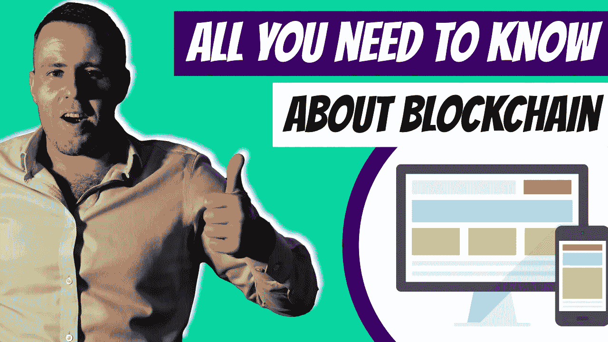

# 什么是区块链——企业所有者指南

> 原文：<https://medium.com/duomly-blockchain-online-courses/what-is-blockchain-guide-for-business-owners-4aff73f8318b?source=collection_archive---------8----------------------->

[What Is Blockchain — Guide for Business Owners](https://www.blog.duomly.com/what-is-blockchain/)

本文最初发表于:[https://www.blog.duomly.com/what-is-blockchain/](https://www.blog.duomly.com/what-is-blockchain/)

如果你是一个企业主，你可能听说过“区块链”这个词。但是区块链到底是什么？这对您的业务意味着什么？

简而言之，区块链是一个分布式数据库，允许安全，透明，防篡改…