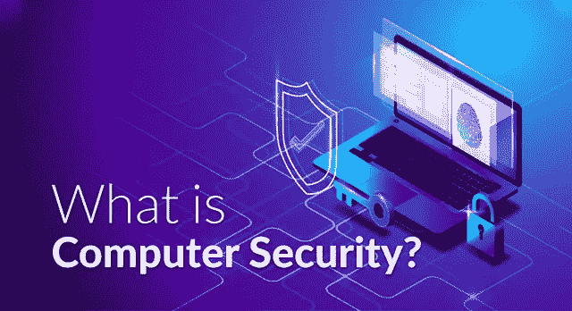
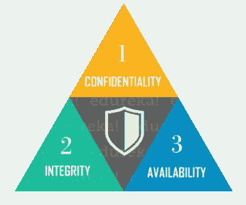
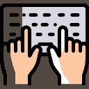

# 什么是计算机安全？-计算机安全入门指南

> 原文：<https://medium.com/edureka/what-is-computer-security-c8eb1b38de5?source=collection_archive---------0----------------------->

What is Computer Security — Edureka

互联网在许多方面改变了我们的生活。不幸的是，这个庞大的网络及其相关技术也带来了越来越多的安全威胁。保护自己免受这些威胁和攻击的最有效方法是了解标准的网络安全实践。这篇关于“什么是计算机安全？”介绍计算机安全及其关键概念。

1.  什么是计算机安全？
2.  计算机安全威胁
3.  最佳计算机安全实践。

# 什么是计算机安全？

计算机安全基本上是保护计算机系统和信息免受损害、盗窃和未经授权的使用。它是防止和检测未经授权使用您的计算机系统的过程。

人们经常将计算机安全与其他相关术语混淆，如信息安全和网络安全。确定这些术语之间的相似性和差异的一种方法是询问被担保的是什么。举个例子，

*   *信息安全*是保护信息免受未经授权的访问、修改&删除
*   C *计算机安全*意味着通过更新和打补丁来保护一台独立的机器
*   网络安全被定义为保护通过计算机网络进行通信的计算机系统

理解这些词之间的区别是很重要的，尽管对它们的意思和重叠或可互换的程度没有明确的共识。

因此，**计算机安全**可以定义为为计算机系统的所有组件提供机密性、完整性和可用性的控制措施。我们来阐述一下定义。

# 计算机系统的组件

需要保护的计算机系统组件有:

*   *硬件，*计算机的物理部分，如系统内存和磁盘驱动器
*   *固件，*蚀刻在硬件设备的非易失性存储器中的永久性软件，用户几乎看不见
*   *软件，*向用户提供服务的程序，如操作系统、文字处理器、互联网浏览器

# 中情局三人组

计算机安全主要涉及三个主要领域:

*   ***保密性*** *是*确保信息只提供给预期的受众
*   ***完整性*** *是*保护信息不被未授权方修改
*   ***可用性*** *是*保护信息不被未授权方修改

简单地说，计算机安全就是确保信息和计算机组件是可用的，但仍然受到保护，防止不应该访问或修改它的人或软件的攻击。

现在继续讨论“什么是计算机安全？”文章让我们看看最常见的安全威胁。

# 计算机安全威胁

计算机安全威胁是可能妨碍计算机正常运行的潜在危险。在当今时代，随着世界走向数字化，网络威胁不断增加。最有害的计算机安全类型有:

## 病毒

计算机病毒是一种恶意程序，它在用户不知情的情况下被加载到用户的计算机中。它会自我复制并感染用户电脑上的文件和程序。病毒的最终目的是确保受害者的电脑永远无法正常运行，甚至根本无法运行。

## 电脑蠕虫

计算机蠕虫是一种软件程序，它可以在没有人类干预的情况下将自身从一台计算机复制到另一台计算机。这里的潜在风险是，它将耗尽您的计算机硬盘空间，因为蠕虫可以大量复制，速度很快。

## 网络钓鱼

伪装成值得信赖的人或企业，网络钓鱼者试图通过欺诈性电子邮件或即时消息窃取敏感的财务或个人信息。不幸的是，网络钓鱼非常容易实施。你被欺骗认为这是合法的邮件，你可能会输入你的个人信息。

## 僵尸网络

僵尸网络是一组连接到互联网的计算机，已经被黑客利用计算机病毒入侵。个人电脑被称为“僵尸电脑”。这种威胁的结果是受害者的计算机，这是机器人将被用于恶意活动和更大规模的攻击，如 DDoS。

## Rootkit

rootkit 是一种计算机程序，旨在提供对计算机的持续特权访问，同时主动隐藏其存在。一旦安装了 rootkit，rootkit 的控制器将能够远程执行文件并更改主机上的系统配置。

## 键盘记录器

也称为击键记录器，击键记录器可以跟踪用户在其计算机上的实时活动。它记录了用户键盘的所有击键。键盘记录器也是一个非常强大的威胁，窃取人们的登录凭证，如用户名和密码。

这些可能是您会遇到的最常见的安全威胁。除此之外，还有其他像**间谍软件、wabbits、scareware、bluesnarfing** 等等。幸运的是，有一些方法可以保护自己免受这些攻击。

# 计算机安全实践

如今，计算机安全威胁变得越来越具有创造性。人们非常需要用信息和资源来武装自己，以抵御这些复杂且不断增长的计算机安全威胁，并保持在线安全。您可以采取的一些预防措施包括:

*   通过以下方式保护您的计算机:

1.  安装可靠、有信誉的安全和防病毒软件
2.  激活您的防火墙，因为防火墙是互联网和您的局域网之间的安全屏障

*   及时了解您设备的最新软件和新闻，并在软件更新可用时立即执行更新
*   避免点击电子邮件附件，除非你知道其来源
*   定期更改密码，使用数字、字母和大小写的独特组合
*   小心使用互联网，在网上冲浪时忽略弹出窗口和下载
*   花时间研究计算机安全的基本方面，并让自己了解不断演变的网络威胁
*   执行每日全系统扫描，并创建一个定期系统备份计划，以确保您的数据是可检索的，如果你的计算机发生问题。

除了这些，还有许多方法可以保护你的电脑系统。加密和计算机清理程序等方面可以帮助保护您的计算机及其文件。

不幸的是，网络威胁的数量正在快速增加，更复杂的攻击正在出现。因此，拥有良好的网络安全概念基础将使您能够保护您的计算机免受不断演变的网络威胁。

这就把我们带到了关于什么是计算机安全的文章的结尾。我希望这篇文章对你有所帮助，并增加了你的知识价值。

如果你想查看更多关于人工智能、DevOps、道德黑客等市场最热门技术的文章，你可以参考 Edureka 的官方网站。

请留意本系列中的其他文章，它们将解释网络安全的各个方面。

> 1.[什么是网络安全？](/edureka/what-is-cybersecurity-778feb0da72)
> 
> 2.[网络安全框架](/edureka/cybersecurity-framework-89bbab5aaf17)
> 
> 3.[隐写术教程](/edureka/steganography-tutorial-1a3c5214a00f)
> 
> 4.[什么是网络安全？](/edureka/what-is-network-security-1f659407dcc)
> 
> 5.[什么是密码学？](/edureka/what-is-cryptography-c94dae2d5974)
> 
> 6.[什么是应用安全？](/edureka/application-security-tutorial-e6a0dda25f5c)
> 
> 7.[渗透测试](/edureka/what-is-penetration-testing-f91668e2291a)
> 
> 8.[道德黑客教程](/edureka/ethical-hacking-tutorial-1081f4aacc53)
> 
> 9.[关于 Kali Linux 你需要知道的一切](/edureka/ethical-hacking-using-kali-linux-fc140eff3300)
> 
> 10.[使用 Python 的道德黑客](/edureka/ethical-hacking-using-python-c489dfe77340)
> 
> 11. [DDOS 攻击](/edureka/what-is-ddos-attack-9b73bd7b9ba1)
> 
> 12.[使用 Python 的 MacChanger】](/edureka/macchanger-with-python-ethical-hacking-7551f12da315)
> 
> 13 [ARP 欺骗](/edureka/python-arp-spoofer-for-ethical-hacking-58b0bbd81272)
> 
> 14. [Proxychains，Anonsurf & MacChange](/edureka/proxychains-anonsurf-macchanger-ethical-hacking-53fe663b734)
> 
> 15.[足迹](/edureka/footprinting-in-ethical-hacking-6bea07de4362)
> 
> 16.[50 大网络安全面试问答](/edureka/cybersecurity-interview-questions-233fbdb928d3)

*原载于 2019 年 1 月 23 日*[*www.edureka.co*](https://www.edureka.co/blog/what-is-computer-security/)*。*