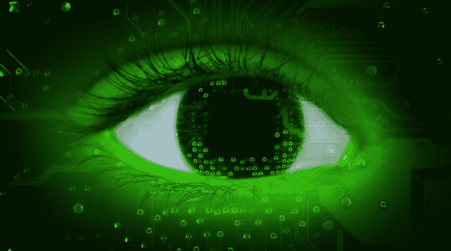

# 什么是计算机视觉？

> 原文：<https://medium.com/quick-code/what-is-computer-vision-88de46921ff7?source=collection_archive---------1----------------------->

计算机视觉允许机器以更快的速度和更高的效率识别图像中的人、地点和事物，准确率达到或超过人类水平。它通常由深度学习模型构建，可以自动从单个图像或一系列图像中提取、分析、分类和理解有用的信息。图像数据可以采取多种形式，例如单个图像、视频序列、来自多个摄像机的视图或三维数据。

应用非常广泛，从识别高速装配线上的缺陷到自动机器人，到分析医学图像，再到识别社交媒体上的产品和人物。

## 计算机视觉的使用案例和优势

## 公共安全和家庭安全

具有图像和面部识别功能的计算机视觉有助于快速识别非法进入者或相关人员，从而实现更安全的社区和更有效的阻止犯罪的方式。

## 认证和增强的人机交互

增强的人机交互提高了客户满意度，例如在零售点提供基于客户情绪分析的产品，或者基于客户身份和偏好通过快速认证提供更快的银行服务。

## 内容管理和分析

每天都有数百万张图片被添加到媒体和社交渠道中。元数据提取和图像分类等计算机视觉技术的使用极大地提高了效率和收入机会。

## 自动驾驶

使用计算机视觉技术。汽车制造商可以提供更好、更安全的自动驾驶汽车导航，实现自动驾驶成为现实和可靠交通选择的目标。

## 医学成像

使用计算机视觉进行医学图像分析可以大大提高患者医学诊断的准确性和速度，从而获得更好的治疗效果和更长的预期寿命。

## 制造过程控制

训练有素的计算机视觉融入机器人技术，提高了制造应用的质量保证和运营效率，从而生产出更可靠、更具成本效益的产品。