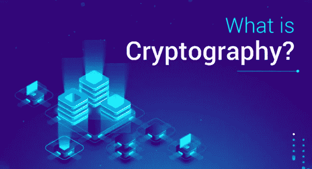
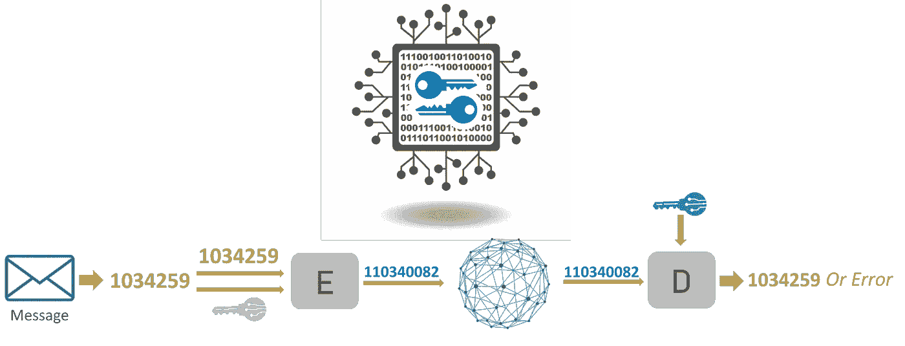
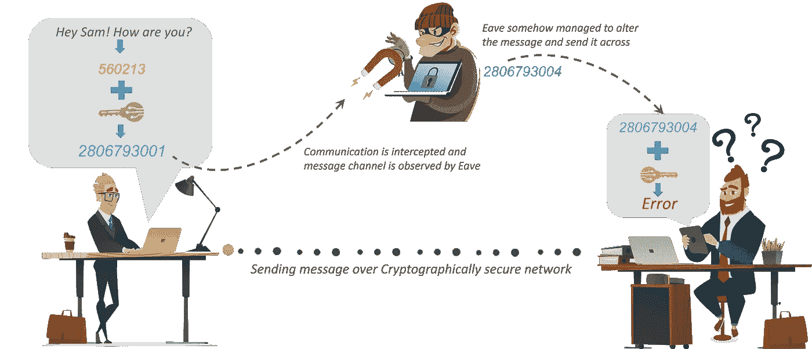
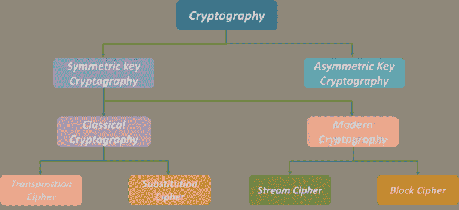
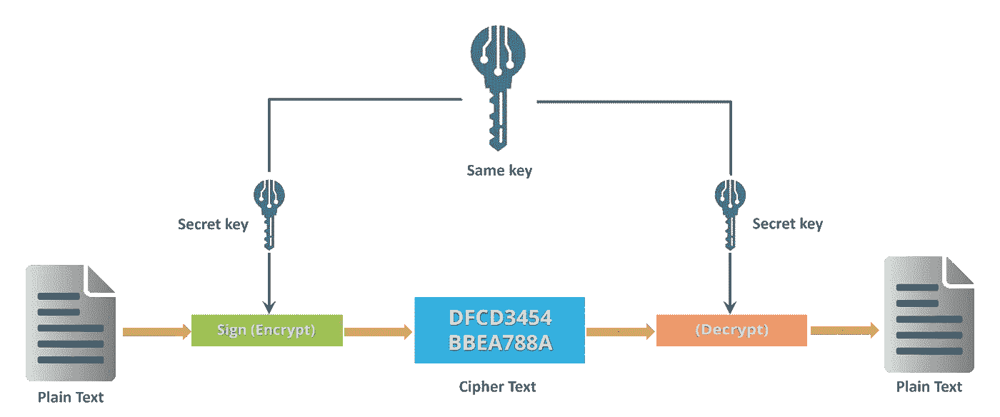
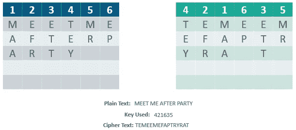
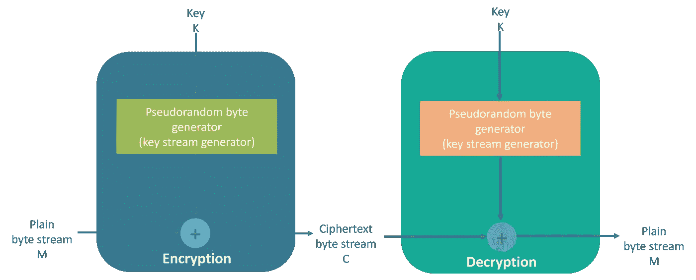
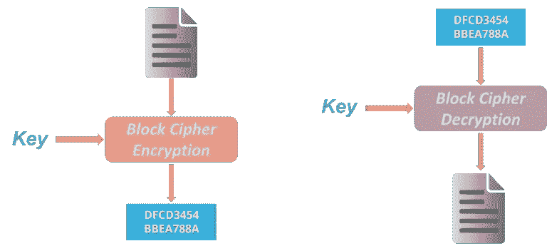
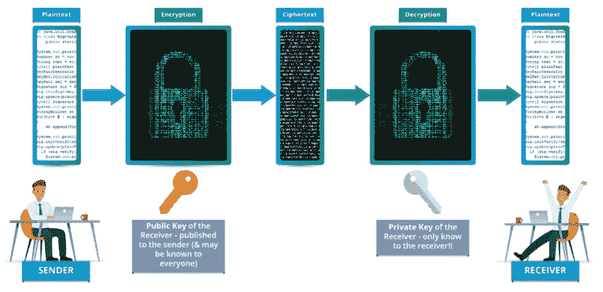
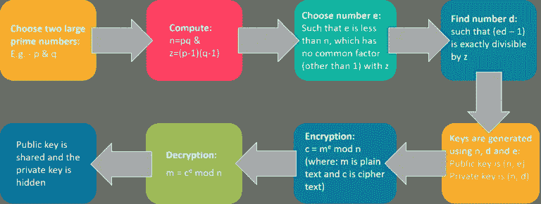

# 什么是密码学？—密码算法简介

> 原文：<https://medium.com/edureka/what-is-cryptography-c94dae2d5974?source=collection_archive---------2----------------------->

What is Cryptography? — Edureka

加密非常重要，因为它保护数据和信息免受未经授权的访问，从而保持机密性。这里有一篇文章可以帮助您了解“什么是加密技术”，以及如何使用它来保护公司机密、保密信息和个人信息，以防止身份盗窃之类的事情。

以下是我在本文中介绍的内容:

*   密码学入门？
*   加密算法
*   各种密码算法是如何工作的？

现在，我将借助一个例子或一个场景来解释*什么是密码学？*

假设有一个人名叫*安迪*。现在假设安迪给他在世界另一端的朋友萨姆发了一条信息。很明显，他希望这条消息是保密的，任何人都不能接触到这条消息。他使用一个公共论坛，例如 WhatsApp 来发送这条消息。主要目标是保护这种通信。

假设有一个叫*屋檐*的聪明家伙，偷偷接入了你的通讯频道。既然这家伙能接触到你的交流，他能做的就不仅仅是偷听了，例如，他能试着改变信息。这只是一个小例子。如果 *Eave* 获取了你的私人信息怎么办？结果可能是灾难性的。

那么*安迪*如何确保中间没有人能够访问发送给*山姆*的消息呢？这就是 ***加密或*** 的用武之地。我来告诉你“什么是密码学”。

# 什么是密码学？

> 密码术是对在敌人面前保护通信和数据的技术的实践和研究。

好了，现在你知道了“什么是密码术”,让我们看看密码术如何帮助保护安迪和萨姆之间的连接。

因此，为了保护他的信息，安迪首先把他可读的信息转换成不可读的形式。在这里，他将消息转换成一些随机数。之后，他用一个密钥对他的信息进行加密，在密码学中，我们称这个为 ***密文*** 。

安迪通过通信信道发送密文或加密信息，他不必担心有人会在中途发现他的私人信息。假设这里的*屋檐*发现了这个消息，他设法在消息到达*山姆*之前修改了它。

现在， *Sam* 需要一个密钥来解密消息，以恢复原始明文。为了将密文转换成明文，*山姆*需要使用解密密钥。使用密钥，他可以将密文或数值转换成相应的明文。

在使用密钥进行解密后，出来的将是原始的*明文*消息，是一个*错误*。这个错误非常重要。这是山姆知道安迪发送的信息与他收到的信息不同的方式。因此，我们可以说加密对于通过网络交流或共享信息非常重要。

# 加密算法

密码学大致分为两类: ***对称密钥密码术*** 和 ***非对称密钥密码术*** (俗称公钥密码)。

现在对称密钥密码术被进一步分类为经典密码术和现代密码术。

再往下钻，经典密码学分为换位密码和替代密码。另一方面，现代密码学分为流密码和分组密码。

所以，让我们用例子来理解这些算法。

# 各种密码算法是如何工作的？

让我们从对称密钥加密开始

## 对称密钥加密

> 一种**加密**系统，其中消息的发送方和接收方共享一个用于加密和解密消息的通用**密钥**。最流行的**对称**–**密钥**系统是数据**加密**标准(DES)。

## 换位密码

> 在密码学中，转置密码是一种加密方法，通过这种方法，明文单元(通常是字符或字符组)所占据的位置根据规则系统被移位，使得密文构成明文的置换。

也就是说，单元的顺序被改变(明文被重新排序)。数学上，对字符位置使用双射函数进行加密，反函数进行解密。

***举例:***

## 替代密码

> 一种加密方法，根据固定的系统，用密文替换明文单元；“单元”可以是单个字母(最常见的)、成对字母、三个字母、以上的混合等等。

***举例:***

考虑幻灯片上显示的这个示例:使用刚才讨论的系统，关键字“zebras”为我们提供了以下字母:

## 流密码

> 一次加密一位的对称或密钥加密算法。使用流密码，每次加密时，相同的明文位或字节将被加密为不同的位或字节。

## 分组密码

> 一种加密方法，应用确定性算法和对称密钥来加密文本块，而不是像流密码那样一次加密一位

***例如:*** 常见的分组密码 AES，用预定长度的密钥加密 128 位的块:128、192 或 256 位。分组密码是伪随机置换(PRP)系列，对固定大小的比特块进行操作。PRPs 是不能从完全随机排列中区分出来的函数，因此，在证明不可靠之前，被认为是可靠的。

# 非对称密钥加密(或公钥加密)

使用不同密钥对信息进行加密和解密的加密过程。密钥是不同的，但在数学上是相关的，因此通过解密密文来检索明文是可行的。

RSA 是最广泛使用的公钥加密形式，

## RSA 算法

*   RSA 代表这项技术的发明者*里维斯特、沙米尔和阿德尔曼*
*   公钥和私钥都可以互换
*   可变密钥大小(512、1024 或 2048 位)

*下面是 RSA 算法如何生成密钥*

好了，这是“什么是密码学”的文章。为了保护您在互联网上共享的信息和数据，使用强大的加密算法以避免任何灾难性的情况是非常重要的。

这就把我们带到了关于什么是密码术的文章的结尾。我希望这篇文章对你有所帮助，并增加了你的知识价值。

如果你想查看更多关于人工智能、DevOps、道德黑客等市场最热门技术的文章，那么你可以参考 [Edureka 的官方网站](https://www.edureka.co/blog/?utm_source=medium&utm_medium=content-link&utm_campaign=what-is-cryptography)。

请留意本系列中的其他文章，它们将解释网络安全的各个方面。

> 1.[什么是网络安全？](/edureka/what-is-cybersecurity-778feb0da72)
> 
> 2.[网络安全框架](/edureka/cybersecurity-framework-89bbab5aaf17)
> 
> 3.[隐写术教程](/edureka/steganography-tutorial-1a3c5214a00f)
> 
> 4.[什么是网络安全？](/edureka/what-is-network-security-1f659407dcc)
> 
> 5.[什么是计算机安全？](/edureka/what-is-computer-security-c8eb1b38de5)
> 
> 6.什么是应用安全？
> 
> 7.[渗透测试](/edureka/what-is-penetration-testing-f91668e2291a)
> 
> 8.[道德黑客教程](/edureka/ethical-hacking-tutorial-1081f4aacc53)
> 
> 9.[关于 Kali Linux 你需要知道的一切](/edureka/ethical-hacking-using-kali-linux-fc140eff3300)
> 
> 10.[使用 Python 的道德黑客](/edureka/ethical-hacking-using-python-c489dfe77340)
> 
> 11. [DDOS 攻击](/edureka/what-is-ddos-attack-9b73bd7b9ba1)
> 
> 12.[使用 Python 的 MAC changer](/edureka/macchanger-with-python-ethical-hacking-7551f12da315)
> 
> 13 [ARP 欺骗](/edureka/python-arp-spoofer-for-ethical-hacking-58b0bbd81272)
> 
> 14. [Proxychains，Anonsurf & MacChange](/edureka/proxychains-anonsurf-macchanger-ethical-hacking-53fe663b734)
> 
> 15.[足迹](/edureka/footprinting-in-ethical-hacking-6bea07de4362)
> 
> 16.[50 大网络安全面试问答](/edureka/cybersecurity-interview-questions-233fbdb928d3)

*原载于 2018 年 8 月 9 日 www.edureka.co**的* [*。*](https://www.edureka.co/blog/what-is-cryptography/)