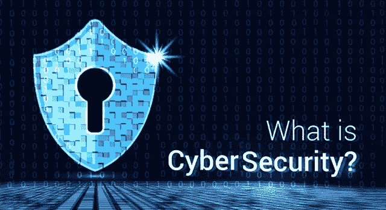
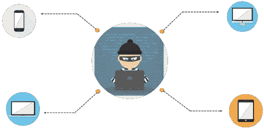
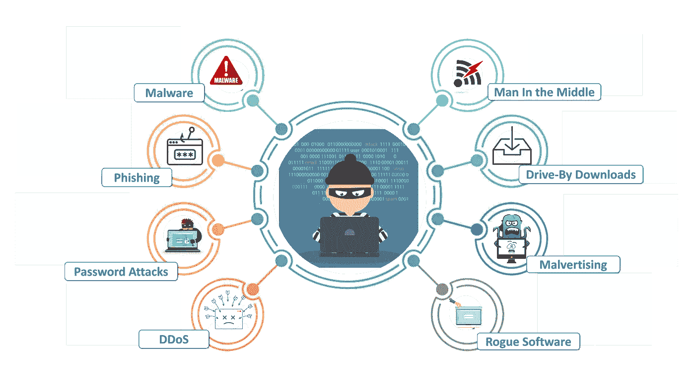
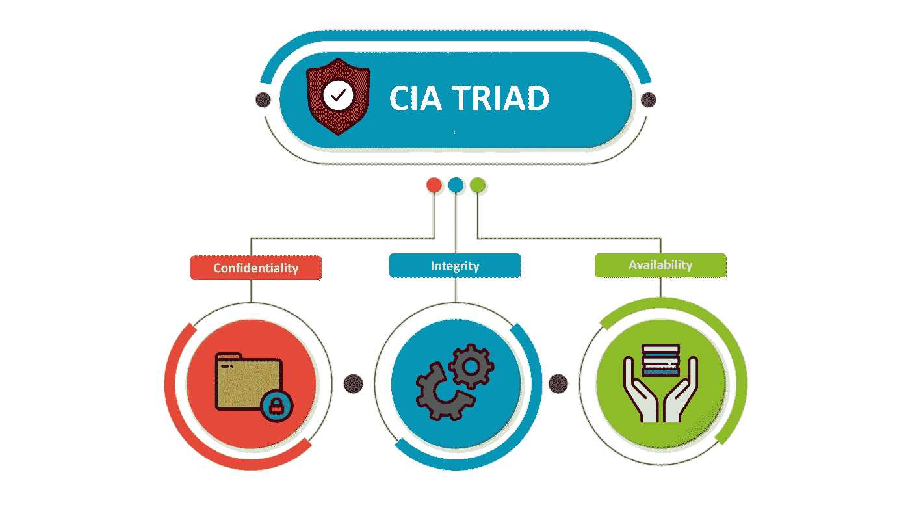
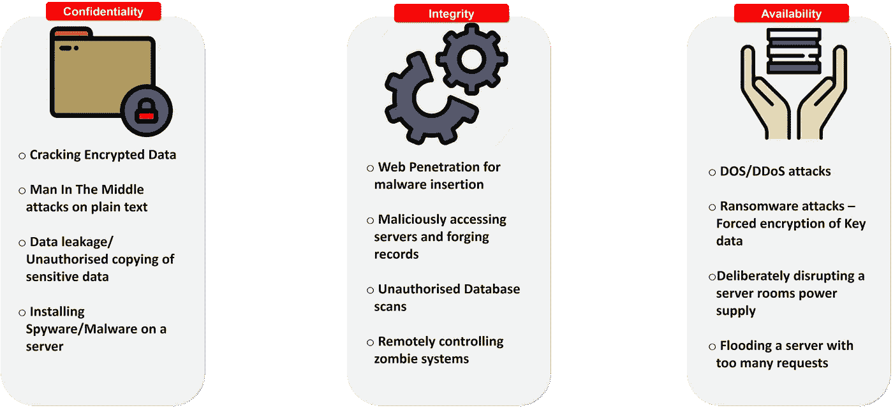
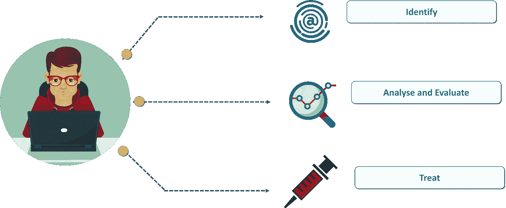
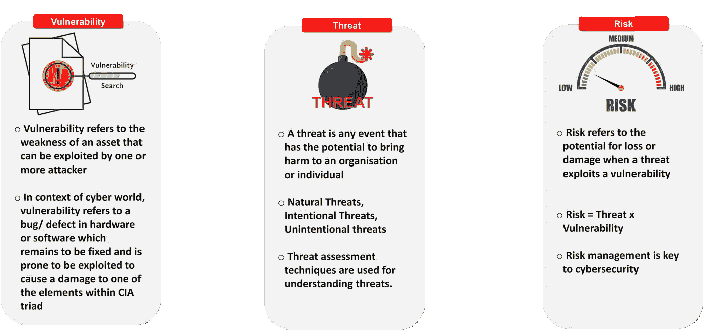

# 网络安全 101 —网络安全世界入门指南

> 原文：<https://medium.com/edureka/what-is-cybersecurity-778feb0da72?source=collection_archive---------2----------------------->

What is Cybersecurity — Edureka

网络犯罪是一个全球性的问题，一直主导着新闻周期。它对个人安全构成威胁，对大型国际公司、银行和政府构成更大的威胁。今天的有组织网络犯罪远远超过了过去的单独黑客，现在大型有组织犯罪团伙像初创公司一样运作，并经常雇用训练有素的开发人员，他们不断创新在线攻击。有如此多的数据可供利用，网络安全变得至关重要。因此，我决定写一篇关于“什么是网络安全？”的文章

在我们开始之前，让我先列出我将在这个博客课程中涉及的主题。

*   为什么我们需要网络安全？
*   网络攻击的类型
*   什么是网络安全？
*   中情局三人组
*   网络安全是如何实施的？

# 为什么我们需要网络安全？

*The golden age of Hackers — What is Cybersecurity?*

可以理直气壮地说，今天的一代生活在互联网上，我们普通用户几乎不知道那些随机的 1 和 0 是如何安全地到达我们的计算机的。对于一个黑客来说，这是一个黄金时代。由于有如此多的接入点、公共 IP 和持续的流量以及大量的数据要利用，黑帽黑客们花了大量的时间来利用漏洞和创建恶意软件。除此之外，网络攻击每天都在演变。黑客对他们的恶意软件变得越来越聪明，越来越有创造力，他们如何绕过病毒扫描和防火墙仍然困扰着许多人。

因此，必须有某种协议来保护我们免受所有这些网络攻击，并确保我们的数据不会落入坏人之手。这正是我们需要网络安全的原因。

让我们来看看一些自互联网诞生以来一直困扰着我们这个群体的最常见的网络攻击。

# 网络攻击的类型

*Types of Cyberthreats — What is Cybersecurity?*

# 什么是网络安全？

> 网络安全是指用于保护网络、程序和数据的完整性免受攻击、破坏或未经授权的访问的一套技术。

从计算的角度来看，安全包括网络安全和物理安全——两者都被企业用来防止对数据中心和其他计算机化系统的未经授权的访问。信息安全旨在维护数据的机密性、完整性和可用性，是网络安全的一个子集。使用网络安全有助于防止网络攻击、数据泄露和身份盗窃，并有助于风险管理。

因此，当谈到网络安全时，人们可能会问"*我们在努力保护自己免受什么威胁？*“嗯，有三个主要方面我们在努力控制，名字:

*   越权存取
*   未经授权的删除
*   未经授权的修改

这三个术语是众所周知的中情局三要素的同义词，代表机密性、完整性和可用性。CIA triad 通常也被称为安全的三大支柱，一个组织的大多数安全策略都是建立在这三个原则之上的。

# 中情局三人组

代表机密性、完整性和可用性的 CIA triad 是一种设计模型，用于指导公司和组织制定其安全策略。为了避免与中央情报局(CIA)混淆，它也被称为 AIC 三合会。三元组的组件被认为是安全性的最重要和最基本的组件。让我向大家简要介绍一下这三个组成部分

*CIA Triad — What is Cybersecurity?*

## 机密

保密是对个人信息的保护。保密意味着在你和客户之间保守客户的信息，不要告诉其他人，包括同事、朋友、家人等。

## 完整

在计算机系统中，完整性是指确保数据真实、准确并防止未经授权的用户修改的方法。

## 有效性

在计算机系统的上下文中，可用性是指用户在指定位置以正确的格式访问信息或资源的能力。

*Attacks on CIA — What is Cybersecurity?*

# 网络安全是如何实施的？

实际实施网络安全有许多程序，但实际解决安全相关问题有三个主要步骤。

第一步是识别导致安全问题的问题，例如，我们必须识别是否存在拒绝服务攻击或中间人攻击。下一步是评估和分析问题。我们必须确保隔离所有可能在攻击中受损的数据和信息。最后，在评估和分析问题之后，最后一步是开发一个补丁，实际解决问题并使组织回到运行状态。

*Steps to treat a Cyberattack — What is Cybersecurity?*

在识别、分析和处理网络攻击时，对于各种计算，有三个原则要牢记在心。它们是:

*Vulnerability, Threat and Risk — What is Cybersecurity?*

如果你想查看更多关于人工智能、DevOps、道德黑客等市场最热门技术的文章，你可以参考 Edureka 的官方网站。

请留意本系列中的其他文章，它们将解释网络安全的各个方面。

> 1.[什么是密码学？](/edureka/what-is-cryptography-c94dae2d5974)
> 
> 2.[网络安全框架](/edureka/cybersecurity-framework-89bbab5aaf17)
> 
> 3.[隐写术教程](/edureka/steganography-tutorial-1a3c5214a00f)
> 
> 4.[什么是网络安全？](/edureka/what-is-network-security-1f659407dcc)
> 
> 5.[什么是计算机安全？](/edureka/what-is-computer-security-c8eb1b38de5)
> 
> 6.[什么是应用安全？](/edureka/application-security-tutorial-e6a0dda25f5c)
> 
> 7.[渗透测试](/edureka/what-is-penetration-testing-f91668e2291a)
> 
> 8.[道德黑客教程](/edureka/ethical-hacking-tutorial-1081f4aacc53)
> 
> 9.[关于 Kali Linux 你需要知道的一切](/edureka/ethical-hacking-using-kali-linux-fc140eff3300)
> 
> 10.[使用 Python 的道德黑客](/edureka/ethical-hacking-using-python-c489dfe77340)
> 
> 11. [DDOS 攻击](/edureka/what-is-ddos-attack-9b73bd7b9ba1)
> 
> 12.[使用 Python 的 MAC changer](/edureka/macchanger-with-python-ethical-hacking-7551f12da315)
> 
> 13 [ARP 欺骗](/edureka/python-arp-spoofer-for-ethical-hacking-58b0bbd81272)
> 
> 14. [Proxychains，Anonsurf & MacChange](/edureka/proxychains-anonsurf-macchanger-ethical-hacking-53fe663b734)
> 
> 15.[足迹](/edureka/footprinting-in-ethical-hacking-6bea07de4362)
> 
> 16.[50 大网络安全面试问答](/edureka/cybersecurity-interview-questions-233fbdb928d3)

*原载于 2018 年 6 月 20 日*[*www.edureka.co*](https://www.edureka.co/blog/what-is-cybersecurity/)*。*