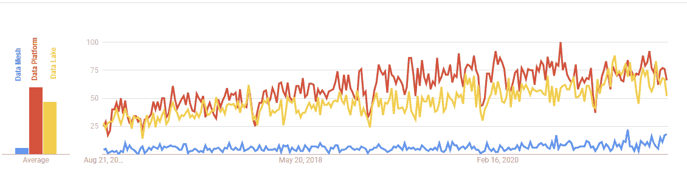
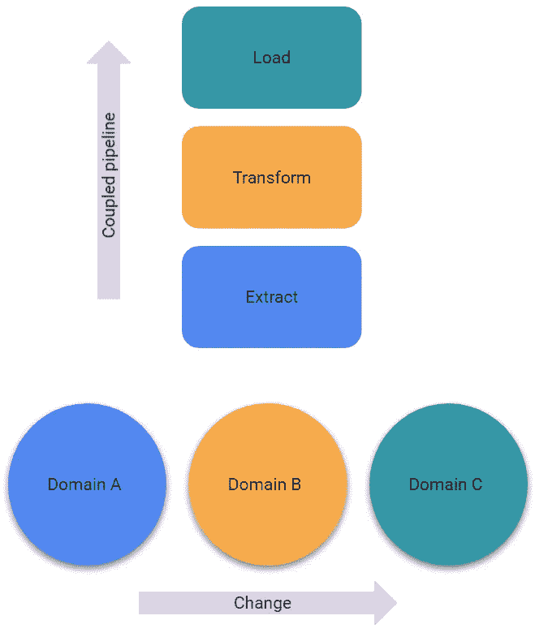

# 什么是数据网格？

> 原文：<https://medium.com/compendium/what-is-data-mesh-4a9f7b6c0355?source=collection_archive---------0----------------------->

# 介绍

“数据网格”一词在过去几年里变得越来越常见，尽管与“数据湖”或“数据平台”等术语相比，它仍然有些小众，而且它的实际含义可能没有得到很好的理解。在本文中，我将深入研究数据网格实际上是什么，它背后的动机，以及如何开始在您的组织中实现它。

Figure 1 — Google Trends interest past 5 years

# 背景

在过去的十年中，特别是随着云计算的出现，许多 IT 项目，尤其是 BI/分析领域的项目，都在努力实现他们想要实现的好处或解决方案。项目可能比最初设想的时间更长或更困难，解决方案可能没有达到所需的质量(特别是数据质量)，围绕数据信任和治理的现有问题可能仍然会导致问题(在某些情况下，迁移到云会加剧这些问题)。与此同时，成为数据驱动型是当今组织的首要战略目标之一；做出更好的决策，提供更好、更个性化的客户服务，降低运营成本，让员工对自己的业务有更深入的了解是成功的关键，首席执行官们知道这是他们的竞争对手正在努力实现的目标。

上述项目面临挑战的主要原因之一是，在很大程度上，这些项目主要是技术性工作。对产品、平台和功能选择的关注掩盖了人员、流程和文化等领域。这并不意味着这些解决方案*一定会*失败，或者技术问题不重要，但它强调了数据网格的一个主要原理。

另一个问题是，尽管在过去几十年中，软件工程在产品思维、微服务和健壮性等方面取得了重大进步，但在数据仓库和商业智能领域却没有发生同样的事情(至少没有达到同样的程度)。IT 和业务用户之间的“知识鸿沟”更是雪上加霜；IT 通常具有非常强的技术技能，但通常对业务用户使用哪些数据、如何使用以及何时使用数据缺乏洞察力，至少通常比他们认为自己拥有的洞察力要少。同时，业务用户通常并不像他们认为的那样了解底层数据、数据来源和质量。在技术上和组织上，操作数据和分析数据之间也经常存在鸿沟。

此外，组织必须管理的数据源的种类和数量，以及组织对创新、适应变化和以不同方式满足(新)客户的日益增长的需求，增加了这些项目所面临的挑战。

# 基本原理

想象一下，去你最喜欢的网上商店，例如订购食品，必须联系食品的个体生产者才能进入，必须花费大量时间弄清楚产品是什么或它们是如何生产的。这没用。但是对于今天访问和使用数据来说，这在不同程度上是许多小型和大型组织每天都在发生的事情。这类问题是 data mesh 试图解决的主要问题之一。

# 那么什么是数据网格呢？

数据网格是一组实践和范例，其总体目标是让数据消费者专注于消费数据，而不是解释或理解数据的特征。这是一种在组织中查看数据的新方式；从治理和质量到生命周期。数据网格不是技术或产品。而且还在不断进化和发展。目前还没有真正的参考体系结构，实现它是一项艰巨而耗时的任务。

传统上，重点是从数据中提取值，而在数据网格范例中，数据的 T2 就是值。我们不是从技术角度看待数据，而是将数据视为组织的产品和资源。数据网格围绕着人员、流程、商业文化和组织。虽然*需要技术和产品来实现*数据网格，但这本身并不是技术。这与(主要)是技术或产品的数据湖或数据平台形成鲜明对比。

在数据网格范例中，域*主机*和*为*提供易于消费的数据产品，而不是数据*通过 ETL 类型的流程*流向某个集中式数据仓库。

Figure 2 — Changes in sources or domains over time vs coupled data warehouse pipelines supporting analytical needs

最后一点值得仔细研究一下。操作系统或域代表单独或协作的业务功能。这些系统会随着时间的推移而变化或发展。同时，ETL(或 ELT)价值链中实现的管道是支持分析业务需求的强耦合步骤。因此，当操作系统更改以支持新的或修改的业务流程时，这些更改会从更改点传播到消费点，因为这些耦合的管道与更改轴(和时间)正交。因此，需要在所涉及的流程/管道的所有步骤中做出改变。某些自动化当然可以实现，但这是传统解决方案在面对不断加快的业务变化、各种数据类型(半结构化和非结构化)以及新的客户需求时变得不灵活且耗时的主要原因之一。

# 视力

数据网格范式的核心原则之一是划分数据的生产者和消费者；*数据产品*的买家和卖家。这个想法是，数据产品的销售者将会在他们产品的质量和消费方面更加*投入*，更加投入。

数据消费者是组织的中心，他们是客户；消费(新)数据应该*而不是*是一个技术问题。数据必须是自描述和文档化的，客户应该能够将组织中的所有数据作为“即服务解决方案”来使用。消费者不应该与数据(产品)销售者互动，因为他们会成为瓶颈。

另一个愿景是，运营数据的所有者不仅负责提供由他们的领域所代表的业务功能，还负责将他们的业务领域的*事实*作为可消费的数据产品。这是一个崇高的目标，因为将可操作的业务领域恰当地映射到期望的统计或分析业务事实可能具有挑战性，不仅在技术上，而且在组织上也是如此。不同的业务单位有不同的词汇、定义和需求。

Data Mesh 还倡导有一个统一的、全公司范围的战略，而不是各种各样的单位，其中一些侧重于技术方面，而另一些侧重于业务方面。

# 从理论到实践

那么这在实践中意味着什么呢？

首先，这意味着数据的消费者必须 ***独立于*** 数据的生产和变更。数据产品中必须有*信任*； ***所有*** QA 都应该发生在生产者/销售者一方。通常，今天，在许多数据仓库解决方案中，情况并非如此；这方面的责任(无意中)被委托给了下游系统或消费者。

其次，由于数据网格本身不是技术或产品，这意味着人、组织和文化需要处于中心位置。改变这些事情需要时间。这意味着赞助和锚定需要在组织中处于非常高的级别；这不仅仅是一个信息技术项目，要知道变化将是渐进的，有时是困难的。

组织还应该考虑他们的规模，以及完全采用数据网格范式实际需要付出多少努力，很可能会建议或要求一些最小规模来证明这一投资的合理性。尤其是考虑到数据网格还不是主流，还在发展和完善中。

但是，不管是否完全致力于数据网格策略，数据网格背后的许多基本原理及其愿景都可以使用。

# 思维数据产品

正如在“背景”中提到的，产品思维在软件工程学科中得到了显著的发展。那么，产品思维在数据仓库/分析领域意味着什么呢？你如何接近这个区域？

首先，你必须让合适的人参与到这个过程中来；关键人物是业务流程所有者和领域专家。这些人必须与 it 和解决方案架构师坐下来，发现并确定您的业务包括哪些领域和流程，如何划分它们并分配所有权。

其次，您必须获得对主数据和数据质量的控制，以便您可以生产消费就绪的数据产品，其中数据质量不委托给消费者或下游系统。通常，在数据网格范例领域，数据团队必须提供可*发现的*、*可寻址的*、*可信任的*(根据服务级别协议并持续监控)、*自描述的*、*可互操作的*和*安全的*数据集。

可发现数据是指通过某些*数据目录*可获得的数据。可寻址与标准化的命名约定和格式有关。信任是对数据质量的控制。自我描述意味着消费者不依赖生产者来使用和理解数据产品。互操作性允许(来自不同领域的)数据产品被容易地使用和关联，需要协调和标准化。最后，安全意味着使用单点登录和基于角色的访问控制来满足安全要求和 GDPR 合规性，通常同时满足内部和外部消费者的需求。

最后，你必须意识到这些是*正在进行的*过程；数据质量、数据治理、主数据管理和数据产品开发不是一次性的问题，而是持续的任务。

# 第一步

如果您想开始向数据网格转移，或者如果您的组织只是想尝试从实践中获得最佳收益，下面的第一步是一个很好的地方；

*   获得专家帮助。使用在这方面有经验的人来评估您的组织的规模和准备情况，以开始数据网格之旅。
*   确定一个业务领域开始。这应该是一个对业务具有高度重要性且技术复杂性较低的业务领域或职能。在这里找到正确的平衡可能很有挑战性。
*   减少涉及的技术数量
*   基础架构应该/必须是“即服务”
*   从小处着手
*   开始开发如何制作数据产品的模板
*   实现数据集的版本控制(对于面向源代码的领域主数据(如代码和词汇表)尤为重要)
*   立即开始测量数据质量；如果你没有意识到问题，你就不能采取行动去解决它们。

# 结论

数据网格仍处于起步阶段。没有可以参考的架构，但是基本的想法、动机和目标是很好理解的。技术已经可以开始转向数据网格解决方案，但挑战通常与文化、组织和成本(时间)问题有关。

成功将需要技能、原则和我们思考这些解决方案的方式发生一些根本性的转变。我们将考虑数据产品的生态系统，而不是集中的数据平台或数据湖。我们将考虑发现和使用，而不是 ETL。我们将考虑为领域数据产品提供服务，而不是从数据源中提取数据。