# 什么是数据科学？—初学者指南

> 原文：<https://medium.com/edureka/what-is-data-science-20069763b2e6?source=collection_archive---------0----------------------->

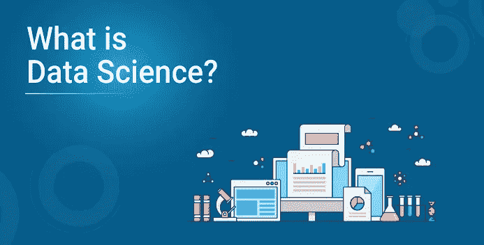

随着世界进入大数据时代，对大数据存储的需求也在增长。直到 2010 年，这一直是企业行业面临的主要挑战和担忧。主要重点是构建一个框架和解决方案来存储数据。现在当 Hadoop 等框架成功解决了存储的问题，重点就转移到了这些数据的处理上。数据科学是这里的秘方。你在好莱坞科幻电影中看到的所有想法都可以通过数据科学变成现实。数据科学是人工智能的未来。因此，了解什么是数据科学以及它如何为您的业务增加价值非常重要。

在这篇文章中，我将涉及以下主题。

*   简单来说什么是数据科学？
*   为什么是数据科学？
*   谁是数据科学家？
*   数据科学家是做什么的？
*   它与商业智能(BI)和数据科学有何不同？
*   借助用例的数据科学生命周期

在本博客结束时，你将能够理解什么是数据科学，以及它在从我们周围复杂而庞大的数据集中提取有意义的见解方面的作用。

# 简单来说什么是数据科学？

数据科学融合了各种工具、算法和机器学习原理，目标是从原始数据中发现隐藏的模式。但是这与统计学家多年来所做的有什么不同呢？

答案在于解释和预测的区别。

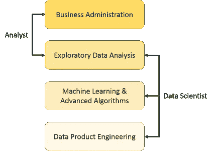

从上图中可以看出，数据分析师通常通过处理数据的历史来解释正在发生的事情。另一方面，数据科学家不仅进行探索性分析以从中发现见解，还使用各种先进的机器学习算法来识别未来特定事件的发生。数据科学家会从多个角度看待数据，有时是以前不知道的角度。

因此，数据科学主要用于利用预测因果分析、规定分析(预测加决策科学)和机器学习来做出决策和预测。

*   **预测性因果分析—** 如果您想要一个可以预测未来特定事件可能性的模型，您需要应用预测性因果分析。比方说，如果你提供信用贷款，那么客户未来按时进行信用支付的概率就是你关心的问题。在这里，您可以构建一个模型，该模型可以对客户的付款历史进行预测性分析，以预测未来的付款是否会按时。
*   **规定性分析:**如果你想要一个模型能够自己做出决定，并且能够用动态参数修改它，你当然需要对它进行规定性分析。这个相对较新的领域就是提供建议。换句话说，它不仅预测，而且建议一系列规定的行动和相关的结果。
    这方面最好的例子是谷歌的无人驾驶汽车，我之前也讨论过。车辆收集的数据可以用来训练自动驾驶汽车。你可以在这些数据上运行算法，为其带来智能。这将使您的汽车能够做出决定，如什么时候转弯，走哪条路，什么时候减速或加速。
*   **用于进行预测的机器学习** —如果你有一家金融公司的交易数据，需要建立一个模型来确定未来的趋势，那么机器学习算法是最好的选择。这属于监督学习的范式。之所以称之为有监督的，是因为你已经有了可以用来训练你的机器的数据。例如，可以使用欺诈购买的历史记录来训练欺诈检测模型。
*   **用于模式发现的机器学习** —如果你没有可以做出预测的参数，那么你需要找出数据集中隐藏的模式，以便能够做出有意义的预测。这只是一个无监督的模型，因为您没有任何预定义的分组标签。模式发现最常用的算法是聚类。
    假设你在一家电话公司工作，你需要在一个地区建立一个网络。然后，您可以使用群集技术来查找那些将确保所有用户接收到最佳信号强度的发射塔位置。

让我们看看上述方法在数据分析和数据科学中的比例有何不同。如下图所示，数据分析在一定程度上包括描述性分析和预测。另一方面，数据科学更多的是预测因果分析和机器学习。

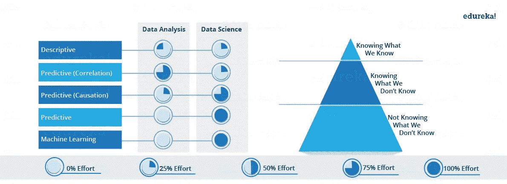

既然您已经知道了数据科学到底是什么，那么现在就让我们来找出最初需要它的原因。

# 为什么是数据科学？

*   传统上，我们拥有的数据大多是结构化的，并且大小较小，可以使用简单的 BI 工具进行分析。不像传统系统中的数据大多是结构化的，如今大多数数据是非结构化或半结构化的。让我们看看下图中的数据趋势，该图显示到 2020 年，超过 80 %的数据将是非结构化的。

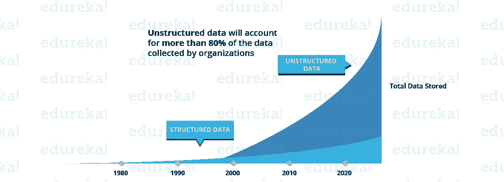

*   这些数据是从不同的来源生成的，如财务日志、文本文件、多媒体表单、传感器和工具。简单的 BI 工具无法处理如此庞大的数据量和数据种类。这就是为什么我们需要更复杂和先进的分析工具和算法来处理、分析并从中得出有意义的见解。

这并不是数据科学如此受欢迎的唯一原因。让我们更深入地了解一下数据科学在各个领域的应用。

*   如果您可以从现有数据(如客户过去的浏览历史、购买历史、年龄和收入)中了解客户的精确需求，情况会如何？毫无疑问，您之前也拥有所有这些数据，但现在有了这些海量和多样的数据，您可以更有效地训练模型，并更精确地向您的客户推荐产品。这会给你的组织带来更多的业务，这不是很好吗？
*   让我们用一个不同的场景来理解数据科学在决策中的作用。如果你的车有智能开车送你回家会怎么样？自动驾驶汽车从传感器收集实时数据，包括雷达、相机和激光，以创建其周围的地图。基于这些数据，它利用先进的机器学习算法，做出诸如何时加速、何时减速、何时超车、何处转弯等决定。
*   让我们看看如何将数据科学用于预测分析。我们以天气预报为例。可以收集和分析来自船只、飞机、雷达、卫星的数据来建立模型。这些模型不仅可以预测天气，还可以帮助预测任何自然灾害的发生。这将有助于你事先采取适当的措施，挽救许多宝贵的生命。

让我们看看下面的信息图，看看数据科学给人留下深刻印象的所有领域。

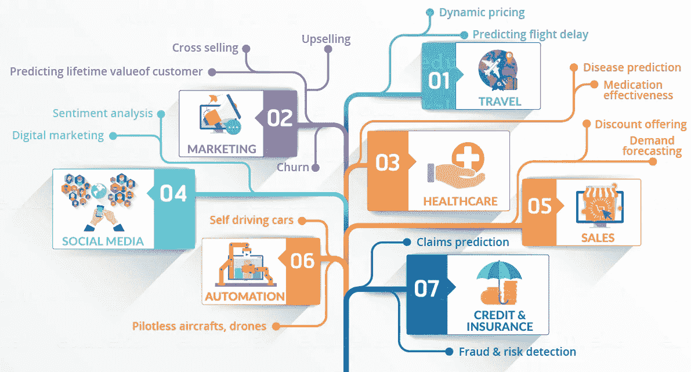

# 谁是数据科学家？

数据科学家有几种定义。简单地说，数据科学家就是实践数据科学艺术的人。“数据科学家”一词是在考虑到数据科学家从科学领域和应用程序(无论是统计还是数学)中获取大量信息后创造出来的。

# 数据科学家是做什么的？

数据科学家是那些利用他们在某些科学领域的专业知识来解决复杂数据问题的人。他们研究与数学、统计学、计算机科学等相关的几个要素(尽管他们可能不是所有这些领域的专家)。他们充分利用最新技术来寻找解决方案并得出对组织的成长和发展至关重要的结论。与结构化和非结构化形式的原始数据相比，数据科学家以更有用的形式呈现数据。

接下来，我们来讨论一下 BI。我相信你可能也听说过商业智能(BI)。数据科学经常与商业智能相混淆。我将陈述两者之间一些简明清晰的对比，这将有助于你更好地理解。让我们看一看。

# 商业智能(BI)与数据科学

*   BI 基本上是通过分析之前的数据来寻找后见之明和洞察力来描述业务趋势。BI 使您能够从外部和内部来源获取数据，准备数据，对数据进行查询，并创建仪表板来回答季度收入分析或业务问题等问题。BI 可以评估近期某些事件的影响。
*   数据科学是一种更具前瞻性的方法，是一种探索性的方法，侧重于分析过去或当前的数据并预测未来的结果，目的是做出明智的决策。它回答了关于“什么”和“如何”事件发生的开放性问题。

让我们来看看一些对比鲜明的特点。

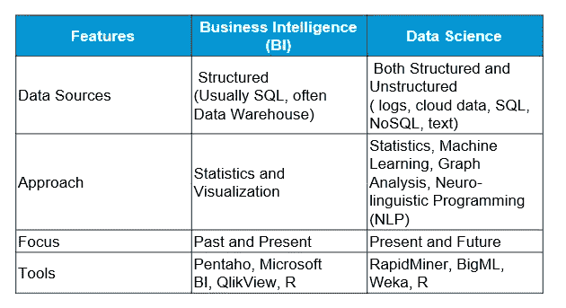

这是关于什么是数据科学的全部内容，现在让我们了解一下数据科学的生命周期。

数据科学项目中的一个常见错误是匆忙进行数据收集和分析，而没有理解需求，甚至没有正确地构建业务问题。因此，遵循数据科学生命周期的所有阶段以确保项目的顺利运行非常重要。

# 数据科学的生命周期

以下是数据科学生命周期主要阶段的简要概述:

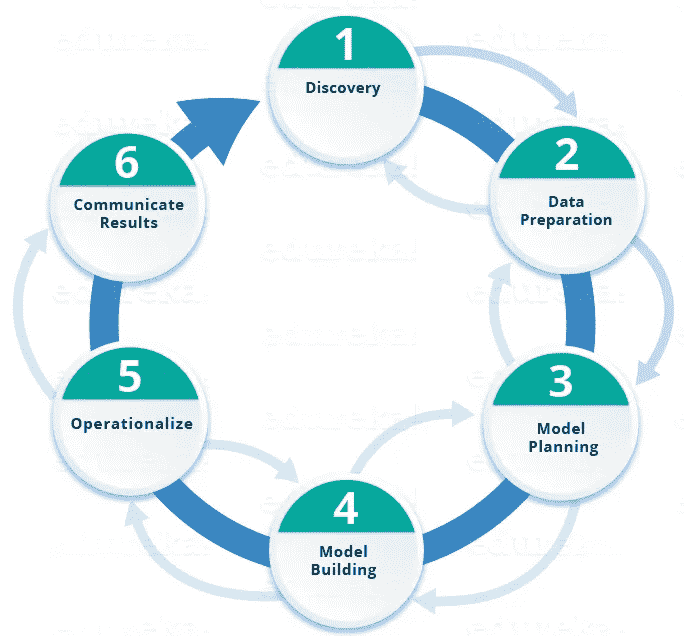

**第 1 阶段—发现:**在开始项目之前，了解各种规格、要求、优先级和所需预算非常重要。你必须具备提出正确问题的能力。在这里，您评估您是否在人员、技术、时间和数据方面拥有支持项目所需的资源。在这个阶段，你还需要框定业务问题，并制定要测试的初始假设(IH)。

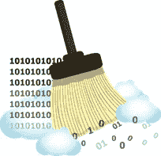

**第 2 阶段——数据准备:**在这个阶段，您需要一个分析沙箱，在这个沙箱中，您可以在整个项目期间执行分析。在建模之前，您需要探索、预处理和调节数据。此外，您将执行 ETLT(提取、转换、加载和转换)来将数据放入沙箱。下面我们来看看统计分析流程。

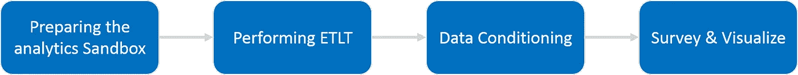

您可以使用 R 进行数据清理、转换和可视化。这将有助于您发现异常值，并建立变量之间的关系。一旦清理和准备好数据，就该对其进行探索性分析了。让我们看看你是如何做到这一点的。

**第三阶段——模型规划:**

在这里，您将确定绘制变量之间关系的方法和技术。这些关系将为您在下一阶段实现的算法奠定基础。您将使用各种统计公式和可视化工具应用探索性数据分析(EDA)。

我们来看看各种模型规划工具。

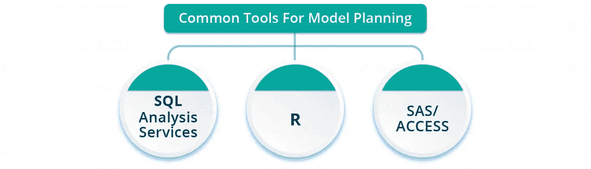

1.  拥有一套完整的建模能力，并为构建解释性模型提供了一个良好的环境。
2.  **SQL Analysis services** 可以使用常见的数据挖掘功能和基本预测模型执行数据库内分析。
3.  **SAS/ACCESS** 可用于从 Hadoop 中访问数据，并用于创建可重复和可重用的模型流程图。

虽然市场上有许多工具，但 R 是最常用的工具。

现在，您已经深入了解了数据的本质，并决定了要使用的算法。在下一阶段，您将应用该算法并构建一个模型。

**第 4 阶段——模型构建:**在这一阶段，您将开发用于训练和测试目的的数据集。您将考虑您现有的工具是否足以运行模型，或者它将需要一个更健壮的环境(比如快速和并行处理)。您将分析各种学习技术，如分类、关联和聚类来构建模型。

您可以通过以下工具实现模型构建。

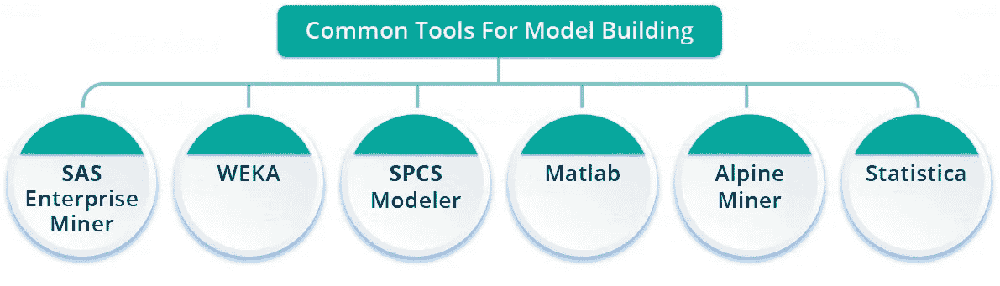

**第 5 阶段—实施:**

在这个阶段，您交付最终报告、简报、代码和技术文档。此外，有时还会在实时生产环境中实施试点项目。这将在全面部署之前为您提供小范围内的性能和其他相关限制的清晰描述。

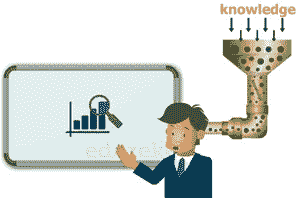

**第 6 阶段——传达结果:**现在，评估您是否能够实现您在第一阶段计划的目标非常重要。因此，在最后一个阶段，您确定所有的关键发现，与风险承担者沟通，并根据第一阶段制定的标准确定项目的结果是成功还是失败。

现在，我将通过一个案例向您解释上述各个阶段。

## 案例研究:糖尿病预防

**如果我们能够预测糖尿病的发生并事先采取适当的措施来预防它，会怎么样？** 在这个用例中，我们将利用我们之前讨论的整个生命周期来预测糖尿病的发生。让我们来看一下各个步骤。

**第一步:**

*   首先，我们将根据第 1 阶段讨论的患者病史收集数据。可以参考下面的样本数据。

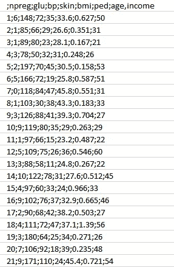

*   正如您所看到的，我们有下面提到的各种属性。

**属性:**

1.  npreg —怀孕次数
2.  葡萄糖——血浆葡萄糖浓度
3.  血压——血压
4.  皮肤——三头肌皮褶厚度
5.  BMI——身体质量指数
6.  ped —糖尿病谱系功能
7.  年龄-年龄
8.  收入——收入

**第二步:**

*   现在，一旦我们有了数据，我们需要清理和准备数据用于数据分析。
*   这些数据有很多不一致的地方，比如缺失值、空白列、突变值以及需要清理的不正确的数据格式。
*   在这里，我们将数据组织到不同属性下的单个表中，使其看起来更有条理。
*   让我们看看下面的样本数据。

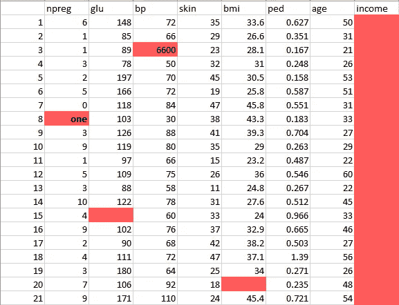

这个数据有很多不一致的地方。

1.  在 *npreg* 栏中，“一”是用文字写的，而它应该是像 1 这样的数字形式。
2.  在列 *bp* 中，其中一个值是 6600，这是不可能的(至少对人类来说)，因为 bp 不能达到这么大的值。
3.  正如你所看到的,*收入*栏是空白的，在预测糖尿病方面也没有意义。因此，它在这里是多余的，应该从表中删除。

*   因此，我们将通过删除异常值、填充空值和规范化数据类型来清理和预处理这些数据。如果你记得的话，这是我们的第二阶段，即数据预处理。
*   最后，我们得到如下所示的干净数据，这些数据可用于分析。

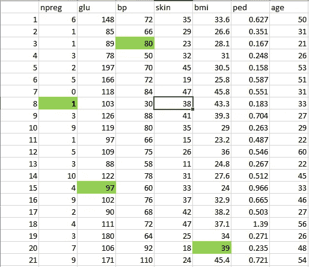

**第三步:**

现在，让我们按照第 3 阶段中的讨论进行一些分析。

*   首先，我们将数据加载到分析沙箱中，并对其应用各种统计函数。例如，R 有类似于 *describe* 的函数，它给出了缺失值和唯一值的数量。我们还可以使用 summary 函数，它将给出统计信息，如平均值、中值、范围、最小值和最大值。
*   然后，我们使用可视化技术，如直方图、线图、箱线图，来获得数据分布的合理概念。

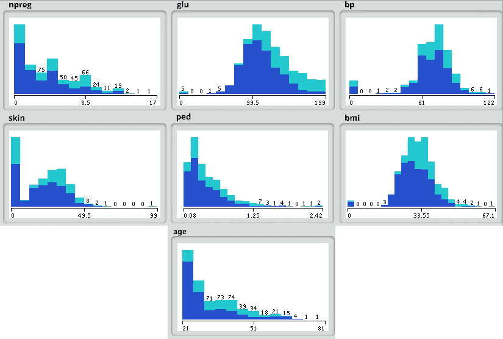

**第四步:**

现在，基于上一步得出的见解，最适合这类问题的是决策树。让我们看看如何？

*   因为，我们已经有了用于分析的主要属性，如 *npreg、bmi* 等。，所以我们将使用监督学习技术来建立一个模型。
*   此外，我们还特别使用了决策树，因为它一次性考虑了所有属性，既有线性关系的属性，也有非线性关系的属性。在我们的例子中，我们在 *npreg* 和*年龄*之间有线性关系，而在 *npreg* 和 *ped* 之间有非线性关系。
*   决策树模型也非常健壮，因为我们可以使用不同的属性组合来生成不同的树，然后最终实现效率最高的树。

让我们看看我们的决策树。

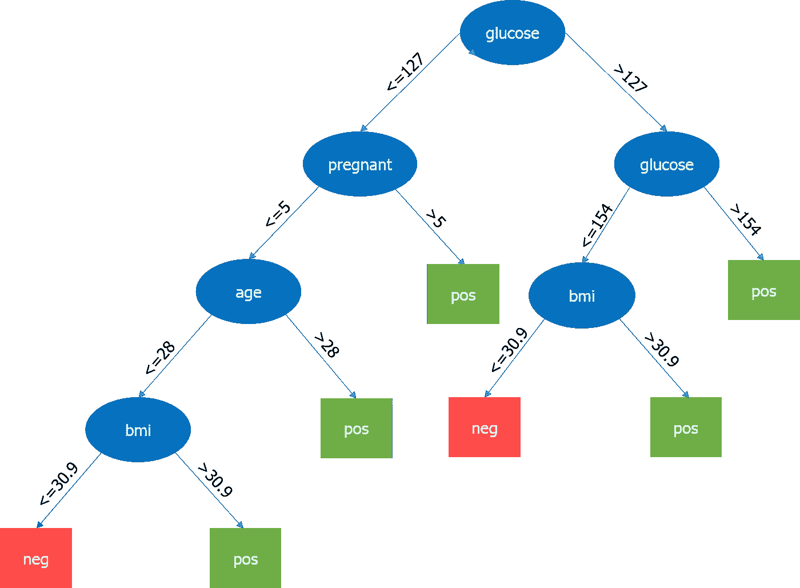

这里，最重要的参数是葡萄糖的水平，所以它是我们的根节点。现在，当前节点及其值决定了要获取的下一个重要参数。这种情况一直持续到我们得到关于 *pos* 或 *neg* 的结果。Pos 表示患糖尿病的趋势为阳性，neg 表示患糖尿病的趋势为阴性。

**第五步:**

在这个阶段，我们将运行一个小的试点项目来检查我们的结果是否合适。我们还将寻找性能约束(如果有的话)。如果结果不准确，那么我们需要重新规划和重建模型。

**第六步:**

一旦我们成功地执行了项目，我们将为全面部署共享输出。

成为一名数据科学家说起来容易做起来难。那么，让我们看看成为一名数据科学家需要什么。数据科学家需要以下三个主要方面的技能。

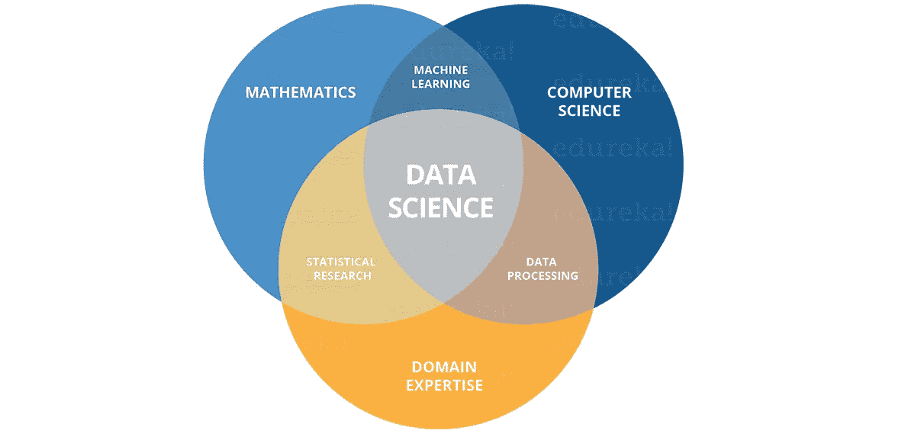

上图可以看到，你需要获得各种硬技能和软技能。你需要擅长*统计学*和*数学*来分析和可视化数据。不用说，*机器学习*构成了数据科学的核心，需要你擅长。此外，你需要对你正在从事的领域有一个坚实的理解，以便清楚地理解业务问题。你的任务不会就此结束。你应该能够实现各种算法，需要良好的编码技能。最后，一旦您做出了某些关键决策，向利益相关者传达这些决策是非常重要的。所以，良好的沟通绝对会给你的技能加分。

如果你想查看更多关于 Python、DevOps、Ethical Hacking 等市场最热门技术的文章，你可以参考 Edureka 的官方网站。

请留意本系列中的其他文章，它们将解释数据科学的各个方面。

> *1。* [*数据科学教程*](/edureka/data-science-tutorial-484da1ff952b)
> 
> *2。* [*数据科学的数学与统计*](/edureka/math-and-statistics-for-data-science-1152e30cee73)
> 
> *3。*[*R 中的线性回归*](/edureka/linear-regression-in-r-da3e42f16dd3)
> 
> *4。* [*机器学习算法*](/edureka/machine-learning-algorithms-29eea8b69a54)
> 
> *5。*[*R 中的逻辑回归*](/edureka/logistic-regression-in-r-2d08ac51cd4f)
> 
> *6。* [*分类算法*](/edureka/classification-algorithms-ba27044f28f1)
> 
> *7。* [*随机森林中的 R*](/edureka/random-forest-classifier-92123fd2b5f9)
> 
> *8。* [*决策树中的 R*](/edureka/a-complete-guide-on-decision-tree-algorithm-3245e269ece)
> 
> 9。 [*机器学习入门*](/edureka/introduction-to-machine-learning-97973c43e776)
> 
> *10。* [*朴素贝叶斯在 R*](/edureka/naive-bayes-in-r-37ca73f3e85c)
> 
> *11。* [*统计与概率*](/edureka/statistics-and-probability-cf736d703703)
> 
> *12。* [*如何创建一个完美的决策树？*](/edureka/decision-trees-b00348e0ac89)
> 
> *13。* [*关于数据科学家角色的十大误区*](/edureka/data-scientists-myths-14acade1f6f7)
> 
> *14。* [*顶级数据科学项目*](/edureka/data-science-projects-b32f1328eed8)
> 
> *15。* [*数据分析师 vs 数据工程师 vs 数据科学家*](/edureka/data-analyst-vs-data-engineer-vs-data-scientist-27aacdcaffa5)
> 
> *16。* [*人工智能的种类*](/edureka/types-of-artificial-intelligence-4c40a35f784)
> 
> *17。*[*R vs Python*](/edureka/r-vs-python-48eb86b7b40f)
> 
> *18。* [*人工智能 vs 机器学习 vs 深度学习*](/edureka/ai-vs-machine-learning-vs-deep-learning-1725e8b30b2e)
> 
> *19。* [*机器学习项目*](/edureka/machine-learning-projects-cb0130d0606f)
> 
> *20。* [*数据分析师面试问答*](/edureka/data-analyst-interview-questions-867756f37e3d)
> 
> *21。* [*面向非程序员的数据科学和机器学习工具*](/edureka/data-science-and-machine-learning-for-non-programmers-c9366f4ac3fb)
> 
> *22。* [*十大机器学习框架*](/edureka/top-10-machine-learning-frameworks-72459e902ebb)
> 
> 23。 [*统计机器学习*](/edureka/statistics-for-machine-learning-c8bc158bb3c8)
> 
> *24。* [*随机森林中的 R*](/edureka/random-forest-classifier-92123fd2b5f9)
> 
> *25。* [*广度优先搜索算法*](/edureka/breadth-first-search-algorithm-17d2c72f0eaa)
> 
> 26。[*R 中的线性判别分析*](/edureka/linear-discriminant-analysis-88fa8ad59d0f)
> 
> *27。* [*机器学习的先决条件*](/edureka/prerequisites-for-machine-learning-68430f467427)
> 
> 28。 [*互动 WebApps 使用 R 闪亮*](/edureka/r-shiny-tutorial-47b050927bd2)
> 
> *29。* [*十大机器学习书籍*](/edureka/top-10-machine-learning-books-541f011d824e)
> 
> 30。 [*监督学习*](/edureka/supervised-learning-5a72987484d0)
> 
> *31。* [*10 本最好的数据科学书籍*](/edureka/10-best-books-data-science-9161f8e82aca)
> 
> *32。* [*机器学习使用 R*](/edureka/machine-learning-with-r-c7d3edf1f7b)

*原载于 2020 年 7 月 21 日*[*https://www.edureka.co*](https://www.edureka.co/blog/what-is-data-science/)*。*