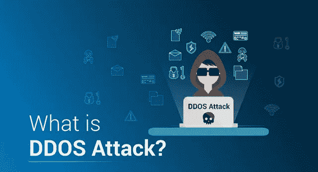
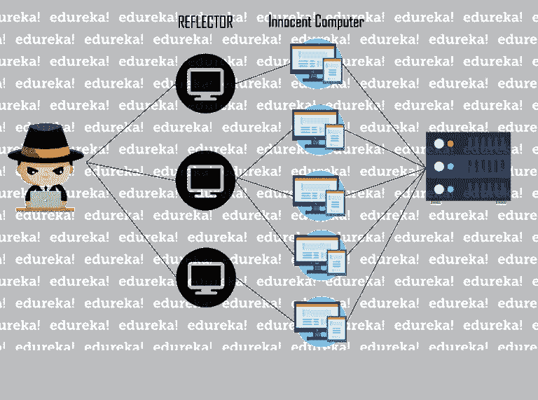
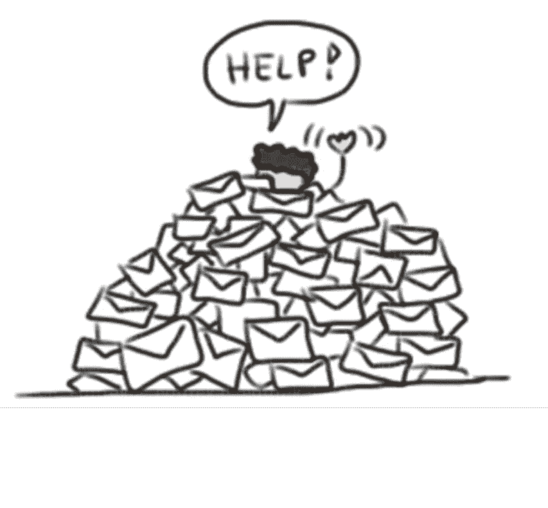
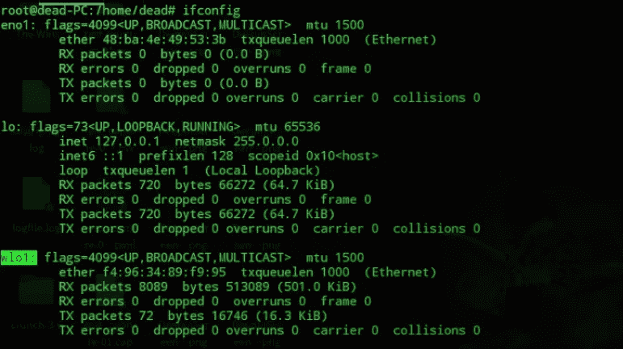
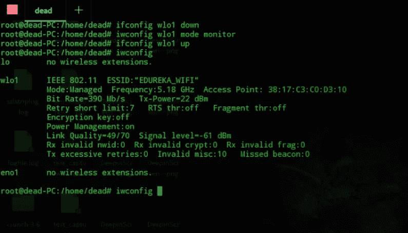
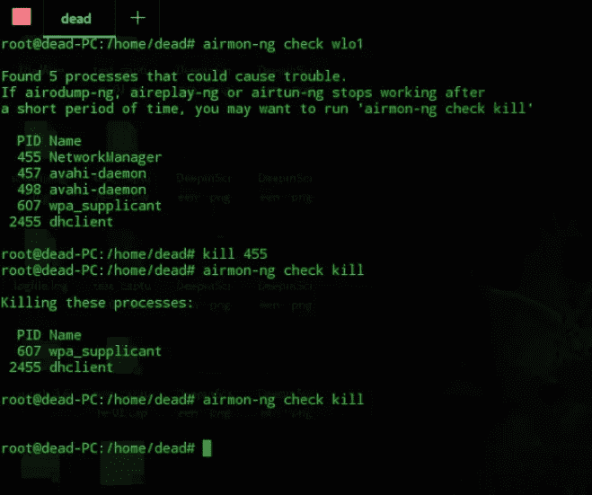
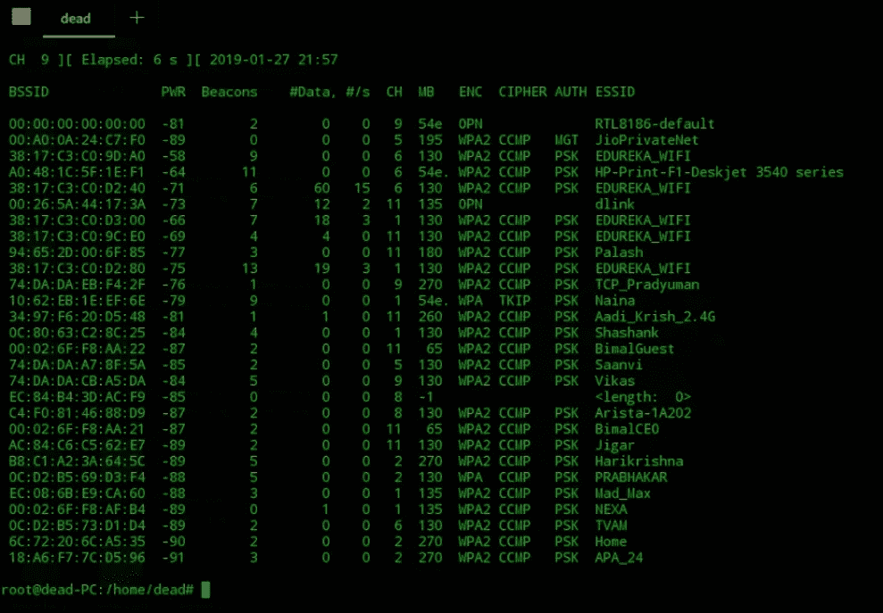
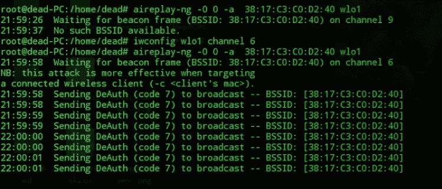

# 什么是 DDOS 攻击？—分布式拒绝服务综合指南

> 原文：<https://medium.com/edureka/what-is-ddos-attack-9b73bd7b9ba1?source=collection_archive---------0----------------------->

What is DDOS Attack? — Edureka

分布式拒绝服务，通常也缩写为 DDOS，是一种网络攻击，因电影和互联网而臭名昭著。简单地说，这是一种任何种类的服务都被拒绝的情况。在本文中，我将全面解释这种特殊的攻击是如何工作的，并介绍它的不同类型。我还将演示如何在无线网络上执行自己的 DOS 攻击。以下是本文涵盖的主题:

*   什么是 DOS & DDOS？
*   它是如何工作的？
*   DDOS 攻击的类型
*   您自己的 DOS 攻击

# 什么是 DOS & DDOS？

为了理解什么是 DDOS 攻击，有必要理解 DOS 攻击的基本原理。

DOS —简单地代表**D**enial**O**f**S**service。这种服务可以是任何类型的，例如，想象一下你的母亲在你准备考试时没收你的手机，以帮助你不受任何干扰地学习。虽然你母亲的意图确实是出于关心和担忧，但你被拒绝提供电话服务和手机提供的任何其他服务。

就计算机和计算机网络而言，或者在道德黑客攻击期间，拒绝服务的形式可能是:

*   劫持网络服务器
*   请求使端口过载，导致端口不可用
*   拒绝无线身份验证
*   拒绝互联网上提供的任何服务

这种意图的攻击可以从一台机器上进行。虽然单机攻击更容易执行和监控，但也更容易检测和缓解。为了解决这个问题，可以从分布在广阔区域的多台设备上执行攻击。这不仅使阻止攻击变得困难，而且几乎不可能指出罪魁祸首。这种攻击被称为分布式拒绝服务或 DDOS 攻击。

# 它是如何工作的？

如上所述，DOS 攻击的主要思想是使某项服务不可用。由于受到攻击的一切实际上都是在机器上运行的，如果机器的性能下降，服务就可能变得不可用。这是 DOS 和 d DOS 背后的基本原理。

一些 DOS 攻击的执行方式是用连接请求淹没服务器，直到服务器过载而被认为无用。其他攻击是通过向服务器发送无法处理的未分段数据包来执行的。当僵尸网络执行这些方法时，它们所造成的损害会呈指数级增加，并且它们减轻损害的难度也会突飞猛进。

为了更好地了解攻击的工作原理，让我们来看看不同的攻击类型。

# DDOS 攻击的类型

虽然有很多方法可以进行 DDOS 攻击，但我将列出一些更著名的方法。这些方法因其成功率和造成的损害而闻名。值得注意的是，随着技术的进步，越有创造力的人已经设计出越迂回的方法来执行 DOS 攻击。

以下是攻击的类型:

## 死亡之平

根据 TCP/IP 协议，数据包的最大大小可以是 65，535 字节。死亡攻击的 ping 利用了这个特殊的事实。在这种类型的攻击中，当数据包片段相加后，攻击者发送的数据包会超过最大数据包大小。计算机通常不知道如何处理这些数据包，最终会死机，有时甚至完全崩溃。

## 反射攻击

在这种情况下，这种类型的攻击是在僵尸网络(也称为反射器)的帮助下进行的。攻击者使用僵尸网络向大量无辜的计算机发送连接请求，看起来像是来自受害计算机(这是通过欺骗数据包报头中的源来实现的)。这使得计算机主机向受害计算机发送确认。由于从不同的计算机到同一台机器有多个这样的请求，这使计算机过载并使其崩溃。这种类型也称为 smurf 攻击。

## 邮件炸弹

邮件炸弹攻击通常攻击电子邮件服务器。在这种类型的攻击中，充满随机垃圾值的超大电子邮件被发送到目标电子邮件服务器，而不是数据包。这通常会使电子邮件服务器崩溃，因为负载会突然增加，在修复之前，它们会变得无用。

## 泪珠

在这种类型的攻击中，数据包的碎片偏移字段被滥用。IP 报头中的一个字段是“片段偏移”字段，指示包含在片段化分组中的数据相对于原始分组中的数据的起始位置或偏移。如果一个分段包的偏移量和大小之和不同于下一个分段包的偏移量和大小之和，则包重叠。发生这种情况时，易受 teardrop 攻击的服务器无法重组数据包，从而导致拒绝服务情况。

# 您自己的 DOS 攻击

在本文的这一部分，我将演示如何在无线网络上执行拒绝服务攻击，并实际上拒绝他们从特定接入点对互联网的任何访问。这种攻击是非法的，如果被抓住，你可能会被起诉，所以我敦促你在获得许可的情况下进行这种攻击，只是为了教育目的，而不是引起任何不必要的混乱。道德黑客的工作是减轻这些攻击，而不是引发它们。

对于这种特殊的攻击，您将需要一台 Linux 机器，您可以在一个虚拟机器上设置它或者双引导您的机器。还需要安装以下工具:

*   空调(安装空调)
*   MAC changer(apt-get install MAC changer)

**步骤 1** :启动你的 Linux 机器，以 root 身份登录。登录后，检查您的网络接口卡的名称，对于我的情况是**wl01**。您可以通过键入' *ifconfig '找到您的网卡名称。*

步骤 2 :现在我们知道了网络接口卡的名称，我们需要将它设置为监控模式。有关命令，请参见下图。

**步骤 3** :在监控模式下成功设置您的接口卡后，检查可能会干扰我们扫描的进程。用他们的 PID 杀死他们。检查图片中的命令。继续杀死进程，直到一个也不剩。

**步骤 4** :现在我们需要扫描可用的接入点。我们需要通过选择接入点的 BSSID 来从该列表中选择接入点。要运行扫描，您必须键入'***airodump-ng wlo 1****'。* **你必须使用你的接口名，而不是 wlo1。**

**第五步**:在你选择了你想要进行 DOS 攻击的无线接入点后，复制下 BSSID 并打开一个新的终端窗口。在这里，我们将持续取消所有设备的身份认证，这些设备将无法使用该特定接入点连接到互联网，简而言之，拒绝它们在互联网上的任何服务以及互联网本身。确保您的网卡也运行在相同的通道上。查看代码的截图。

这就把我们带到了“什么是 DDOS 攻击？”。我希望这篇文章对你有所帮助，并增加了你的知识价值。如果你想查看更多关于人工智能、DevOps、云等市场最热门技术的文章，那么你可以参考 [Edureka 的官方网站。](https://www.edureka.co/blog/?utm_source=medium&utm_medium=content-link&utm_campaign=what-is-ddos-attack)

请留意本系列中的其他文章，它们将解释网络安全的各个方面。

> 1.[什么是网络安全？](/edureka/what-is-cybersecurity-778feb0da72)
> 
> 2.[网络安全框架](/edureka/cybersecurity-framework-89bbab5aaf17)
> 
> 3.[隐写术教程](/edureka/steganography-tutorial-1a3c5214a00f)
> 
> 4.[什么是网络安全？](/edureka/what-is-network-security-1f659407dcc)
> 
> 5.[什么是计算机安全？](/edureka/what-is-computer-security-c8eb1b38de5)
> 
> 6.[什么是应用安全？](/edureka/application-security-tutorial-e6a0dda25f5c)
> 
> 7.[渗透测试](/edureka/what-is-penetration-testing-f91668e2291a)
> 
> 8.[道德黑客教程](/edureka/ethical-hacking-tutorial-1081f4aacc53)
> 
> 9.[关于 Kali Linux 你需要知道的一切](/edureka/ethical-hacking-using-kali-linux-fc140eff3300)
> 
> 10.[使用 Python 的道德黑客](/edureka/ethical-hacking-using-python-c489dfe77340)
> 
> 11.[什么是密码学？](/edureka/what-is-cryptography-c94dae2d5974)
> 
> 12.[使用 Python 的 MAC changer](/edureka/macchanger-with-python-ethical-hacking-7551f12da315)
> 
> 13 [ARP 欺骗](/edureka/python-arp-spoofer-for-ethical-hacking-58b0bbd81272)
> 
> 14. [Proxychains，Anonsurf & MacChange](/edureka/proxychains-anonsurf-macchanger-ethical-hacking-53fe663b734)
> 
> 15.[足迹](/edureka/footprinting-in-ethical-hacking-6bea07de4362)
> 
> 16.[50 大网络安全面试问答](/edureka/cybersecurity-interview-questions-233fbdb928d3)

*原载于 2019 年 1 月 30 日 www.edureka.co**的* [*。*](https://www.edureka.co/blog/what-is-ddos-attack/)