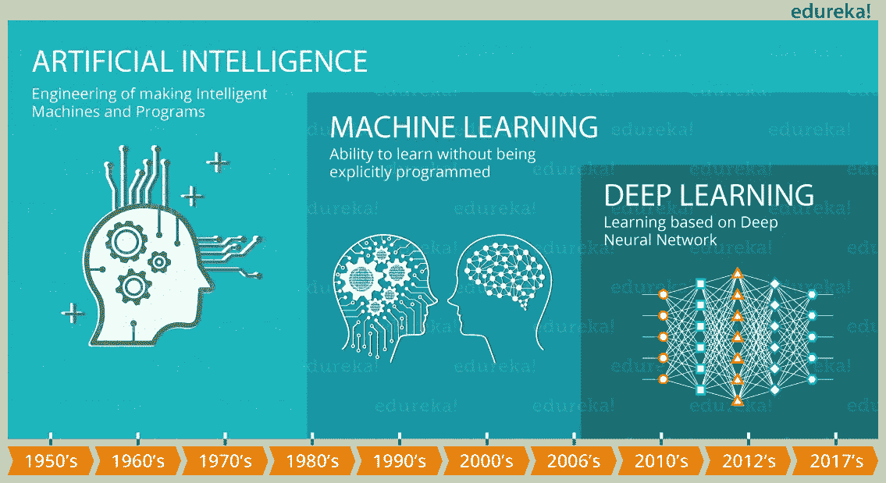

# 什么是深度学习？

> 原文：<https://medium.com/edureka/what-is-deep-learning-a71030766ce0?source=collection_archive---------1----------------------->

# 什么是深度学习？

在这篇文章中，我将谈论什么是*深度学习*，这是当今的一个热门话题，并且已经在投资人工智能、大数据和分析等领域的众多行业中牢牢扎根。例如，谷歌在其语音和图像识别算法中使用深度学习，而网飞和亚马逊则使用它来理解客户的行为。事实上，你不会相信，但麻省理工学院的研究人员正试图利用深度学习来预测未来。现在，想象一下深度学习在彻底改变世界方面有多大的潜力，以及公司将如何寻找深度学习方面的认证专家。在谈深度学习之前，必须了解它与机器学习和人工智能的关系。理解这种关系的最简单的方法是浏览下图:

**图:**什么是深度学习——人工智能技术时间轴

在这里，在图像中，你可以看到机器学习是人工智能的一个子集。这意味着我们可以建造智能机器，它可以根据提供的数据集自行学习。此外，您会注意到深度学习是机器学习的一个子集，其中类似的机器学习算法用于训练深度神经网络，以便在前者表现不达标的情况下实现更好的准确性。以下是我将在本深度学习教程中讨论的主题:

*   **人工智能**
*   **机器学习**
*   **ML 的弊端**
*   **什么是深度学习？**
*   **深度学习应用**

获得行业级项目认证，快速跟踪您的职业发展

# 人工智能

**fig:** What is Deep Learning — Artificial Intelligence

人工智能一词是由约翰·麦卡锡在 1956 年创造的，他也被称为人工智能之父。人工智能背后的想法相当简单却又令人着迷，那就是制造能够自己做出决定的智能机器。你可能会认为这是科学幻想，但随着技术和计算能力的发展，这个想法似乎越来越接近现实。

# 机器学习:迈向人工智能的一步

现在，你已经熟悉了人工智能，让我们简单地谈谈机器学习，并理解当我们说我们正在给机器编程以学习时意味着什么。让我们从机器学习的一个非常著名的定义开始:

*“如果一个计算机程序在 T 上的性能(由 P 测量)随着经验 E 而提高，那么就可以说它从经验 E 中学习了一些任务 T 和一些性能测量 P。”——Tom Mitchell，卡内基梅隆大学*

所以，如果你想让你的程序预测一个繁忙十字路口的交通模式(任务 T)，你可以用过去交通模式的数据通过一个机器学习算法来运行它(经验 E)。现在，预测的准确性(性能度量 P)将取决于程序是否成功地从数据集学习(经验 E)。

基本上，机器学习被称为一种人工智能(AI)，它通过让计算机接触大量数据，为计算机提供学习能力，而无需显式编程。机器学习背后的核心原则是从数据集学习，并尝试最小化错误或最大化其预测为真的可能性。

# 机器学习的缺点

*   传统的最大似然算法在处理高维数据时是没有用的，因为在高维数据中我们有大量的输入和输出。例如，在手写识别的情况下，我们有大量的输入，其中我们将有与不同类型的手写相关联的不同类型的输入。
*   第二个主要挑战是告诉计算机它应该寻找哪些特征，这些特征将在预测结果中发挥重要作用，并在这样做的同时实现更好的准确性。这个过程被称为**特征提取**。向算法提供原始数据很少奏效，这就是为什么特征提取是传统机器学习工作流程的关键部分。因此，如果没有特征提取，对程序员的挑战会增加，因为算法的有效性在很大程度上取决于程序员的洞察力。因此，很难将这些机器学习模型或算法应用于复杂问题，如对象识别、手写识别、NLP(自然语言处理)等。

# 深度学习

*   认识他们父母的脸和不同的物体。
*   辨别不同的声音，甚至可以根据声音识别特定的人。
*   从其他人的面部表情和更多的动作中推断。

事实上，多年来，我们的大脑已经下意识地训练自己去做这些事情。现在，问题来了，*深度学习如何模仿大脑的功能？*嗯，深度学习使用人工神经元的概念，其功能与我们大脑中存在的生物神经元类似。因此，我们可以说深度学习是**机器学习**的一个子领域，涉及由大脑结构和功能启发的算法，称为人工神经网络。

现在，让我们举一个例子来理解它。假设我们想做一个系统，可以识别图像中不同人的脸。如果我们将此作为一个典型的机器学习问题来解决，我们将定义面部特征，如眼睛、鼻子、耳朵等。然后，系统会自己识别哪个特征对哪个人更重要。

现在，深度学习领先了这一步。由于深度神经网络，深度学习会自动找出对分类很重要的特征，而在机器学习的情况下，我们必须手动定义这些特征。

*   在最低层次上，网络把局部对比的模式看得很重要。
*   接下来的一层就可以利用这些局部对比的模式来关注类似眼睛、鼻子和嘴巴的东西
*   最后，顶层能够将这些面部特征应用于面部模板。
*   深度神经网络能够在其连续的每一层中构成越来越复杂的特征。

你有没有想过脸书是如何自动标记你上传的图片中的所有人的？嗯，脸书使用深度学习的方式与上面的例子类似。现在，你应该已经意识到深度学习的能力，以及在我们对所有可能影响结果的特征知之甚少的情况下，它如何胜过机器学习。因此，深度网络可以通过在没有适当标记的情况下从由输入数据组成的数据集进行推断来克服机器学习的缺点。

# 深度学习的应用

在这个什么是深度学习的博客中，让我们看看深度学习的一些现实应用，以了解它的真正力量。

## 语音识别

你们都应该听说过 Siri，它是苹果公司的语音控制智能助手。像其他大巨头一样，苹果也开始投资深度学习，以使其服务比以往任何时候都更好。

在语音识别和语音控制智能助理(如 Siri)领域，人们可以使用深度神经网络开发更准确的声学模型，这是当前深度学习实现最活跃的领域之一。简而言之，你可以建立这样一个系统，它可以学习新的特性或者根据你的需要进行自我调整，从而通过预先预测所有的可能性来提供更好的帮助。

## 自动机器翻译

我们都知道谷歌可以瞬间翻译 100 种不同人类语言，速度太快了，就像变魔术一样。谷歌翻译背后的技术被称为 T2 机器翻译，已经成为因语言差异而无法交流的人们的救星。现在，您可能会想，这个特性已经存在很长时间了，那么，它有什么新特性呢？让我告诉你，在过去的两年里，在深度学习的帮助下，谷歌在其谷歌翻译中彻底改革了机器翻译的方法。事实上，对语言翻译几乎一无所知的深度学习研究人员正在提出相对简单的机器学习解决方案，这些解决方案正在击败世界上最好的专家构建的语言翻译系统。文本翻译可以在没有任何序列预处理的情况下执行，允许算法学习单词之间的依赖性以及它们到新语言的映射。大型递归神经网络的堆叠网络用于执行这种翻译。

*   **即时视觉翻译**

如你所知，深度学习用于识别有字母的图像以及字母在场景中的位置。一旦被识别，它们就可以被转换成文本，被翻译，并且用翻译后的文本重建图像。这通常被称为**即时视觉翻译**。

现在，想象一个情景，你去过任何一个你不懂其母语的国家。嗯，不用担心，使用各种应用程序，如谷歌翻译，你可以继续进行即时视觉翻译，以阅读用另一种语言写的标志或商店董事会。这一切之所以成为可能，仅仅是因为深度学习。

***注:*** 你可以下载谷歌翻译应用程序，使用上面的图片查看令人惊叹的即时视觉翻译。

*   **行为:自动驾驶汽车**

谷歌正试图利用深度学习将他们的自动驾驶汽车计划(称为 WAYMO)提升到一个全新的完美水平。因此，他们现在可以使用不同传感器提供的数据，编写能够自我学习的系统，而不是使用旧的手动编码算法。深度学习现在是大多数感知任务的最佳方法，也是许多低级控制任务的最佳方法。因此，现在即使是不知道开车的人或残疾人，也可以不依赖任何人而继续乘坐。

在这里，我只提到了几个著名的真实生活用例，其中深度学习被广泛使用并显示出有希望的结果。深度学习还有许多其他应用，以及许多有待探索的领域。

简而言之，这就是深度学习。我敢肯定，到现在为止，你应该已经意识到机器学习和深度学习之间的区别，以及深度学习如何对各种现实生活中的应用非常有用。如果你想查看更多关于 Python、DevOps、Ethical Hacking 等市场最热门技术的文章，你可以参考 Edureka 的官方网站。

请留意本系列中的其他文章，它们将解释数据科学的各个方面。

> *1。* [*数据科学教程*](/edureka/data-science-tutorial-484da1ff952b)
> 
> *2。* [*数据科学的数学与统计*](/edureka/math-and-statistics-for-data-science-1152e30cee73)
> 
> *3。*[*R 中的线性回归*](/edureka/linear-regression-in-r-da3e42f16dd3)
> 
> *4。* [*机器学习算法*](/edureka/machine-learning-algorithms-29eea8b69a54)
> 
> *5。*[*R 中的逻辑回归*](/edureka/logistic-regression-in-r-2d08ac51cd4f)
> 
> *6。* [*分类算法*](/edureka/classification-algorithms-ba27044f28f1)
> 
> *7。* [*随机森林中的 R*](/edureka/random-forest-classifier-92123fd2b5f9)
> 
> *8。* [*决策树中的 R*](/edureka/a-complete-guide-on-decision-tree-algorithm-3245e269ece)
> 
> *9。* [*机器学习入门*](/edureka/introduction-to-machine-learning-97973c43e776)
> 
> *10。* [*朴素贝叶斯在 R*](/edureka/naive-bayes-in-r-37ca73f3e85c)
> 
> *11。* [*统计与概率*](/edureka/statistics-and-probability-cf736d703703)
> 
> *12。* [*如何创建一个完美的决策树？*](/edureka/decision-trees-b00348e0ac89)
> 
> *13。* [*关于数据科学家角色的 10 大误区*](/edureka/data-scientists-myths-14acade1f6f7)
> 
> *14。* [*顶级数据科学项目*](/edureka/data-science-projects-b32f1328eed8)
> 
> 15。 [*数据分析师 vs 数据工程师 vs 数据科学家*](/edureka/data-analyst-vs-data-engineer-vs-data-scientist-27aacdcaffa5)
> 
> 16。 [*人工智能的种类*](/edureka/types-of-artificial-intelligence-4c40a35f784)
> 
> *17。*[*R vs Python*](/edureka/r-vs-python-48eb86b7b40f)
> 
> *18。* [*人工智能 vs 机器学习 vs 深度学习*](/edureka/ai-vs-machine-learning-vs-deep-learning-1725e8b30b2e)
> 
> 19。 [*机器学习项目*](/edureka/machine-learning-projects-cb0130d0606f)
> 
> 20。 [*数据分析师面试问答*](/edureka/data-analyst-interview-questions-867756f37e3d)
> 
> *21。* [*面向非程序员的数据科学和机器学习工具*](/edureka/data-science-and-machine-learning-for-non-programmers-c9366f4ac3fb)
> 
> *22。* [*十大机器学习框架*](/edureka/top-10-machine-learning-frameworks-72459e902ebb)
> 
> *23。* [*用于机器学习的统计*](/edureka/statistics-for-machine-learning-c8bc158bb3c8)
> 
> *24。* [*随机森林中的 R*](/edureka/random-forest-classifier-92123fd2b5f9)
> 
> *25。* [*广度优先搜索算法*](/edureka/breadth-first-search-algorithm-17d2c72f0eaa)
> 
> *26。*[*R 中的线性判别分析*](/edureka/linear-discriminant-analysis-88fa8ad59d0f)
> 
> *27。* [*机器学习的先决条件*](/edureka/prerequisites-for-machine-learning-68430f467427)
> 
> *28。* [*互动 WebApps 使用 R 闪亮*](/edureka/r-shiny-tutorial-47b050927bd2)
> 
> *29。* [*机器学习十大书籍*](/edureka/top-10-machine-learning-books-541f011d824e)
> 
> *三十。* [*监督学习*](/edureka/supervised-learning-5a72987484d0)
> 
> *31。* [*10 本最好的数据科学书籍*](/edureka/10-best-books-data-science-9161f8e82aca)
> 
> 32。 [*机器学习使用 R*](/edureka/machine-learning-with-r-c7d3edf1f7b)

*原载于 2017 年 5 月 13 日*[*https://www.edureka.co*](https://www.edureka.co/blog/what-is-deep-learning)*。*