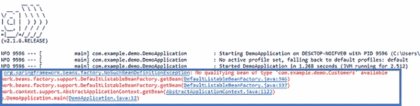

# 使用 Spring Boot 的依赖注入

> 原文：<https://medium.com/edureka/what-is-dependency-injection-5006b53af782?source=collection_archive---------0----------------------->


Dependency Injection — Edureka

在一个我们每天都在使用编程语言的世界里，我们所有人都倾向于寻找方法和技巧来使我们的生活变得简单。依赖注入就是这样一种技术，它旨在通过提供对另一个对象的依赖来帮助开发人员轻松编码。在这篇关于什么是依赖注入的文章中，我将帮助您详细理解这项技术。

本文将涵盖以下主题:

*   依赖注入简介
*   控制反转
*   依赖注入的类型
*   依赖注入的好处
*   使用 Spring Boot 实现依赖注入

那么，就从这篇文章开始吧。

# 什么是依赖注入？

依赖注入是一个对象提供另一个对象的依赖的能力。

现在，我很确定，你可能不理解上面的技术定义。所以，让我为你澄清困惑。

当你听到依赖这个词时，你会想到什么？

很明显，有些东西依赖于其他东西的支持，对吗？

嗯，这是相同的，在编程的情况下也是如此。

编程中的依赖是一种方法，其中一个类使用另一个类的特定功能。因此，举例来说，如果你考虑两个类 A 和 B，并且说类 A 使用类 B 的功能，那么它暗示类 A 具有对类 B 的依赖性。现在，如果你用 Java 编码，那么你必须知道，你必须在类 A 使用对象之前创建类 B 的实例。

所以，如果我现在必须为你定义依赖注入，那么为其他类创建一个对象并让该类直接使用依赖的过程就叫做依赖注入。它主要涉及三个类别:


*   **客户端类:**这是依赖类，依赖于服务类。
*   **服务类:**这个类为客户端类提供服务。
*   **注入器类:**这个类负责将服务类对象注入到客户端类中

现在，您已经理解了什么是依赖注入，接下来让我带您了解依赖注入所基于的原则。

# 控制反转

正如我上面提到的，控制反转是依赖注入的一个原则。此外，顾名思义，控制反转基本上是用来反转一个类的不同种类的附加责任，而不是主要责任。

如果我必须用更简单的术语来解释你，那就考虑一个例子，你有烹饪的能力。根据国际奥委会的原则，你可以颠倒控制，所以你可以直接从外面订购，而不是烹饪食物，你可以在家门口收到食物。因此，食物送到你家门口的过程被称为控制倒置。

你不必自己做饭，相反，你可以点餐，让送餐员为你送餐。这样，你就不必顾及额外的责任，只需专注于主要工作。

现在，您已经知道了依赖注入背后的原理，让我带您了解一下依赖注入的类型。

# 依赖注入的类型

依赖注入主要有三种类型:

*   **构造器注入:**在这种类型的注入中，注入器通过客户端类构造器提供依赖。
*   **Setter 注入/属性注入:**在这种类型的注入中，注入器方法将依赖注入到客户端公开的 Setter 方法中。
*   **接口注入:**在这种类型的注入中，注入器使用接口来提供对客户端类的依赖。客户端必须实现一个接口，该接口将公开一个接受依赖关系的 setter 方法。

到目前为止，我希望您已经理解了这样一个事实，即依赖注入负责创建对象，理解哪些类需要这些对象，并最终为这些类提供对象。因此，在这一点上，让我们接下来看看依赖注入的好处。

# 依赖注入的好处

在我列出依赖注入的好处之前，让我向您解释一下在行业层面上进行这种注入的必要性，以帮助您更好地理解这些好处。

考虑一个场景，其中有一个电子邮件类，它的唯一职责是处理收到的电子邮件。现在，这个类将拥有诸如“收件人电子邮件地址”、“发件人电子邮件地址”、“电子邮件的主题和正文”等对象。

现在，如果公司想要保存文本和音频消息，您认为这个类可以保存消息吗？

嗯，答案是否定的？

这是因为，Email 类不能处理文本和音频消息的参数。在这种情况下，您必须重新创建该类。现在，重新创建类是一件相当麻烦的工作，尤其是如果您必须定期这么做的话。相反，如果您使用依赖注入，您可以在运行时更改对象。所以，用这种方法，你不需要重新创建类，这在很多方面对你有帮助。

因此，如果我必须总结依赖注入的好处，那么下面是这些好处:


好了，现在你知道了依赖注入的好处，让我们向前看，看看如何使用 Spring Boot 实现依赖注入。

# 如何使用 Spring Boot 实现 DI？

**步骤 1:** 打开您的 **Eclipse IDE** ，通过右键单击并选择 **Spring Starter 项目**来创建一个 **Spring Boot 应用程序**。然后提及项目名称并点击**完成**。


要获得 Spring Starter 项目，您必须从 Eclipse Marketplace 安装 Spring Tool Suite。

您将自动看到一个应用程序文件创建如下。


**第二步:**接下来，在同一个包中创建一个类。为此，右键单击 file - >选择**类**并提及**类名。**然后点击**完成**。这将创建一个**类**文件。在这里，我创建了一个客户类。参考下文。


第三步:之后，让我们为这个类添加一些属性。因此，假设我们包括*客户 ID、客户名称*和*课程名称。*下面提一下代码。

```
package com.example.demo; //package name

public class Customers {
private int custid;
private String custname;
private String coursename;

}
```

**步骤 3.1:** 一旦你完成了，你必须**为这些属性生成 Getter 和 Setter 方法**。为此，选择这些属性并单击右键。然后选择**源**->-**生成 Getter 和 Setter 方法。**


到目前为止，您的代码应该如下所示:

```
package com.example.demo;

public class Customers {
private int custid;
private String custname;
private String coursename;

public int getCustid() {
return custid;
}
public void setCustid(int custid) {
this.custid = custid;
}
public String getCustname() {
return custname;
}
public void setCustname(String custname) {
this.custname = custname;
}
public String getCoursename() {
return coursename;
}
public void setCoursename(String coursename) {
this.coursename = coursename;
}
}
```

***现在，考虑一个场景，您必须为客户创建一个对象，但您不想手动完成。在这种情况下，您将不得不使用依赖注入，以便在您需要时获取对象。***

那么，接下来让我们看看如何才能达到同样的效果。

**第四步:**首先，将**应用类文件**中的**运行行**修改为:

```
ConfigurableApplicationContext context = SpringApplication.run(DemoApplication.class, args);
```

**注意:如果你得到一个错误，输入如下:**

```
import org.springframework.boot.SpringApplication; 
import org.springframework.boot.autoconfigure.SpringBootApplication; import org.springframework.context.ConfigurableApplicationContext;
```

上面这行代码将在执行时返回一个对象。现在将下面的代码添加到应用程序文件中。

```
customers c = context.getBean(customers.class);
```

上面一行告诉编译器返回 customer 类的一个对象。参考下文。


**步骤 4.1:** 现在，要检查它是否工作，您**可以返回到客户类**并添加一个方法，如下所示:

```
public void display()

{

System.out.println("Object Returned Successfully");

}
```

该方法将在成功执行时显示输出“对象成功返回”。

**第 4.2 步:**接下来，你要回到申请文件，提及以下内容:

```
c.display();
```

这样，您就可以通过引用 display 方法来调用 Customers 类的对象。到目前为止，应用程序类的代码见下图:


现在，如果您执行这个项目，您将会看到一个**异常，没有类型**的合格 bean。*这是因为您定义的客户类不是 Spring Bean，即不是 Spring 对象。*参考下文。



**步骤 4.3:** 因此，为了告诉 Spring 容器，我们需要一个 customer 类的对象。为此，您需要在 Customer 类中提到**@组件注释**。Customers 类中的代码应该如下所示:

```
package com.example.demo;

import org.springframework.stereotype.Component;
[@Component](http://twitter.com/Component)
public class Customers {
private int custid;
private String custname;
private String coursename;

public int getCustid() {
return custid;
}
public void setCustid(int custid) {
this.custid = custid;
}
public String getCustname() {
return custname;
}
public void setCustname(String custname) {
this.custname = custname;
}
public String getCoursename() {
return coursename;
}
public void setCoursename(String coursename) {
this.coursename = coursename;
}
public void display()

{
System.out.println("Object Returned Successfully");

}
}
```

然后，当你提到客户**c = context . get bean(customers . class)；**编译器将检查容器中是否有可用的客户 bean。

如果 Bean 是可用的，那么 Spring 框架会在应用程序中注入 customer 对象。所以，基本上，这个对象是由 Spring 框架创建的，可以在应用程序中进一步使用。

因此，如果我现在执行这个项目，您将看到 Object 成功返回的输出。参考下文。


这就是你实现依赖注入的基本方法。

**示例:使用自动连线注释的依赖注入**

我希望你已经理解了依赖注入在 Spring Boot 是如何工作的。现在，让我们扩展这个例子，进一步看看在 Spring Boot 中一个依赖于另一个类的类是如何使用那个类的功能的。

**步骤 1:** 通过再次**右击包**并通过选择**新建- >类，创建一个新的**类文件**。**现在，按如下方式提及类名，并点击**完成。**

接下来，让我们为这个类添加一些属性。所以，让我们说，我们包括 *TechID，Techname。*下面提一下代码。

```
package com.example.demo;
public class Technologies {
private int techid;
private String techname;
}
```

**步骤 2.1:** 一旦你完成了这些，右键点击文件，为这些属性生成 **Getter 和 Setter 方法**，然后选择 **Source - > Generate Getter 和 Setter 方法。**

**步骤 3:** 现在，让我们说，我们必须创建一个打印“**成功的**”的方法。为此，请提及代码:

```
public void tech()
{
System.out.println(" Successful");
}
```

到目前为止，您的代码应该如下所示:

```
package com.example.demo;

public class Technologies {
private int techid;
private String techname;
public int getTechid() {
return techid;
}
public void setTechid(int techid) {
this.techid = techid;
}
public String getTechname() {
return techname;
}
public void setTechname(String techname) {
this.techname = techname;
}
public void tech()

{

System.out.println(" Successful");

}
}
```

**步骤 4:** 现在，要调用**客户类**中的 **tech()方法**，您必须创建一个 technologies 类的对象。因此，在 customers 类中提到下面一行代码:

```
private Technologies techdetail;
```


**步骤 4.1:** 一旦完成，通过**右键单击文件**，然后选择**源- >生成 Getter 和 Setter 方法，为这些属性生成 **Getter 和 Setter 方法**。**

**第五步:**接下来要使用 **tech()方法**，就不得不提一下**tech detail . tech()；**客户类别的**显示方式下。此外，为了确保 techdetail 对象被实例化，请提及**@组件注释**是**技术类。**参考下文。**


现在，当您执行这个项目时，您将看到一个**空指针异常**。这是因为现在 ***客户类依赖于技术类，但它不知道技术类*** 的存在。


*因此，为了使客户能够识别技术类，您必须在客户类中插入****@ Autowired annotation****。客户类的最终代码应该如下:*

```
package com.example.demo;

import org.springframework.beans.factory.annotation.Autowired;
import org.springframework.stereotype.Component;
[@Component](http://twitter.com/Component)
public class Customers {
private int custid;
private String custname;
private String coursename;
[@Autowired](http://twitter.com/Autowired)
private Technologies techdetail;

public Technologies getTechdetail() {
return techdetail;
}
public void setTechdetail(Technologies techdetail) {
this.techdetail = techdetail;
}
public int getCustid() {
return custid;
}
public void setCustid(int custid) {
this.custid = custid;
}
public String getCustname() {
return custname;
}
public void setCustname(String custname) {
this.custname = custname;
}
public String getCoursename() {
return coursename;
}
public void setCoursename(String coursename) {
this.coursename = coursename;
}
public void display()

{

System.out.println("Object Returned Successfully");
techdetail.tech();

}
}
```

一旦您执行了这些文件，您将看到 Object 成功返回的输出，这意味着我们已经完成了对类的依赖。参考下文。


到此为止，我们结束了这篇文章。

如果你想查看更多关于人工智能、DevOps、道德黑客等市场最热门技术的文章，你可以参考 Edureka 的官方网站。

请留意本系列中的其他文章，它们将解释 Java 的各个方面。

> 1.[面向对象编程](/edureka/object-oriented-programming-b29cfd50eca0)
> 
> 2.[Java 中的继承](/edureka/inheritance-in-java-f638d3ed559e)
> 
> 3.[Java 中的多态性](/edureka/polymorphism-in-java-9559e3641b9b)
> 
> 4.[Java 中的抽象](/edureka/java-abstraction-d2d790c09037)
> 
> 5. [Java 字符串](/edureka/java-string-68e5d0ca331f)
> 
> 6. [Java 数组](/edureka/java-array-tutorial-50299ef85e5)
> 
> 7. [Java 集合](/edureka/java-collections-6d50b013aef8)
> 
> 8. [Java 线程](/edureka/java-thread-bfb08e4eb691)
> 
> 9.[Java servlet 简介](/edureka/java-servlets-62f583d69c7e)
> 
> 10. [Servlet 和 JSP 教程](/edureka/servlet-and-jsp-tutorial-ef2e2ab9ee2a)
> 
> 11.[Java 中的异常处理](/edureka/java-exception-handling-7bd07435508c)
> 
> 12.[高级 Java 教程](/edureka/advanced-java-tutorial-f6ebac5175ec)
> 
> 13. [Java 面试问题](/edureka/java-interview-questions-1d59b9c53973)
> 
> 14. [Java 程序](/edureka/java-programs-1e3220df2e76)
> 
> 15.[科特林 vs Java](/edureka/kotlin-vs-java-4f8653f38c04)
> 
> 16. [Java 教程](/edureka/java-tutorial-bbdd28a2acd7)
> 
> 17.[在 Java 中可比](/edureka/comparable-in-java-e9cfa7be7ff7)
> 
> 18.[十大 Java 框架](/edureka/java-frameworks-5d52f3211f39)
> 
> 19. [Java 反射 API](/edureka/java-reflection-api-d38f3f5513fc)
> 
> 20.[Java 中的 30 大模式](/edureka/pattern-programs-in-java-f33186c711c8)
> 
> 21.[核心 Java 备忘单](/edureka/java-cheat-sheet-3ad4d174012c)
> 
> 22.[Java 中的套接字编程](/edureka/socket-programming-in-java-f09b82facd0)
> 
> 23. [Java OOP 备忘单](/edureka/java-oop-cheat-sheet-9c6ebb5e1175)
> 
> 24.[Java 中的注释](/edureka/annotations-in-java-9847d531d2bb)
> 
> 25.[Java 中的图书管理系统项目](/edureka/library-management-system-project-in-java-b003acba7f17)
> 
> 26.[Java 中的树](/edureka/java-binary-tree-caede8dfada5)
> 
> 27.[Java 中的机器学习](/edureka/machine-learning-in-java-db872998f368)
> 
> 28.[Java 中的顶级数据结构&算法](/edureka/data-structures-algorithms-in-java-d27e915db1c5)
> 
> 29. [Java 开发者技能](/edureka/java-developer-skills-83983e3d3b92)
> 
> 30.[前 55 个 Servlet 面试问题](/edureka/servlet-interview-questions-266b8fbb4b2d)
> 
> 31. [](/edureka/java-exception-handling-7bd07435508c) [顶级 Java 项目](/edureka/java-projects-db51097281e3)
> 
> 32. [Java 字符串备忘单](/edureka/java-string-cheat-sheet-9a91a6b46540)
> 
> 33.[Java 中的嵌套类](/edureka/nested-classes-java-f1987805e7e3)
> 
> 34. [Java 集合面试问答](/edureka/java-collections-interview-questions-162c5d7ef078)
> 
> 35.[Java 中如何处理死锁？](/edureka/deadlock-in-java-5d1e4f0338d5)
> 
> 36.[你需要知道的 50 大 Java 集合面试问题](/edureka/java-collections-interview-questions-6d20f552773e)
> 
> 37.[Java 中的字符串池是什么概念？](/edureka/java-string-pool-5b5b3b327bdf)
> 
> 38.[C、C++和 Java 有什么区别？](/edureka/difference-between-c-cpp-and-java-625c4e91fb95)
> 
> 39.[Java 中的回文——如何检查一个数字或字符串？](/edureka/palindrome-in-java-5d116eb8755a)
> 
> 40.[你需要知道的顶级 MVC 面试问答](/edureka/mvc-interview-questions-cd568f6d7c2e)
> 
> 41.[Java 编程语言的十大应用](/edureka/applications-of-java-11e64f9588b0)
> 
> 42.[Java 中的死锁](/edureka/deadlock-in-java-5d1e4f0338d5)
> 
> 43.[Java 中的平方和平方根](/edureka/java-sqrt-method-59354a700571)
> 
> 44.[Java 中的类型转换](/edureka/type-casting-in-java-ac4cd7e0bbe1)
> 
> 45.[Java 中的运算符及其类型](/edureka/operators-in-java-fd05a7445c0a)
> 
> 46.[Java 中的析构函数](/edureka/destructor-in-java-21cc46ed48fc)
> 
> 47.[爪哇的二分搜索法](/edureka/binary-search-in-java-cf40e927a8d3)
> 
> 48.[Java 中的 MVC 架构](/edureka/mvc-architecture-in-java-a85952ae2684)
> 
> 49.[冬眠面试问答](/edureka/hibernate-interview-questions-78b45ec5cce8)

*原载于 2019 年 7 月 2 日*[*https://www.edureka.co*](https://www.edureka.co/blog/what-is-dependency-injection/)*。*