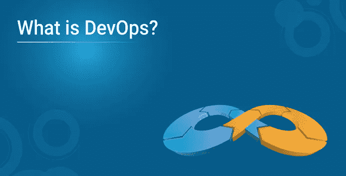
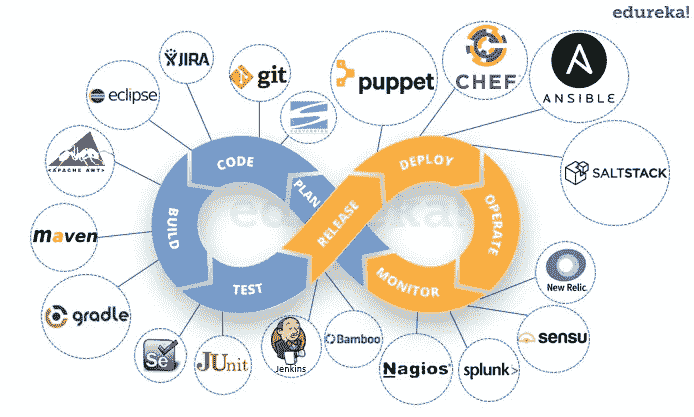
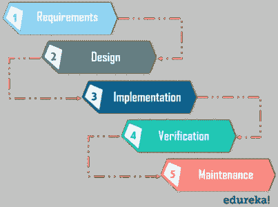
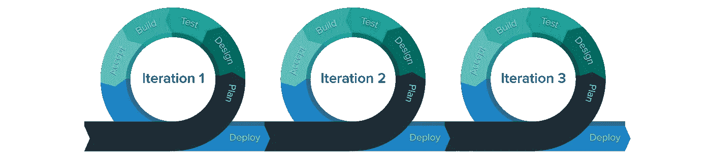
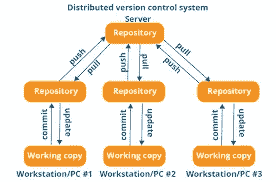
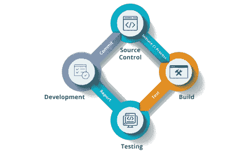
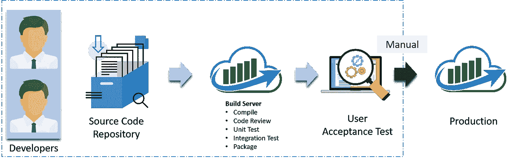
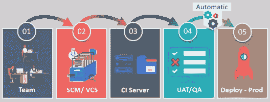
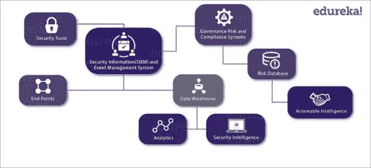
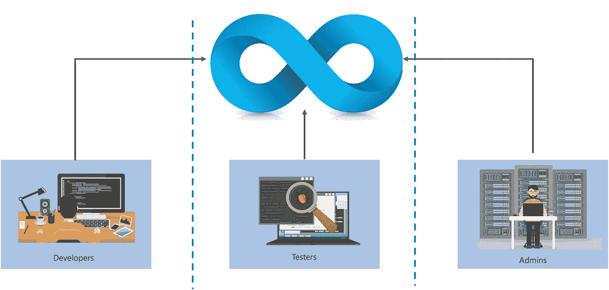

# 什么是 DevOps —简单指南

> 原文：<https://medium.com/edureka/what-is-devops-712737435fc5?source=collection_archive---------1----------------------->

如果你在 IT 行业，那么你一定听说过一个最流行的词汇，叫做 DevOps。许多大型 IT 公司已经采用 DevOps 作为他们的前进方向。因此，在这篇博客中，我将讨论 DevOps 到底是什么，我将涉及的要点如下:

*   **什么是 DevOps？**
*   **devo PS 的历史**
*   **DevOps 工具和阶段**
*   **谁是 DevOps 工程师？**

# DevOps 是什么？

*   DevOps 一词由两个词组成，即开发和运营。DevOps 是一种实践，它允许单个团队管理整个应用程序开发生命周期，即开发、测试、部署和监控。
*   DevOps 的最终目标是缩短系统开发生命周期的持续时间，同时与业务目标紧密同步地频繁交付特性、修复和更新。
*   DevOps 是一种软件开发方法，在它的帮助下，您可以快速地、更可靠地开发出高质量的软件。它由持续开发、持续集成、持续测试、持续部署和持续监控等不同阶段组成。

那么既然什么是 DevOps，那就让我们来看看 DevOps 的历史吧。

# DevOps 的历史

在 DevOps 之前，我们有两种软件开发方法，即瀑布和敏捷。

## 瀑布模型

*   瀑布模型是一种非常直接和线性的软件开发模型。该模型遵循自上而下的方法。
*   这个模型有各种从**开始的需求收集和分析**。在这个阶段，您从客户端获取开发应用程序的需求。在这之后，你试着分析这些需求。

*   下一个阶段是**设计**阶段，在这里你准备软件的蓝图。在这里，您可以考虑软件的实际外观。
*   一旦设计就绪，您就可以进一步进入**实现**阶段，从应用程序的编码开始。开发人员团队在应用程序的各个组件上协同工作。
*   一旦你完成了应用程序的开发，你就可以在**验证**阶段测试它。对应用程序进行各种测试，如单元测试、集成测试、性能测试等。
*   在应用程序的所有测试完成之后，它被部署到生产服务器上。
*   最后，进入**维护**阶段。在这一阶段，对应用程序的性能进行监控。与应用程序性能相关的任何问题都在此阶段得到解决。

## 瀑布模型的优势:

*   易于理解和使用
*   便于测试和分析
*   节省大量的时间和金钱
*   如果明确定义了所有需求，那么对小型项目很有好处
*   允许部门化和管理控制

## 瀑布模型的缺点:

*   风险和不确定性
*   缺乏对当前进展的了解
*   当需求不断变化时不适合
*   当产品处于测试阶段时，很难对其进行更改
*   最终产品仅在周期结束时可用
*   不适合大型复杂的项目

# 敏捷方法

敏捷方法是一种基于迭代的软件开发方法，其中软件项目被分解成不同的迭代或冲刺。每个迭代都有类似瀑布模型的阶段，例如需求收集、设计、开发、测试和维护。每次迭代的持续时间通常为 2–8 周。

## 敏捷过程

*   在敏捷中，公司在第一次迭代中发布带有一些高优先级特性的应用程序。
*   发布后，最终用户或客户会向您反馈应用程序的性能。
*   然后，您对应用程序进行必要的更改，添加一些新特性，应用程序再次发布，这是第二次迭代。
*   您重复整个过程，直到您达到期望的软件质量。

## 敏捷模型的优势

*   它自适应地对需求变化做出有利的响应
*   在开发过程的早期修复错误使这个过程更具成本效益
*   提高产品质量，使其高度无差错
*   允许参与软件项目的人员之间直接交流
*   非常适合大型和长期项目
*   最小的资源需求&非常易于管理

## 敏捷模型的缺点

*   高度依赖明确的客户需求
*   很难预测大型项目的时间和工作量
*   不适合复杂的项目
*   缺乏文档效率
*   可维护性风险增加

现在让我们继续讨论 DevOps 阶段和工具。

# DevOps 阶段和工具

如前所述，持续开发、持续集成、持续测试、持续部署和持续监控等各个阶段构成了 DevOps 生命周期。现在让我们一个接一个地看看 DevOps 生命周期的每个阶段。

## **阶段— 1:持续发展**

**使用的工具:** Git，SVN，Mercurial，CVS

**工艺流程:**

*   这是涉及软件“规划”和“编码”的阶段。您在规划阶段决定项目远景，开发人员开始为应用程序开发代码。
*   没有计划所需的 ***DevOps 工具*** ，但是有许多工具用于维护代码。
*   代码可以是任何语言，但是您可以使用版本控制工具来维护它。这个维护代码的过程被称为源代码管理。
*   代码开发完成后，您就进入了持续集成阶段。

## **阶段— 2:持续整合**

**工具:詹金斯、团队城市、特拉维斯**

**工艺流程:**

*   这个阶段是整个 DevOps 生命周期的核心。这是一种实践，开发人员需要更频繁地提交对源代码的更改。这可以是每天或每周一次。
*   然后构建每一个提交，这样可以尽早发现问题。构建代码不仅包括编译，还包括代码审查、单元测试、集成测试和打包。

*   支持新功能的代码是 ***与现有代码持续集成*** 。由于软件是不断发展的，你需要不断地、平稳地将更新的代码与系统集成，以向最终用户反映变化。
*   在这个阶段，您使用工具将代码构建/打包到一个可执行文件中，以便您可以将它转发到下一个阶段。

## **阶段— 3:连续测试**

**工具:Jenkins、Selenium TestNG、JUnit**

**工艺流程:**

*   这是您使用自动化测试工具连续测试已开发软件的错误的阶段。这些工具允许 QAs 完全并行地测试多个代码库，以确保在功能上没有缺陷。在这个阶段，您可以使用 Docker 容器来模拟测试环境。
*   ***Selenium*** 用于自动化测试，报告由 ***TestNG*** 生成。您可以借助一个名为 Jenkins 的持续集成工具来自动化整个测试阶段。
*   假设您用 Java 编写了一个 selenium 代码来测试您的应用程序。现在，您可以使用 ant 或 maven 构建这段代码。一旦你构建了代码，你就可以对它进行用户接受度测试(UAT)。这整个过程可以使用 ***詹金斯*** 自动完成。

## **阶段— 4:持续部署**

**使用的工具:**

**配置管理—主厨、傀儡、负责人**

**集装箱化——码头工人、流浪汉**

**工艺流程:**

*   这是在生产服务器上部署代码的阶段。确保在所有服务器上正确部署代码也很重要。在继续之前，让我们试着了解一些关于配置管理和 ***容器化工具*** 的事情。这些工具有助于实现连续部署(CD)。

*   ***配置管理*** 是在应用程序的功能需求和性能中建立和维护一致性的行为。让我用更简单的话来说，它是向服务器发布部署、在所有服务器上安排更新的行为，最重要的是保持所有服务器上的配置一致。
*   集装箱工具在部署阶段也发挥着同样重要的作用。容器化工具有助于在开发、测试、试运行以及生产环境中产生一致性。除此之外，它们还有助于快速放大和缩小实例。

## **阶段— 5:持续监控**

**使用的工具:Splunk、ELK Stack、Nagios、New Relic**

**工艺流程:**

*   这是 DevOps 生命周期的一个非常关键的阶段，在这个阶段，您需要持续监控应用程序的性能。在这里，您记录了有关软件使用的重要信息。然后处理这些信息，检查应用程序的功能是否正常。在这一阶段，您需要解决系统错误，例如内存不足、服务器不可达等。

*   这一实践包括操作团队的参与，他们将监控用户活动以发现系统的错误或任何不适当的行为。持续监控工具可以帮助您密切监控应用程序的性能和服务器，还可以让您主动检查系统的健康状况。

最后，我们将讨论谁是 DevOps 工程师。

# 谁是 DevOps 工程师？

DevOps 工程师了解软件开发生命周期，并对开发数字管道(CI/ CD 管道)的各种自动化工具有透彻的了解。

DevOps 工程师与开发人员和 IT 人员一起监督代码发布。他们要么是对部署和网络操作感兴趣的开发人员，要么是对脚本和编码充满热情的系统管理员，并进入开发领域，在那里他们可以改进测试和部署的规划。

以上是我在这篇关于什么是 DevOps 的文章中的观点。我希望你已经理解了我在这里讨论的一切。如果你有任何问题，请在评论区提出。

这是我关于 Nagios 面试问题的文章的结尾。如果你想查看更多关于人工智能、Python、道德黑客等市场最热门技术的文章，那么你可以参考 [Edureka 的官方网站。](https://www.edureka.co/blog/?utm_source=medium&utm_medium=content-link&utm_campaign=what-is-devops)

请留意本系列中的其他文章，它们将解释 DevOps 的各个方面。

> *1。* [*DevOps 教程*](/edureka/devops-tutorial-89363dac9d3f)
> 
> *2。* [*饭桶教程*](/edureka/git-tutorial-da652b566ece)
> 
> *3。* [*詹金斯教程*](/edureka/jenkins-tutorial-68110a2b4bb3)
> 
> *4。* [*Docker 教程*](/edureka/docker-tutorial-9a6a6140d917)
> 
> *5。* [*Ansible 教程*](/edureka/ansible-tutorial-9a6794a49b23)
> 
> *6。* [*傀儡教程*](/edureka/puppet-tutorial-848861e45cc2)
> 
> *7。* [*厨师教程*](/edureka/chef-tutorial-8205607f4564)
> 
> *8。* [*Nagios 教程*](/edureka/nagios-tutorial-e63e2a744cc8)
> 
> *9。* [*如何编排 DevOps 工具？*](/edureka/devops-tools-56e7d68994af)
> 
> *10。* [*连续交货*](/edureka/continuous-delivery-5ca2358aedd8)
> 
> *11。* [*持续集成*](/edureka/continuous-integration-615325cfeeac)
> 
> *12。* [*连续部署*](/edureka/continuous-deployment-b03df3e3c44c)
> 
> *13。* [*持续交付 vs 持续部署*](/edureka/continuous-delivery-vs-continuous-deployment-5375642865a)
> 
> *14。* [*CI CD 管道*](/edureka/ci-cd-pipeline-5508227b19ca)
> 
> *15。* [*Docker 作曲*](/edureka/docker-compose-containerizing-mean-stack-application-e4516a3c8c89)
> 
> *16。* [*码头工人群*](/edureka/docker-swarm-cluster-of-docker-engines-for-high-availability-40d9662a8df1)
> 
> *17。* [*Docker 联网*](/edureka/docker-networking-1a7d65e89013)
> 
> *18。* [*天穹*](/edureka/ansible-vault-secure-secrets-f5c322779c77)
> 
> *19。* [*可变角色*](/edureka/ansible-roles-78d48578aca1)
> 
> *20。* [*适用于 AWS*](/edureka/ansible-for-aws-provision-ec2-instance-9308b49daed9)
> 
> *21。* [*詹金斯管道*](/edureka/jenkins-pipeline-tutorial-continuous-delivery-75a86936bc92)
> 
> 22。 [*顶级 Docker 命令*](/edureka/docker-commands-29f7551498a8)
> 
> *23。*[*Git vs GitHub*](/edureka/git-vs-github-67c511d09d3e)
> 
> *24。* [*顶级 Git 命令*](/edureka/git-commands-with-example-7c5a555d14c)
> 
> 25。 [*DevOps 面试问题*](/edureka/devops-interview-questions-e91a4e6ecbf3)
> 
> *二十六。* [*谁是 DevOps 工程师？*](/edureka/devops-engineer-role-481567822e06)
> 
> *二十七。* [*DevOps 生命周期*](/edureka/devops-lifecycle-8412a213a654)
> 
> *28。*[*Git Reflog*](/edureka/git-reflog-dc05158c1217)
> 
> *29。* [*易变条款*](/edureka/ansible-provisioning-setting-up-lamp-stack-d8549b38dc59)
> 
> 30。 [*组织正在寻找的顶尖 DevOps 技能*](/edureka/devops-skills-f6a7614ac1c7)
> 
> *30。* [*瀑布 vs 敏捷*](/edureka/waterfall-vs-agile-991b14509fe8)
> 
> *31。* [*詹金斯小抄*](/edureka/jenkins-cheat-sheet-e0f7e25558a3)
> 
> *32。* [*Ansible 备忘单*](/edureka/ansible-cheat-sheet-guide-5fe615ad65c0)
> 
> *33。* [*Ansible 面试问答*](/edureka/ansible-interview-questions-adf8750be54)
> 
> *34。* [*50 码头工人面试问题*](/edureka/docker-interview-questions-da0010bedb75)
> 
> *35。* [*敏捷方法论*](/edureka/what-is-agile-methodology-fe8ad9f0da2f)
> 
> *36。* [*詹金斯面试问题*](/edureka/jenkins-interview-questions-7bb54bc8c679)
> 
> *37。* [*Git 面试问题*](/edureka/git-interview-questions-32fb0f618565)
> 
> *38。* [*Docker 架构*](/edureka/docker-architecture-be79628e076e)
> 
> 39。[*devo PS 中使用的 Linux 命令*](/edureka/linux-commands-in-devops-73b5a2bcd007)
> 
> 40。 [*詹金斯 vs 竹子*](/edureka/jenkins-vs-bamboo-782c6b775cd5)
> 
> *41。* [*Nagios 教程*](/edureka/nagios-tutorial-e63e2a744cc8)
> 
> *42。* [*Nagios 面试问题*](/edureka/nagios-interview-questions-f3719926cc67)
> 
> 43。 [*DevOps 实时场景*](/edureka/jenkins-x-d87c0271af57)
> 
> 44。 [*詹金斯和詹金斯 X 的区别*](/edureka/jenkins-vs-bamboo-782c6b775cd5)
> 
> 45。[*Windows Docker*](/edureka/docker-for-windows-ed971362c1ec)
> 
> *46。*[*Git vs Github*](http://git%20vs%20github/)