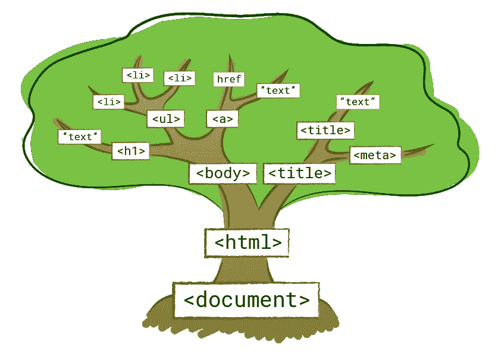
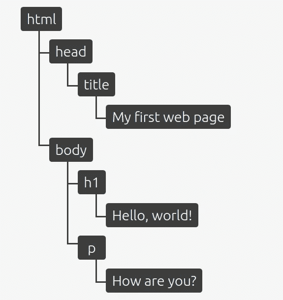
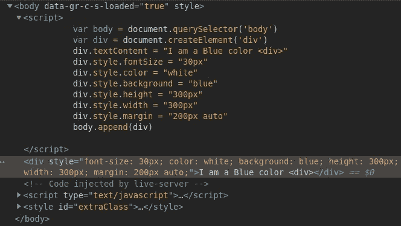
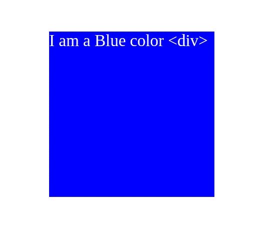
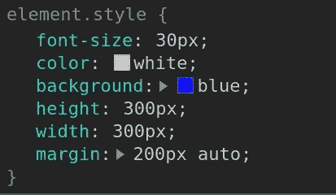
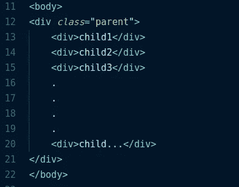

# 什么是 DOM？为什么说潜入是最刺激的部分？

> 原文：<https://medium.com/quick-code/what-is-dom-why-is-it-the-most-stimulating-part-to-dive-in-ffe7c96debb7?source=collection_archive---------0----------------------->


Understanding DOM

当我浏览 JavaScript 时，我每天都学到新的东西，这是一个有无限可能的广阔世界。

DOM 指的是文档对象模型，我们用 HTML 和 CSS 制作网页结构并赋予其样式的事情可以通过在 javaScript 的帮助下操纵 DOM 来完成，这被称为**“DOM 操纵”**

文档对象模型将所有页面内容表示为可以修改的对象。

`document`对象是页面的主要“入口点”。我们可以使用它在页面上更改或创建任何内容。

DOM 通过表示文档的结构将网页连接到脚本或编程语言——比如表示网页的 HTML。

**根据维基百科:**

> **文档对象模型** ( **DOM** )是一个跨平台和独立于语言的接口，它将 HTML 文档视为一个树形结构，其中每个节点都是一个表示文档一部分的对象。DOM 用一个逻辑树表示一个文档。树的每个分支都以一个节点结束，每个节点都包含对象。DOM 方法允许对树的编程访问；有了它们，人们可以改变文档的结构、风格或内容。节点可以附加事件处理程序。一旦事件被触发，事件处理程序就会被执行。

那么上面的定义是什么意思呢，用图表就很容易理解了，



DOM Representation / Node-Tree

```
<!doctype html>
<html lang="en">
 <head>
   <title>My first web page</title>
  </head>
 <body>
    <h1>Hello, world!</h1>
    <p>How are you?</p>
  </body>
</html>
```

**代码在下图中表示为分支，**



DOM Hierarchy

DOM 的对象结构由所谓的“节点树”来表示。之所以这样说，是因为它可以被认为是一棵树，只有一个母干，分支成几个子分支，每个子分支可能都有叶子。
在这种情况下，父元素“stem”是根元素`<html>`，子元素“branches”是嵌套元素，“leaves”是元素中的内容。

在维基百科的定义中，有几次提到了节点。

**这里的 Node 指的是什么？**

在这个上下文中，一个“**节点**”仅仅是一个 HTML 元素。“ **DOM** ”是表示网站 HTML 的树形结构，每个 HTML 元素都是一个“**节点**”。因此，DOM 只是一个具有树状结构的文档，其中所有的 HTML 元素都存在或者可以被创建。

为了操作 DOM 中的任何元素或者可以说是操作任何节点，我们使用关键字`document`来访问节点或者创建一个新节点。

**例如:**
如果我想在 dom 中创建一个`div`并将它的背景变成蓝色，文本里面写着“我是蓝色的< div >”。
这里`div`不仅仅是一个节点，而是`html,body,meta-tags`都代表 DOM 的节点。

我正在使用一些 JS DOM 操作属性来完成上面的任务，我将在稍后解释，

**我正在创建一个** `**index.html**` **文件，只是有一个空的体标记。**

**在**中添加了 js 后`**<script>**`的**标记，**

**现在当我在浏览器中查看** `**html**` **时，**



Inspect Elements

**我们看看用 JS 创建的** `**div**` **它就在** `**body**` **标签里面。
现在看看浏览器，我们看到蓝色的** `**div**` **如我们所愿出现在它的位置。**

# **“BOOM WOW”**



“I am a Blue color <div>”

这是如此令人兴奋，现在我们已经增加了一个武器，我们使用 HTML，CSS 来制作我们的网页，但如果你不想被他们弄糟，你可以只显示你的 JS 技能，并成为一个**热！！！**

现在让我解释一下我用来制作**蓝色 div** 的代码和属性，

`var body = document.querySelector('body')`这里我取了一个名为`body`的变量，它被分配给一个`Document`方法`querySelector()`。

# →选择元素:

`**Document.querySelector('.className || #ID || tagName')**`

`Document`方法`querySelector()`返回文档中与指定选择器或选择器组匹配的第一个`Element`。如果没有找到匹配项，则返回`null`。
它可以用类名、Id 或标签名本身来定位一个元素。

## 在我的代码中，我用它来定位`body`标记名。

还有其他不同的方法来定位一个元素，

`**Document.getElementByID('#ID_GIVEN_TO_THE_ELEMENT')**`

`Document`方法`getElementById()`返回一个`Element`对象，表示其`id`属性与指定字符串匹配的元素。

`**Document.getElementByClassName('name_of_the_class')**`

此方法以类名与指定字符串匹配的元素为目标，或者如果有多个元素具有相同的类名，则返回一个数组。

# →创建元素:

`**Document.createElement()**`

**在上面的 index.html 代码中，**

`var div = document.createElement('div')`这里变量`div`被分配给`Document`方法`createElement()`。
`document.createElement()`方法创建由 tagName 指定的 HTML 元素。

现在，我选择`div`并使用`textContent`属性插入我想要的文本，这样它就会显示在浏览器中所选的节点中，在我的例子中是我用`createElement`方法创建的`div`。

`Node`接口的`textContent`属性表示浏览器上节点或元素的文本内容。

# →为元素添加风格:

## HTMLElement.style

我们甚至不用编写 CSS 就可以给选中的`div`添加样式。
我们使用`style`属性，它选择 HTMLElement 并为元素设置一个内联 CSS 属性。
在我们的例子里，
我已经补充过了，

***font size = " 30px "
color = " white "
background = " blue "
height = " 300 px "
width = " 300 px "
margin = " 200 px auto "***

这是我们在浏览器中查看时的样子，



The Element here is the div that is being created above.

# →渲染元素:

最后，我通过使用`append`属性将`div`添加到我使用`querySelector()`方法选择的`body`标签中。在我们理解`append`属性之前，我将向你解释什么是父节点的`parentNode`和`child`。这基本上只是节点树的层次，
最顶层的元素是其子元素的父元素，这可以通过 HTML 结构快照来理解。



Understanding ParentNode.

在快照中，我们可以看到包含一个`div`的`body`标签，而`div`进一步嵌套了一堆`div's`。
这里的`div's`是`div`与`class="parent”`的子节点。
带`class="parent"`的`div`是嵌套`div's`的`parentNode`。

并且，`parentDiv`中的每一个`div`都是彼此的兄弟。
我们可以访问具有只读属性的元素，如`parentNode`、`firstChild`、`lastChild`，并引用`nextSibling`和`previousSibling`属性。

一旦我们用上面讨论的任何选择方法选择了一个特定的`div`，这些属性就可以用来访问所选`div`的兄弟或父。


nodeParent and its child :)

唷，有很多东西需要理解，但如果你一部分一部分地理解它，那就很容易了。我会把这些主题的参考链接下来，这样你自己就可以深入了解了。

现在，当我们理解`parentNode`是什么的时候，我们可以跳到`append()`方法。

`append()`在`ParentNode`的最后一个子对象后插入一组`Node`对象。
还有一个方法`appendChild()`，它只能追加一个节点对象，而`append()`可以添加多个节点对象到`parentNode`。

因此，我们在 DOM 上用蓝色背景渲染`div`。

有如此多的 DOM 和不同的方法，我们用来操纵 DOM 的事件。

我将为本文添加第 2 部分，因为 DOM 是一个很大的主题，要在一篇文章中涵盖。

我希望你一路跟随，让我知道你是否喜欢下面这篇文章的回应。

这是如此有趣和刺激，一旦你学会了 DOM 操作，你就可以构建如此多的酷应用，这是一个热门开发者必须具备的技能。

查看我现有项目的 Github 个人资料，
【https://github.com/bhavishya2107 

# 谢谢各位。！！

**鼓掌会被欣赏:)**

> 继续编码学习和构建…

# 参考资料:

*   JavaScript info 是一个很棒的网站，它很好地解释并提供了上面提到的 DOM 及其方法的例子:
    [https://javascript.info/dom-nodes](https://javascript.info/dom-nodes)
*   Mozilla 也有非常有用的文档(加上他们的“自己尝试”选项非常适合实验):
    [https://developer . Mozilla . org/en-US/docs/Web/API/Document _ Object _ Model](https://developer.mozilla.org/en-US/docs/Web/API/Document_Object_Model)
*   维基百科了解定义。
    [https://en.wikipedia.org/wiki/Document_Object_Model](https://en.wikipedia.org/wiki/Document_Object_Model)