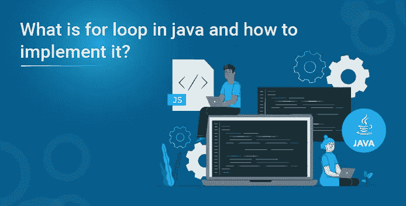
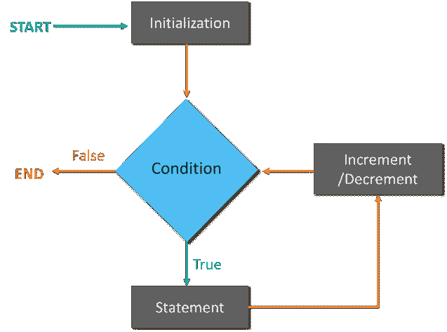

# java 中的 for 循环是什么，如何实现？

> 原文：<https://medium.com/edureka/what-is-for-loop-in-java-and-how-to-implement-140b782afc98?source=collection_archive---------0----------------------->



在编程时，如果出现了这样一种情况，即您明确知道要在代码中迭代特定语句块多少次，那么就使用“for”循环。在本文中，让我们学习如何用 Java 编程语言实现 for 循环。

本文涵盖的主题如下:

*   什么是 for 循环？
*   流程图
*   句法
*   for 循环的示例
*   Java 嵌套 for 循环
*   Java 嵌套 for 循环示例
*   金字塔示例:案例 1
*   金字塔示例:案例 2

我们开始吧！

# 什么是 for 循环？

程序员通常使用循环来执行一组语句。当他们需要多次迭代程序的一部分时，使用循环。它特别适用于迭代次数固定的情况！

为了更好的理解，让我给你一个图示！

# 流程图



这里，在初始化之后，扫描您在代码中指定的条件，如果条件为真，它将增加/减少(根据您的代码)值，并根据您指定的条件再次迭代代码。但是，如果你的条件为假，它将退出循环。

在这个理论解释之后，让我给你展示一下 ***对于*** 循环的语法！

**语法**

```
for (statement 1; statement 2; statement 3) {
// code block to be executed
}
```

语法非常简单。其内容如下
**语句 1:** 代码块执行前的条件
**语句 2:** 指定代码执行的条件
**语句 3:** 条件一旦代码执行完毕

为了使事情更清楚，让我们用 Java 代码实现上面解释的语法。

**for 循环的例子**

下面写的代码描述了如何用 Java 语言实现 for 循环

```
public class MyClass {
{
public static void main(String[] args) {
{for (int i = 0; i < 5; i++) {
System.out.println(i);
}
}
}}
```

我用了一个简单的代码来让你们熟悉 for 循环的概念。在 for 循环中，有三个语句，我在上一节已经讲过了。我希望你现在能很容易地理解它们！

*   首先，Int i=0 是一个整型变量的初始化，这个变量的值已经被赋值为 0。
*   其次，我<5 is the condition that I have applied in my code
*   Thirdly, i++, means that I want the value of my variable to be incremented.

After understanding the working of for loop, let me take you to another concept, that is Java nested ***为*** 循环！

# Java 嵌套 for 循环

如果在 for 循环中有一个 for 循环，那么就遇到了一个嵌套的 Java for 循环。当外循环执行时，内循环完全执行。

我将通过一个例子向您展示 Java 嵌套 for 循环的工作方式。

# 例子

嵌套 for 循环的 Java 代码:

```
public class Example{
public static void main(String[] args) {
for(int i=1;i<=3;i++){
for(int j=1;j<=3;j++){
System.out.println(i+" "+j);
}
}
}
}
```

输出:
1 1
1 2
1 3
2 1
2 2
2 3
3 1
3 2
3 3

现在您已经理解了嵌套 for 循环的概念，让我向您展示一个您可能听说过的非常著名的例子！金字塔的例子！

# 金字塔示例:案例 1

```
public class PyramidExample {
public static void main(String[] args) {
for(int i=1;i<=5;i++){
for(int j=1;j<=i;j++){
System.out.print("* ");
}
System.out.println();//new line
}
}
}
```

**输出:**

*
* *
* * *
* * *
* * * * * *

继续下一个例子。

# 金字塔示例:案例 2

```
package MyPackage;
public class Demo {
public static void main(String[] args) {
int term=6;
for(int i=1;i<=term;i++){ for(int j=term;j>=i;j--){
System.out.print("* ");
}
System.out.println();//new line
}
}
}
```

**输出:**

* * * *
* * * *
* * * *
* *
*

我相信您会熟悉这两种模式。

这样我们就结束了这篇文章。如果您想了解更多，请查看 Edureka 提供的 Java 培训，这是一家值得信赖的在线学习公司。Edureka 的 Java J2EE 和 SOA 培训和认证课程旨在培训您掌握核心和高级 Java 概念以及各种 Java 框架，如 Hibernate & Spring。

如果你想查看更多关于人工智能、DevOps、道德黑客等市场最热门技术的文章，你可以参考 [Edureka 的官方网站。](https://www.edureka.co/blog/?utm_source=medium&utm_medium=java-for-loop)

请留意本系列中解释 Java 其他各方面的其他文章。

> *1。* [*面向对象编程*](/edureka/object-oriented-programming-b29cfd50eca0)
> 
> *2。* [*继承 Java 中的*](/edureka/inheritance-in-java-f638d3ed559e)
> 
> *3。*[*Java 中的多态性*](/edureka/polymorphism-in-java-9559e3641b9b)
> 
> *4。*[*Java 中的抽象*](/edureka/java-abstraction-d2d790c09037)
> 
> *5。* [*Java 字符串*](/edureka/java-string-68e5d0ca331f)
> 
> *6。* [*Java 数组*](/edureka/java-array-tutorial-50299ef85e5)
> 
> *7。* [*Java 集合*](/edureka/java-collections-6d50b013aef8)
> 
> *8。* [*Java 线程*](/edureka/java-thread-bfb08e4eb691)
> 
> *9。*[*Java servlet 简介*](/edureka/java-servlets-62f583d69c7e)
> 
> *10。* [*Servlet 和 JSP 教程*](/edureka/servlet-and-jsp-tutorial-ef2e2ab9ee2a)
> 
> *11。*[*Java 中的异常处理*](/edureka/java-exception-handling-7bd07435508c)
> 
> *12。* [*Java 教程*](/edureka/java-tutorial-bbdd28a2acd7)
> 
> *13。* [*Java 面试题*](/edureka/java-interview-questions-1d59b9c53973)
> 
> *14。*[Java 程序 ](/edureka/java-programs-1e3220df2e76)
> 
> 15。[*kot Lin vs Java*](/edureka/kotlin-vs-java-4f8653f38c04)
> 
> *16。* [*依赖注入使用 Spring Boot*](/edureka/what-is-dependency-injection-5006b53af782)
> 
> *17。* [*堪比爪哇*](/edureka/comparable-in-java-e9cfa7be7ff7)
> 
> 18。 [*十大 Java 框架*](/edureka/java-frameworks-5d52f3211f39)
> 
> 19。 [*Java 反射 API*](/edureka/java-reflection-api-d38f3f5513fc)
> 
> 20。[*Java 中的 30 大模式*](/edureka/pattern-programs-in-java-f33186c711c8)
> 
> *21。* [*核心 Java 备忘单*](/edureka/java-cheat-sheet-3ad4d174012c)
> 
> *22。*[*Java 中的套接字编程*](/edureka/socket-programming-in-java-f09b82facd0)
> 
> *23。* [*Java OOP 备忘单*](/edureka/java-oop-cheat-sheet-9c6ebb5e1175)
> 
> *24。*[*Java 中的注释*](/edureka/annotations-in-java-9847d531d2bb)
> 
> *25。*[*Java 中的库管理系统项目*](/edureka/library-management-system-project-in-java-b003acba7f17)
> 
> *26。*[*Java 中的树木*](/edureka/java-binary-tree-caede8dfada5)
> 
> *27。*[*Java 中的机器学习*](/edureka/machine-learning-in-java-db872998f368)
> 
> *28。* [*顶级数据结构&Java 中的算法*](/edureka/data-structures-algorithms-in-java-d27e915db1c5)
> 
> *29。* [*Java 开发者技能*](/edureka/java-developer-skills-83983e3d3b92)
> 
> *30。* [*前 55 名 Servlet 面试问题*](/edureka/servlet-interview-questions-266b8fbb4b2d)
> 
> *31。*[](/edureka/java-exception-handling-7bd07435508c)*[*顶级 Java 项目*](/edureka/java-projects-db51097281e3)*
> 
> *32。 [*Java 字符串备忘单*](/edureka/java-string-cheat-sheet-9a91a6b46540)*
> 
> *33。[*Java 中的嵌套类*](/edureka/nested-classes-java-f1987805e7e3)*
> 
> *34。 [*Java 集合面试问答*](/edureka/java-collections-interview-questions-162c5d7ef078)*
> 
> **35。*[*Java 中如何处理死锁？*](/edureka/deadlock-in-java-5d1e4f0338d5)*
> 
> *36。 [*你需要知道的 50 个 Java 合集面试问题*](/edureka/java-collections-interview-questions-6d20f552773e)*
> 
> *37。[*Java 中的字符串池是什么概念？*](/edureka/java-string-pool-5b5b3b327bdf)*
> 
> *38。[*C、C++和 Java 有什么区别？*](/edureka/difference-between-c-cpp-and-java-625c4e91fb95)*
> 
> **39。*[*Java 中的回文——如何检查一个数字或字符串？*](/edureka/palindrome-in-java-5d116eb8755a)*
> 
> *40。 [*你需要知道的顶级 MVC 面试问答*](/edureka/mvc-interview-questions-cd568f6d7c2e)*
> 
> *41。[*Java 编程语言的十大应用*](/edureka/applications-of-java-11e64f9588b0)*
> 
> **42。*[*Java 中的死锁*](/edureka/deadlock-in-java-5d1e4f0338d5)*
> 
> **43。*[*Java 中的平方和平方根*](/edureka/java-sqrt-method-59354a700571)*
> 
> **44。*[*Java 中的类型转换*](/edureka/type-casting-in-java-ac4cd7e0bbe1)*
> 
> **45。*[*Java 中的运算符及其类型*](/edureka/operators-in-java-fd05a7445c0a)*
> 
> **46。*[*Java 中的析构函数*](/edureka/destructor-in-java-21cc46ed48fc)*
> 
> **47。*[*Java 中的二分搜索法*](/edureka/binary-search-in-java-cf40e927a8d3)*
> 
> **48。*[*Java 中的 MVC 架构*](/edureka/mvc-architecture-in-java-a85952ae2684)*
> 
> **49。* [*冬眠面试问答*](/edureka/hibernate-interview-questions-78b45ec5cce8)*

**原载于 2019 年 8 月 20 日*[*https://www.edureka.co*](https://www.edureka.co/blog/java-for-loop)*。**