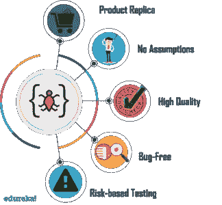

# 什么是功能测试？-自动化工具完整指南

> 原文：<https://medium.com/edureka/what-is-functional-testing-complete-guide-to-automation-tools-183e42ad517a?source=collection_archive---------2----------------------->


What is Functional Testing? — Edureka

在这个科技和互联网的时代，顾客希望他们的产品比竞争对手更快交付。但是没有人想要一个有缺陷的软件产品。测试在提高系统的质量、可靠性和性能方面起着重要的作用。这篇关于“**什么是功能测试**”的文章将帮助您按照以下顺序了解更多关于使用自动化工具进行测试的知识:

*   什么是软件测试？
*   软件测试的类型
*   什么是功能测试？
*   功能测试与非功能测试
*   功能测试的优势
*   功能测试中涉及的步骤
*   功能测试的类型
*   功能测试技术
*   功能测试工具
*   使用 Selenium 的自动化测试

# 什么是软件测试？


软件测试是评估软件应用程序的功能以发现任何软件缺陷的过程。它检查开发的软件是否满足指定的要求，并识别软件中的任何缺陷，以便生产出高质量的产品。它基本上是执行一个系统，以便识别任何差距、错误或与实际需求相反的缺失需求。

# 软件测试的类型

测试是任何成功的软件项目不可或缺的一部分。软件测试的类型取决于各种因素，包括项目需求、预算、时间表、专业知识和适用性。不同类型的软件测试是测试人员为应用程序确定正确测试的关键角色。


QA 或软件测试人员执行的两种主要测试是:

*   功能测试
*   非功能测试

# 什么是功能测试？

功能测试被定义为一种验证软件应用程序的每个**功能**按照需求规格运行的测试。这种测试主要涉及黑盒测试，它不关心应用程序的源代码。它关注手工测试和自动化测试。


功能测试包括检查以下内容:

*   用户界面
*   蜜蜂
*   数据库ˌ资料库
*   安全性
*   客户端/服务器应用程序
*   被测应用程序的功能

# 功能测试与非功能测试

功能测试定义了测试的过程，非功能测试用于检查性能、可靠性、可用性等。让我们来看看不同的参数，基于这些参数我们可以比较这两种类型的测试:


# 功能测试的优势

功能测试是很重要的，因为它验证了系统是固定的，并且没有错误。现在让我们来看看功能测试的一些优势:



*   该测试提供了实际系统的**复制品**，即产品在真实环境中的复制品。测试的重点是客户使用的规格。
*   它不基于任何关于系统结构的假设。
*   该测试确保交付符合客户要求的**高质量**产品，并确保客户对最终结果满意。
*   它确保交付一个无**缺陷的**产品，该产品具有按照客户要求工作的所有功能。
*   **基于风险的**测试是为了降低产品中任何风险的可能性。

# 功能测试中涉及的步骤

在执行功能测试时，我们需要遵循某些步骤。涉及的各个步骤是:


*   第一步是确定需要测试的产品的**功能**，它包括测试主要功能、错误条件和消息、可用性测试。
*   下一步是根据需求规范为要测试的功能创建**输入数据**。
*   在第三步中，从需求规格中确定被测功能的输出。
*   准备好的**测试用例**在下一步执行。
*   最后一步是**比较**执行测试用例后的**输出**和预期输出，以发现功能是否按预期工作。

# 功能测试的类型

功能测试有许多类别，可以根据场景来使用。让我们来看看最主要的功能测试类型:

**单元测试**——通常由开发人员执行，他们编写不同的代码单元，这些代码单元可能相关，也可能不相关，以实现特定的功能。代码覆盖率是单元测试的一个重要部分，其中测试用例需要覆盖行覆盖率、代码路径覆盖率和方法覆盖率。

健全性测试— 这样做是为了确保应用程序/系统的所有主要和重要功能都正常工作。这通常在烟雾测试后进行。

**冒烟测试** —在每个构建发布后进行测试，以确保构建的稳定性。它也被称为构建验证测试。


**回归测试** —执行测试以确保添加新代码、增强功能、修复错误不会破坏现有功能或导致任何不稳定性，并且仍然按照规范工作。

**集成测试** —当系统依赖于多个功能模块时，这些功能模块可能单独工作得很好，但当组合在一起时必须协调工作以实现端到端的场景，这种场景的验证被称为集成测试。

**可用性测试** —产品在生产过程中像环境一样暴露给实际客户，他们测试产品。用户的舒适度来源于此，并接受反馈。这类似于用户验收测试。

# 功能测试技术

测试的基本方法可以分为两大类:

1.  正面测试— **正面测试**是快乐路径测试，旨在确保产品至少满足对客户使用至关重要的基本要求。
2.  负面测试— **负面场景**确保产品即使在遇到意外数据时也能正常运行。


现在让我们来看看功能测试中这两种不同技术的子类:

*   **基于最终用户的测试**——测试中的系统由许多组件组成，当它们耦合在一起时，就实现了用户场景。
*   **等价测试** —在这种情况下，测试数据被分成不同的分区，称为等价数据类。每个分区中的数据必须以相同的方式运行，因此只需要测试一个条件。类似地，如果一个分区中的一个条件停止工作，其他条件都不会工作。
*   **边界值测试** —边界测试意味着对应用程序的数据限制，并验证其行为方式。如果输入超过边界值，则认为是负测试。
*   **基于决策的测试** —基于决策的测试专注于满足特定条件时系统可能结果的意识形态。
*   **备选流程测试** —备选路径测试基本上是为了验证所有可能存在的方式，而不是主要流程来完成一项功能。
*   **特别测试** —当通过上述技术发现了大多数错误时，特别测试是发现任何早期没有观察到的差异的好方法。

# 功能测试工具

市场上充斥着大量用于测试管理、负载测试、GUI 测试、功能测试等的自动化工具。我建议你选择一个随需应变的工具，根据你的技能，容易学习，通用和有效的测试类型。

一些最受欢迎的功能测试工具有:

*   **雷诺克斯**
*   **硒**
*   **测试 IO**
*   **Telerik**
*   **CUIT**

Selenium 是最受欢迎的测试工具之一。让我们看看它是如何用于自动化测试的。

# 使用 Selenium 的自动化测试

为了准确无误地识别 web 元素，selenium 使用了不同类型的定位器。它们如下:

*   Id 定位器
*   名称定位器
*   链接文本和部分链接文本
*   CSS 选择器
*   XPath

现在让我们看一个例子，它将在自动化工具的帮助下浏览一个特定的网页。


所以这里我以 edureka 博客页面为例。首先，我将启动谷歌浏览器并导航至*edureka.co。*现在我想让它打开博客网页内的面试问题。

现在，要定位网页中的任何特定链接，您必须使用 LinkText locator。假设你想定位'*面试问题*链接如上图所示。你会怎么做？

让我带你经历这些步骤。


在检查“*面试问题”*——你可以注意到它是以一个锚标签开始的。但是，这个锚标记没有任何名称和 Id 属性。在这种情况下，您可以使用 **linkText** 定位器。


在上面的片段中可以看到，它有一段文字叫做*“面试问题”*。我将利用该文本并使用 linkText 定位器来编写代码，如下所示:

```
package Edureka;
import java.util.concurrent.TimeUnit;
public class Example {
public static void main(String[] args) {
System.setProperty('webdriver.chrome.driver','C:\\Selenium-java-edureka\\chromedriver_win32\\chromedriver.exe');
WebDriver driver = new ChromeDriver();
driver.manage().window().maximize();
driver.manage().deleteAllCookies();
driver.manage().timeouts().pageLoadTimeout(40, TimeUnit.SECONDS);
driver.manage().timeouts().implicitlyWait(30, TimeUnit.SECONDS);
driver.get('[https://edureka.co/blog](https://edureka.co/blog&quot)');
driver.findElement(By.linkText('Interview Questions')).click();//linkText locator for links
```

当你运行上述 Java 程序时，chrome 驱动程序将启动 Google Chrome，重定向到 edureka 博客页面，并导航到面试问题页面。


因此，您需要手动**导航到不同页面和链接的所有工作，都是在 Selenium 等自动化工具的帮助下自动**完成的。****

至此，我们就此结束。什么是功能测试？文章。我希望你们喜欢这篇文章，并且理解如何在自动化工具的帮助下执行测试。

如果你想查看更多关于 Python、DevOps、Ethical Hacking 等市场最热门技术的文章，那么你可以参考 [Edureka 的官方网站。](https://www.edureka.co/blog/?utm_source=medium&utm_medium=content-link&utm_campaign=what-is-functional-testing)

请留意本系列中的其他文章，它们将解释软件测试的各个方面。

> 1.[移动应用测试](/edureka/mobile-application-testing-51140ebe4a87)
> 
> 2.[软件测试工具](/edureka/software-testing-tools-ebd9ebac6f29)
> 
> 3.[软件测试的种类](/edureka/types-of-software-testing-d7aa29090b5b)
> 
> 4. [Appium 教程](/edureka/appium-tutorial-28e604aebeb)
> 
> 5. [Appium 工作室教程](/edureka/appium-studio-tutorial-8a13ee9662d6)
> 
> 6. [JMeter 教程](/edureka/jmeter-tutorial-774856163ee9)
> 
> 7.[使用 JMeter 进行负载测试](/edureka/load-testing-using-jmeter-3da837c11a02)
> 
> 8.[自动化测试教程](/edureka/automation-testing-tutorial-157d269e60db)
> 
> 9. [JMeter vs LoadRunner](/edureka/jmeter-vs-loadrunner-c1ab63acd935)
> 
> 10.[回归测试](/edureka/regression-testing-b913b7064824)
> 
> 11.[性能测试生命周期](/edureka/performance-testing-life-cycle-d4242d39a5aa)
> 
> 12. [JMeter 插件](/edureka/jmeter-plugins-1bceec7f6226)
> 
> 13. [Appium 架构](/edureka/appium-architecture-505f70bf3484)
> 
> 14.[如何在网站上使用 JMeter 进行压力测试？](/edureka/stress-testing-using-jmeter-e6b3c64299d0)

*原载于 2019 年 3 月 20 日*[*www.edureka.co*](https://www.edureka.co/blog/what-is-functional-testing/)*。*