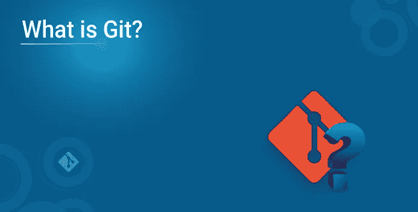
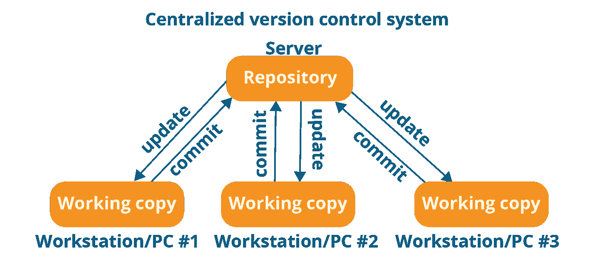
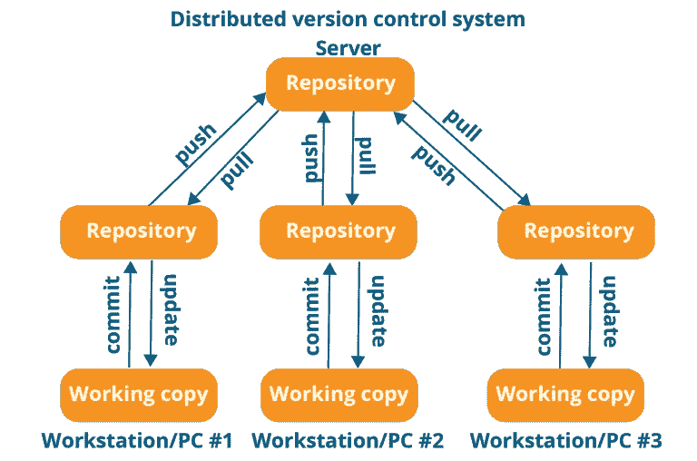
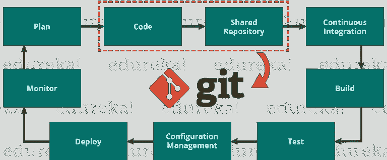
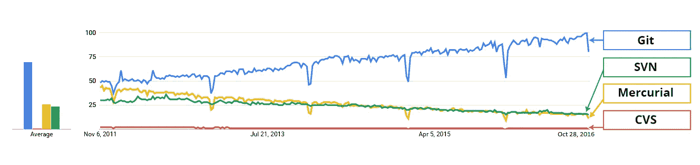

# Git 是什么？—探索分布式版本控制工具

> 原文：<https://medium.com/edureka/what-is-git-d7267d658069?source=collection_archive---------2----------------------->

Git 是一个免费的开源分布式版本控制系统工具，旨在快速高效地处理从小到大的各种项目。它是由 Linus Torvalds 在 2005 年创建的，用于开发 Linux 内核。Git 拥有大多数团队和个人开发人员需要的功能、性能、安全性和灵活性。它也是一个重要的分布式版本控制工具*。*

*在这篇“什么是 Git”的博客中，您将了解到:*

*   *Git 为什么会存在？*
*   *Git 是什么？*
*   *Git 的特性*
*   *Git 如何在 DevOps 中起到至关重要的作用？*
*   *微软和其他公司如何使用 Git*

# *什么是 Git——为什么 Git 会出现？*

*我们都知道“需要是所有发明之母”。同样，Git 的发明也是为了满足开发人员在使用 Git 之前所面临的某些需求。*

# *Git 的目的是什么？*

*Git 主要用于管理您的项目，包括一组可能会改变的代码/文本文件。*

*但是在我们深入之前，让我们后退一步来了解一下版本控制系统(VCS)以及 Git 是如何出现的。*

*版本控制是对文档、计算机程序、大型网站和其他信息集合的更改的管理。*

## *VCS 有两种类型:*

*   *集中式版本控制系统(CVCS)*
*   *分布式版本控制系统(DVCS)*

***集中版本控制系统(CVCS)***

*集中式版本控制系统(CVCS)使用中央服务器来存储所有文件并支持团队协作。它在单个存储库上工作，用户可以直接访问中央服务器。*

*请参考下图，更好地了解 CVCS:*

**

*上图中的存储库表示一个中央服务器，它可以是本地的，也可以是远程的，直接连接到每个程序员的工作站。*

*每个程序员都可以用存储库中的数据提取或更新他们的工作站，或者修改存储库中的数据或提交。每个操作都是直接在存储库上执行的。*

*尽管维护单个存储库看起来非常方便，但是它有一些主要的缺点。其中一些是:*

*   *它在本地不可用；这意味着您总是需要连接到网络才能执行任何操作。*
*   *由于一切都是集中的，在任何情况下，中央服务器崩溃或损坏将导致项目的全部数据丢失。*

*这是分布式 VCS 来拯救。*

***分布式 VCS***

*这些系统不一定依赖中央服务器来存储项目文件的所有版本。*

*在分布式 VCS 中，每个贡献者都有主存储库的本地副本或“克隆”，即每个人都维护他们自己的本地存储库，其中包含主存储库中存在的所有文件和元数据。*

*参考下图，你会更好地理解它:*

**

*正如您在上面的图表中所看到的，每个程序员都维护着自己的本地存储库，这实际上是他们硬盘上的中央存储库的拷贝或克隆。他们可以不受任何干扰地提交和更新他们的本地存储库。*

*他们可以通过名为“ **pull** ”的操作用来自中央服务器的新数据更新他们的本地存储库，并通过名为“ **push** 的操作从他们的本地存储库影响对主存储库的更改。*

*将整个存储库克隆到您的工作站以获得本地存储库的行为具有以下优势:*

*   *所有操作(除了推和拉)都非常快，因为该工具只需要访问硬盘驱动器，而不是远程服务器。因此，您并不总是需要互联网连接。*
*   *提交新的变更集可以在本地完成，而不需要操作主存储库上的数据。一旦您准备好了一组变更集，您就可以一次将它们全部推入。*
*   *由于每个贡献者都有项目存储库的完整副本，如果他们想在影响主存储库中的变更之前获得一些反馈，他们可以彼此共享变更。*
*   *如果中央服务器在任何时候崩溃，丢失的数据可以很容易地从贡献者的任何一个本地存储库中恢复。*

*了解了分布式 VCS 之后，是时候深入了解什么是 Git 了。*

# *Git 是什么？*

*Git 是一个分布式版本控制工具，它通过为开发高质量软件提供数据保证来支持分布式非线性工作流。在你继续之前，看看 GIT 上的这个视频，它会让你有更好的视野*

*Git 为前面提到的用户提供了所有分布式 VCS 设施。Git 存储库很容易找到和访问。当您体验下面提到的特性时，您会知道 Git 与您的系统是多么的灵活和兼容:*

# *什么是 Git——Git 的特性*

***可伸缩:**
Git 的可伸缩性非常好。所以，如果将来合作者的数量增加，Git 可以轻松应对这种变化。虽然 Git 代表了一个完整的存储库，但是存储在客户端的数据非常少，因为 Git 通过无损压缩技术压缩了所有的巨大数据。*

***安全:**
Git 使用 ***SHA1*** (安全散列函数)来命名和标识其存储库中的对象。在签出时，每个文件和提交都通过其校验和进行校验和检索。Git 历史以这样的方式存储，特定版本的 ID(Git 术语中的*提交*)依赖于导致该提交的完整开发历史。一旦发布，就不可能在不被注意到的情况下更改旧版本。*

*经济实惠:
在 CVCS，中央服务器需要足够强大来满足整个团队的请求。对于较小的团队来说，这不是问题，但是随着团队规模的增长，服务器的硬件限制可能会成为性能瓶颈。在 DVCS 的情况下，开发人员不与服务器交互，除非他们需要推或拉改变。所有繁重的工作都发生在客户端，所以服务器硬件可以非常简单。*

***支持非线性开发:**
Git 支持快速分支和合并，并包括用于可视化和导航非线性开发历史的特定工具。Git 中的一个核心假设是，一个变更被合并的次数要比它被编写的次数多，因为它被传递给不同的评审者。Git 中的分支非常轻量级。Git 中的分支只是对单个提交的引用。有了父提交，就可以构建完整的分支结构。*

***可靠:**
由于每个贡献者都有自己的本地存储库，所以在系统崩溃时，丢失的数据可以从任何本地存储库中恢复。你的所有文件都会有备份。*

***轻松分支:**
用 Git 进行分支管理非常简单。创建、删除和合并分支只需几秒钟。特性分支为您的代码库的每次更改提供了一个隔离的环境。当一个开发人员想要开始做某件事情时，不管是大是小，他们都会创建一个新的分支。这确保了主分支总是包含生产质量代码。*

***免费开源:**
Git 是在 GPL(通用公共许可证)开源许可下发布的。你不需要购买 Git。它是绝对免费的。因为它是开源的，你可以根据自己的需要修改源代码。*

***分布式开发:**
Git 给每个开发人员一个整个开发历史的本地副本，变更从一个这样的库复制到另一个。这些变更作为附加的开发分支被导入，并且可以以与本地开发分支相同的方式被合并。*

***与现有系统或协议**
的兼容性储存库可以通过 http、ftp 或 Git 协议在普通套接字或 ssh 上发布。Git 还有一个并发版本系统(CVS)服务器仿真，它支持使用现有的 CVS 客户端和 IDE 插件来访问 Git 存储库。Apache SubVersion (SVN)和 SVK 库可以直接用于 Git-SVN。*

# *什么是 Git——Git 在 DevOps 中的作用？*

*现在你知道什么是 Git 了，你应该知道 Git 是 DevOps 不可或缺的一部分。*

*DevOps 是将敏捷性引入开发和运营过程的实践。这是一种全新的意识形态，已经席卷了全世界的 It 组织，促进了项目的生命周期，从而增加了利润。DevOps 促进开发工程师和运营部门之间的沟通，共同参与整个服务生命周期，从设计到开发流程再到生产支持。*

*下图描述了 DevOps 的生命周期，并展示了 Git 如何适应 DevOps。*

**

*上图显示了 DevOps 的整个生命周期，从规划项目到部署和监控。在管理协作者贡献给共享存储库的代码时，Git 起着至关重要的作用。然后提取这些代码来执行持续集成，以创建一个构建，并在测试服务器上测试它，最终将其部署到生产环境中。*

*像 Git 这样的工具支持开发和操作团队之间的交流。当您开发一个有大量协作者的大型项目时，在项目中进行更改时，协作者之间的交流非常重要。Git 中的提交消息在团队交流中扮演着非常重要的角色。我们部署的零碎东西都存在于 Git 这样的版本控制系统中。为了在 DevOps 中取得成功，您需要在版本控制中拥有所有的通信。因此，Git 在 DevOps 的成功中起着至关重要的作用。*

# *谁用 Git？—使用 Git 的热门公司*

*与市场上的其他版本控制工具相比，Git 更受欢迎，比如 Apache Subversion(SVN)、Concurrent Version Systems(CVS)、Mercurial 等。您可以通过下面从 *Google Trends* 收集的图表来比较 Git 与其他版本控制工具在时间上的兴趣:*

**

*在大公司中，产品通常由分布在世界各地的开发人员开发。为了实现它们之间的通信，Git 是解决方案。*

*使用 Git 进行版本控制的公司有脸书、雅虎、Zynga、Quora、Twitter、易贝、Salesforce、微软等等。*

*最近，微软所有的新开发工作都在 Git 特性上。微软正在迁移。NET 及其 GitHub 上由 Git 管理的许多开源项目。*

*其中一个项目是 LightGBM。它是一个基于决策树算法的快速、分布式、高性能梯度提升框架，用于排序、分类和许多其他机器学习任务。*

*在这里，Git 通过提供速度和准确性，在管理这个 LightGBM 分布式版本中扮演着重要的角色。*

# *热门问题:*

## *Git 和 GitHub 有什么区别？*

**Git 只是一个版本控制系统，管理和跟踪你的源代码的变化，而 GitHub 是一个基于云的托管平台，管理你所有的 Git 库。**

## *为什么 Git 这么受欢迎？*

*Git 是一个分布式版本控制系统(VCS ),使开发人员能够离线管理变更，并允许您在需要时进行分支和合并，让他们完全控制本地代码库。它速度很快，也适合处理分散在多个开发人员中的大量代码库，这使它成为最受欢迎的工具。*

*这是我关于 Nagios 面试问题的文章的结尾。如果你想查看更多关于人工智能、Python、道德黑客等市场最热门技术的文章，你可以参考 [Edureka 的官方网站。](https://www.edureka.co/blog/?utm_source=medium&utm_medium=content-link&utm_campaign=what-is-git)*

*请留意本系列中的其他文章，它们将解释 DevOps 的各个方面。*

> **1。* [*DevOps 教程*](/edureka/devops-tutorial-89363dac9d3f)*
> 
> **2。* [*Git 教程*](/edureka/git-tutorial-da652b566ece)*
> 
> **3。* [*詹金斯教程*](/edureka/jenkins-tutorial-68110a2b4bb3)*
> 
> **4。* [*Docker 教程*](/edureka/docker-tutorial-9a6a6140d917)*
> 
> **5。* [*Ansible 教程*](/edureka/ansible-tutorial-9a6794a49b23)*
> 
> **6。* [*木偶教程*](/edureka/puppet-tutorial-848861e45cc2)*
> 
> **7。* [*厨师教程*](/edureka/chef-tutorial-8205607f4564)*
> 
> **8。* [*Nagios 教程*](/edureka/nagios-tutorial-e63e2a744cc8)*
> 
> **9。* [*如何编排 DevOps 工具？*](/edureka/devops-tools-56e7d68994af)*
> 
> **10。* [*连续交货*](/edureka/continuous-delivery-5ca2358aedd8)*
> 
> **11。* [*持续集成*](/edureka/continuous-integration-615325cfeeac)*
> 
> **12。* [*连续部署*](/edureka/continuous-deployment-b03df3e3c44c)*
> 
> **13。* [*持续交付 vs 持续部署*](/edureka/continuous-delivery-vs-continuous-deployment-5375642865a)*
> 
> **14。* [*CI CD 管道*](/edureka/ci-cd-pipeline-5508227b19ca)*
> 
> *15。 [*码头工人撰写*](/edureka/docker-compose-containerizing-mean-stack-application-e4516a3c8c89)*
> 
> *16。 [*码头工人群*](/edureka/docker-swarm-cluster-of-docker-engines-for-high-availability-40d9662a8df1)*
> 
> **17。* [*Docker 联网*](/edureka/docker-networking-1a7d65e89013)*
> 
> **18。* [*天穹*](/edureka/ansible-vault-secure-secrets-f5c322779c77)*
> 
> *19。 [*可变角色*](/edureka/ansible-roles-78d48578aca1)*
> 
> *20。 [*适用于 AWS*](/edureka/ansible-for-aws-provision-ec2-instance-9308b49daed9)*
> 
> **21。* [*詹金斯管道*](/edureka/jenkins-pipeline-tutorial-continuous-delivery-75a86936bc92)*
> 
> **22。* [*顶级 Docker 命令*](/edureka/docker-commands-29f7551498a8)*
> 
> **23。*[*Git vs GitHub*](/edureka/git-vs-github-67c511d09d3e)*
> 
> **24。* [*顶级 Git 命令*](/edureka/git-commands-with-example-7c5a555d14c)*
> 
> **25。* [*DevOps 面试问题*](/edureka/devops-interview-questions-e91a4e6ecbf3)*
> 
> **26。* [*谁是 DevOps 工程师？*](/edureka/devops-engineer-role-481567822e06)*
> 
> **27。* [*DevOps 生命周期*](/edureka/devops-lifecycle-8412a213a654)*
> 
> **28。*[*Git Reflog*](/edureka/git-reflog-dc05158c1217)*
> 
> **29。**
> 
> ***三十。* [*组织正在寻找的顶尖 DevOps 技能*](/edureka/devops-skills-f6a7614ac1c7)**
> 
> ***30。* [*瀑布 vs 敏捷*](/edureka/waterfall-vs-agile-991b14509fe8)**
> 
> ***31。* [*詹金斯小抄*](/edureka/jenkins-cheat-sheet-e0f7e25558a3)**
> 
> ***32。***
> 
> ***33。 [*Ansible 面试问答*](/edureka/ansible-interview-questions-adf8750be54)***
> 
> ***34。 [*50 Docker 面试问题*](/edureka/docker-interview-questions-da0010bedb75)***
> 
> ***35。 [*敏捷方法论*](/edureka/what-is-agile-methodology-fe8ad9f0da2f)***
> 
> ****36。* [*詹金斯面试问题*](/edureka/jenkins-interview-questions-7bb54bc8c679)***
> 
> ***37。 [*Git 面试问题*](/edureka/git-interview-questions-32fb0f618565)***
> 
> ***38。 [*Docker 架构*](/edureka/docker-architecture-be79628e076e)***
> 
> ***39。[*devo PS 中使用的 Linux 命令*](/edureka/linux-commands-in-devops-73b5a2bcd007)***
> 
> ****40。* [*詹金斯 vs 竹子*](/edureka/jenkins-vs-bamboo-782c6b775cd5)***
> 
> ****41。* [*Nagios 教程*](/edureka/nagios-tutorial-e63e2a744cc8)***
> 
> ****42。* [*Nagios 面试问题*](/edureka/nagios-interview-questions-f3719926cc67)***
> 
> ****43。* [*DevOps 实时场景*](/edureka/jenkins-x-d87c0271af57)***
> 
> ****44。* [*詹金斯和詹金斯 X 的区别*](/edureka/jenkins-vs-bamboo-782c6b775cd5)***
> 
> ****45。*[*Docker for Windows*](/edureka/docker-for-windows-ed971362c1ec)***
> 
> ****46。*T80*Git vs Github****

****原载于 2016 年 11 月 16 日*[*https://www.edureka.co*](https://www.edureka.co/blog/what-is-git/)*。****