# 什么是谷歌云平台(GCP)？—GCP 服务和 GCP 客户简介

> 原文：<https://medium.com/edureka/what-is-google-cloud-platform-a6c270f8c2fc?source=collection_archive---------4----------------------->

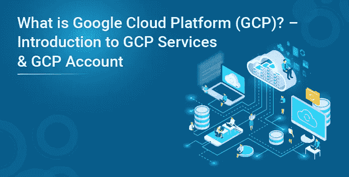

近年来，云计算市场出人意料地增长。目前市场上有许多云提供商，如 VM Ware、Amazon Web Services、Google Cloud Platform、Microsoft Azure、IBM Cloud 等等。根据 Gartner 的预测，2018 年全球公共云服务市场将从 2017 年的 1460 亿美元增长到 1780 亿美元，并将继续以 22%的复合年增长率(CAGR)增长。所以让我们从什么是谷歌云平台的博客开始。

在这篇博客中，我们将讨论以下主题:

*   什么是谷歌云平台(GCP)？
*   什么是云计算？
*   为什么选择谷歌云平台？
*   GCP 地区和区域
*   谷歌云平台服务
*   创建自由层 GCP 账户

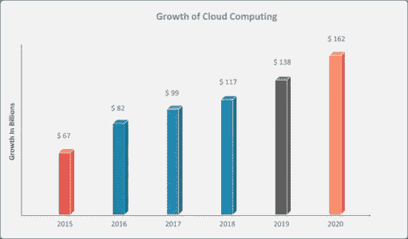

# 什么是谷歌云平台(GCP)？

谷歌云平台是由谷歌提供的一套计算、网络、存储、大数据、机器学习和管理服务，运行在谷歌内部用于其最终用户产品的相同云基础设施上，如谷歌搜索、Gmail、谷歌照片和 YouTube。

你可以浏览这个谷歌云提供商视频讲座，我们的 GCP 培训专家会讨论每一个技术细节。

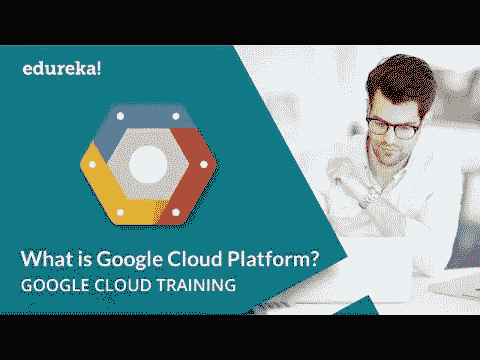

所以在深入了解谷歌云平台的细节之前，我们先来了解一下云计算。

# 什么是云计算？

云计算是指通过互联网借助云服务平台按需交付计算能力、数据库存储、应用程序和其他 IT 资源，采用随用随付的价格。它是使用互联网上的远程服务器来存储、管理和处理数据，而不是本地服务器或你的个人电脑。

云计算使公司能够避免或最大限度地减少前期 it 基础设施成本，以保持其应用程序更快地启动和运行，同时提高可管理性并减少维护，并且使 IT 团队能够快速调整资源，以满足波动和不可预测的需求。

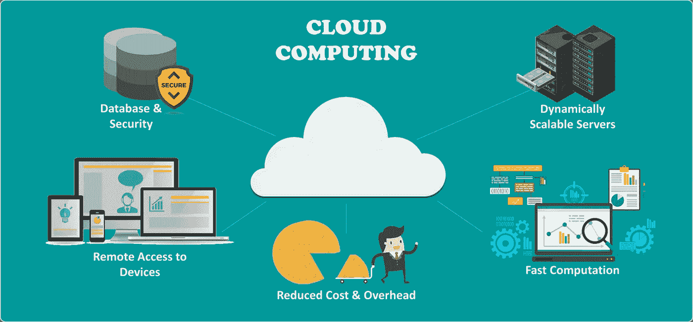

云计算提供商根据不同的模型提供服务，其中 NIST(美国国家标准与技术研究所)的三个标准模型是:

*   基础设施即服务(IaaS)
*   平台即服务(PaaS)，以及
*   软件即服务(SaaS)

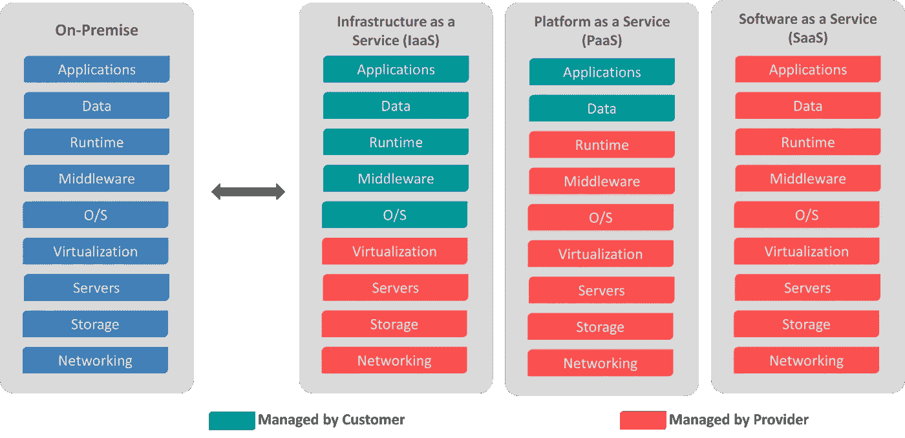

# 为什么选择谷歌云平台？

现在你已经对什么是谷歌云平台和云计算有了一个简单的概念，让我们来理解为什么你一定要去追求它。谷歌云平台是一套云计算服务，运行在谷歌内部为其最终用户产品(如谷歌搜索、Gmail、谷歌照片和 YouTube)使用的同一基础设施上。我们都知道 Gmail，Youtube，Google 搜索的数据库有多大。

而且我也不认为近几年，谷歌的服务器有下降的趋势。这是世界上最大的公司之一，所以信任他们似乎是一个显而易见的选择，对吗？

所以现在来看看 GCP 的一些真正让它比其他厂商占优势的特性。

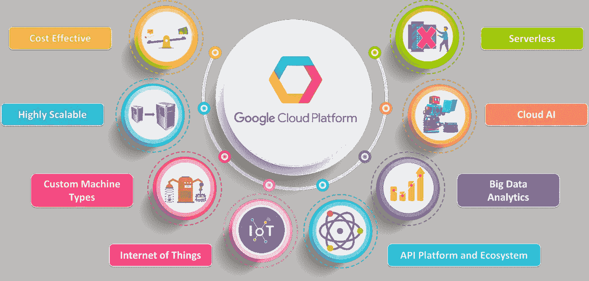

# 谷歌云平台区域和专区

谷歌云平台服务在北美、南美、欧洲、亚洲和澳大利亚的许多地方都可以使用。这些位置被分成区域和地带。您可以选择放置应用程序的位置，以满足您的延迟、可用性和持久性要求。

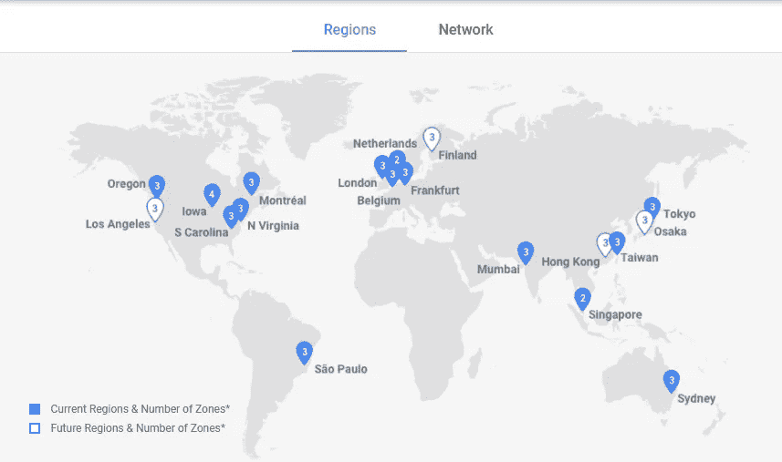

# 什么是谷歌云平台(GCP)服务？

谷歌提供广泛的服务。以下是主要的谷歌云服务:

*   计算
*   建立工作关系网
*   存储和数据库
*   大数据
*   机器学习
*   身份和安全性
*   管理和开发工具

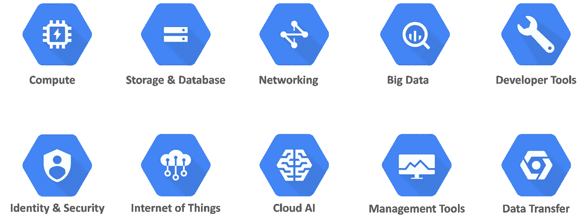

**计算:** GCP 提供了一系列可扩展的计算选项，您可以根据自己的需求进行定制。它提供高度可定制的虚拟机。以及直接或通过容器部署代码的选项。

*   谷歌计算引擎
*   谷歌应用引擎
*   谷歌 Kubernetes 引擎
*   谷歌云容器注册中心
*   云函数

**联网:**存储域包括与**联网**相关的服务，包括以下服务

*   谷歌虚拟私有云(VPC)
*   谷歌云负载平衡
*   内容交付网络
*   谷歌云互联
*   谷歌云域名系统

**存储和数据库:**存储域包括与数据相关的服务**存储**，它包括以下服务

*   谷歌云存储
*   云 SQL
*   云大表
*   谷歌云数据存储
*   永久磁盘

**大数据:**存储领域包括与大数据相关的服务，它包括以下服务

*   谷歌大查询
*   谷歌云数据平台
*   谷歌云数据实验室
*   谷歌云发布/订阅

**云 AI:** 存储领域包括与机器学习相关的服务，它包括以下服务

*   云机器学习
*   视觉 API
*   语音 API
*   自然语言 API
*   翻译 API
*   作业 API

**身份&安全:**存储域包括与安全相关的服务，它包括以下服务

*   谷歌虚拟私有云(VPC)
*   谷歌云负载平衡
*   内容交付网络
*   谷歌云互联
*   谷歌云域名系统

**管理工具:**存储域包括与监控和管理相关的服务，它包括以下服务

*   谷歌云存储
*   云 SQL
*   云大表
*   谷歌云数据存储
*   永久磁盘

**开发者工具:**存储领域包括与开发相关的服务，包括以下服务

*   云 SDK
*   部署经理
*   云资源存储库
*   云测试实验室

现在我们已经了解了什么是谷歌云平台，要获得这些服务，你只需要在 GCP 上创建一个免费账户。你可以获得价值 300 美元的信用额度，在 12 个月内使用。您需要提供您的卡的详细信息，但在试用期结束后或您用完 300 美元的信用额度后，将不会向您收取额外费用。

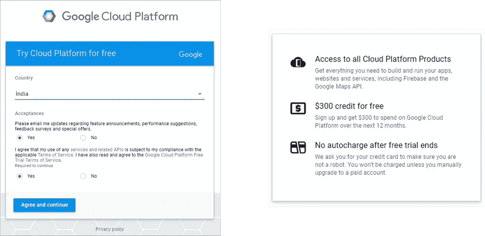

创建帐户后。转到控制台。

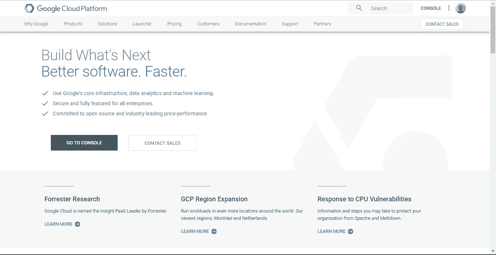

在这里，您将有一个仪表板，提供您正在使用的 GCP 服务的摘要，以及统计和计费报告。

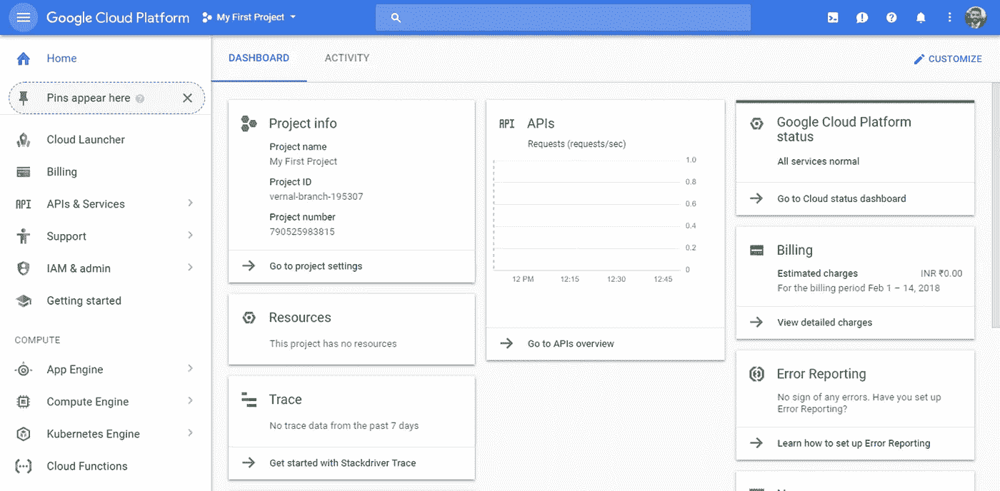

在谷歌云平台的这一部分，您可以找到以下内容的汇总视图:

*   项目信息
*   正在使用的资源
*   各种 API 正在运行
*   计算引擎(CPU 使用率%)
*   谷歌云平台状态
*   每个项目的服务计费
*   错误报告
*   数据跟踪
*   教程
*   关于谷歌云平台的新闻和更新
*   证明文件

就这样了，伙计们！

我希望你喜欢这个什么是谷歌云平台的博客。如果你正在读这篇文章，那么恭喜你！你不再是 GCP 的新手。

如果你想查看更多关于市场最流行技术的文章，你可以参考 Edureka 的官方网站。

有问题吗？请在评论区提到它，我们会给你回复。

原 p *发布于 2018 年 3 月 6 日*[*【https://www.edureka.co】*](https://www.edureka.co/blog/what-is-google-cloud-platform/)*。*