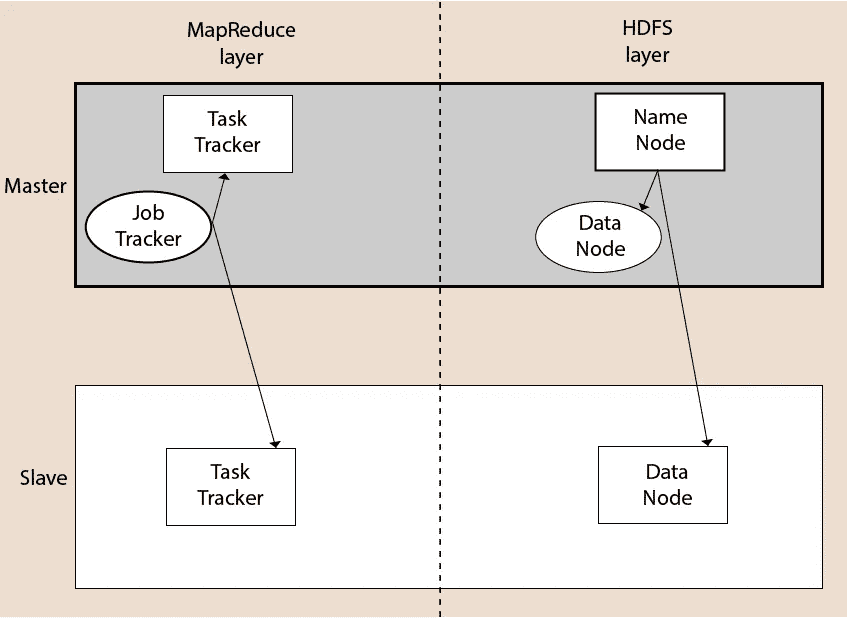
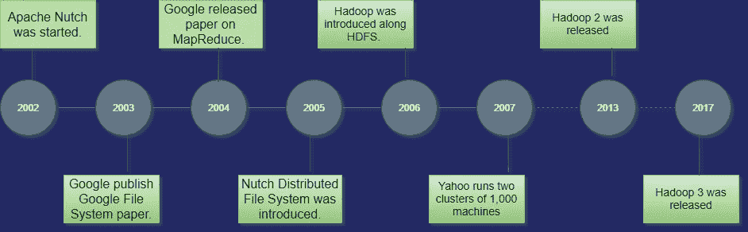

# 什么是 Hadoop 以及 Hadoop 的模块？完整概述。

> 原文：<https://medium.com/quick-code/what-is-hadoop-and-modules-of-hadoop-complete-overview-2d0b501982e2?source=collection_archive---------1----------------------->

Hadoop 是 Apache 的一个开源框架，用于存储和分析海量数据。Hadoop 是用 Java 写的，不是 OLAP(在线分析处理)。它用于批处理/离线处理。它被脸书、雅虎、谷歌、推特、LinkedIn 和许多其他公司使用。此外，它可以通过在集群中添加节点来进行扩展。

# Hadoop 的模块

1.  **HDFS:** Hadoop 分布式文件系统。谷歌发表了论文 GFS，并在此基础上开发了 HDFS。它声明文件将被分成块并存储在分布式体系结构的节点中。更多关于 [**Hadoop Admin 认证**](https://onlineitguru.com/hadoop-online-training-placement.html) 的附加信息
2.  另一个资源协商器用于作业调度和管理集群。
3.  **Map Reduce:** 这是一个帮助 Java 程序使用键值对对数据进行并行计算的框架。Map 任务获取输入数据，并将其转换为可以在键值对中计算的数据集。Map 任务的输出被 reduce 任务消耗，然后 reducer 的输出给出期望的结果。
4.  **Hadoop 常用:**这些 Java 库用于启动 Hadoop，并被其他 Hadoop 模块使用。

# Hadoop 架构

Hadoop 架构是文件系统、MapReduce 引擎和 HDFS (Hadoop 分布式文件系统)的一个包。MapReduce 引擎可以是 MapReduce/MR1 或 YARN/MR2。

Hadoop 集群由一个主节点和多个从节点组成。主节点包括作业跟踪器、任务跟踪器、NameNode 和 DataNode，而从节点包括 DataNode 和 Task Tracker。

# Hadoop 分布式文件系统

Hadoop 分布式文件系统(HDFS)是一个用于 Hadoop 的分布式文件系统。它包含一个主/从架构。这种架构由单个 NameNode 执行主节点的角色，多个 DataNodes 执行从节点的角色组成。

NameNode 和 DataNode 都能够在商用机器上运行。Java 语言用于开发 HDFS。所以任何支持 Java 语言的机器都可以轻松运行 NameNode 和 DataNode 软件。

# NameNode

*   它是 HDFS 集群中的一台主服务器。
*   由于是单个节点，可能会成为单点故障的原因。
*   它通过执行打开、重命名和关闭文件等操作来管理文件系统名称空间。
*   它简化了系统的架构。

# DataNode

*   HDFS 集群包含多个 DataNodes。
*   每个 DataNode 包含多个数据块。
*   这些数据块用于存储数据。
*   DataNode 负责从文件系统的客户端读取和写入请求。
*   它根据 NameNode 的指令执行块创建、删除和复制。

# 工作跟踪

*   作业跟踪器的作用是接受来自客户端的 MapReduce 作业，并使用 NameNode 处理数据。
*   作为响应，NameNode 向作业跟踪器提供元数据。

# 任务跟踪器

*   它作为工作跟踪器的从节点。
*   它从作业跟踪器接收任务和代码，并将该代码应用于文件。这个过程也可以称为映射器。

# MapReduce 层

当客户端应用程序将 MapReduce 作业提交给作业跟踪器时，MapReduce 就出现了。作为响应，作业跟踪器将请求发送给适当的任务跟踪器。有时，TaskTracker 会失败或超时。在这种情况下，该部分作业将被重新安排。

# Hadoop 的优势

*   **快速:**在 HDFS 中，数据分布在集群中并被映射，这有助于更快地检索。甚至处理数据的工具也经常在相同的服务器上，因此减少了处理时间。它能够在几分钟内处理万亿字节的数据，在几小时内处理千万亿字节的数据。
*   **可扩展:** Hadoop 集群可以通过在集群中添加节点来扩展。
*   **经济高效:** Hadoop 是开源的，使用商用硬件来存储数据，因此与传统的关系数据库管理系统相比，它确实经济高效。
*   **故障恢复能力:** HDFS 具有能够通过网络复制数据的特性，因此，如果一个节点出现故障或发生其他网络故障，Hadoop 会获取另一份数据并使用它。通常情况下，数据会复制三次，但复制因子是可配置的。

# Hadoop 的历史

Hadoop 是由 Doug Cutting 和 Mike Cafarella 在 2002 年创建的。它的起源是 Google 发布的 Google 文件系统论文。

让我们通过以下步骤来关注 Hadoop 的历史

*   2002 年，Doug Cutting 和 Mike Cafarella 开始了一个项目，Apache Nutch。是一个开源的网络爬虫软件项目。
*   在开发 Apache Nutch 时，他们在处理大数据。为了存储这些数据，他们不得不花费大量成本，这也是该项目的后果。这个问题成为 Hadoop 出现的重要原因之一。
*   2003 年，谷歌推出了一个名为 GFS(谷歌文件系统)的文件系统。它是一个专有的分布式文件系统，旨在提供高效的数据访问。
*   2004 年，谷歌发布了一份关于 Map Reduce 的白皮书。这种技术简化了大型集群的数据处理。
*   2005 年，Doug Cutting 和 Mike Cafarella 推出了一种新的文件系统，称为 NDFS (Nutch 分布式文件系统)。这个文件系统还包括 Map reduce。
*   2006 年，道格·卡丁(Doug Cutting)离开谷歌，加入雅虎。在 Nutch 项目的基础上，面团切割引入了一个新的项目 Hadoop，其文件系统被称为 HDFS (Hadoop 分布式文件系统)。Hadoop 首个版本 0.1.0 于今年发布。
*   Doug Cutting 以他儿子的玩具大象命名了他的项目 Hadoop。
*   2007 年，雅虎运行两个 1000 台机器的集群。
*   2008 年，Hadoop 成为在 209 秒内对 900 节点集群上的 1tb 数据进行排序的最快系统。
*   2013 年，Hadoop 2.2 发布。
*   2017 年，Hadoop 3.0 发布。更多 [**Hadoop 管理员在线培训**](https://onlineitguru.com/hadoop-online-training-placement.html)