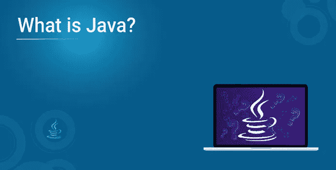
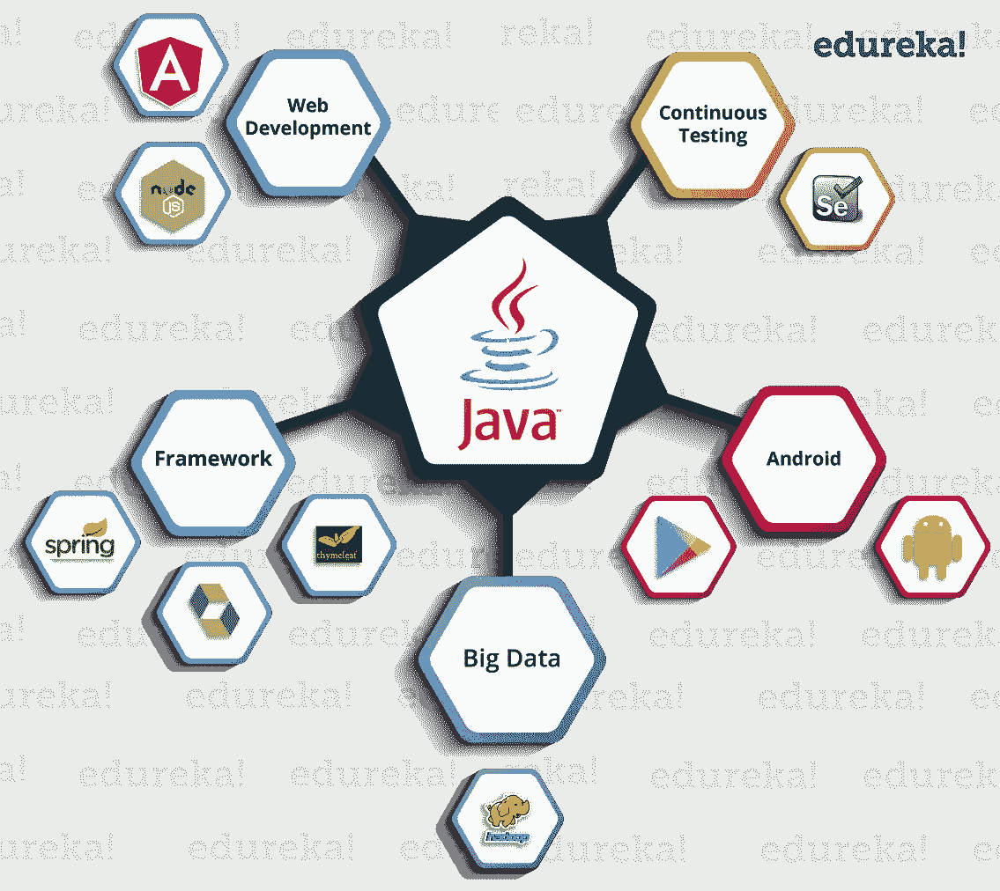

# Java 是什么？Java 及其发展的初学者指南

> 原文：<https://medium.com/edureka/what-is-java-36be53c03cf1?source=collection_archive---------1----------------------->

Java 是一种跨平台的面向对象编程语言，由 Sun Microsystems 于 1995 年发布。如今，Java 需要运行各种应用程序，如游戏、社交媒体应用程序、音频和视频应用程序等。

在这篇博客中，我将涉及以下主题:

*   Java 是用来做什么的？
*   历史
*   Java 是什么？
*   特征
*   成分

# Java 是用来做什么的？

在我继续之前，让我简单介绍一下为什么应该选择 Java。它非常受欢迎，从 2000 年代初到现在的 2018 年一直主导着这一领域。

下面列出了一些应用程序:

*   **银行**:处理交易管理。
*   **零售**:你在商店/餐厅看到的账单应用程序完全是用 Java 编写的。
*   **信息技术** : Java 旨在解决实现依赖。
*   **Android** :应用要么用 Java 写，要么用 Java API。
*   **金融服务**:用于服务器端应用。
*   **股票市场**:编写他们应该投资哪家公司的算法。
*   **大数据** : Hadoop MapReduce 框架使用 Java 编写。
*   **科研界**:处理海量数据。

***等等！Java 能做的更多。***

让我们看看一些技术如何利用 Java 作为其功能的核心。

让我们看看一些技术如何利用 Java 作为其功能的核心。

在上图中你可以看到，Java 是一个 ***的机会海洋*** 。

让我们来看看 Java 的简史。

# 历史

Java 是由**詹姆斯** **高斯林**与其他团队成员名为**迈克·谢里丹**和**帕特里克·诺顿**开发的一种编程语言，在 **1995** 为**太阳微系统**开发用于数字设备，如机顶盒、电视等。现在，让我们详细探讨一下这种语言。

# Java 是什么？

它是一种类似于 C++的面向对象语言，但是具有高级和简化的特性。该语言**可以自由访问**并且**可以在**所有平台**上运行**。

*   **并发**可以执行许多语句，而不是顺序执行。
*   **基于类的**和一种**面向对象的**编程语言。
*   **独立的**编程语言，遵循“**一次编写，随处运行**的逻辑，即编译后的代码可以在所有支持 java 的平台上运行。

简单来说，它是一个计算平台，您可以在其中开发应用程序。

# 特征

**简单:** Java 消除了所有的复杂性，如 C++或任何其他编程语言中的指针、操作符重载，让生活变得更加简单。

**可移植性:**这是独立于平台的，这意味着在一个平台上编写的任何应用程序都可以很容易地移植到另一个平台上。

**安全:**所有的代码在编译后都被转换成**字节码**，人类无法阅读。java 不使用显式指针，而是在沙箱内运行程序来防止来自不可信来源的任何活动。它使我们能够开发无病毒、无篡改的系统/应用程序。

**动态:**它能够适应支持动态内存分配的不断发展的环境，从而减少内存浪费并提高应用程序的性能。

**分布式:**这种语言提供了帮助创建分布式应用程序的特性。使用远程方法调用(RMI)，一个程序可以通过网络调用另一个程序的方法并获得输出。您可以通过从 internet 上的任何计算机调用这些方法来访问文件。

**高性能:** Java 通过使用字节码来实现高性能，字节码可以很容易地翻译成本机代码。通过使用 JIT(实时)编译器，它实现了高性能。

**解释:** Java 被编译成字节码，由运行时环境解释。

**多线程:** Java 支持执行的多线程(也称为轻量级进程)，包括一组同步原语。这使得用线程编程更加容易。

# 成分

**JVM (Java 虚拟机)**

它是一台抽象的机器。它是一个提供运行时环境的规范，字节码可以在这个环境中执行。它遵循三种符号:

*   规范:描述 JVM 实现的文档。它是由 Sun 和其他公司提供的。
*   **实现**:是符合 JVM 规范要求的程序。
*   **运行时实例**:每当您在命令提示符下编写命令并运行该类时，就会创建一个 JVM 实例。

**JRE (Java 运行时环境)**

JRE 指的是可以执行字节码的运行时环境。它实现了 JVM，并提供了 JVM 在运行时使用的所有类库和其他支持文件。所以 JRE 是一个软件包，包含了运行一个程序所需要的东西。基本上，它是物理上存在的 JVM 的一个实现。

**JDK(Java 开发工具包)**

这是必要的工具:-

*   编制
*   文件
*   打包 Java 程序。

JDK 完全包括 JRE，其中包含程序员工具。开发套件是免费提供的。除了 JRE，它还包括一个解释器/加载器、一个编译器(javac)、一个归档器(jar)、一个文档生成器以及 Java 开发中需要的其他工具。简而言之，它包含了 JRE +开发工具。

您将看到您的应用程序正在工作。通过打开“文件”窗口，然后展开目标节点，可以看到构建输出。
如果你想查看更多关于人工智能、DevOps、道德黑客等市场最热门技术的文章，你可以参考 [Edureka 的官方网站。](https://www.edureka.co/blog/?utm_source=medium&utm_medium=content-link&utm_campaign=what-is-java)

请留意本系列中解释 Java 其他各方面的其他文章。

> *1。* [*面向对象编程*](/edureka/object-oriented-programming-b29cfd50eca0)
> 
> *2。*[*Java 中的继承*](/edureka/inheritance-in-java-f638d3ed559e)
> 
> *3。*[*Java 中的多态性*](/edureka/polymorphism-in-java-9559e3641b9b)
> 
> *4。*[*Java 中的抽象*](/edureka/java-abstraction-d2d790c09037)
> 
> *5。* [*Java 字符串*](/edureka/java-string-68e5d0ca331f)
> 
> *6。* [*Java 数组*](/edureka/java-array-tutorial-50299ef85e5)
> 
> *7。* [*Java 收藏*](/edureka/java-collections-6d50b013aef8)
> 
> *8。* [*Java 线程*](/edureka/java-thread-bfb08e4eb691)
> 
> *9。*[*Java servlet 简介*](/edureka/java-servlets-62f583d69c7e)
> 
> *10。* [*Servlet 和 JSP 教程*](/edureka/servlet-and-jsp-tutorial-ef2e2ab9ee2a)
> 
> *11。*[*Java 中的异常处理*](/edureka/java-exception-handling-7bd07435508c)
> 
> *12。* [*Java 教程*](/edureka/java-tutorial-bbdd28a2acd7)
> 
> 13。 [*Java 面试题*](/edureka/java-interview-questions-1d59b9c53973)
> 
> *14。* [*Java 程序*](/edureka/java-programs-1e3220df2e76)
> 
> *15。* [*科特林 vs 爪哇*](/edureka/kotlin-vs-java-4f8653f38c04)
> 
> 16。 [*依赖注入使用 Spring Boot*](/edureka/what-is-dependency-injection-5006b53af782)
> 
> 17。 [*堪比 Java 中的*](/edureka/comparable-in-java-e9cfa7be7ff7)
> 
> 18。 [*十大 Java 框架*](/edureka/java-frameworks-5d52f3211f39)
> 
> *19。* [*Java 反射 API*](/edureka/java-reflection-api-d38f3f5513fc)
> 
> *20。*[*Java 中的 30 大模式*](/edureka/pattern-programs-in-java-f33186c711c8)
> 
> *21。* [*核心 Java 备忘单*](/edureka/java-cheat-sheet-3ad4d174012c)
> 
> *22。*[*Java 中的套接字编程*](/edureka/socket-programming-in-java-f09b82facd0)
> 
> *23。* [*Java OOP 备忘单*](/edureka/java-oop-cheat-sheet-9c6ebb5e1175)
> 
> *24。*[*Java 中的注释*](/edureka/annotations-in-java-9847d531d2bb)
> 
> *25。*[*Java 中的库管理系统项目*](/edureka/library-management-system-project-in-java-b003acba7f17)
> 
> *26。*[*Java 中的树木*](/edureka/java-binary-tree-caede8dfada5)
> 
> *27。*[*Java 中的机器学习*](/edureka/machine-learning-in-java-db872998f368)
> 
> *28。* [*顶级数据结构&Java 中的算法*](/edureka/data-structures-algorithms-in-java-d27e915db1c5)
> 
> *29。* [*Java 开发者技能*](/edureka/java-developer-skills-83983e3d3b92)
> 
> *三十。* [*前 55 名 Servlet 面试问题*](/edureka/servlet-interview-questions-266b8fbb4b2d)
> 
> 31。 [*顶级 Java 项目*](/edureka/java-projects-db51097281e3)
> 
> *32。* [*Java 字符串备忘单*](/edureka/java-string-cheat-sheet-9a91a6b46540)
> 
> *33。*[*Java 中的嵌套类*](/edureka/nested-classes-java-f1987805e7e3)
> 
> 34。 [*Java 集合面试问答*](/edureka/java-collections-interview-questions-162c5d7ef078)
> 
> 35。[*Java 中如何处理死锁？*](/edureka/deadlock-in-java-5d1e4f0338d5)
> 
> 36。 [*你需要知道的 50 个 Java 合集面试问题*](/edureka/java-collections-interview-questions-6d20f552773e)
> 
> *37。*[*Java 中的字符串池是什么概念？*](/edureka/java-string-pool-5b5b3b327bdf)
> 
> *38。*[*C、C++和 Java 有什么区别？*](/edureka/difference-between-c-cpp-and-java-625c4e91fb95)
> 
> 39。[*Java 中的回文——如何检查一个数字或字符串？*](/edureka/palindrome-in-java-5d116eb8755a)
> 
> 40。 [*你需要知道的顶级 MVC 面试问答*](/edureka/mvc-interview-questions-cd568f6d7c2e)
> 
> *41。*[*Java 编程语言的十大应用*](/edureka/applications-of-java-11e64f9588b0)
> 
> *42。*[*Java 中的死锁*](/edureka/deadlock-in-java-5d1e4f0338d5)
> 
> *43。*[*Java 中的平方和平方根*](/edureka/java-sqrt-method-59354a700571)
> 
> *44。*[*Java 中的类型转换*](/edureka/type-casting-in-java-ac4cd7e0bbe1)
> 
> *45。*[*Java 中的运算符及其类型*](/edureka/operators-in-java-fd05a7445c0a)
> 
> *46。*[*Java 中的析构函数*](/edureka/destructor-in-java-21cc46ed48fc)
> 
> *47。*[*Java 中的二分搜索法*](/edureka/binary-search-in-java-cf40e927a8d3)
> 
> *48。*[*Java 中的 MVC 架构*](/edureka/mvc-architecture-in-java-a85952ae2684)
> 
> 49。 [*冬眠面试问答*](/edureka/hibernate-interview-questions-78b45ec5cce8)

*原载于 2017 年 4 月 19 日*[*https://www.edureka.co*](https://www.edureka.co/blog/what-is-java/)*。*