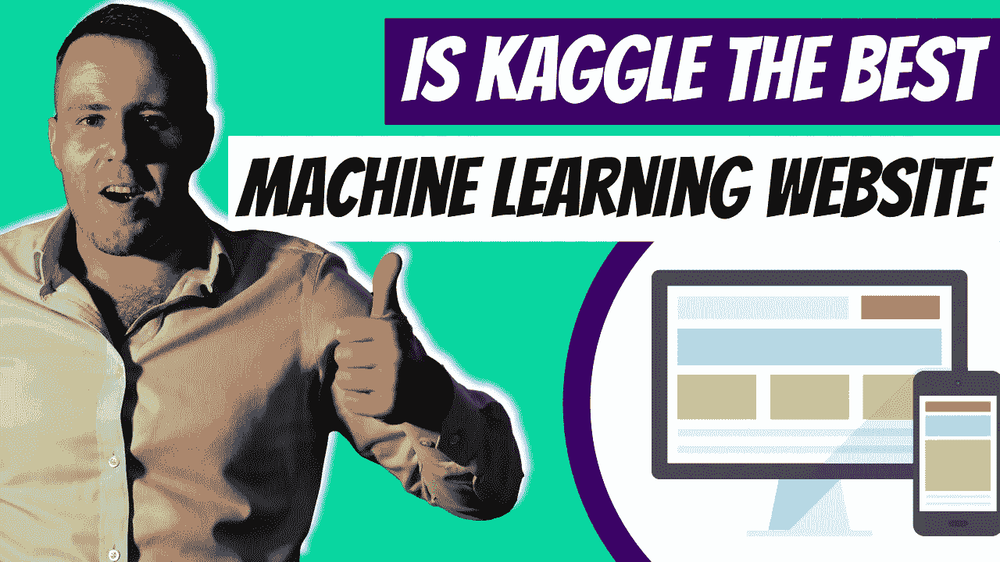

# 什么是 ka ggle——2022 年机器学习的最佳平台

> 原文：<https://medium.com/duomly-blockchain-online-courses/what-is-kaggle-the-best-platform-for-machine-learning-in-2022-1d72f182f1ae?source=collection_archive---------8----------------------->

[What Is Kaggle — The Best Platform for Machine Learning in 2022](https://www.blog.duomly.com/what-is-kaggle-the-best-platform-for-machine-learning/)

本文最初发表于:[https://www . blog . duomly . com/what-is-ka ggle-the-best-platform-for-machine-learning/](https://www.blog.duomly.com/what-is-kaggle-the-best-platform-for-machine-learning/)

人工智能已经以五年前很少有人能预测的速度起飞。随着谷歌和脸书等公司每年向人工智能研究投入数十亿美元，我们能够看到自动驾驶汽车…