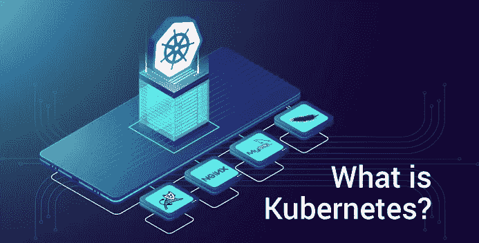

# 什么是 Kubernetes？—容器编排工具简介

> 原文：<https://medium.com/edureka/what-is-kubernetes-container-orchestration-tool-d972741550f6?source=collection_archive---------1----------------------->

What is Kubernetes — Edureka

我们都知道在当今快速发展的 IT 世界中，容器变得多么重要。几乎每个大型组织都已经摆脱了使用虚拟机的传统方法，开始使用容器进行部署。所以，现在是你了解什么是 Kubernetes 的时候了。以下是本博客涵盖的主题:

1.  什么是 Kubernetes？
2.  为什么使用 Kubernetes？
3.  库伯内特的特点
4.  案例研究:Kubernetes 为 Pokemon Go 提供动力
5.  库伯内特建筑

# 什么是 Kubernetes？

Kubernetes 是开源的容器管理(编排)工具。它的容器管理职责包括容器部署、容器的缩放和除垢以及容器负载平衡。

***注*** *: Kubernetes 不是集装箱化平台。这是一个多容器管理解决方案。*

根据定义，你可能会觉得 Kubernetes 很普通，不重要。但是相信我，这个世界需要 Kubernetes 来管理容器，就像它需要 Docker 来创建容器一样。让我告诉你为什么！

# 为什么使用 Kubernetes？

外面的公司可能会使用 Docker 或 Rocket 或者简单的 Linux 容器来封装他们的应用程序。但是，不管是什么，他们大规模使用它。他们不会停留在生产中使用 1 或 2 个容器。而是 10 个或 100 个容器，用于负载平衡流量并确保高可用性。

请记住，随着流量的增加，他们甚至不得不增加容器的数量来服务每秒钟到来的“n”个请求。而且，当需求减少时，他们也不得不缩小集装箱的规模。所有这些能在本地完成吗？

嗯，说实话，我不确定能不能做到。即使可以做到，也只是在管理这些容器的大量人工工作之后。所以，真正的问题是，**真的值得吗**？自动化干预不会让生活更轻松吗？绝对会的！

这就是为什么对容器管理工具的需求迫在眉睫。Docker Swarm 和 Kubernetes 都是容器管理和编排的流行工具。但是，Kubernetes 是无可争议的市场领导者。部分原因是它是谷歌的创意，部分原因是它的功能更好。

从逻辑上讲，Docker Swarm 是一个更好的选择，因为它运行在 Docker 之上，对吗？如果我是你，我会有同样的疑问，这将是我要解决的第一个谜。

如果我可以在这两者中选择一个，那么我会选择 Kubernetes。原因很简单:基于流量需求的容器自动缩放。然而，Docker Swarm 不够智能，无法进行自动缩放。尽管如此，让我们进入下一个话题，什么是 Kubernetes 博客。

# 库伯内特的特点

这是谈论 Kubernetes 特性的合适时机，因为你已经知道它是做什么的，以及它与 Docker Swarm 相比如何。

Kubernetes Features — What is Kubernetes — Edureka

# 1.自动装箱

Kubernetes 自动打包您的应用程序，并根据需求和可用资源调度容器，同时不牺牲可用性。为了确保完全利用并节省未使用的资源，Kubernetes 在关键工作负载和尽力而为工作负载之间进行平衡。

# 2.服务发现和负载平衡

有了 Kubernetes，就不需要担心网络和通信问题，因为 Kubernetes 会自动为容器分配 IP 地址，并为一组容器分配一个 DNS 名称，这样可以在集群内部实现流量负载平衡。

# 3.存储编排

使用 Kubernetes，您可以安装自己选择的存储系统。你可以选择本地存储，或者选择 GCP 或 AWS 等公共云提供商，或者使用 NFS、iSCSI 等共享网络存储系统。

# 4.自愈

个人觉得这是我最喜欢的功能。Kubernetes 可以自动重启在执行过程中失败的容器，并杀死那些不响应用户定义的健康检查的容器。但是，如果节点本身失效，那么它会在其他可用的节点上替换和重新调度那些失效的容器。

# 5.机密和配置管理

Kubernetes 可以帮助您部署和更新机密和应用程序配置，而无需重新构建您的映像，也无需在您的堆栈配置中暴露机密。

# 6.批量执行

除了管理服务，Kubernetes 还可以管理您的批处理和 CI 工作负载，从而在需要时替换失败的容器。

# 7.水平缩放

使用 CLI 时，Kubernetes 只需要一个命令就可以放大或缩小容器。否则，也可以通过仪表板(kubernetes UI)进行缩放。

# 8.自动回滚和转出

Kubernetes 通过确保不是所有的实例都在同一个实例上工作，逐步推出对应用程序或其配置的更改和更新。即使出现问题，Kubernetes 也会为您回滚更改。

这些是 Kubernetes 的一些显著特征。让我通过 Kubernetes 的实际实现来深入研究它吸引人的方面，以及它如何解决了一个主要的行业问题。

# 案例研究:Kubernetes 如何成为 Pokemon Go 进化的中心

我很确定每个阅读这篇博客的人都玩过这个著名的智能手机游戏。或者至少你听说过这个游戏。我之所以如此肯定，是因为这款游戏几乎打破了游戏应用在安卓和 T2 iOS 市场创造的每一项记录。

口袋妖怪 Go 由 Niantic 实验室开发，最初仅在北美、澳大利亚和新西兰推出。在全球发行后的短短几周内，这款游戏的下载量就达到了 **5 亿次以上**，平均每天有**2000 万以上的活跃用户**。这些统计数据比《糖果粉碎》和《部落冲突》更好。

# 口袋妖怪 Go:游戏后端与 Kubernetes

应用后端是用 Java 结合 libGDX 编写的。该计划是托管在 Java 云与谷歌云 Bigtable NoSQL 数据库。这个架构建立在 Kubernetes 之上，这是他们的扩展策略。

由于 MapReduce，特别是云数据流，在全球范围内快速迭代推送更新，以合并数据，进行高效的 MapReduce 洗牌，并扩展其基础架构。

## **实际挑战**:

对于像这样的大多数大型应用程序来说，这就是水平扩展。横向扩展是指当你扩展你的服务器来满足来自多个玩家和游戏环境的不断增长的请求时。但对于这款游戏来说，尤其是垂直缩放也是一个重大挑战，因为玩家的实时环境在不断变化。这种变化也必须反映到所有在附近玩的其他人身上，因为向每个人反映同一个游戏世界是游戏的工作方式。每台服务器的性能和规格也必须同时调整，这是 Kubernetes 需要解决的最大挑战。

## **结论**:

Kubernetes 不仅有助于容器的水平和垂直缩放，而且在工程预期方面也表现出色。他们根据基本估计来规划部署，服务器已准备好应对最大 5 倍的流量。然而，游戏的受欢迎程度如此之高，以至于他们不得不将规模扩大到 50 倍。问问其他公司的工程师，95%的人会回答他们的服务器崩溃故事以及他们的业务是如何崩溃的。但《口袋妖怪 Go》的开发者 Niantic Labs 却没有。

**软件工程总监爱德华·吴**，冲着娘们说道:

> "当这些在数小时内被超过时，我们知道我们手头有一些特别的东西."
> 
> “我们认为，当人们走出家门，并有理由与他人保持联系时，他们会更健康。”

Pokemon Go 超出了所有工程预期的 50 倍，尽管早期推出时出现了问题，但仍成功保持了运行。这成为现代增强现实游戏的灵感和基准，因为它激励用户在一年内步行超过 54 亿英里。Niantic 实验室的实施使其成为有史以来部署的最大的 Kubernetes。

# 库伯内特建筑

所以，现在进入这个博客的下一部分，让我解释一下 Kubernetes 的工作架构。

由于 Kubernetes 实现了一个集群计算后台，一切都在一个 ***Kubernetes 集群*** 内部工作。该群集由一个节点作为群集的“主节点”托管，其他节点作为“节点”进行实际的“容器化”。下图显示了同样的情况。

*Kubernetes Architecture — What Is Kubernetes — Edureka*

Master 控制集群和其中的节点。它确保执行只发生在节点，并协调行动。节点托管容器；事实上，这些容器被逻辑地分组以形成豆荚。对于一个部署，每个节点可以运行多个这样的 pod，它们是一组彼此交互的容器。

复制控制器是主机的资源，以确保请求数量的 pod 始终在节点上运行。服务是主服务器上的一个对象，它在一组复制的 pod 之间提供负载平衡。

这就是库伯内特简单的建筑风格。如果你想查看更多关于人工智能、Python、道德黑客等市场最热门技术的文章，你可以参考 Edureka 的官方网站。

请留意本系列中的其他文章，它们将解释 Kubernetes 的各个方面。

> 1.[在 Ubuntu 上安装 Kubernetes](/edureka/install-kubernetes-on-ubuntu-5cd1f770c9e4)
> 
> 2. [Kubernetes 教程](/edureka/kubernetes-tutorial-fe6de6a20325)
> 
> 3. [Kubernetes 仪表板安装&视图](/edureka/kubernetes-dashboard-d909b8b6579c)
> 
> 4. [Kubernetes 建筑](/edureka/kubernetes-architecture-c43531593ca5)
> 
> 5. [Kubernetes 网络](/edureka/kubernetes-networking-a46d9f994bab)
> 
> 6.[Kubernetes vs Docker Swarm](/edureka/kubernetes-vs-docker-45231abeeaf1)
> 
> 7. [Kubernetes 面试问题](/edureka/kubernetes-interview-questions-c9790e5abddb)
> 
> 8.[与亚马逊 EKS 合作开发 Kubernetes 应用](/edureka/amazon-eks-ac646c23abf8)
> 
> 9.[在 AWS 上设置 Kubernetes 入口控制器](/edureka/kubernetes-ingress-controller-nginx-c5cf9e8ff031)
> 
> 10.[如何用 Elasticsearch 和 Kibana 可视化 Kubernetes 集群](/edureka/logging-monitoring-elasticsearch-fluentd-kibana-e2cd477a576b)

*原载于 2018 年 6 月 12 日*[*www.edureka.co*](https://www.edureka.co/blog/what-is-kubernetes-container-orchestration)*。*