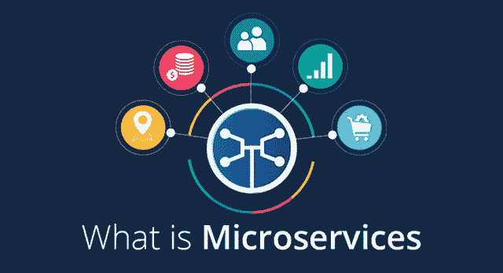
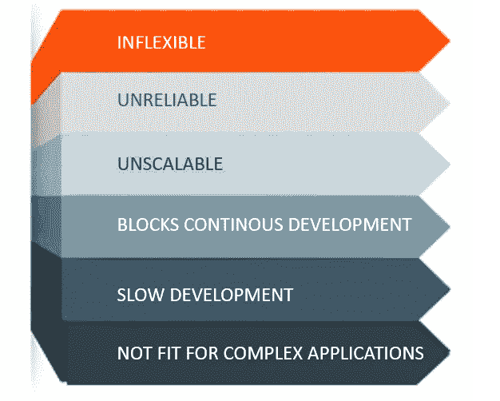
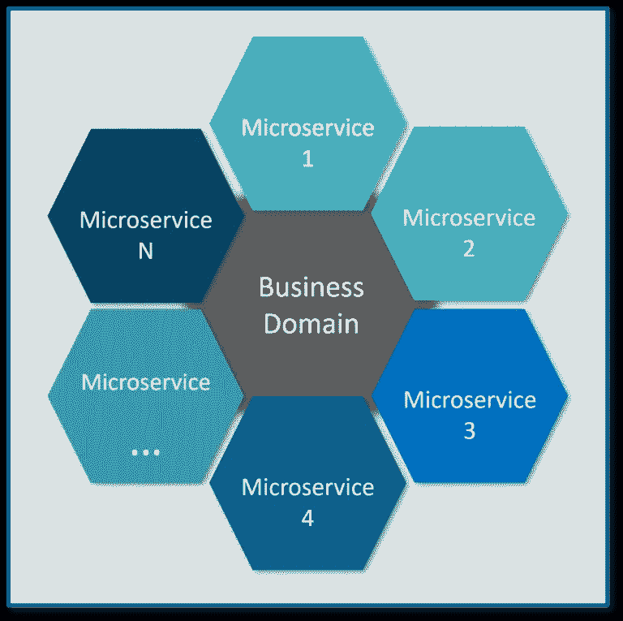
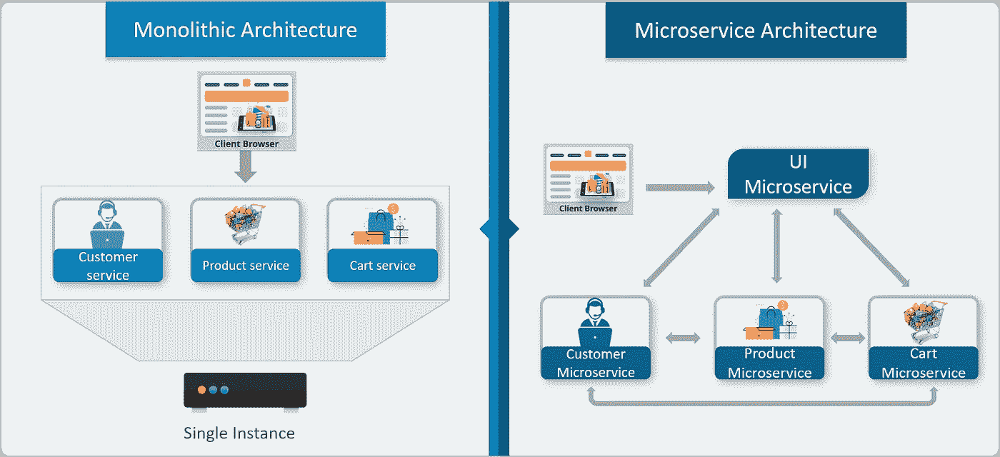
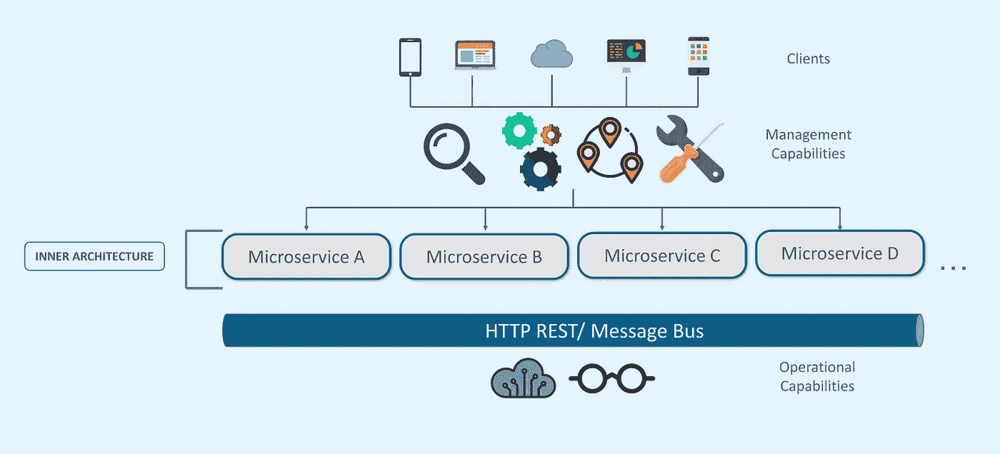
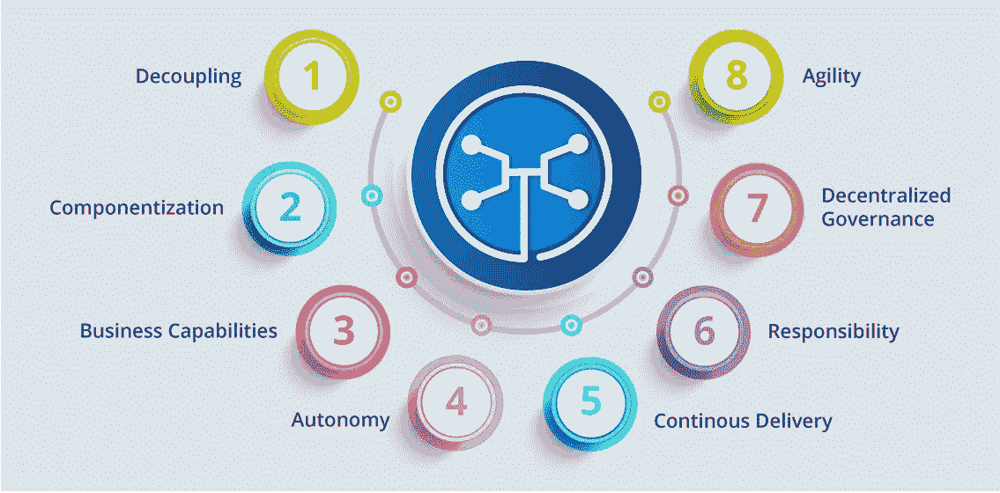
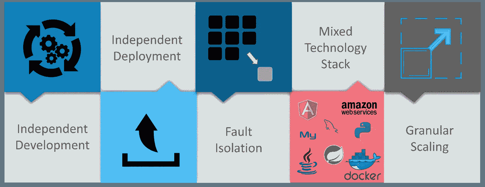
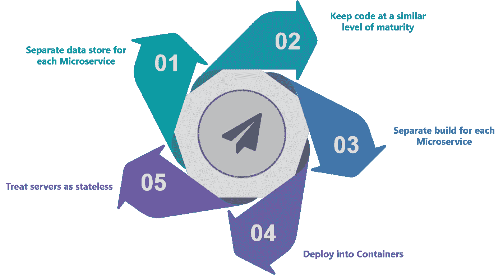
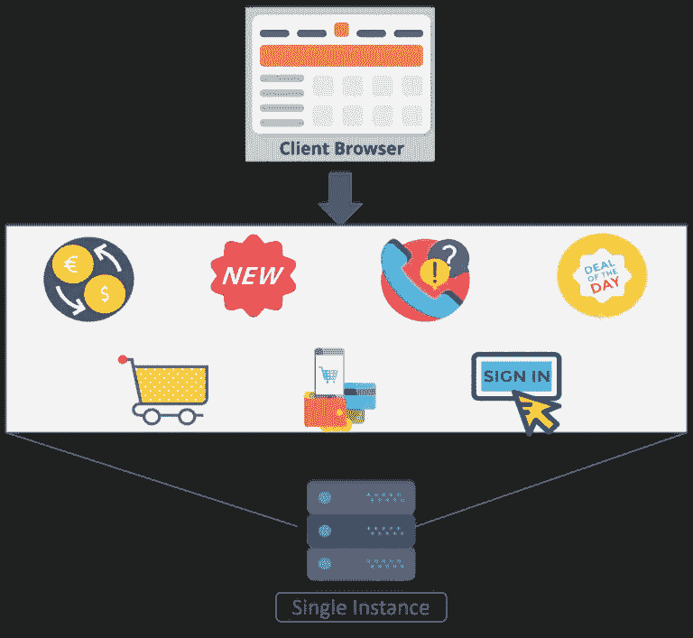
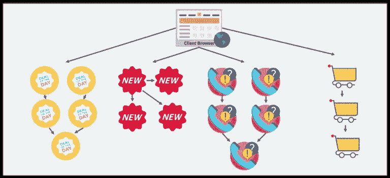

# 什么是微服务？—了解微服务架构的所有信息

> 原文：<https://medium.com/edureka/what-is-microservices-86144b17b836?source=collection_archive---------1----------------------->

What is Microservices — Edureka

*您有没有想过，* ***什么是微服务*** *以及扩展行业如何在构建应用程序以满足客户期望的同时与微服务集成？*

要了解什么是微服务**的概念，您必须了解如何将单一应用程序分解为独立打包和部署的微小微应用程序。这篇文章将让你清楚地了解开发人员如何使用微服务来根据他们的需求扩展他们的应用程序。**

***在这篇文章中，你将了解到以下内容:***

1.  为什么选择微服务？
2.  什么是微服务？
3.  微服务架构的特点
4.  微服务架构的优势
5.  设计微服务的最佳实践
6.  使用微服务的公司

# 为什么选择微服务？

现在，在我向您介绍微服务之前，我们先来看看微服务之前流行的架构，即**单片架构。**

通俗地说，你可以说它类似于一个大容器，其中一个应用程序的所有软件组件被组装在一起并紧密打包。

**下面列出了单片架构的挑战:**

Challenges of Monolithic Architecture — What is Microservices

> **不灵活** —单一应用程序无法使用不同的技术构建
> 
> 不可靠的——即使系统的一个特征不起作用，整个系统也不起作用
> 
> **不可扩展** —应用程序不容易扩展，因为每次应用程序需要更新时，整个系统都必须重建
> 
> **阻碍持续开发** —应用程序的许多特性不能同时构建和部署
> 
> **缓慢的开发** —单块应用程序的开发需要花费大量的时间来构建，因为每一个功能都必须一个接一个地构建
> 
> **不适合复杂的应用程序—** 复杂应用程序的特性具有紧密耦合的依赖关系

上述挑战是导致微服务发展的主要原因。

# 什么是微服务？

*微服务*，又名*微服务架构* ***，*** 是一种架构风格，将应用程序构建为小型自治服务的集合，围绕**业务领域建模。**

Microservices Representation —What Is Microservices

在微服务架构中，每个服务都是**自包含的**，并实现一个**单一业务能力。**

# 传统架构和微服务的区别

将一个电子商务应用程序作为一个用例来理解两者之间的区别。

Differences Between Monolithic Architecture and Microservices - What is Microservices

我们在上图中观察到的主要区别是，所有的特性最初都在一个实例下，共享一个数据库。但是，对于微服务，每个功能都被分配了不同的微服务，处理自己的数据，并执行不同的功能。

现在，让我们通过查看微服务的架构来了解它。请参考下图:

# 微服务架构

Microservice Architecture - What is Microservices

> 来自不同设备的不同客户端尝试使用不同的服务，如搜索、构建、配置和其他管理功能。
> 
> 所有服务都根据它们的领域和功能进行分离，并进一步分配给各个微服务。
> 
> 这些微服务有自己的**负载平衡器**和**执行环境**来执行它们的功能&，同时在它们自己的数据库中捕获数据。
> 
> 所有的微服务通过一个无状态服务器相互通信，这个无状态服务器要么是 **REST** 要么是**消息总线。**
> 
> 微服务借助**服务发现**了解其通信路径，并执行自动化、监控等操作功能。
> 
> 然后微服务执行的所有功能通过 **API 网关传递给客户端。**
> 
> 所有内部点都从 API 网关连接。因此，任何连接到 API 网关的人都会自动连接到整个系统。

现在，让我们通过查看微服务的特性来了解它的更多信息。

# 微服务功能

Features Of Microservices — What is Microservices

> **解耦** —系统内的服务在很大程度上是解耦的。因此，应用程序作为一个整体可以很容易地构建、修改和扩展。
> 
> **组件化** —微服务被视为独立的组件，可以轻松替换和升级。
> 
> **业务能力** —微服务非常简单，专注于单一能力。
> 
> **自主性** —开发人员和团队可以彼此独立工作，从而提高速度。
> 
> **连续交付**——通过软件创建、测试和批准的系统化自动化，允许软件的频繁发布。
> 
> **责任** —微服务不把应用作为项目来关注。相反，他们将应用程序视为他们负责的产品
> 
> **分散治理** —关注的焦点是为正确的工作使用正确的工具。这意味着没有标准化的模式或任何技术模式。开发人员可以自由选择最有用的工具来解决他们的问题
> 
> **敏捷** —微服务支持敏捷开发。任何新功能都可以快速开发并再次丢弃

# 微服务的优势

Advantages of Microservices - What is Microservices

> **独立开发** —所有微服务都可以基于其各自的功能轻松开发
> 
> **独立部署** —基于他们的服务，他们可以在任何应用中单独部署
> 
> **故障隔离** —即使应用程序的一个服务不工作，系统仍然继续运行
> 
> **混合技术堆栈** —不同的语言和技术可用于构建同一应用程序的不同服务
> 
> **粒度扩展** —单个组件可以根据需要扩展，无需将所有组件一起扩展

# 设计微服务的最佳实践

在当今世界，复杂性已经设法渗入到产品中。微服务架构承诺保持团队的可扩展性和更好的运行。

以下是设计微服务的最佳实践:

Best Practices To Design Microservices - What is Microservices

现在，让我们通过一个用例来更好地理解微服务。

# 用例:购物车应用程序

让我们以一个购物车应用程序的经典用例为例。

当你打开一个购物车应用程序时，你看到的只是一个网站。但是，在后台，购物车应用程序有一个接受付款的服务，一个客户服务服务，等等。

假设这个应用程序的开发人员已经在一个单一的框架中创建了它。请参考下图:

Monolithic Framework Of Shopping Cart Application — What is Microservices

因此，所有的功能都放在一个代码库中，并位于一个底层数据库中。

现在，让我们假设市场上出现了一个新品牌，开发人员希望将这个新品牌的所有细节都放在这个应用程序中。

然后，他们不仅需要为新标签重新设计服务，还需要重新构建整个系统并相应地进行部署。

为了避免这样的挑战，该应用程序的开发人员决定将他们的应用程序从单片架构转移到微服务。请参考下图，了解购物车应用程序的微服务架构。

Microservice Architecture of Shopping Cart Application — What is Microservices

这意味着开发人员不会创建 web 微服务、逻辑微服务或数据库微服务。相反，他们为搜索、推荐、客户服务等创建单独的微服务。

这种类型的应用程序架构不仅可以帮助开发人员克服以前的架构所面临的所有挑战，还可以帮助购物车应用程序轻松地构建、部署和扩展。

# 使用微服务的公司

使用微服务构建应用的公司有很多，这里仅举几个例子:

Companies using Microservices - What is Microservices

*这就把我们带到了关于什么是微服务的文章的结尾。我希望这篇文章对你有所帮助，并增加了你的知识价值。*

如果你想查看更多关于人工智能、DevOps、道德黑客等市场最热门技术的文章，你可以参考 Edureka 的官方网站。

请留意本系列中的其他文章，它们将解释微服务的各个方面。

> 1.[微服务架构](/edureka/microservice-architecture-5e7f056b90f1)
> 
> 2.  [微服务 vs SOA](/edureka/microservices-vs-soa-4d71c5590fc6)
> 
> 3.[微服务教程](/edureka/microservices-tutorial-with-example-a230413dfa13)
> 
> 4.[使用 Spring Boot 构建微服务应用](/edureka/microservices-with-spring-boot-ffab2ce8ac34)
> 
> 5.[微服务安全](/edureka/microservices-security-b01b8f2a9215)

*原载于 2018 年 2 月 21 日*[*www.edureka.co*](https://www.edureka.co/blog/what-is-microservices/)*。*