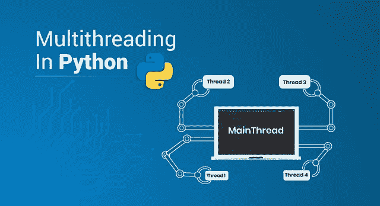
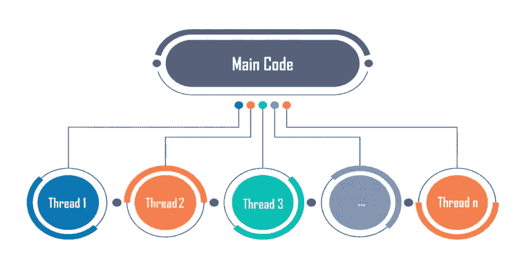

# Python 中的多线程以及如何实现？

> 原文：<https://medium.com/edureka/what-is-mutithreading-19b6349dde0f?source=collection_archive---------0----------------------->



Multithreading in Python — Edureka

时间是生命中最关键的因素。由于其重要性，编程领域提供了各种技巧和技术，可以显著地帮助您减少时间消耗，从而提高性能。Python 中的多线程就是这样一种方法。

以下是本文涵盖的所有专业的快速总结:

1.  Python 中的多任务是什么？
2.  什么是线程？
3.  Python 中什么时候使用多线程？
4.  Python 中如何实现多线程？
5.  如何在 Python 中创建线程？

*   不创建类
*   通过扩展线程类
*   不扩展线程类

6.在 Python 中使用多线程的优势

首先，在我们开始学习 Python 中的多线程之前，让我们先试着理解多任务。

# Python 中的多任务是什么？

一般来说，多任务处理是指同时执行多项任务的能力。用专业术语来说，多任务指的是操作系统同时执行不同任务的能力。*例如*，你在电脑上下载东西，同时听歌和玩游戏等。所有这些任务都由同一操作系统同步执行。这就是多任务处理，不仅能帮你节省时间，还能提高效率。

操作系统中有两种类型的多任务处理:

*   基于流程的
*   基于线程的

在本文中，您将了解到基于**多任务处理或 ***多线程*** *。***

# **什么是线程？**

****

**一个线程基本上是一个 ***独立*** 的执行流。单个进程可以由多个线程组成。程序中的每个线程都执行特定的任务。*例如，*当你在 PC 上玩一个游戏，比如说 FIFA，游戏整体上是一个单独的进程*，*，但是它由几个线程组成，负责播放音乐，接收用户输入，同步运行对手，等等。所有这些都是独立的线程，负责在同一个程序中执行这些不同的任务。**

**每个进程都有一个始终运行的线程。这是主线。这个主线程实际上创建了子线程对象。子线程也由主线程发起。我将在本文中进一步向您展示如何检查当前正在运行的线程。**

**所以有了这些，我希望你已经清楚地了解了什么是线程。继续，让我们看看什么是 Python 中的多线程。**

# ****Python 中什么时候使用多线程？****

**多线程对于节省时间和提高性能是非常有用的，但是它不能在任何地方都适用。在前面的 FIFA 示例中，音乐线程独立于接收您输入的线程，接收您输入的线程独立于运行您对手的线程。这些线程独立运行，因为它们不相互依赖。**

**因此，只有当各个线程之间不存在依赖关系时，才能使用多线程。**

**本文进一步展示了如何在 Python 中实现多线程。**

# **Python 中如何实现多线程？**

**Python 中的多线程可以通过导入 ***线程*** 模块来实现。**

**在导入此模块之前，您必须安装它。要在您的 anaconda 环境中安装它，请在 anaconda 提示符下执行以下命令:**

****康达安装-康达锻造 tbb****

**成功安装后，您可以使用以下任何命令来导入线程模块:**

```
**import threading 
from threading import ***
```

**现在你已经安装了线程模块，让我们继续前进，用 Python 做多线程。**

# **如何在 Python 中创建线程？**

**Python 中的线程可以通过三种方式创建:**

1.  **不创建类**
2.  **通过扩展线程类**
3.  **不扩展线程类**

## **不创建类**

**Python 中的多线程可以在不创建类的情况下完成。这里有一个例子来说明这一点:**

*****举例:*****

```
**from threading import *
print(current_thread().getName())
def mt():
    print("Child Thread")
child=Thread(target=mt)
child.start()
print("Executing thread name :",current_thread().getName())**
```

*****输出:*****

```
**MainThread
Child Thread
Executing thread name : MainThread**
```

**上面的输出显示出现的第一个线程是主线程。这个主线程随后创建一个执行该函数的子线程，然后主线程再次执行最终的打印语句。**

**现在让我们继续，看看如何通过扩展 Thread 类在 python 中进行多线程处理。**

## **通过扩展 Thread 类:**

**当通过扩展 Thread 类创建子类时，子类表示新线程正在执行某个任务。扩展 Thread 类时，子类只能重写两个方法，即 __init__()方法和 run()方法。除了这两个方法之外，没有其他方法可以被重写。**

**下面是一个如何扩展 Thread 类来创建线程的示例:**

*****举例:*****

```
**import threading
import time
class mythread(threading.Thread):
    def run(self):
        for x in range(7):
        print("Hi from child")
a = mythread()
a.start()
a.join()
print("Bye from",current_thread().getName())**
```

*****输出:*****

```
**Hi from child
Hi from child
Hi from child
Hi from child
Hi from child
Hi from child
Hi from child
Bye from MainThread**
```

**上面的例子显示了类 myclass 继承了线程类，而子类 myclass 覆盖了 run 方法。默认情况下，任何类函数的第一个参数都需要是 self，它是指向当前对象的指针。输出显示子线程执行 run()方法，主线程等待子线程的执行完成。这是因为 join()函数，它让主线程等待子线程完成。**

**这种创建线程的方法是最优选的方法，因为它是标准方法。但是如果您想在不继承或扩展 Thread 类的情况下创建线程，您可以用下面的方式来实现。**

## **不扩展线程类**

**要创建一个线程而不扩展 thread 类，可以做如下:
***例如:*****

```
**from threading import *
class ex:
def myfunc(self): #self necessary as first parameter in a class func
    for x in range(7):
        print("Child")
myobj=ex()
thread1=Thread(target=myobj.myfunc)
thread1.start()
thread1.join()
print("done")**
```

*****输出:*****

```
**Child
Child
Child
Child
Child
Child
Child
done**
```

**子线程执行 myfunc，之后主线程执行最后一条 print 语句。**

# **使用线程的优势**

**多线程有许多优点，其中一些如下:**

*   **更好地利用资源**
*   **简化代码**
*   **允许各种任务同时并行发生**
*   **减少时间消耗或响应时间，从而提高性能。**

**下面是一个示例，用于检查在 python 中使用和不使用多线程时代码执行所需的时间:**

*****例如:*****

```
**import time
def sqr(n):
    for x in n:
        time.sleep(1)
        x%2
def cube(n):
    for x in n:
        time.sleep(1)
        x%3
n=[1,2,3,4,5,6,7,8]
s=time.time()
sqr(n)
cube(n)
e=time.time()
print(e-s)**
```

*****输出:*****

```
**16.042309284210205**
```

**以上是在不使用线程的情况下执行程序所花费的输出时间。现在让我们使用线程，看看同一个程序会发生什么:**

*****例如:*****

```
**import threading
from threading import *
import time
def sqr(n):
    for x in n:
        time.sleep(1)
        print('Remainder after dividing by 2',x%2)
def cube(n):
    for x in n:
        time.sleep(1)
        print('Remainder after dividing by 3',x%3)
n=[1,2,3,4,5,6,7,8]
start=time.time()
t1=Thread(target=sqr,args=(n,))
t2=Thread(target=cube,args=(n,))
t1.start()
time.sleep(1)
t2.start()
t1.join()
t2.join()
end=time.time()
print(end-start)**
```

*****输出:*****

```
**9.040220737457275**
```

**上面的输出清楚地表明，与不使用线程执行相同的程序相比，使用线程所花费的时间要少得多。**

**我希望您清楚本文中涉及的与 Python 中多线程相关的概念。确保尽可能多的练习，因为这是编程中最重要的概念之一。**

**如果你想查看更多关于人工智能、DevOps、道德黑客等市场最热门技术的文章，你可以参考 Edureka 的官方网站。**

**请留意本系列中的其他文章，它们将解释 Python 和数据科学的各个方面。**

> **1. [Python 教程](/edureka/python-tutorial-be1b3d015745)**
> 
> **2. [Python 编程语言](/edureka/python-programming-language-fc1015de7a6f)**
> 
> **3. [Python 函数](/edureka/python-functions-f0cabca8c4a)**
> 
> **4.[Python 中的文件处理](/edureka/file-handling-in-python-e0a6ff96ede9)**
> 
> **5. [Python Numpy 教程](/edureka/python-numpy-tutorial-89fb8b642c7d)**
> 
> **6. [Scikit 学习机器学习](/edureka/scikit-learn-machine-learning-7a2d92e4dd07)**
> 
> **7.[蟒蛇熊猫教程](/edureka/python-pandas-tutorial-c5055c61d12e)**
> 
> **8. [Matplotlib 教程](/edureka/python-matplotlib-tutorial-15d148a7bfee)**
> 
> **9. [Tkinter 教程](/edureka/tkinter-tutorial-f655d3f4c818)**
> 
> **10.[请求教程](/edureka/python-requests-tutorial-30edabfa6a1c)**
> 
> **11. [PyGame 教程](/edureka/pygame-tutorial-9874f7e5c0b4)**
> 
> **12. [OpenCV 教程](/edureka/python-opencv-tutorial-5549bd4940e3)**
> 
> **13.[用 Python 进行网页抓取](/edureka/web-scraping-with-python-d9e6506007bf)**
> 
> **14. [PyCharm 教程](/edureka/pycharm-tutorial-d0ec9ce6fb60)**
> 
> **15.[机器学习教程](/edureka/machine-learning-tutorial-f2883412fba1)**
> 
> **16.[Python 中从头开始的线性回归算法](/edureka/linear-regression-in-python-e66f869cb6ce)**
> 
> **17.[面向数据科学的 Python](/edureka/learn-python-for-data-science-1f9f407943d3)**
> 
> **18.[Python 中的循环](/edureka/loops-in-python-fc5b42e2f313)**
> 
> **19. [Python 正则表达式](/edureka/python-regex-regular-expression-tutorial-f2d17ffcf17e)**
> 
> **20. [Python 项目](/edureka/python-projects-1f401a555ca0)**
> 
> **21.[机器学习项目](/edureka/machine-learning-projects-cb0130d0606f)**
> 
> **22.[Python 中的数组](/edureka/arrays-in-python-14aecabec16e)**
> 
> **23.[在 Python 中设置](/edureka/sets-in-python-a16b410becf4)**
> 
> **24. [Python 面试问题](/edureka/python-interview-questions-a22257bc309f)**
> 
> **25. [Java vs Python](/edureka/java-vs-python-31d7433ed9d)**
> 
> **26.[如何成为一名 Python 开发者？](/edureka/how-to-become-a-python-developer-462a0093f246)**
> 
> **27. [Python Lambda 函数](/edureka/python-lambda-b84d68d449a0)**
> 
> **28.[网飞如何使用 Python？](/edureka/how-netflix-uses-python-1e4deb2f8ca5)**
> 
> **29.[Python 中的套接字编程是什么](/edureka/socket-programming-python-bbac2d423bf9)**
> 
> **30. [Python 数据库连接](/edureka/python-database-connection-b4f9b301947c)**
> 
> **31. [Golang vs Python](/edureka/golang-vs-python-5ac32e1ef2)**
> 
> **32. [Python Seaborn 教程](/edureka/python-seaborn-tutorial-646fdddff322)**
> 
> **33. [Python 职业机会](/edureka/python-career-opportunities-a2500ce158de)**

***原载于 2019 年 5 月 17 日*[*【https://www.edureka.co】*](https://www.edureka.co/blog/what-is-mutithreading/)*。***