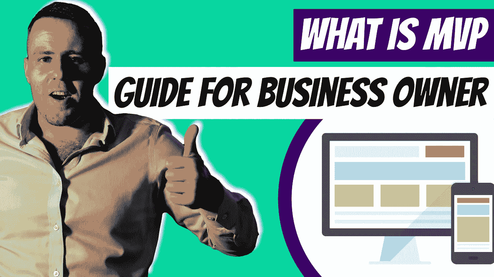

# 什么是 MVP——企业主最低可行产品指南

> 原文：<https://medium.com/duomly-blockchain-online-courses/what-is-mvp-minimum-viable-product-guide-for-business-owners-5e65e59e33e8?source=collection_archive---------3----------------------->

[What Is MVP — Minimum Viable Product Guide for Business Owners](https://www.blog.duomly.com/what-is-mvp-minimum-viable-product-guide/)

本文最初发布于:[https://www . blog . duomly . com/what-is-MVP-minimum-valid-product-guide/](https://www.blog.duomly.com/what-is-mvp-minimum-viable-product-guide/)

什么是 MVP？MVP 代表最小可行产品。

MVP 的目标是尽快将产品送到用户手中，开始收集反馈。