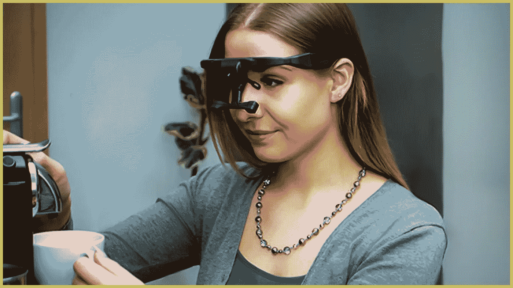

# 什么是神经营销:初学者指南 2022

> 原文：<https://medium.com/globant/what-is-neuromarketing-7aa2b7eba183?source=collection_archive---------0----------------------->

## **塑造数字营销行业未来的 6 种神经营销技术**

**了解什么是神经营销，它是如何工作的，并探索未来数字营销人员的最佳神经营销技术。**

**Neuromarketing Technique** — **Braindancing** featured in the action role-playing video game ***Cyberpunk 2077***

虽然许多品牌最初很难理解他们的受众，但成功的广告和营销活动弥合了这两者之间的差距。多年来，新技术不断打破各种品牌接触客户群的技术。随着品牌的成长，数字营销人员越来越有兴趣了解他们的受众——他们如何反应，他们如何做出购买决定，或者如何充分利用他们使用的服务。从那以后，人类心理的运作一直受到质疑。

因此，将神经科学领域与这种数字营销实践结合起来，以产生必要的销售结果以及心理学原理，这就是所谓的神经营销。

在这篇文章中，我们将详细了解什么是神经营销，它是如何工作的，并探索一些数字营销专业人士的最佳神经营销技术。

# 什么是神经营销？

当营销人员利用神经科学技术收集对顾客的选择、决定和冲动的洞察，以便更好地在市场上定位他们的品牌时，这被称为神经营销。

> *Patrick Renvoise，一家名为****sales brain****的神经营销公司的联合创始人，声称* **“神经营销就是要找到你的受众大脑中的购买按钮。”**

Patrick Renvoise on Neuromarketing at TEDxBend

最终，这项技术可以广泛用于重新设计品牌的包装和展示，从而影响消费者的购买决定。

# 神经营销是如何运作的？

数字营销人员总是对衡量营销活动的绩效指标感到好奇。这项技术使用神经计量学、生物统计学和心理测量技术来生成数据并了解消费者的行为。

Source: Block Diagram — How Neuromarketing Works by Nick Lee

***推荐阅读=>>***[***数字营销人员神经营销书籍***](/convertize/13-neuromarketing-books-digital-marketers-must-read-in-2018-36fba0e071d4)

## 以下是一些流行的神经营销技巧:

1.  眼球追踪
2.  面部编码
3.  功能磁共振成像(Functional magnetic resonance imaging)
4.  脑电图
5.  皮肤电反应和生物识别
6.  心理技术

下面让我们回顾一下上面列出的技术。

## #1)眼球追踪

**最适合**改善网站用户体验、平面设计、广告和品牌包装。通过眼球追踪生成的数据可以帮助品牌加强设计实践，以更好地吸引观众。

Source: UBC News

**工作原理:**在测量受试者的瞳孔是否放大时，准确检测受试者凝视的位置

**结果:**

我们可以记录下什么抓住了他们的注意力，什么让他们困惑

识别速度

订婚的级别

**功能:**

相对便宜且易于管理

最好与生物识别结合使用

不测量情绪

## #2)面部编码

**最适合**改善广告中的视觉内容和网站用户体验。

Source: Smartmicros

**工作原理:**识别面部表情，记录他们在看特定产品时的反应

**结果:**

一般情绪反应:快乐、惊喜、恐惧等。

**功能:**

比其他神经营销技术相对便宜

## #3)功能磁共振成像

**最适合**制定价格和改善品牌战略。详细的大脑扫描以及在功能磁共振成像过程中给予观众的各种评估可以帮助品牌产生必要的数据来重组他们的活动或战略。

Source: Nuffield Department of Clinical Neurosciences

**工作原理:**检测与增加的神经活动相关的大脑中的血流

**结果:**

详细的情感反应

订婚级别

重新定位和重组品牌

**功能:**

最昂贵和侵入性的方法

大多用于测量特定的情绪

必须在实验室进行

## #4)脑电图

**最适合**改进广告和规划详细的品牌战略。

Source: Bitbrain

**工作原理:**记录头皮上来自大脑内部神经元的电信号

**结果:**

一级啮合

重定位

**功能:**

高度昂贵的工艺

能以较小的时间增量测量变化

## #5) **皮肤电反应&生物特征**

**最有利于**提高广告内容。

Source: Future Proof Insights

**工作原理:**测量皮肤电导、心率、情绪和呼吸引起的出汗

**结果:**

订婚级别

记录他们的反应是积极还是消极

**特色:**

最好与其他各种技术配合使用

## #6) **心理技巧**

**最有利于**了解消费者心理，从而更好地定位广告内容。

Source: Future Proof Insights

**操作原理:**用小而简单的方法与潜意识沟通，以促使顾客购买。

**结果:**

订婚级别

认知反应

**功能:**

最便宜

必须依靠认知研究和重数据

# 对市场和整体悲观情绪的影响

与神经科学研究人员一样，数字营销人员正在更近距离地观察大脑，因为它可以用来影响购买，这听起来让他们非常兴奋。不过，另一方面，这也引发了一些伦理问题。

听起来像反乌托邦，神经操纵可以通过更好的分割、睡眠推进、激素操纵或暂时的神经抑制带来线索。因此，我们的消费者有必要了解这些因素。

埃隆·马斯克创办了一家名为 ***Neuralink —*** 的公司，这是一家神经技术公司，旨在开发可植入的脑机接口。

Source: Analytics Insight

随着许多科技巨头正在探索这项技术，人们需要对这些实验室内部发生的事情以及他们本质上在做什么创造透明度。

***建议阅读=>>***[***AI 驱动的数字营销***](/globant/back-in-the-90s-did-you-ever-imagine-that-a-day-will-come-when-you-just-have-to-say-and-things-2ed94a0b31eb)

# 结论

为什么神经营销技术会变得更有争议，甚至对传统市场构成威胁？好吧，答案依赖于它的误解，即它可以读取客户的想法，当然可以影响和控制他们，最终影响购买。

虽然这个领域使用的技术很先进，但这些工具无法“读心术”，我们的大脑也没有简单的“购买按钮”大脑有数十亿个相互连接的神经元，是人体中最复杂的器官，我们对它的工作方式还只是皮毛。

因此，这项技术帮助我们发现人类的情绪及其决策过程。组织可以进一步利用这些见解来改进他们的产品体验、服务和营销运作，以更好地满足目标受众的要求、需求和愿望。但是，在选择此类服务之前，必须了解其技术透明度和条款。