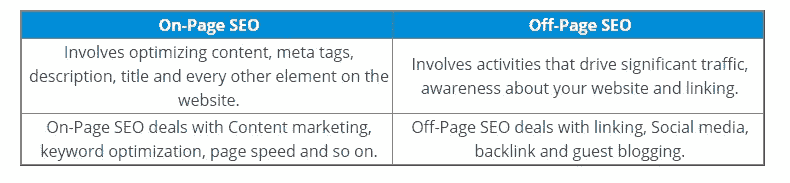

# 什么是离页 SEO？知道它的重要性和好处

> 原文：<https://medium.com/edureka/what-is-off-page-seo-cd3ddcfb6b02?source=collection_archive---------0----------------------->

在数字营销中，像 Google、Bing 等搜索引擎使用复杂的算法来确定你的网站在搜索引擎结果页(SERP)上的排名。增加流量的一个方法是优化你的网站，这主要是基于页面上和页面外的内容。这篇文章将集中在离页搜索引擎优化及其过程。

这些是本文将涉及的主题:

*   什么是 SEO？
*   不同的搜索引擎优化技术
*   离页搜索引擎优化
*   离页搜索引擎优化的重要性
*   链接和非链接相关的离页因素
*   反向链接
*   页面内与页面外搜索引擎优化
*   离页搜索引擎优化的好处

我们开始吧！

## 什么是 SEO？

搜索引擎优化或者简单的说 *SEO* 就是**增加**你的网站**的流量**的过程。更好地说，我会说，这是通过有机搜索引擎结果增加网站流量数量和质量的做法。

SEO 增加了公司成长和繁荣的机会。这是因为有机流量更可靠，不需要投入太多就能得到。所以，如果你想了解 SEO 是如何工作的，可以看看 Edureka 关于 SEO 的最新视频。难怪页面内搜索引擎优化非常重要，但是，如果你不关注页面外搜索引擎优化，你将无法达到你的预期目标。

这个视频将通过例子帮助你从头开始学习搜索引擎优化(SEO)。你将了解强大的搜索引擎优化技巧，以及它们对你的商业投资有多重要。

现在你已经理解了什么是 SEO，让我们继续前进，看看市场上不同类型的 SEO。

## 不同的搜索引擎优化技术

人们经常会对类型和技术感到困惑。类型包括黑帽 SEO，白帽 SEO，灰帽 SEO。现在，这些技术包括

*   页面搜索引擎优化
*   离页搜索引擎优化
*   技术搜索引擎优化

我们来了解一下它们是什么。

**页面搜索引擎优化**

嗯，页面搜索引擎优化是指**优化单个网页，使其在搜索引擎优化中排名更高**，并从搜索引擎中获得更多相关流量。顾名思义，它优化了页面上的内容。

现在，你认为页面上呈现的内容是什么？无非是**标题标签，元标签，关键词密度，URL** 等等。这些只是你通过在页面上放置内容来获得更多流量的策略。您可能会想，处理页面上的内容有什么特别的？嗯，有。

只要你把更多的注意力放在内容和呈现给观众的方式上，你就安全了。

继续，让我们了解什么是离页搜索引擎优化。

**离页 SEO**

离页搜索引擎优化处理的是在你的网站之外执行的行为，以提高你在搜索引擎优化中的排名。最近的一项研究还表明，离页搜索引擎优化**在一个好的**数字策略中占到 75%**** *。*

**

*它与你的社交形象、链接建设以及其他许多不一定要出现在页面上的东西都有关系。用外行人的话来说，我会说，离页搜索引擎优化简单地告诉谷歌或搜索引擎观众对你的网站的看法。*

*还有，我经常碰到有人说离页优化只是链接建设。但是，它肯定有更多的翅膀。它对你在互联网上成名的方式有着战略性的控制。*

*非常广泛使用的离页元素有:*

*   *反向链接*
*   *跟随和不跟随*
*   *锚文本*
*   *链接果汁*
*   *关联*

*现在你知道什么是离页搜索引擎优化，让我们看看为什么它如此重要。*

## *离页搜索引擎优化的重要性*

*搜索引擎算法、排名因素和策略都在不断变化。同样，普遍的共识是，一个有效的离页搜索引擎优化所能提供的可信度、相关性和权威性，仍然在该页面的排名能力中扮演着重要的角色。*

***链接**对于让你的网站在 SERPs 上排名非常重要。所以，在你的网站上有链接(入站、出站链接)可以增加你在谷歌第一页排名的机会。*

*为了确保你的内容排名，你的网站应该有适当的可见性。*

*通常，网站不排名是因为离页搜索引擎优化。这是因为缺乏**链接建设、社交媒体、视频、博客、**等。*

*继续，让我们了解影响页面排名的不同的离页因素。*

## *链接和非链接相关的离页因素*

*反向链接是离页搜索引擎优化的核心。像谷歌、必应等搜索引擎利用反向链接作为高质量内容的指示。反向链接也是离页搜索引擎优化最关键的部分。*

*为此，你可以利用搜索引擎优化工具。*

*Ahrefs 就是这样一个工具，它有一个**反向链接检查器**帮助你理解如何创建反向链接并处理它们。*

# *链接相关的离页搜索引擎优化*

*当我说**链接**时，我指的是网页上的链接，将它连接到其他网站。我将主要谈论三种类型的链接。*

*   ***自然链接***
*   ***手动建立链接***
*   ***自建链接***

*影响这些联系的主要因素有:*

*   *链接网站的受欢迎程度*
*   *链接的新鲜度*
*   *锚定标签/文本的正确使用*
*   *链接域名和网站的权限*

## *链接建筑*

*处理离页 SEO 最有效和最流行的方法之一是 ***链接建设*。**在这里，我们有“**投票**的概念，这有助于收集你的竞争对手和你的公司的排名位置。*

*有许多方法可以让你包含链接。几个值得注意的例子是:*

*   ***博客**:你总是可以有**篇文章指向你的网站**。从其他媒体获得流量，如**客座博客**等等。这也有助于你在数字营销领域获得认可，并了解当前的市场趋势。*
*   ***评论链接**:提高**客户参与度**的一个方法是解决他们的问题并正确引导他们。所以，你总是有机会在评论区链接你的内容。*
*   *文章分发:这是为你的网站增加流量的另一种方式。**内容营销**处理**创作视频**和**写博客**。这些商业文章不只是由花哨的词语组成，还包含了获得更多流量和线索的渴望。你应该能够正确分发你的内容。*

*接下来，我们将讨论用于创建页面外链接的*锚文本**。**

## *锚文本*

*这是超链接中可见且可点击的文本。当它们链接到另一个网页时，你可以在任何文章中找到这些链接。通常是带下划线的蓝色文本。*

***例如:***

**

*这些锚文本被 [*搜索引擎*](https://www.edureka.co/blog/seo-tutorial/#How_does_Search_Engine_work?) 用来展现受众如何看待你的网站的反映。“锚”在以前的 HTML 规范中使用。现在它被用作“a”元素。*

# *非链接相关的离页搜索引擎优化*

*与没有搜索引擎优化或社交媒体营销相比，这些因素对你的流量有更大的影响。这些是一些值得注意的非链接相关的离页搜索引擎优化。*

*   *社交媒体营销*
*   *客座博客*
*   *链接和非链接品牌提及*
*   *直播带货*

***现在，集中在反向链接部分，让我们看看它是什么。***

# ***反向链接***

***反向链接也叫**入站链接**或**入站链接。**这些是当一个网站链接到另一个网站时创建的。**指向外部网站的链接被称为*反向链接。******

***谷歌和其他主要搜索引擎认为反向链接是对特定网页的投票。这意味着票数高的页面在 SERPs 上的排名会更高。***

*****例子**:假设我在 Instagram 上喜欢了一个来自 X 的帖子。我在我的个人资料上分享相应的帖子，我的追随者会点击我分享的帖子。这实际上会创建一个到来自 X 的帖子的**反向链接**，这意味着，在这里，我不仅会包含来自 X 的帖子，还会获得更多的查看和点击，因为我分享了来自 X 的热门帖子之一。**这是一个双赢的局面。*****

## ***为什么需要反向链接？***

***反向链接对确保观众了解你的业务很重要。也。寻找人们找到相同或相关主题的其他信息来源。***

## ***如何获得反向链接？***

*   ***写了很多**的客帖*****
*   ***建立良好的公众关系***
*   ***这有助于**减少断链*****

******注:*** *要查看你的网站有多少反向链接，把你的域名粘贴到 Ahrefs 的站点浏览器或它的免费反向链接检查器。****

# ***页面内与页面外搜索引擎优化***

***比较两种最广泛使用的 SEO 技术，我记下了它们之间的主要区别。***

******

***现在，在本文的最后一部分，我们将看看使用离页 SEO 的好处。***

# ***离页搜索引擎优化的好处***

*   *****提高排名:** 这有助于你的网站在 SERPs 上排名更高，从而获得良好的流量。***
*   *****精彩曝光** :
    排名越高，因为链接数、社交媒体提及数等等，流量就越大。***
*   ***让你的网站在谷歌上排名第一是很有挑战性的，但是通过使用离页搜索引擎优化，你将能够了解排名的因素。这个页面排名数字在 0-10 之间，这对于谷歌来说是很重要的，并且被放在第一个搜索结果页面上。***

***至此，我们来结束这篇关于“*什么是离页 SEO？*”。我希望您清楚讨论的主题，并增加对*数字营销*的了解。如果你想查看更多关于人工智能、DevOps、道德黑客等市场最热门技术的文章，那么你可以参考 [Edureka 的官方网站。](https://www.edureka.co/blog/?utm_source=medium&utm_medium=content-link&utm_campaign=what-is-off-page-seo)***

***请留意本系列中的其他文章，它们将解释数字营销的各个方面***

> ****1。什么是数字营销？
> 2。75 大数字营销面试问答****

****原载于 2020 年 07 月 01 日 https://www.edureka.co***。*****