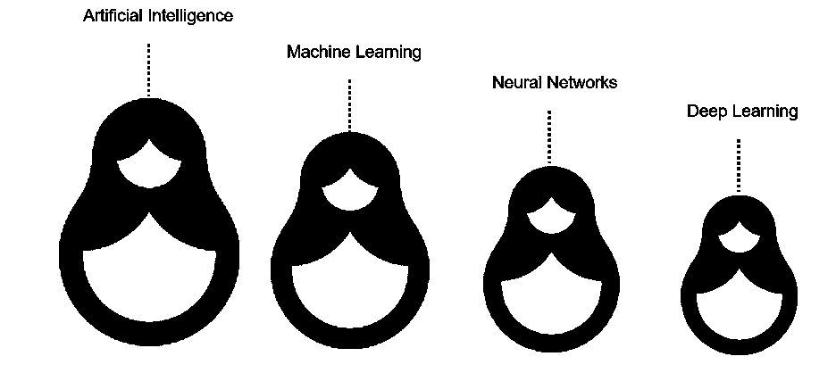
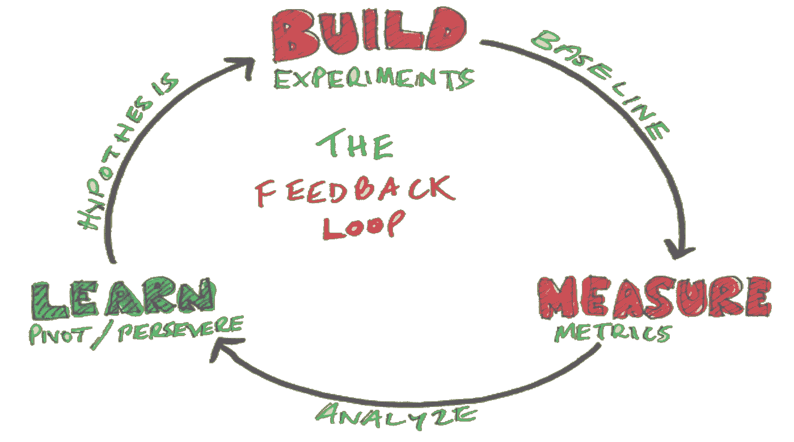

# 什么是模式 X？

> 原文：<https://medium.com/walmartglobaltech/what-is-pattern-x-c9f0fe63d5e6?source=collection_archive---------0----------------------->

Photo by [Clint Adair](https://unsplash.com/@clintadair?utm_source=medium&utm_medium=referral) on [Unsplash](https://unsplash.com?utm_source=medium&utm_medium=referral)

> 算法的无限改进

“只有一个老板。顾客。他可以解雇公司里从董事长开始的所有人，只要把钱花在别的地方。”——*。*

*从沃尔玛早期开始，Sam 对顾客的理解就一直是正确的，这也是沃尔玛今天每天以低价满足顾客需求的原因。在各种努力理解消费者的企业中，越来越多的技术支持的方式来做到这一点。一种方法是机器学习，这是人工智能的一个子集。*

*沃尔玛商店是许多人喜欢去的地方之一，不仅可以每天以最低的价格购物，还可以与我们的商店员工互动。我们可以找到许多鼓舞人心、令人欣慰的故事，顾客每天都在分享，讲述员工如何帮助他们简化购物过程。传统上，顾客的购物灵感、发现和交易主要发生在我们的商场。我们的商场员工定期与顾客互动(模式)，以了解他们的喜好(个性化)，接收他们的反馈(评分)，以及帮助我们为他们创造良好体验的许多其他因素。*

*作为一个以人为本、科技赋能的创新者，沃尔玛全球科技正通过引领下一次零售变革，让我们的员工超越并积极影响顾客的生活。虽然我们的商店员工每天都在与顾客互动，但我们的技术人员和工程师正在开发技术产品，这些产品可以理解、个性化、重新定义，并帮助顾客随时随地购物，获得量身定制的“惊喜”体验。*

# *零售业 ML 实施的三大领域*

1.  *库存和存货*

*2.动态定价*

*3.了解和预测客户行为*

*从这些方面来看，了解客户行为对于任何类型的企业来说都是最重要的部分，尤其是对于零售商来说。给超个性化提供独特的客户体验是可能的，因为该算法与来自各种类型的精确数据(例如图像、选择、点击、购买历史等)的用户反馈一起被摄取。新的石油有多种形式，必须对其进行清理和重组，以识别模式，了解用户行为和他们的偏好。*

# *预测的灰色地带*

*假设约翰正在寻找一件蓝色衬衫:*

> ***场景 A** :根据他之前的搜索或订单模式，算法的动作决定了各种海军蓝颜色的衬衫，并立即推荐其中几款。在这种情况下，有三种可能性。*

***A1** :如果 John 真的在寻找海军蓝的颜色，那么 ML-enabled 模式是积极的，并随着消费者的行动而改进，以在下次提供更独特的个性化。*

*另一方面，如果他正在寻找水蓝色，它没有给出建议，并认为这是一种否定。来自消费者的后续动作可以用精确的词再次搜索，并且来自算法的动作可以是理解误差差异并通过将结果作为输入来进行分析以增强/改进。*

***A3** :其中一个建议可以收买约翰的注意力，这显然改变了他的思维过程，他接受了。*

> ***场景 B** :基于他之前的搜索/订单模式，约翰也购买了水蓝色衬衫，因此算法扫描组合集并推荐结果。*

*如果有现货，约翰从推荐中找到了一件很好的水蓝色衬衫，那么预测就会不断提高。*

***B2** :如果扫描中没有水蓝色，只能得到海军蓝和天蓝色，那么又有两种可能。*

*→*

***→***

*****除了上面提到的情况，还有 n 种可能已经发生了。这里的不同视角是我在 A3 和 B2.2 场景中试图表现的灰色区域。顾客想买一件水蓝色衬衫，但因为出现的建议是海军蓝，其中一个引起了他的注意，他继续下单并购买了这件衬衫。*****

*****从两个不同的角度来看，这里发生了两件事:当时客户意见/想法的改变，另一个角度是建议超越了客户的意见/想法/愿望。简而言之，它明显改变了客户的行为，而不是理解和预测。当然，有些人可以用特定的词再次搜索，但有些人会偏离他们最初的想法。你遇到过吗？这是你在音乐、电影、电子商务等不同平台上冲浪时最常见的行为。*****

**********

*****source: [IBM](https://www.ibm.com/cloud/blog/ai-vs-machine-learning-vs-deep-learning-vs-neural-networks)*****

# *****对曼梯·里的普遍威胁*****

*****有偏见的算法是 ML 和 AI 的噩梦，它一直困扰着每个模式和 algo(算法)。避免偏见对开发人员来说是一个巨大的挑战，因为它是不可追踪的，因为它可能来自设计人员/相关人员，或者来自为训练集摄取的数据。数据同样来自不可避免会有偏见的人。历史向我们展示了它对数据的威胁有多大，这里有几个敲响警钟的例子。*****

*****→一个受欢迎的组织的自动招聘流程作为一个人工智能项目，使用过去 10 年的数据来训练他们的人工智能模型。这些来自历史的数据包含了对女性的偏见，因为整个科技行业都是男性占主导地位。因此，招聘系统错误地了解到男性候选人更受欢迎，该组织后来停止使用该算法。*****

*****→2016 年，第一次由 AI 评判的选美比赛展示了一些有争议的结果。在 44 名获奖者中，大多数是白人，少数人是浅棕色皮肤，只有一名获奖者是深色皮肤。这是因为训练模型时使用的数据集主要包括白人。*****

*****一些专家认为，从技术上讲，人工智能完全没有偏见是可能的。然而，在现实世界中，在不久的将来，人工智能不会完全没有偏见。人类有许多偏见，新的偏见正在迅速增加。因此，拥有 100%无偏见的人类思维是不可行的，因此 AI 和 ML 算法也是如此。以人为中心的技术的目标是，从不同算法和模式中演化出来的预测/建议永远不应该超越消费者的想法/决定。*****

# *****用反馈回路寻找 x*****

*****在理解消费者行为的过程中，我们需要推导出许多变量/因素，但最大的资产之一是 x。认为一旦 ML 模型被训练并付诸实施，它总是需要良好的监督，以根据世界的变化不断更新它，这是错误的。模式 x 就是寻求正确理解顾客，甚至在他们使用屏幕之前就预测他们的想法/决定。*****

*****目前，ML 算法的每一扇门都通向系统中流水线末端的反馈回路，这是理解算法预测并与之进行比较的唯一方式，以便下次总能改进。仔细思考和选择以下内容非常重要:*****

1.  *****在哪里可以获得反馈？*****
2.  *****如何将其重新整合到您的模型中？*****

*****这两个决定在通过以人为中心的设计让人们更好地使用算法时发挥了突出的作用。当用户搜索蓝衬衫时，在结果显示出来后，如果你的算法做得很好或者需要改进，弹出窗口来收集他们的意见总是一个更好的做法。现在，这个反馈组件可以携带不同的变量来收集用户的精确意见。通常，设计反馈回路和有效获取反馈的过程是区分成功的 ML 项目和失败的 ML 项目的艰苦工作。*****

**********

# *****三面反馈回路*****

*****1.当模型请求时，客户提供反馈*****

*****2.客户跳过反馈*****

*****3.收集关于界限内某个目的的反馈*****

## *******1。** **客户根据模型要求提供反馈:*******

******客户观点:*这是流程中的晴天，客户根据他们在整个产品使用过程中的搜索/体验给出适当的反馈。这些人希望下次行动时能得到更好的结果，因此贡献出他们有价值的反馈。*****

******算法的观点:*模型得到了它所期望的，通过考虑反馈，它将在下一次理解和提供更好的结果时改进预测。*****

## *******2。** **客户跳过反馈:*******

******客户观点:*有些人不理解反馈完成的价值，但他们仍然是正确的，因为他们没有义务在每次使用手中的产品时都提供反馈，所以用户有时可能会跳过这一步。*****

******算法的观点:*这些很难处理，当然是人脸的重要部分，决策引擎的质量应该保持不变，需要找到其他形式，如定期反馈调度程序，改变请求反馈的体验，快速调查以了解他们为什么跳过反馈等。，或者维护一个基准分数，以便模型为了预测的质量应该总是维护它。*****

## *******3。** **收集边界内目的的反馈:*******

*****随着大型社交媒体平台的增加，一批人开始抵制这些反馈循环，因为这些循环是即兴的，变得更聪明，比最初要求的更了解用户。例如，一位顾客为他们的一位朋友/家人订购了一件产品，但他/她今后从未打算购买此类商品。由于购买历史是了解客户的因素之一，算法将开始推荐相关产品。我希望你看到的是另一个盲点，这个模型应该允许一个选项来定制反馈回路，并向客户保证他们的在线行为没有被监控。算法的需要是继续只寻找模式 x，而不是所有的变量，因为如果消费者从模型中得到任何渴望的暗示，模式 x 变得更容易找到和解决。*****

*****在将所有可能的资产数字化的世界中，不断增长的数据是打开难以想象的大门的关键，它创造了识别、理解和重新定义市场的机会。作为一个数据爱好者，我坚信从最小的代码行到基于目的构建的复杂模型的持续改进。数据是 ML 的核心，有多种形式，但它并没有充分发挥作用。*****

> *******人类在解决围绕技术的许多挑战方面取得了进步——我们制造机器，我们编写算法，我们设计模式，我们总是能够找到每个问题中的 x，将不可能变为可能。*******

*******参考文献:*******

*******/*******

******[*https://www.impira.com/blog/feedback-loop*](https://www.impira.com/blog/feedback-loop)******

******[*https://MITS loan . MIT . edu/ideas-made-to-matter/machine-learning-explained*](https://mitsloan.mit.edu/ideas-made-to-matter/machine-learning-explained)******

******[*https://www . data versity . net/making-machine-learning-datasets-无偏/*](https://www.dataversity.net/making-machine-learning-datasets-unbiased/)******