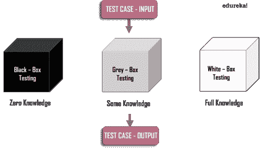
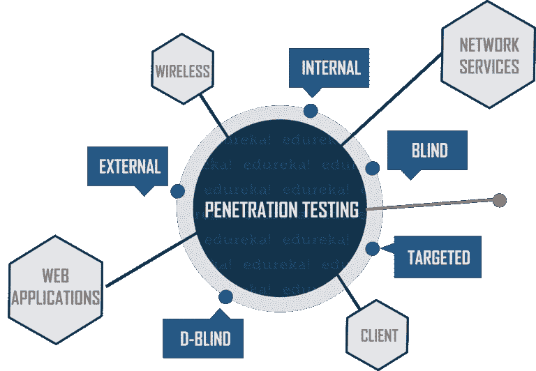

# 什么是渗透测试？—方法和工具的全面指南

> 原文：<https://medium.com/edureka/what-is-penetration-testing-f91668e2291a?source=collection_archive---------1----------------------->

What is Penetration Testing? — Edureka

你可以在任何地方找到技术的精髓。随着企业越来越依赖信息技术，包括云、IOT、移动设备和社交媒体，他们的网络风险继续以惊人的速度增长。几乎每天，你都能找到关于最新网络安全攻击的新标题。黑客正在改进他们的方法，并且仍然以惊人的频率窃取数百万份记录和数十亿美元。对抗这些攻击的一种方法是通过渗透测试。在本文中，我们将探讨什么是渗透测试及其类型。它将回答以下所有关于渗透测试的问题:

1.  什么是渗透测试？
2.  渗透测试有哪些阶段？
3.  什么是不同类型的渗透测试？
4.  渗透测试使用什么工具？

我们开始吧！

# 什么是渗透测试？

渗透测试是在回答一个简单的问题:“ ***网络罪犯会做什么来危害我的组织的计算机系统、应用程序和网络？*** 。它是测试计算机系统、网络或 web 应用程序以发现攻击者可能利用的漏洞的实践，模拟对组织的 It 资产的攻击。

漏洞可能是由多种原因造成的，其中几个基本原因是:

*   硬件和软件设计中的缺陷
*   不安全网络的使用
*   配置不良的计算机系统、网络和应用程序
*   计算机系统的复杂体系结构
*   貌似合理的人为错误

因此，高效的渗透测试有助于发现组织使用的安全工具中的漏洞，发现多种攻击媒介和错误配置。因此，组织可以确定风险的优先级，修复风险，并缩短整体安全响应时间。接下来，通过这篇文章，我们将了解典型的渗透测试是如何进行的。

# 渗透测试有哪些阶段？

渗透测试仪通常从收集尽可能多的目标信息开始。然后，他通过扫描识别系统中可能存在的漏洞。之后他发动了一次袭击。攻击后，他分析每个漏洞和涉及的风险。最后，向上级提交一份详细报告，总结渗透试验的结果。

渗透测试可以分为多个阶段，这取决于组织和渗透测试的类型。

让我们来讨论每个阶段:

## 侦察和规划

第一阶段是计划。在这里，攻击者收集关于目标的尽可能多的信息。数据可以是 IP 地址、域细节、邮件服务器、网络拓扑等。在这个阶段，他还定义了测试的范围和目标，包括要处理的系统和要使用的测试方法。一个专业的渗透测试人员将在这个阶段花费大部分时间，这将有助于进一步的攻击。

## 扫描

根据第一步中收集的数据，攻击者将与目标进行交互，以识别漏洞。这有助于渗透测试人员利用系统中的漏洞发起攻击。这个阶段包括使用端口扫描器、ping 工具、漏洞扫描器和网络映射器等工具。

在测试 web 应用程序时，扫描部分可以是动态的，也可以是静态的。

*   在静态扫描中，目标是识别易受攻击的函数、库和逻辑实现
*   与静态分析相比，动态分析是更实用的扫描方式，在静态分析中，测试人员会将各种输入传递给应用程序并记录响应

## 实际剥削

这是一个至关重要的阶段，必须谨慎从事。这是造成实际损害的步骤。渗透测试人员需要具备一些特殊的技能和技术，才能对目标系统发起攻击。利用这些技术，攻击者将试图获取数据、危害系统、发起 dos 攻击等。检查计算机系统、应用程序或网络可能受到的危害程度。

## 风险分析和建议

渗透测试完成后，最终目标是收集被利用漏洞的证据。这一步主要考虑上面讨论的所有步骤，以及对以潜在风险形式存在的漏洞的评估。有时，在这个步骤中，pen-tester 还会提供一些有用的建议来提高安全级别。

## 报表生成

现在，这是最后也是最重要的一步。在这一步中，渗透测试的结果被汇编成一份详细的报告。该报告通常包含以下详细信息:

*   前一阶段提出的建议
*   发现的漏洞及其风险级别
*   渗透试验的总体总结
*   对未来安全的建议

这些阶段有时可能会因组织和正在进行的渗透测试的类型而异。本文进一步探讨了不同的渗透测试类型。

# 什么是不同类型的渗透测试？

渗透测试可以根据不同的参数进行分类，如对目标的了解、渗透测试仪的位置或执行渗透测试的区域。

## 基于目标知识的渗透测试类型:

***黑匣子***

当攻击者不知道目标时，它被称为黑盒渗透测试。这种类型需要大量的时间，并且笔测试人员使用自动化工具来找到弱点和薄弱点。

***白盒***

当渗透测试者获得目标的完整知识时，这被称为白盒渗透测试。攻击者完全了解 IP 地址、适当的控制、代码样本、操作系统细节等。与黑盒渗透测试相比，它需要的时间更少。

***灰色框***

当测试者有关于目标的部分信息时，它被称为灰箱渗透测试。在这种情况下，攻击者会知道一些目标信息，如 URL、IP 地址等。，但没有完全的知识或访问权限。

## 基于测试者位置的渗透测试类型:

*   如果渗透测试是从网络外部进行的，则称为*外部渗透测试*
*   假设攻击者出现在网络内部，这个场景的模拟被称为*内部渗透测试*
*   *目标测试*通常由组织的 IT 团队和渗透测试团队一起执行
*   在*盲贯入试验*中，除了机构名称外，贯入试验人员没有任何先验信息
*   在*双盲测试*中，最多只有一两个人知道正在进行测试

## 基于执行位置的渗透测试类型:

***网络渗透测试***

网络渗透测试活动旨在发现与组织网络基础设施相关的弱点和漏洞。它涉及防火墙配置和旁路测试、状态分析测试、DNS 攻击等。该测试中检查的最常见软件包包括:

*   安全外壳(SSH)
*   SQL Server
*   关系型数据库
*   简单邮件传输协议(SMTP)
*   文件传送协议

***应用渗透检测***

在应用程序渗透测试中，渗透测试器检查是否在基于 web 的应用程序中发现任何安全漏洞或弱点。核心应用程序组件，如 ActiveX、Silverlight 和 Java 小程序，以及 API 都会被检查。因此，这种测试需要很多时间。

***无线渗透检测***

在无线渗透测试中，公司使用的所有无线设备都要接受测试。包括平板电脑、笔记本、智能手机等物品。该测试从无线接入点、管理员凭证和无线协议方面找出漏洞。

***社会工程***

社会工程测试包括试图通过故意欺骗组织中的一名员工来获得机密或敏感信息。这里有两个子集。

*   *远程测试*——即通过电子手段诱骗员工泄露敏感信息
*   *物理测试*——使用物理手段收集敏感信息，如威胁或勒索员工

***客户端渗透测试***

此类测试的目的是确定客户工作站上运行的软件的安全问题。其主要目标是搜索和利用客户端软件程序中的漏洞。例如，网络浏览器(如 Internet Explorer、Google Chrome、Mozilla Firefox、Safari)、内容创建软件包(如 Adobe Framemaker 和 Adobe RoboHelp)、媒体播放器等。

所以，这些都是基于不同参数的不同类型的贯入试验。现在，在本文的剩余部分，我们将讨论渗透测试人员可以用来进行渗透测试的工具。

# 渗透测试使用哪些工具？

渗透测试人员借助不同类型的渗透工具，使渗透测试更加快速、高效、简单、可靠。有许多流行的渗透测试工具，其中大部分都是免费或开源软件。一些最广泛使用的笔测试工具包括:

*   **Nessus** —是一款网络和 web 应用漏洞扫描程序，可以执行不同类型的扫描，帮助渗透测试人员识别漏洞。
*   **Metasploit**——这是一个充满了各种功能的开发框架。熟练的攻击者可以使用 Metasploit 生成有效负载、外壳代码、获得访问权限并执行权限提升攻击。
*   **Nmap** 或网络映射器—一种端口扫描程序，可扫描系统和网络中与开放端口相关的漏洞。
*   **Wireshark** —是一种分析网络流量和分析网络数据包的工具。

除了以上这些，还有其他的如开膛手约翰，Burp Suite，Cain 和 Abel ，以及很多更流行的工具。

好了，我们已经到了本文的结尾。所以，您知道什么是渗透测试，它的阶段，类型和工具。

如果您想查看更多关于人工智能、DevOps、Cloud 等市场最热门技术的文章，您可以参考 [Edureka 的官方网站。](https://www.edureka.co/blog/?utm_source=medium&utm_medium=content-link&utm_campaign=what-is-penetration-testing)

请留意本系列中的其他文章，它们将解释道德黑客的各个方面。

> 1.[什么是网络安全？](/edureka/what-is-cybersecurity-778feb0da72)
> 
> 2.[网络安全框架](/edureka/cybersecurity-framework-89bbab5aaf17)
> 
> 3.[隐写术教程](/edureka/steganography-tutorial-1a3c5214a00f)
> 
> 4.[什么是网络安全？](/edureka/what-is-network-security-1f659407dcc)
> 
> 5.[什么是计算机安全？](/edureka/what-is-computer-security-c8eb1b38de5)
> 
> 6.[什么是应用安全？](/edureka/application-security-tutorial-e6a0dda25f5c)
> 
> 7.[什么是密码学？](/edureka/what-is-cryptography-c94dae2d5974)
> 
> 8.[道德黑客教程](/edureka/ethical-hacking-tutorial-1081f4aacc53)
> 
> 9.[关于 Kali Linux 你需要知道的一切](/edureka/ethical-hacking-using-kali-linux-fc140eff3300)
> 
> 10.[使用 Python 的道德黑客](/edureka/ethical-hacking-using-python-c489dfe77340)
> 
> 11. [DDOS 攻击](/edureka/what-is-ddos-attack-9b73bd7b9ba1)
> 
> 12.[使用 Python 的 MAC changer](/edureka/macchanger-with-python-ethical-hacking-7551f12da315)
> 
> 13 [ARP 欺骗](/edureka/python-arp-spoofer-for-ethical-hacking-58b0bbd81272)
> 
> 14. [Proxychains，Anonsurf & MacChange](/edureka/proxychains-anonsurf-macchanger-ethical-hacking-53fe663b734)
> 
> 15.[足迹](/edureka/footprinting-in-ethical-hacking-6bea07de4362)
> 
> 16.[50 大网络安全面试问答](/edureka/cybersecurity-interview-questions-233fbdb928d3)

*原载于 2019 年 1 月 10 日 www.edureka.co***。**