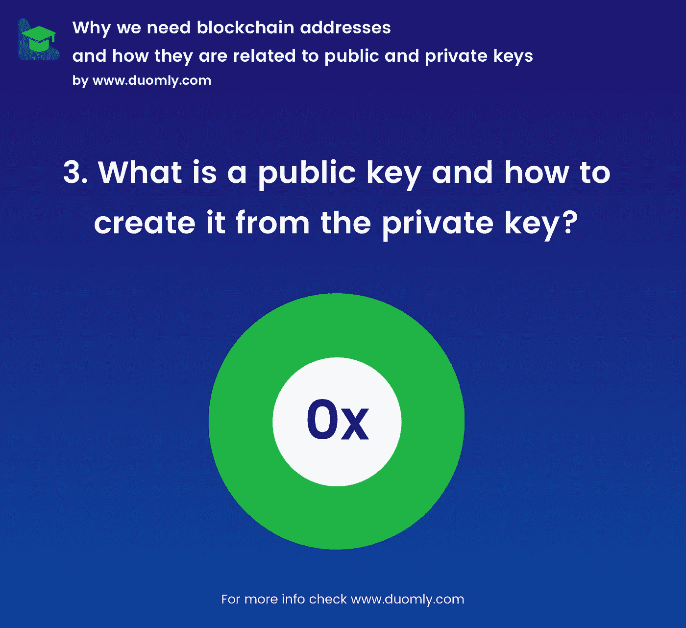

# 什么是私钥和公钥，它们与区块链地址有什么关系

> 原文：<https://medium.com/duomly-blockchain-online-courses/what-is-private-and-public-key-and-how-they-are-related-to-blockchain-addresses-da5514e71d74?source=collection_archive---------1----------------------->

[www.duomly.com](https://www.duomly.com)

当我们想有一个银行账户时，我们必须找到任何银行办事处，与销售主管交谈，给他我们的 ID 和一些其他文件，然后等待一段时间，直到银行员工为我们创建一个合同，银行将创建一个帐户并生成银行账号。

在这整个过程之后，我们可以使用我们的银行帐户，并进行金融活动，如银行转帐。

然而，当我们想进行银行转账时，我们必须等待很长时间，直到收款人收到钱(国外转账有时甚至需要几天)。

我们可以用区块链交易来解决这个问题，这种交易速度非常快(通常情况下，资金在几秒钟内就到了不同的账户上)。

如果我们想创建一个区块链帐户，我们可以找到一个钱包，它将处理选定的区块链，连接它，并创建一个帐户。结果，我们将得到私钥、公钥和帐户地址，但接下来呢，这些密钥是什么，区块链帐户地址是什么，我们为什么需要它们？

现在，我将试着举例说明它们是什么，为什么我们需要所有这三个，以及以更详细的方式创建它们的程序是什么。

**什么是私钥，如何在 Javascript 中创建私钥**

[www.duomly.com](https://www.duomly.com)

私钥是一个秘密数字(在区块链，大部分是 256 位长)，你可以用它从你的账户中汇款/管理你的资金，生成公钥和地址。

重要的是，你永远不应该与任何人共享私钥，用私钥你可以创建你的公钥和地址。

为了简单起见，我们将使用以太坊区块链作为一个例子。

以太坊生成私钥是基于 EC(椭圆曲线)ecp256k1，有趣的是从 1 到⁵⁶-1 的每一个数字都可能是正确的私钥。

让我们看看如何用 node.js 创建简单的私有密钥的相同代码:

> var crypto = require(' crypto ')；
> 
> var private key = crypto . random bytes(32)；
> 
> console . log(private key . tostring(' hex '))；
> 
> //369931d 88354 c 0437 a 753 ADB 1 a 373 b 95 d0c 44 b 2874 DDE 134937725 a7e 819 d7c 9

为此，我们使用 node.js 加密库并生成随机的 32 字节长的密钥。

接下来，当我们希望以人类可读的方式查看它时，我们需要使用方法 toString，并指定“十六进制”类型。

就是这样。我们有了自己的第一把区块链式私人钥匙！

**什么是公钥，如何从私钥创建公钥**

[www.duomly.com](https://www.duomly.com)

现在我们知道了什么是私钥，它是如何工作的，最重要的是我们不应该把私钥分享给任何人，永远，永远！

然而，当我们想要分享某人的密钥来确认我们的真实性时，该怎么办呢？

我们需要创建一个公钥。

公钥是由数字和字母表示的巨大整数，我们可以从私钥创建公钥，但是我们不能恢复这个操作，这意味着你不能从公钥生成私钥。

要生成公钥，我们需要使用像椭圆曲线这样的高级数学，下面是如何在 javascript 中一步一步地从私钥创建公钥的指南:

1.我们需要用 secp256k1 标准创建新的椭圆。

2.接下来，我们将创建一个生成点

3.将私钥定义为一个大数字

5.通过创建生成点乘法来定义公共点

6.创建公共点的 x 和 y 坐标

7.只需创建一个 x 和 y 连接的缓冲区。

8.就是这样！我们有自己的公钥。

这是代码:

> var crypto = require(' crypto ')；
> 
> var elliptic lib = require(' elliptic ')。欧共体；
> 
> var big number = require(' bn . js ')；
> 
> //生成私钥
> 
> var private key = crypto . random bytes(32)；
> 
> console.log('privateKey:'，private key . tostring(' hex '))；
> 
> //private key:67 f 7 f1 ff 9431 e 7 c 7 ddaff 18 B3 db 344493 de 4d 12 c 445 bcae 3 Fe 2 Fe 7091 b 477913
> 
> //生成公钥
> 
> var elliptic = new elliptic lib(' secp 256k 1 ')；
> 
> //这里我们定义生成器点
> 
> var generatorPoint = elliptic.g
> 
> //接下来，我们将私钥更改为大数
> 
> var big number private key = new big number(private key)；
> 
> //这里我们必须为定义公共点创建生成点乘法
> 
> var public point = generator point . mul(bigNumberPrivateKey)；
> 
> //接下来我们将创建公共点的 x 坐标
> 
> var x = publicPoint.getX()。to buffer()；
> 
> //接下来我们将创建公共点的 y 坐标
> 
> var y = publicPoint.getY()。to buffer()；
> 
> //我们将通过从公共点的 x 和 y 坐标创建 concat 的 buff 来创建公共密钥
> 
> var publicKey = Buffer.concat([x，y])；
> 
> console.log('publicKey:'，publicKey.toString('hex '))
> 
> //public key:bb 98 C1 D8 e 489 ffdf 4d 8752 e 6 FB 5357954471 c 52 f 76 D7 b 35384556214605 fb7a 82305 c 64d 26 e 8 CB 43 fc 6 c 64 ff 80 a 4 af 644033 c B0 c 8 f 9 c 77 e 4749 FBD 7963 e 2 B3 a 6

**什么是区块链地址，如何从公钥创建它**

[www.duomly.com](https://www.duomly.com)

当我们创建一个公钥时，我们是安全的，因为从一个公钥中找到我们的私钥是非常困难的(几乎是不可能的)和非常长的操作。

为了增加更多的安全性，我们将通过添加 sha256 类型的散列来创建我们的区块链地址，所以现在我们可以确保没有人会恢复所有这些操作来获取我们的私钥。

从公钥创建区块链地址很简单，我们需要用 sha256 标准散列我们的公钥。

代码如下:

> var crypto = require(' crypto ')；
> 
> var elliptic lib = require(' elliptic ')。欧共体；
> 
> var big number = require(' bn . js ')；
> 
> //生成私钥
> 
> var private key = crypto . random bytes(32)；
> 
> console.log('privateKey:'，private key . tostring(' hex '))；
> 
> //private key:3 f1ac 42 c 37 c 9726625 BFA 850902 c 49054 a 57 F5 C1 aafc 577736d 2711048079 af 3
> 
> //生成公钥
> 
> var elliptic = new elliptic lib(' secp 256k 1 ')；
> 
> //这里我们定义生成器点
> 
> var generatorPoint = elliptic.g
> 
> //接下来，我们将私钥更改为大数
> 
> var big number private key = new big number(private key)；
> 
> //这里我们必须为定义公共点创建生成点乘法
> 
> var public point = generator point . mul(bigNumberPrivateKey)；
> 
> //接下来我们将创建公共点的 x 坐标
> 
> var x = publicPoint.getX()。to buffer()；
> 
> //接下来我们将创建公共点的 y 坐标
> 
> var y = publicPoint.getY()。to buffer()；
> 
> //我们将通过从公共点的 x 和 y 坐标创建 concat 的 buff 来创建公共密钥
> 
> var publicKey = Buffer.concat([x，y])；
> 
> console.log('publicKey:'，public key . tostring(' hex '))；
> 
> //public key:d 9 c 5797 CD 271799027 a 68 e9 BAE 2c 92 a 54855940 c 292 ccaa 1 b 24 b 264 e 27461 b 5 e 7 bdff 45918 f 328 f 993 aa 7094 a 59 a 60 AAA 0fa 9 C1 BF 422 ee 27 a9 af 3669 b 82 a 7
> 
> //从公钥生成地址
> 
> var address = ' 0x '+crypto . create hmac(' sha 256 '，publicKey)。digest(' hex ')；
> 
> console.log('address:'，address)；
> 
> //地址:0 x2 b 8 DDA 3a 53 CAE 74974 ade 7600387 b 31 DD 3 ba 825d 9 b 5207d 65 AFB 8 db 0 b 34 b 2230

**总结**

现在你知道什么是私人钥匙，保证他的安全有多重要。

此外，您还了解了什么是公钥和地址，为什么我们需要它们，以及如何从头开始创建这些密钥。

如果你有更多关于区块链的问题，请继续阅读我和 duomly 的故事。

[www.duomly.com](https://www.duomly.com)

感谢阅读，

拉多斯瓦夫·法比西克，

[的核心开发者多](https://www.duomly.com)