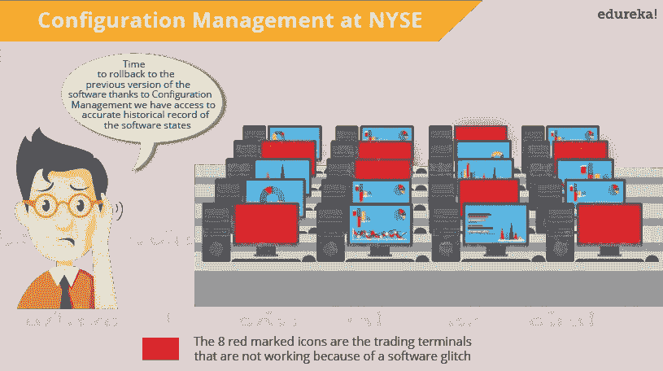
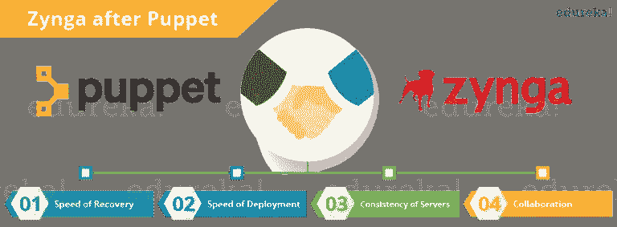

# 什么是木偶？—使用 Puppet 进行配置管理

> 原文：<https://medium.com/edureka/what-is-puppet-9129b5f44a5a?source=collection_archive---------1----------------------->

今天，最成熟的配置管理工具是 Puppet。但是，我知道您一定想知道为什么 Puppet 如此受欢迎，与其他配置管理工具相比，它有什么独特之处。在这篇“什么是木偶”的文章中，我将为你回答这些问题，并帮助你走上成为一名认证 DevOps 工程师的道路。

# 什么是木偶？

Puppet 是一个配置管理工具，用于部署、配置和管理服务器。它执行以下功能:

*   为每台主机定义不同的配置，并持续检查和确认主机上所需的配置是否到位且未被更改(如果被更改，Puppet 将恢复到所需的配置)。
*   机器的动态放大和缩小。
*   提供对所有已配置机器的控制，因此集中的(主服务器或基于 repo 的)更改会自动传播到所有机器。

Puppet 使用主从架构，其中主设备和从设备在 SSL 的帮助下通过安全的加密通道进行通信。

# 什么是 Puppet —关键指标

以下是一些关于木偶的事实:

*   **安装基数大:**全球超过 30，000 家公司使用 Puppet，包括 Google、Red Hat、Siemens 等。以及斯坦福和哈佛法学院等几所大学。平均每天有 22 个新组织首次使用 Puppet。
*   **庞大的开发者群体:** Puppet 应用如此广泛，以至于很多人都在为它开发。Puppet 的核心源代码有许多贡献者。
*   **长期商业跟踪记录:**木偶从 2005 年开始投入商业使用，一直在不断完善和改进。它已经被部署在非常大的基础设施(5，000 多台机器)中，从这些项目中获得的性能和可伸缩性经验对 Puppet 的开发做出了贡献。
*   **文档:** Puppet 有一个由用户维护的大型 wiki，里面有数百页的文档和关于该语言及其资源类型的综合参考资料。此外，它在几个邮件列表上被积极讨论，并有一个非常受欢迎的 IRC 频道，所以无论你的木偶问题是什么，都很容易找到答案。
*   **平台支持:** Puppet Server 可以运行在任何支持 ruby for ex 的平台上:CentOS、Microsoft Windows Server、Oracle Enterprise Linux 等。它不仅支持新的操作系统，还可以运行在相对旧的和过时的操作系统和 Ruby 版本上。

很明显，木偶在全球有着巨大的需求。但是，在深入研究 Puppet 之前，公平起见，我首先解释一下什么是配置管理以及它为什么重要。

# 结构管理

系统管理员通常执行重复的任务，例如安装服务器、配置这些服务器等。他们可以通过编写脚本来自动完成这项任务，但当您在大型基础设施上工作时，这是一项非常繁忙的工作。

为了解决这个问题，引入了配置管理。配置管理是系统地处理变更的实践，以便系统随着时间的推移保持其完整性。配置管理(CM)确保系统的当前设计和构建状态是已知的、良好的和可信的；并且不依赖开发团队的隐性知识。它允许访问系统状态的准确历史记录，用于项目管理和审计目的。配置管理克服了以下挑战:

*   当需求改变时，找出哪些组件需要改变。
*   重做实现，因为自上次实现以来需求已经改变。
*   如果您用一个新的但有缺陷的版本替换了该组件，则恢复到以前的版本。
*   更换错误的组件，因为您无法准确确定哪个组件需要更换。

让我们通过一个用例来理解它的重要性。

我所知道的最好的例子是纽约证券交易所。一个软件“故障”导致纽约证券交易所股票交易中断近 90 分钟。这导致了数百万美元的损失。新的软件安装导致了问题。该软件安装在 20 个交易终端中的 8 个上，并在前一天晚上对系统进行了测试。然而，在早上，它无法在 8 个终端上正常运行。所以有必要切换回旧软件。你可能认为这是纽约证券交易所配置管理过程的失败，但事实上，这是成功的。由于正确的配置管理流程，NYSE 在 90 分钟内就从那种情况中恢复过来，这是相当快的速度。如果问题持续的时间更长，后果会更严重。

现在，我希望你知道配置管理的重要性。配置管理阶段可以被认为是 DevOps 的主干。它允许以最安全和最可靠的方式更频繁地发布软件。

接下来让我们看看 Puppet 的一些应用。

# 什么是木偶——木偶的应用

让我们通过一个案例来了解 Puppet 的应用。如果你是一个扑克爱好者，或者你曾经玩过网络游戏，那么你一定听说过 Zynga。它是世界上最大的社交游戏开发商。Zynga 的基础设施使用公共云和私有数据中心的数万台服务器。早期，他们使用手动流程，包括 Kickstarter 和后安装来让数百台服务器上线。

现在，我们将看到他们在这个过程中面临着什么问题:

*   **可扩展性&一致性** — Zynga 经历了惊人的增长，其基础设施需要跟上行业的步伐。基于脚本的解决方案和手动方法不足以满足他们的需求。
*   **便携式基础设施** — Zynga 需要一种方法来在他们的公共云基础设施和自己的数据中心中利用一致的配置管理方法。
*   **灵活性** —鉴于 Zynga 游戏特性的多样性，团队能够快速为正确的机器匹配正确的配置非常重要。
*   **基础设施洞察** —随着组织的成熟，拥有可视化每台机器属性的自动化方法变得越来越重要。

该公司足够聪明，甚至在他们达到快速扩展之前就迅速意识到自动化过程的需要，这就是 Puppet 出现的原因。让我们了解一下 Puppet 是如何为他们的组织做出贡献的。

*   **恢复速度** —生产运营团队可以快速将正确的配置部署到正确的机箱中。如果系统被不恰当地重新配置，Puppet 会自动将其恢复到上次的稳定状态，或者提供快速手动修复系统所需的详细信息。
*   **部署速度** —在运营团队为游戏工作室提供服务的方式上，Puppet 节省了大量时间。
*   **服务器的一致性** — Puppet 的模型驱动框架确保了部署的一致性。Zynga 生产运营副总裁马克·斯托克福特表示:“很明显，我们节省了时间。使用 Puppet 的好处在于，它允许我们每次都在短时间内跨服务器交付一致的配置。”
*   **协作** —采用模型驱动的方法可以轻松地在整个组织中共享配置，使开发人员和运营团队能够合作，确保新服务的交付具有极高的质量。Zynga 团队中的十几个人接受了木偶训练。这些知识已经在整个团队中传播，并传播到每个游戏工作室的运营团队。

这是我关于 Nagios 面试问题的文章的结尾。如果你想查看更多关于人工智能、Python、道德黑客等市场最热门技术的文章，你可以参考 Edureka 的官方网站。

请留意本系列中的其他文章，它们将解释 DevOps 的各个方面。

> *1。* [*DevOps 教程*](/edureka/devops-tutorial-89363dac9d3f)
> 
> *2。* [*Git 教程*](/edureka/git-tutorial-da652b566ece)
> 
> *3。* [*詹金斯教程*](/edureka/jenkins-tutorial-68110a2b4bb3)
> 
> *4。* [*码头工人教程*](/edureka/docker-tutorial-9a6a6140d917)
> 
> *5。* [*Ansible 教程*](/edureka/ansible-tutorial-9a6794a49b23)
> 
> *6。* [*木偶教程*](/edureka/puppet-tutorial-848861e45cc2)
> 
> *7。* [*厨师教程*](/edureka/chef-tutorial-8205607f4564)
> 
> *8。* [*Nagios 教程*](/edureka/nagios-tutorial-e63e2a744cc8)
> 
> *9。* [*如何编排 DevOps 工具？*](/edureka/devops-tools-56e7d68994af)
> 
> *10。* [*连续交货*](/edureka/continuous-delivery-5ca2358aedd8)
> 
> *11。* [*持续集成*](/edureka/continuous-integration-615325cfeeac)
> 
> *12。* [*连续部署*](/edureka/continuous-deployment-b03df3e3c44c)
> 
> *13。* [*持续交付 vs 持续部署*](/edureka/continuous-delivery-vs-continuous-deployment-5375642865a)
> 
> *14。* [*CI CD 管道*](/edureka/ci-cd-pipeline-5508227b19ca)
> 
> *15。* [*Docker 作曲*](/edureka/docker-compose-containerizing-mean-stack-application-e4516a3c8c89)
> 
> *16。* [*码头工人群*](/edureka/docker-swarm-cluster-of-docker-engines-for-high-availability-40d9662a8df1)
> 
> *17。* [*Docker 联网*](/edureka/docker-networking-1a7d65e89013)
> 
> *18。* [*易变拱顶*](/edureka/ansible-vault-secure-secrets-f5c322779c77)
> 
> *19。* [*岗位职责*](/edureka/ansible-roles-78d48578aca1)
> 
> *20。* [*适用于 AWS*](/edureka/ansible-for-aws-provision-ec2-instance-9308b49daed9)
> 
> *21。* [*詹金斯管道*](/edureka/jenkins-pipeline-tutorial-continuous-delivery-75a86936bc92)
> 
> 22。 [*顶级 Docker 命令*](/edureka/docker-commands-29f7551498a8)
> 
> *23。*[*Git vs GitHub*](/edureka/git-vs-github-67c511d09d3e)
> 
> *24。* [*顶级 Git 命令*](/edureka/git-commands-with-example-7c5a555d14c)
> 
> 25。 [*DevOps 面试问题*](/edureka/devops-interview-questions-e91a4e6ecbf3)
> 
> *二十六。* [*谁是 DevOps 工程师？*](/edureka/devops-engineer-role-481567822e06)
> 
> *二十七。* [*DevOps 生命周期*](/edureka/devops-lifecycle-8412a213a654)
> 
> *28。*[*Git Reflog*](/edureka/git-reflog-dc05158c1217)
> 
> *29。* [*易变条款*](/edureka/ansible-provisioning-setting-up-lamp-stack-d8549b38dc59)
> 
> 30。 [*组织正在寻找的顶尖 DevOps 技能*](/edureka/devops-skills-f6a7614ac1c7)
> 
> *30。* [*瀑布 vs 敏捷*](/edureka/waterfall-vs-agile-991b14509fe8)
> 
> *31。* [*詹金斯小抄*](/edureka/jenkins-cheat-sheet-e0f7e25558a3)
> 
> *32。* [*Ansible 备忘单*](/edureka/ansible-cheat-sheet-guide-5fe615ad65c0)
> 
> *33。* [*Ansible 面试问答*](/edureka/ansible-interview-questions-adf8750be54)
> 
> *34。* [*50 码头工人面试问题*](/edureka/docker-interview-questions-da0010bedb75)
> 
> *35。* [*敏捷方法论*](/edureka/what-is-agile-methodology-fe8ad9f0da2f)
> 
> *36。* [*詹金斯面试问题*](/edureka/jenkins-interview-questions-7bb54bc8c679)
> 
> *37。* [*Git 面试问题*](/edureka/git-interview-questions-32fb0f618565)
> 
> *38。* [*Docker 架构*](/edureka/docker-architecture-be79628e076e)
> 
> 39。[*devo PS 中使用的 Linux 命令*](/edureka/linux-commands-in-devops-73b5a2bcd007)
> 
> 40。 [*詹金斯 vs 竹子*](/edureka/jenkins-vs-bamboo-782c6b775cd5)
> 
> *41。* [*Nagios 教程*](/edureka/nagios-tutorial-e63e2a744cc8)
> 
> *42。* [*Nagios 面试问题*](/edureka/nagios-interview-questions-f3719926cc67)
> 
> 43。 [*DevOps 实时场景*](/edureka/jenkins-x-d87c0271af57)
> 
> 44。 [*詹金斯和詹金斯 X 的区别*](/edureka/jenkins-vs-bamboo-782c6b775cd5)
> 
> 45。[*Windows Docker*](/edureka/docker-for-windows-ed971362c1ec)
> 
> *46。*[*Git vs Github*](http://git%20vs%20github/)

*原载于 2016 年 11 月 18 日*[*https://www.edureka.co*](https://www.edureka.co/blog/what-is-puppet/)*。*