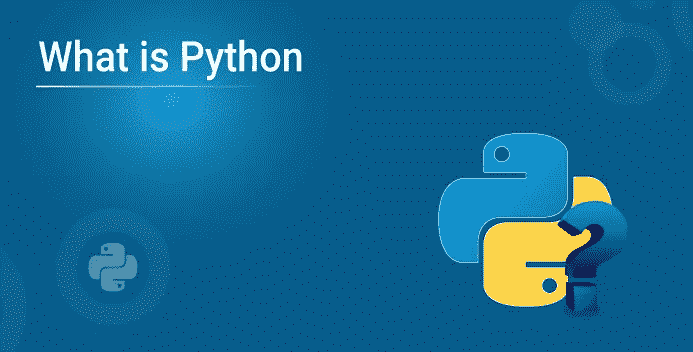
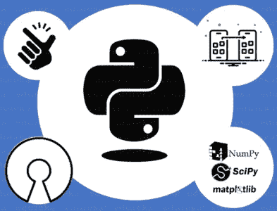
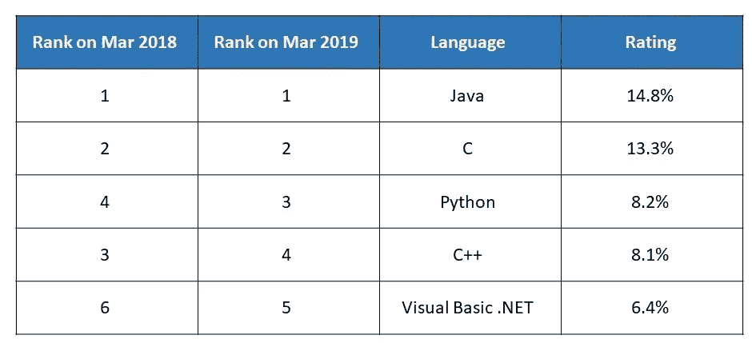

# Python 是什么？—初学者指南

> 原文：<https://medium.com/edureka/what-is-python-21d016f1fb33?source=collection_archive---------5----------------------->

**Python 是什么？好吧，好奇心把你带到了这里。阅读这篇博客的大多数人要么完全是编程新手，要么只是想知道它在世界各地引起的轰动。因此，让我们继续深入了解什么是 Python。**

这篇文章包括:

*   Python 是什么？
*   为什么是 Python？
*   Python 是怎么用的？
*   Python 特性
*   Python 基础

# Python 是什么？

因此，让我通过正式向您介绍什么是 Python 来消除误解。Python 是一种**高级**、**解释的**语言，具有**简单**语法和**动态**语义。Python 比其他编程语言简单得多，可以帮助您更轻松地创建漂亮的应用程序。

# 为什么是 Python？

你可能想知道为什么要使用 Python？让我帮助你理解在 Python 的正式定义中使用关键字。

*   **高级** Python 从我们人类用来相互交流的**自然语言**中派生出组件。这使得任何人都可以更容易地尝试和联系到底会发生什么，而不用承担查看大量**机器代码**的负担。
*   **解释的** Python 代码被编译**逐行**这使得调试错误变得更加容易和高效。但是这是有代价的，因为它比其他编程语言慢得多。
*   **简单语法** Python 利用**缩进**而不是大括号来区分哪些代码块属于哪个类或函数。这使得代码看起来很好**分布**并且让任何人都容易阅读。
*   动态语义
    如果你是一个老程序员，你会知道在使用任何东西之前，你需要**初始化**它。这一切都是动态进行的。

# Python 是怎么用的？

理解了什么是 Python，为什么要用它，你就会想，当你掌握了它，你能做什么。名单出奇的长。举个例子，

*   使用 Python 框架创建 web 应用程序，如 **Django** 和 **Flask**
*   您可以为正在使用的软件创建工作流程
*   使用 Python 修改存储在**数据库**中的文件和数据
*   **科学**、**分析**和复杂的计算都可以轻松搞定
*   使用 Python 可以更快地创建软件，因为 Python 已经可以部署了

这个清单还在继续。使用 Python 作为解决问题的首选语言，你会有一个非常好的职业生涯。让我列举几个你可以追求的头衔。

*   **数据科学家** 数据科学家是破解**复杂的**问题的人，这些问题涉及数学、统计领域，并以逻辑的方式提出这些问题的解决方案。
*   **软件工程师** 软件工程师根据需求设计、开发、测试和维护他们为客户创建的软件应用程序。
*   **Web 开发人员** Web 开发人员使用**客户机-服务器**模型创建 Web 应用程序来为他们的用户服务。存在诸如信息共享、社交网络平台、娱乐之类的应用，这只是其中的几个例子。

# Python 特性

Python 是**慢**。然而，它的受欢迎程度并没有停止增长，因为它可以用更少的代码实现更好的生产力，使 Python 成为最受欢迎的语言之一。Python 有一系列吸引几乎所有人开始用它编码的特性。

*   **简单** Python 本身就是一种简单。你所需要知道的就是**缩进**是如何工作的，你可以用更少的代码行编写最复杂的问题。
*   **开源** Python 是**免费**给任何人使用。你甚至可以自由地修改 Python 的代码来更好地满足你自己的需求，而不用面对任何后果。
*   **可移植性** 代码写一次**就可以跨**不同系统**运行**。当一个团队在一个项目中工作时，这非常有用。
*   **嵌入属性** Python 允许嵌入 C、C++等其他语言的**代码**，这让它的功能强大了很多，通用性也更强了。
*   **解释** 如你所知，Python 是逐行编译的，这使得**调试**更加容易，并且**内存管理**更加高效
*   **库支持** Python 支持**库**，您可以使用这些库并开始获取您的**解决方案**。这些图书馆的社区是非常活跃和有益的
*   **哎呀** 面向对象的概念帮助你**在你的代码中复制**真实世界的场景，同时也为它们提供**安全性**，这样你就可以获得一个制作精良的应用程序

研究和统计数据已经证明，Python 是有史以来发展最快的语言。使用跟踪流行度增长的 TIOBE 包，我们获得了以下数据。

# Python 基础

总之，让我们写一个小程序。你可以按照这个循序渐进的指南来设置自己。

`print('Hello world. Welcome to Edureka!')`

**输出:**你好世界。欢迎来到 Edureka！

如果你想查看更多关于人工智能、DevOps、道德黑客等市场最热门技术的文章，那么你可以参考 [Edureka 的官方网站。](https://www.edureka.co/blog/?utm_source=medium&utm_medium=content-link&utm_campaign=whats-python)

请留意本系列中的其他文章，它们将解释 Python 和数据科学的各个方面。

> *1。*[*Python 中的机器学习分类器*](/edureka/machine-learning-classifier-c02fbd8400c9)
> 
> *2。*[*Python Scikit-Learn Cheat Sheet*](/edureka/python-scikit-learn-cheat-sheet-9786382be9f5)
> 
> *3。* [*机器学习工具*](/edureka/python-libraries-for-data-science-and-machine-learning-1c502744f277)
> 
> *4。* [*用于数据科学和机器学习的 Python 库*](/edureka/python-libraries-for-data-science-and-machine-learning-1c502744f277)
> 
> *5。*[*Python 中的聊天机器人*](/edureka/how-to-make-a-chatbot-in-python-b68fd390b219)
> 
> *6。* [*Python 集合*](/edureka/collections-in-python-d0bc0ed8d938)
> 
> *7。* [*Python 模块*](/edureka/python-modules-abb0145a5963)
> 
> *8。* [*Python 开发者技能*](/edureka/python-developer-skills-371583a69be1)
> 
> *9。* [*哎呀面试问答*](/edureka/oops-interview-questions-621fc922cdf4)
> 
> *10。* [*一个 Python 开发者的简历*](/edureka/python-developer-resume-ded7799b4389)
> 
> *11。*[*Python 中的探索性数据分析*](/edureka/exploratory-data-analysis-in-python-3ee69362a46e)
> 
> *12。* [*蛇与蟒蛇的游戏*](/edureka/python-turtle-module-361816449390)
> 
> *13。* [*Python 开发者工资*](/edureka/python-developer-salary-ba2eff6a502e)
> 
> *14。* [*主成分分析*](/edureka/principal-component-analysis-69d7a4babc96)
> 
> 15。[*Python vs c++*](/edureka/python-vs-cpp-c3ffbea01eec)
> 
> *16。* [*刺儿头教程*](/edureka/scrapy-tutorial-5584517658fb)
> 
> *17。*[*Python SciPy*](/edureka/scipy-tutorial-38723361ba4b)
> 
> 18。 [*最小二乘回归法*](/edureka/least-square-regression-40b59cca8ea7)
> 
> 19。 [*Jupyter 笔记本小抄*](/edureka/jupyter-notebook-cheat-sheet-88f60d1aca7)
> 
> 20。 [*Python 基础知识*](/edureka/python-basics-f371d7fc0054)
> 
> *21。* [*Python 模式程序*](/edureka/python-pattern-programs-75e1e764a42f)
> 
> *22。*[*Python 中的*](/edureka/generators-in-python-258f21e3d3ff) 生成器
> 
> *23。* [*Python 装饰器*](/edureka/python-decorator-tutorial-bf7b21278564)
> 
> *24。*[*Python Spyder IDE*](/edureka/spyder-ide-2a91caac4e46)
> 
> *25。*[*Python 中使用 Kivy 的移动应用*](/edureka/kivy-tutorial-9a0f02fe53f5)
> 
> *26。* [*十大最佳学习书籍&练习 Python*](/edureka/best-books-for-python-11137561beb7)
> 
> *27。* [*机器人框架与 Python*](/edureka/robot-framework-tutorial-f8a75ab23cfd)
> 
> *28。*[*Python 中的贪吃蛇游戏*](/edureka/snake-game-with-pygame-497f1683eeaa)
> 
> *29。* [*Django 面试问答*](/edureka/django-interview-questions-a4df7bfeb7e8)
> 
> *30。* [*十大 Python 应用*](/edureka/python-applications-18b780d64f3b)
> 
> *31。*[*Python 中的哈希表和哈希表*](/edureka/hash-tables-and-hashmaps-in-python-3bd7fc1b00b4)
> 
> *32。*[*Python 中的套接字编程是什么*](/edureka/socket-programming-python-bbac2d423bf9)
> 
> 33。 [*支持向量机*](/edureka/support-vector-machine-in-python-539dca55c26a)
> 
> 34。 [*Python 教程*](/edureka/python-tutorial-be1b3d015745)

*原载于 2019 年 11 月 26 日*[*https://www.edureka.co*](https://www.edureka.co/blog/what-is-python/)*。*