# 什么是 REST API？RESTful APIs 综合指南

> 原文：<https://medium.com/edureka/what-is-rest-api-d26ea9000ee6?source=collection_archive---------0----------------------->

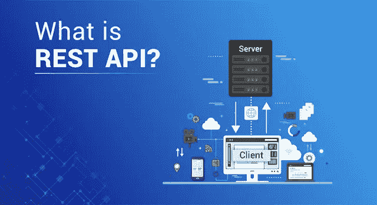

What is REST API? — Edureka

自从互联网发明以来，我们一直在使用不同的应用程序和网页来获取各种资源的数据。但是，你有没有想过，这个数据是从哪里来的？我们从服务器上获取数据。因此，在这篇关于什么是 REST API 的文章中，让我们看看客户机如何与服务器通信来提取所需的信息。

本文将涵盖以下主题:

*   REST API 的需求
*   什么是 REST API？
*   REST API 的原理
*   REST API 的方法
*   如何创建一个 REST API？

现在，在我为你定义 REST API 之前，让我带你看一个例子，让你理解 REST API 的需求。

# REST API 的需求

考虑一个使用“我的图书秀”应用程序的场景。显然，这个应用程序需要大量的输入数据，因为应用程序中的数据从来都不是静态的。要么是电影频繁上映，要么是不同的城市在一天的不同时间放映不同语言的电影。它从来都不是静态的，这意味着在这些应用程序中数据总是在变化的。

现在，你认为我们从哪里得到这些数据？

这些数据是从服务器上接收的，通常被称为网络服务器。因此，客户端通过 API 向服务器请求所需的信息，然后服务器向客户端发送响应。

在这里，发送给客户机的响应是以 HTML 网页的形式。但是，您认为这是您发送请求时所期望的恰当响应吗？

嗯，我假设你会说不，因为你更喜欢数据以结构化格式返回，而不是完整的网页。

因此，由于这些原因，服务器响应客户机请求返回的数据要么是 JSON 格式的，要么是 XML 格式的。JSON 和 XML 格式都有适当的数据层次结构。

这听起来很简单，对吧？

但是，到目前为止，这个框架中存在的唯一问题是，你必须使用许多方法来获得所需的信息。事实上，当您需要复杂的数据时，使用这些方法来检索信息变得相当麻烦。

所以，这就是 REST API 的用武之地。REST API 创建一个对象，然后发送对象的值来响应客户端。

现在，您已经知道了 REST 的必要性，接下来在本文中，让我们来看看什么是 REST API？

# 什么是 REST API？

REST 建议为客户机请求的数据创建一个对象，并将对象的值发送给用户。例如，如果用户请求在班加罗尔的某个地点和时间看电影，那么您可以在服务器端创建一个对象。

所以，在这里，你有一个对象，你发送一个对象的状态。这就是为什么 REST 被称为表征状态转移。

如果我必须定义 REST，那么，表述性状态转移也称为 REST，它是一种架构风格，也是一种用于通信目的的方法，经常在各种 web 服务开发中使用。

REST 的架构风格有助于利用较少的带宽，使应用程序更适合互联网。它通常被认为是互联网的*语言*，并且完全基于资源。

为了更好地理解，让我们深入一点，看看 REST API 到底是如何工作的。基本上，REST API 分解一个事务，以便创建小模块。现在，这些模块中的每一个都用于处理交易的特定部分。这种方法提供了更多的灵活性，但是需要从头开始进行大量的工作。

现在，您已经知道了什么是 REST API，接下来让我们来理解一个应用程序被认为是 REST API 所必须满足的约束或原则。

# **REST API 原理**

菲尔丁博士提出了六条基本原则，他是 2000 年定义 REST API 设计的人。以下是休息的六个指导原则:

## 无国籍的

从客户端发送到服务器的请求将包含使服务器理解从客户端发送的请求所需的所有信息。这可以是 URL、查询字符串参数、正文甚至标题的一部分。URL 用于唯一地标识资源，并且主体保存请求资源的状态。一旦服务器处理了请求，就会通过主体、状态或头向客户端发送响应。

## 客户端-服务器

客户机-服务器体系结构支持统一的接口，并将客户机与服务器分开。这增强了跨多个平台的可移植性以及服务器组件的可伸缩性。

## 统一界面

为了获得整个应用程序的一致性，REST 有以下四个接口约束:

*   资源标识
*   使用表示的资源操作
*   自我描述的消息
*   作为应用程序状态引擎的超媒体

## 可缓冲的

为了提供更好的性能，应用程序通常是可缓存的。这是通过隐式或显式地将来自服务器的响应标记为可缓存或不可缓存来实现的。如果响应被定义为可缓存的，那么客户机缓存可以在将来为等效的响应重用响应数据。

## 分层系统

分层系统架构通过限制组件行为，使应用程序更加稳定。这种类型的体系结构有助于增强应用程序的安全性，因为每一层中的组件不能与它们所在的下一层之外的组件进行交互。此外，它还支持负载平衡，并提供共享缓存来提高可伸缩性。

## **按需编码**

这是一个可选约束，使用最少。它允许下载客户代码或小程序，并在应用程序中使用。本质上，它通过创建一个不依赖于自身代码结构的智能应用程序来简化客户端。

现在，您已经了解了 REST API 背后的原理，接下来让我们研究 REST API 的方法。

# REST API 的方法

我们所有使用网络技术的人，都在做 CRUD 操作。当我说 CRUD 操作时，我的意思是我们创建一个资源、读取一个资源、更新一个资源和删除一个资源。现在，要完成这些操作，您实际上可以使用 HTTP 方法，这些方法就是 REST API 方法。参考下文。

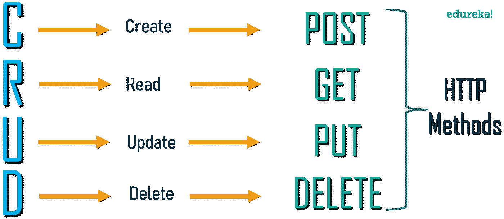

现在您已经知道了什么是 REST API，以及为了交付一个高效的应用程序您需要注意什么，让我们更深入地了解构建 REST API 的过程。

# 如何创建一个 REST API？

在这个实际演示中，我将使用 Node.js 创建一个简单的 CRUD REST 应用程序。

1.  节点. js
2.  快递. js
3.  约伊
4.  节点监控器

对于这次实践，我将使用 WebStorm IDE 来编写和执行代码。您可以根据自己的选择使用任何 IDE 或代码编辑器。那么，我们开始吧。

**步骤 1:** 创建一个项目目录，该目录将包含项目中存在的所有文件。然后，打开命令提示符并导航到项目目录。参考下文。

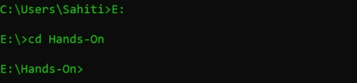

**步骤 2:** 现在，使用下面的命令调用 npm。这将初始化您系统中的 npm 模块。

```
npm init
```

点击 enter 后，Node.js 会要求您输入一些与项目相关的详细信息。这些细节基本上是你的项目的元数据。参考下文。

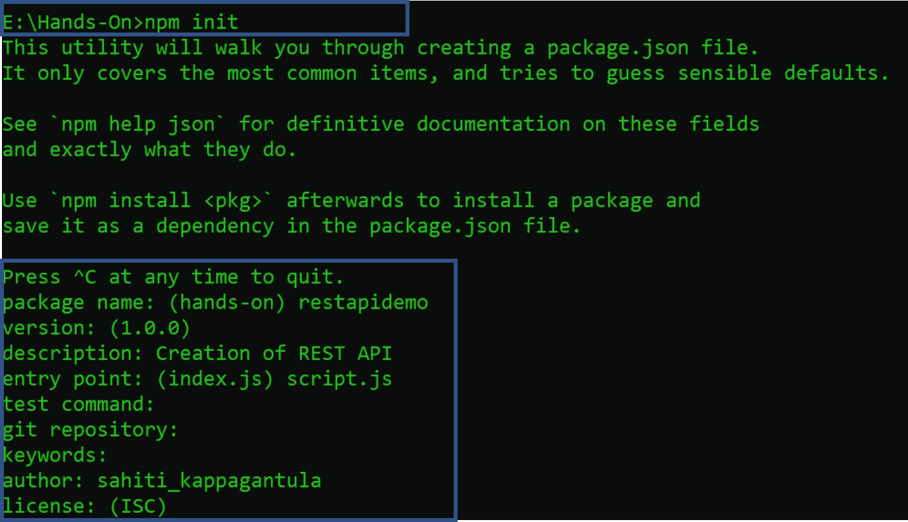

在这里，您可以定义您的入口点以及其他一些信息。对于这个演示，我将使用 **script.js** 作为切入点。

然后，它会要求您确认您必须提到的数据。只需按下 **Y** 即可确认。参考下文。

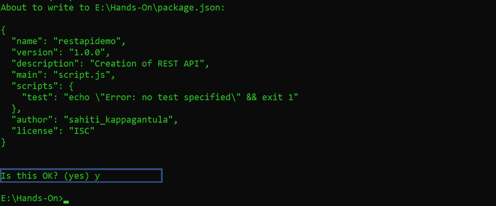

**步骤 3:** 接下来，使用下面的命令安装**步骤 3: Express.js** :

```
npm i express
```

Express 是一个可以与 Node.js 一起使用的 web 框架。这个 web 框架将允许您创建 Restful APIs，借助帮助器方法、中间层来配置您的应用程序。

**步骤 3.1:** 同样，你也要安装 **Joi** 。

```
npm i joi
```

这个包允许你为存储信息的 JavaScript 对象创建蓝图，以确保关键信息的有效性。

**步骤 3.2:** 最后，使用下面的命令安装节点监控包 **nodemon** 。

```
npm i -g nodemon
```

Nodemon，监视该文件夹中任何扩展名类型的所有文件。此外，有了观察器上的 nodemon，您不必在每次进行任何更改时都重新启动 Node.js 服务器。Nodemon 将隐式地检测这些更改，并为您重新启动服务器。

## **package.json**

```
{
"name": "restapidemo",
"version": "1.0.0",
"description": "Creation of REST API",
"main": "script.js",
"scripts": {
"test": "echo \"Error: no test specified\" &amp;&amp; exit 1"
},
"author": "sahiti_kappagantula",
"license": "ISC",
"dependencies": {
"express": "^4.17.1",
"joi": "^14.3.1"
}
}
```

## **script.js**

```
const express = require('express'); //Import Express
const Joi = require('joi'); //Import Joi
const app = express(); //Create Express Application on the app variable
app.use(express.json()); //used the json file

//Give data to the server
const customers = [
{title: 'George', id: 1},
{title: 'Josh', id: 2},
{title: 'Tyler', id: 3},
{title: 'Alice', id: 4},
{title: 'Candice', id: 5}
]

//Read Request Handlers
// Display the Message when the URL consist of '/'
app.get('/', (req, res) => {
res.send('Welcome to Edurekas REST API!');
});
// Display the List Of Customers when URL consists of api customers
app.get('/api/customers', (req,res)=> {
res.send(customers);
});
// Display the Information Of Specific Customer when you mention the id.
app.get('/api/customers/:id', (req, res) => {
const customer = customers.find(c => c.id === parseInt(req.params.id));
//If there is no valid customer ID, then display an error with the following message
if (!customer) res.status(404).send('<h2 style="font-family: Malgun Gothic; color: darkred;">Ooops... Cant find what you are looking for!</h2>');
res.send(customer);
});

//CREATE Request Handler
//CREATE New Customer Information
app.post('/api/customers', (req, res)=> {

const { error } = validateCustomer(req.body);
if (error){
res.status(400).send(error.details[0].message)
return;
}
//Increment the customer id
const customer = {
id: customers.length + 1,
title: req.body.title
};
customers.push(customer);
res.send(customer);
});

//Update Request Handler
// Update Existing Customer Information
app.put('/api/customers/:id', (req, res) => {
const customer = customers.find(c=> c.id === parseInt(req.params.id));
if (!customer) res.status(404).send('<h2 style="font-family: Malgun Gothic; color: darkred;">Not Found!! </h2>');

const { error } = validateCustomer(req.body);
if (error){
res.status(400).send(error.details[0].message);
return;
}

customer.title = req.body.title;
res.send(customer);
});

//Delete Request Handler
// Delete Customer Details
app.delete('/api/customers/:id', (req, res) => {

const customer = customers.find( c=> c.id === parseInt(req.params.id));
if(!customer) res.status(404).send('<h2 style="font-family: Malgun Gothic; color: darkred;"> Not Found!! </h2>');

const index = customers.indexOf(customer);
customers.splice(index,1);

res.send(customer);
});
//Validate Information
function validateCustomer(customer) {
const schema = {
title: Joi.string().min(3).required()
};
return Joi.validate(customer, schema);

}

//PORT ENVIRONMENT VARIABLE
const port = process.env.PORT || 8080;
app.listen(port, () => console.log(`Listening on port ${port}..`));
```

**第四步:**现在，下一步是检查处理程序是否正常工作。为此，我们将使用名为 Postman 的 Chrome 扩展。要安装 Postman，你可以访问[这里](https://chrome.google.com/webstore/detail/postman/fhbjgbiflinjbdggehcddcbncdddomop?hl=en)并点击**添加到 Chrome** 。

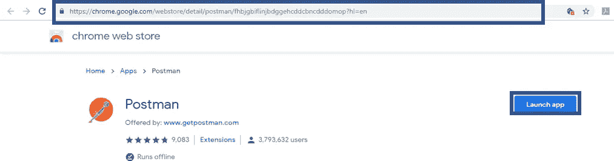

**步骤 5:** 现在，一旦你安装了 Postman，打开它测试你的应用程序。

步骤 6: 但在此之前，你必须启动你的服务器。要启动服务器，请键入以下命令。

```
node script.js
```

您将看到如下输出:

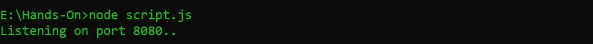

# 结果

让我们从测试 GET 方法开始。

**第七步:**为了做到这一点，你需要**从下拉列表中选择获取**，**输入定义好的网址**并点击**发送**。

如果您的代码运行良好，那么您将看到我们在代码中手动添加的所有客户的列表。在下面的图片中，你可以看到我的结果。这里我提到了 URL 是*localhost:8080/API/customers*

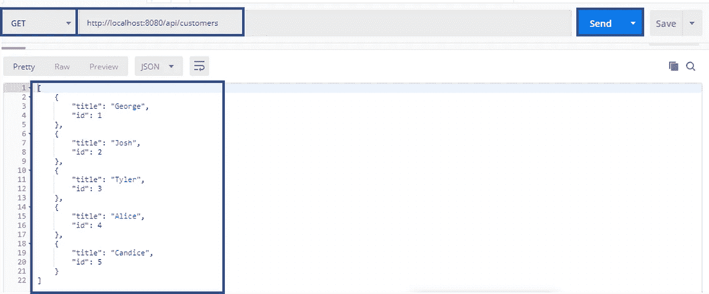

第 8 步:现在，让我们尝试向我们的客户堆栈中添加一个新客户。为此，从下拉列表中选择' **POST** '，并输入 POST 方法的定义 URL。然后，点击' **Body** '，选择' **raw** '并从下拉列表中选择' **JSON** '，如下图所示。现在，**在文本区域，**键入您的客户名称，如图所示，然后点击**发送。**

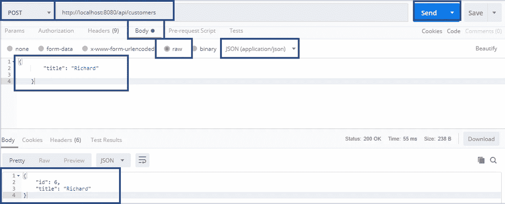

如果您的 POST 方法运行良好，您的响应正文将包含新客户的名称以及客户 ID。在这里，如果你观察，我们只提到了名称，但我们没有给客户 id。这意味着客户 ID 会自动递增。

第 9 步:现在，让我们尝试更新一个客户名称。假设我们想要更新客户 ID = 3 的名字。因此，要更新数据，您需要首先从下拉表中选择' **PUT** ，并输入 PUT 请求的 URL 以及您希望更新的客户 id。接下来，在“**正文**”中，键入新的客户名称，并按回车键。

这将给你一个带有*客户 id 和更新的客户名称*的响应。

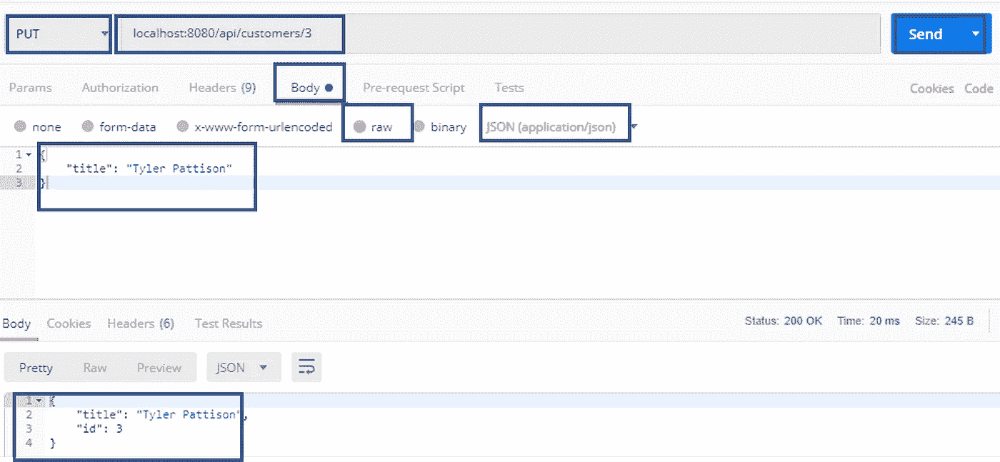

**第 10 步:**最后，让我们发送一个“**删除**请求来删除一个现有的记录。从下拉列表中选择**删除**，并键入您想要删除的删除请求处理程序的 URL 以及客户的详细信息，然后按 enter 键。比方说，我想删除一个 id = 3 的客户的详细信息。如果您的交易成功，您将在回复正文中看到已删除条目的完整详细信息。

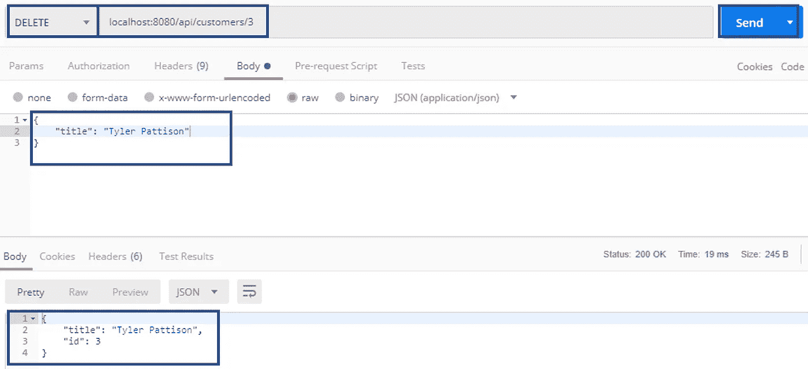

现在，让我们为我们的最终客户列表发送一个 GET 请求。

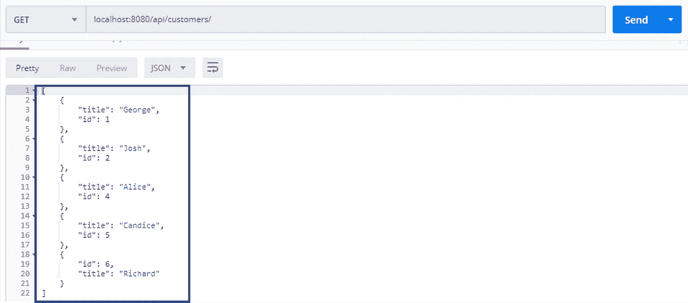

从上面的屏幕截图可以看出，响应正文总共包含五个客户，其中客户 id 3 缺失，因为我们已经删除了该条目。

至此，我们结束了这篇关于“什么是 REST API？”。如果你想查看更多关于人工智能、Python、道德黑客等市场最热门技术的文章，那么你可以参考 [Edureka 的官方网站。](https://www.edureka.co/blog/?utm_source=medium&utm_medium=content-link&utm_campaign=what-is-rest-api)

请留意本系列中的其他文章，它们将解释 Web 开发的各个方面。

> 1. [ReactJS 教程](/edureka/reactjs-tutorial-aa087fd7fc90)
> 
> 2. [React 路由器 v4 教程](/edureka/react-router-2aab4e781736)
> 
> 3. [React Redux 教程](/edureka/react-redux-tutorial-2b3d81cfd3f7)
> 
> 4. [HTML vs HTML5](/edureka/html-vs-html5-83302f95652e)
> 
> 5.[反应堆组件](/edureka/react-components-65dc1d753af5)
> 
> 6.[颤振 vs 反应原生](/edureka/flutter-vs-react-native-58133fbf9f33)
> 
> 7.[前端开发者技能](/edureka/front-end-developer-skills-ebb32d19f488)
> 
> 8.[前端开发者简历](/edureka/front-end-developer-resume-c3d443f98296)
> 
> 9.[网络开发项目](/edureka/web-development-projects-b01f0fe85d3f)

*原载于 2019 年 6 月 18 日*[*https://www.edureka.co*](https://www.edureka.co/blog/what-is-rest-api/)*。*