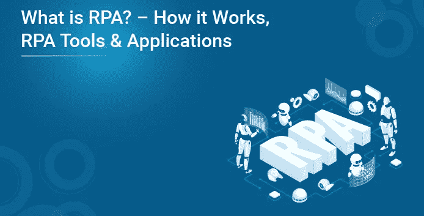
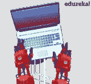
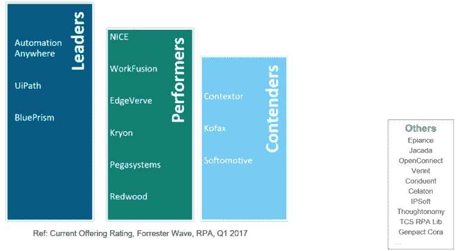
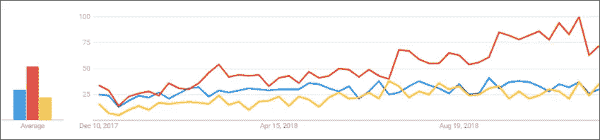

# RPA 是什么？|工作原理，RPA 工具和应用程序| Edureka

> 原文：<https://medium.com/edureka/what-is-rpa-how-2eb5f511fcc0?source=collection_archive---------8----------------------->

随着世界朝着使用各种技术的方向前进，自动化也改进了它的方式，使我们的工作变得更容易。尽管自动化这个词是在 20 世纪 50 年代创造的，但很少有人真正理解它的含义。那么，在这篇关于“什么是 RPA”的博客中？我将讨论什么是机器人过程自动化及其各种因素。

以下是本博客涵盖的主题:

*   RPA 是什么？
*   RPA 是如何工作的？
*   RPA 怎么入门？
*   RPA 工具
*   RPA 工具的比较
*   RPA 工具的市场趋势
*   RPA 的应用

那么，我们先从了解什么是 RPA 开始吧？

# RPA 是什么？

在机器人的帮助下实现业务运营自动化以减少人工干预的过程被称为机器人流程自动化(RPA)。

如果我必须一个一个地解释这些术语，那么

*   机器人是模仿人类行为的实体，称为机器人。
*   一个过程是导致有意义活动的一系列步骤。比如泡茶的过程或者你喜欢的菜等等。
*   自动化是指机器人在没有人类干预的情况下完成的任何过程。

因此，当我们将所有这些术语总结在一起时，然后模仿人类的行为来执行一系列步骤，从而导致有意义的活动，而无需任何人类干预，这也被称为机器人流程自动化。

如果您希望进一步了解机器人过程自动化，那么我建议您浏览一下这个关于什么是 RPA 的有趣视频。

# RPA 是如何工作的？

这个问题总是出现在 RPA 是否使用物理机器人，或者是否有实际的机器人来自动执行任务。

好吧，让我告诉你，RPA 不会用真正的机器人代替人类。但是，市场上有一些软件可以让您配置自动化工作流来自动化您的业务运营。据我们的专家称，由于市场上缺乏技能组合，RPA 认证培训的需求将增长 150%。

尽管我提到过 RPA 是通过软件实施的，而这些软件不过是 RPA 工具/供应商，但在我们开始讨论工具之前，让我告诉您一些关于如何开始使用 RPA 的指导原则。

# RPA 怎么入门？

要开始使用 RPA，您需要遵循以下步骤:

*   **第一步:**广泛了解 RPA 背后的历史。也就是说，学习所有关于传统自动化的知识。
*   **步骤 2:** 了解 RPA 以及 RPA 的各种应用。
*   **步骤 3:** 选择您希望自动化的流程，并回顾流程依赖关系。这是一种确保您的业务在您忙于自动化任务时不会遭受损失的方法。
*   **步骤 4:** 获得大量 RPA 工具实践经验，如 UiPath、Blue Prism 和 Automation Anywhere。

继续这篇关于什么是 RPA 的文章，让我告诉你 RPA 市场上的顶级工具，它们将帮助你自动化任务。

# RPA 工具

RPA 工具/供应商是一种软件，您可以通过它来配置任务以实现自动化。在当今的市场上，有许多 RPA 供应商，如 Blue Prism、Automation Anywhere、UiPath、WorkFusion、Pega Systems 等等。但是，市场的领导者是三巨头(UiPath、Blue Prism & Automation Anywhere)。参考下面 Forester 关于 RPA 的研究，了解各种 RPA 工具的当前排名。

# 顶级工具比较

正如我之前提到的，RPA 市场的领导者是 UiPath、Blue Prism 和 Automation Anywhere。这些工具是行业中用于各种目的的最广泛使用的工具。这些工具各有优缺点。

让我们先来看看这些工具的市场趋势。

## RPA 工具的市场趋势

这里，红线是 UiPath，蓝线是蓝色棱镜，黄线是任何地方的自动化。从图中可以明显看出，UiPath 在这里是赢家。现在，如果你想知道*为什么 UiPath 赢得了比赛*？

那么，可以考虑下表，了解 UiPath 领先游戏背后的原因。

功能 suipath blue prism automation anywhere 有试用版吗？社区版/免费版提供试用版提供试用版提供 30 天它用户友好吗？提供了用户友好的可视化设计器提供了用户友好的可视化设计器，比 Automation 更容易开发人员友好但需要很高的编程技巧。受欢迎程度最受欢迎的工具在任何地方都比自动化更受欢迎三者中最不受欢迎的工具

所有工具的功能和结构都是相似的。但是，如果你是自动化的新手，想学习如何自动化任务，那么 UiPath 提供了一个带有拖放可视化设计器的免费版本。这个工具不需要编程知识，可以按照你的意愿自动完成任意数量的任务。

所以，如果你能掌握一种工具，那么这将会给你一个良好的开端来增加你的职业机会。

继续这篇关于什么是 RPA 的文章，让我快速告诉您 RPA 的各种应用。

# RPA 的应用

德勤、埃森哲、凯捷等跨国公司在日常工作中使用机器人流程自动化。这些公司受益于 RPA，因为它提供了准确、可靠、一致的输出和高生产率。现在，让我告诉您 RPA 的主要应用，以便您了解 RPA 可用于的各个领域。

如上图所示，RPA 提供的不仅仅是测试。通过在会计、金融服务和人力资源行业使用，一个人的压力减少了，可以更好地利用他的才能。因此，RPA 是一项可以让您的工作变得轻松、可靠的技术。

因此，朋友们，我们到此结束这篇“什么是 RPA”的文章。如果你想查看更多关于人工智能、DevOps、道德黑客等市场最热门技术的文章，你可以参考 Edureka 的官方网站。

*原载于 2018 年 3 月 13 日*[*【https://www.edureka.co*](https://www.edureka.co/blog/what-is-robotic-process-automation/)*。*