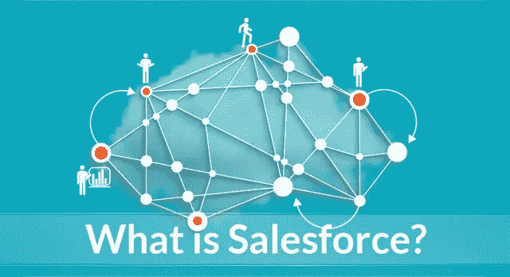
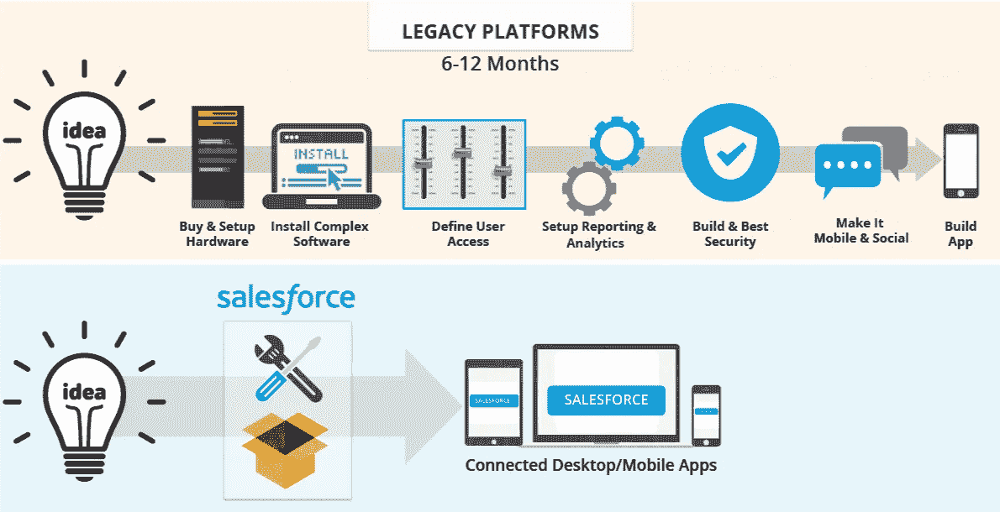
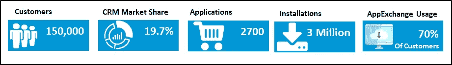
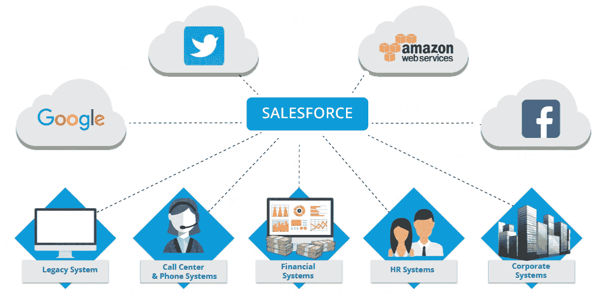
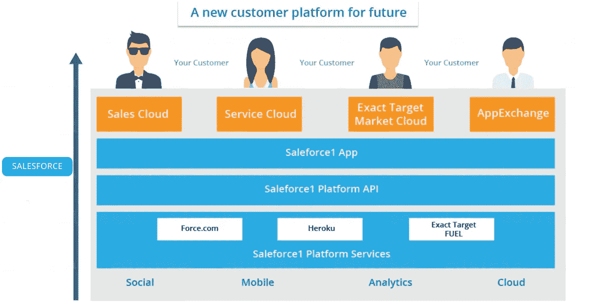
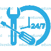
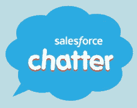
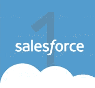
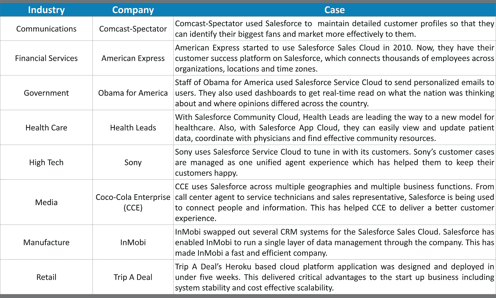
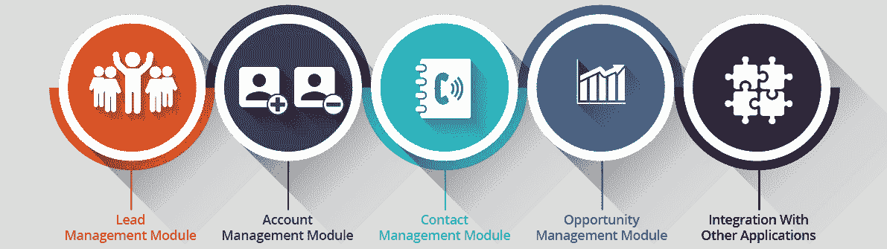

# 什么是 Salesforce？Salesforce 初学者指南

> 原文：<https://medium.com/edureka/what-is-salesforce-5df4830aee98?source=collection_archive---------0----------------------->

What is Salesforce? — Edureka

近年来，云计算技术有了很大的发展。对计算世界产生巨大影响的技术之一是 Salesforce。在本文中，我将向您介绍 Salesforce，并将回答:什么是 Salesforce？为什么使用 Salesforce？Salesforce 在哪里使用？以及为什么公司都在找专业人士。

# 这一切是如何开始的？

在 Salesforce 之前，客户关系管理(CRM)解决方案托管在公司自己的服务器上。你能想象公司拥有自己的 CRM 解决方案所花费的成本和时间吗？嗯，过去建立它需要几个月甚至几年的时间，成本高达数百万美元。即使在安装之后，它们也很难使用。对此可行的解决方案是什么？我相信您已经猜到了——构建价格合理的 CRM 软件，并完全以在线服务的形式交付。这是 Salesforce 背后的主要理念。Salesforce 最初是一家软件即服务(SaaS)公司，现已发展成为全球第五大软件公司。

# 是什么让 Salesforce 一炮而红？

答案很简单，那就是云计算。Salesforce 不仅仅是以很小的成本提供更好的产品。它是关于取代冗长的安装过程和移动一切到互联网上。他们改变了商业模式——不再有长期合同或昂贵的许可协议，任何人都可以使用 Salesforce，只需每月支付 50 美元的订阅费。

# 为什么选择 Salesforce？

在我回答什么是 Salesforce 这个问题之前，让我简单介绍一下您为什么应该选择 Salesforce。

*   如上图所示，Salesforce 为您提供了从创意到应用的最快路径。您可以使用 Salesforce 工具专注于构建您的应用程序，而不是自己构建基础架构和工具。这可以为您节省数年的时间和数百万美元。
*   Salesforce 客户通常认为它是独一无二的，主要有三个原因:

1.  快速—传统的 CRM 软件可能需要一年多的时间来部署，而 Salesforce 则需要几个月甚至几周。
2.  简单— Salesforce 在*易于使用*类别中轻松胜出。你可以花更多的时间去使用它，花更少的时间去解决它。
3.  有效—因为它易于使用并且可以定制以满足业务需求，所以客户发现 Salesforce 非常有效。

*   Salesforce 位于云中，因此您的团队可以在任何能够访问互联网的地方使用它。
*   如果你是一家正在快速变化的企业，或者你是一家已经存在多年的经验丰富的公司，你的企业可能也在变化。Salesforce 完全可以根据您的增长进行扩展。
*   Salesforce 与第三方应用程序无缝集成。如果你想将 Salesforce 与 Gmail 集成，你可以这样做；如果你想将它与你的会计软件集成，你也可以这样做。另一方面，与其他 CRM 的集成很困难。
*   Salesforce 价格合理，尤其是考虑到它的各种功能时。即使是创业公司和小企业也可以使用 Salesforce。

# 促使您选择 Salesforce 的统计数据

截至 2016 年 5 月，Salesforce 在全球拥有超过 150，000 名客户。在 CRM 领域，Salesforce 以 19.7%的市场份额占据主导地位。其最接近的竞争对手 SAP (12.1%)、甲骨文(9.1%)和微软(6.2%)都远远落后。Salesforce AppExchange 拥有超过 2，700 个应用程序，这些应用程序总共驱动了超过 300 万次安装，超过 70%的 Salesforce 客户使用 AppExchange 上列出的应用程序。今天，许多公司正在 Salesforce 平台上开发他们的应用程序，或者正在迁移到 Salesforce。这增加了对 Salesforce 开发人员和管理员的需求。目前，Salesforce Architect 是技术简历中最热门的技能之一。

> “在最有价值的工作技能中，Salesforce Architect 的平均工资最高。”–商业内幕

# 什么是 Salesforce？

我希望我已经回答了你为什么应该选择 Salesforce 的问题。现在，让我向您介绍 Salesforce，并回答您心中的问题:什么是 Salesforce？下图展示了 Salesforce 在当今科技发达的世界中的力量。从谷歌和脸书这样的科技巨头到您附近的呼叫中心，他们都使用 Salesforce 服务和产品来解决他们的问题。

[Salesforce](https://www.edureka.co/blog/salesforce-tutorial?utm_source=medium&utm_medium=content-link&utm_campaign=what-is-salesforce) 最初是一家软件即服务(SaaS) CRM 公司。Salesforce 现在提供各种软件解决方案和平台，供用户和开发人员开发和分发定制软件。Salesforce.com 基于多租户架构。这意味着多个客户共享共同的技术，并且都运行在最新版本上。您不必担心应用程序或基础架构升级，它们会自动发生。这有助于您的组织专注于创新，而不是管理技术。

# Salesforce 提供哪些服务和产品？

要了解什么是 Salesforce，您需要了解 Salesforce 必须提供的不同服务和产品以及何时使用它们。通过 Salesforce，您可以访问云、社交和移动领域的各种产品和服务。下图显示了 Salesforce 向其客户提供的不同服务和产品。

# Salesforce 提供的云服务包括:

## **Salesforce 销售云**

销售云是一个 CRM 平台，使您能够管理您组织的销售、营销和客户支持方面。如果你的公司从事企业对企业(B2B)和企业对客户(B2C)，那么销售云就是你的销售团队需要的服务。

## **Salesforce 营销云**

[营销云](https://www.edureka.co/blog/salesforce-marketing-cloud?utm_source=medium&utm_medium=content-link&utm_campaign=what-is-salesforce)为您提供世界上最强大的数字营销平台之一。您组织中的营销人员可以使用它来管理客户旅程、电子邮件、手机、社交媒体、web 个性化、内容创建、内容管理和数据分析。

## **Salesforce 服务云**

[服务云](https://www.edureka.co/blog/salesforce-service-cloud?utm_source=medium&utm_medium=content-link&utm_campaign=what-is-salesforce)是为您组织的客户服务和支持团队提供的服务平台。它提供了案例跟踪和用于对话和分析的社交网络插件等功能。这不仅有助于您的代理更快地解决客户问题，还能让您的客户获得答案。使用这些答案，您的客户可以自己解决问题。

## **Salesforce 社区云**

如果您的组织需要一个社交平台来连接和促进员工、合作伙伴和客户之间的交流，那么 Salesforce Community Cloud 就是您需要的服务。你可以利用这个平台实时交换数据和图像。

## **Salesforce 商务云**

商务云使您的组织能够提供无缝的客户服务和体验，而不管您的客户在哪里(在线或店内)。它还提供客户数据集成，以便您的消费者可以获得更好的体验。如果您的目标是为客户提供积极、有吸引力的客户体验，那么商务云就是您需要的服务。

## **Salesforce 分析云**

分析云为您的组织提供了一个商业智能平台，以处理大型数据文件，创建图形、图表和其他数据的图形表示。它针对移动访问和数据可视化进行了优化，并且可以与其他 Salesforce 云集成。

## **Salesforce 应用云**

要开发将在 Salesforce 平台上运行的自定义应用程序，您可以使用 Salesforce 应用程序云。它为您提供了一组开发工具，您可以利用这些工具来创建定制的应用程序。应用云中的一些工具包括:

*   **Force.com**，允许管理员和开发者在主 Salesforce.com 应用中创建网站和应用。
*   AppExchange 是一个在线应用市场，面向在 Force.com 平台上运行的第三方应用。
*   Heroku Enterprise 为开发人员提供了使用他们喜欢的语言和工具创建应用程序的灵活性。
*   **Salesforce Thunder** 是大数据和规则处理引擎，旨在分析事件并采取个性化行动。
*   **Salesforce 沙盒**允许开发者在安全和隔离的开发环境中测试想法。

## **Salesforce 物联网云**

当您的组织需要存储和处理物联网(IoT)数据时，您可以利用 Salesforce IoT cloud 的服务。该平台旨在接收由设备、传感器、网站、应用程序、客户和合作伙伴生成的海量数据。收到这些数据后，平台会采取行动，为您提供实时响应。

## **Salesforce 健康云**

如果您是一家医疗 IT 组织，并且需要一个包含医患关系和记录管理的 CRM 系统，那么医疗云就是您所需要的。通过患者档案，您可以通过集成来自多个数据源的信息来支持一对一的关系。

# Salesforce 提供的其他服务包括:

## **喋喋不休**

Chatter 是 Salesforce 的企业协作平台，可让您的员工进行协作。Chatter 可以帮助您联系员工，无论他们身在何处，从而提高生产力。它也有助于一个组织或不同组织的部门之间的知识共享。

## **销售力量 1**

Salesforce1 是使您能够通过应用程序编程接口(API)开发应用程序和交换数据的平台。API 是指预先构建的编程代码组件。

# 哪些公司使用 Salesforce？

现在，我们已经清楚地了解了什么是 Salesforce 以及何时使用哪种服务，让我们看看不同行业的各个公司在哪里使用 Salesforce。

*Source: Salesforce.com*

# Salesforce 用例

我们已经在上面看到了不同的公司如何使用 Salesforce 来解决问题和提高生产力。现在，让我们看看印度斯坦计算机有限公司(HCL)如何利用 Salesforce 解决其业务挑战。

1.  HCL 希望迎合不断变化的业务需求。为了解决这个问题，HCL 希望实施、集成并迁移到新的销售团队应用程序(SFA——自动化业务任务的软件)。净 SFA。
2.  HCL 希望克服由多个应用程序导致的数据冗余和不一致的挑战。

为了解决这些业务挑战，HCL 选择使用 Salesforce.com 实施 SFA。HCL 评估了 Salesforce，发现它满足了他们在安全性、治理、协作以及与第三方应用程序集成方面的要求。

上图显示了为解决这些挑战而实施的不同模块。下面我已经详细解释了这些模块。

## **销售线索管理模块**

HCL 使用 Salesforce 标准解决方案进行销售线索捕获和分配、销售线索确认和转化。他们开发了一个定制解决方案，用于从外部来源捕获销售线索，并筛选销售线索以防止重复。

## **账户管理模块**

HCL 使用 Salesforce 标准帐户管理模块并实施了自定义解决方案，用于定义实时搜索客户帐户的业务逻辑，管理数据流并管理每日批量更新。

## **联系人管理模块**

HCL 使用包括活动管理在内的 Salesforce 标准联系人管理模块，并实施了自定义解决方案来管理帐户转换后的数据流。

## **机会管理模块**

HCL 使用标准的 Salesforce opportunity 模块，并开发了一个自定义解决方案，用于向 opportunity 添加产品、启用手动产品定价以及为 opportunity 产品创建折扣审批。

## **与其他应用程序集成**

通过使用 AppExchange 应用程序和定制的 Web 服务 API，Salesforce 与 SAP、ODS、BI 和各种第三方应用程序等应用程序集成。

HCL 在四个月内实施了 Salesforce1 销售云，用户采用率达到 92%。对于一个影响了 14 个国家 6200 多名用户的项目来说，四个月是很快的。易于与第三方应用程序集成，生产力提高了 3-4%。使用 Salesforce，HCL 能够在数据输入时验证数据。这使得他们的主数据达到了令人难以置信的 90%的准确率。

希望你已经了解了 Salesforce，得到了什么是 Salesforce 的答案。如果你想查看更多关于人工智能、DevOps、道德黑客等市场最热门技术的文章，那么你可以参考 [Edureka 的官方网站。](https://www.edureka.co/blog/?utm_source=medium&utm_medium=content-link&utm_campaign=what-is-salesforce)

请留意本系列中解释 Salesforce 各个方面的其他文章。

> 1. [Salesforce 教程](/edureka/salesforce-tutorial-5bac7659e0c5)
> 
> 2. [Salesforce 开发人员教程](/edureka/salesforce-developer-1051ba8ce733)
> 
> 3. [Salesforce 服务云](/edureka/salesforce-service-cloud-b8b8dbdae9f9)
> 
> 4. [Salesforce 营销云](/edureka/salesforce-marketing-cloud-d057c266d87f)

*原载于 2017 年 1 月 4 日 www.edureka.co**的* [*。*](https://www.edureka.co/blog/what-is-salesforce/)