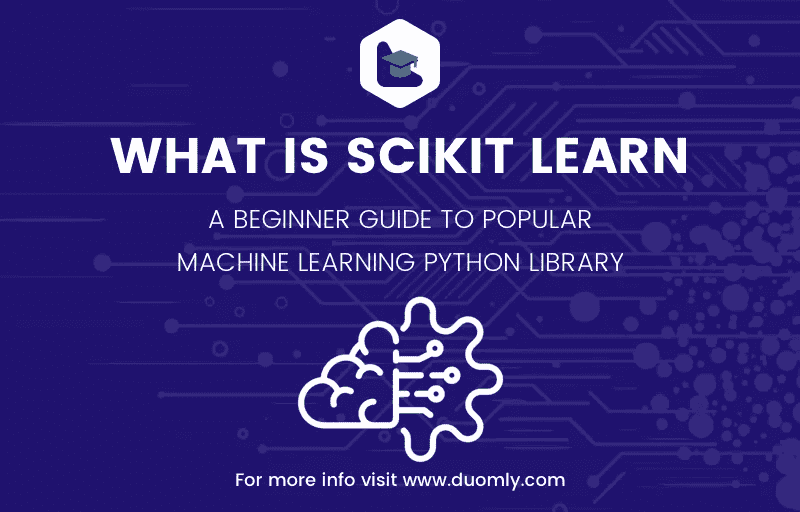

# 什么是 scikit learn——流行的机器学习 Python 库的初学者指南

> 原文：<https://medium.com/duomly-blockchain-online-courses/what-is-scikit-learn-a-beginner-guide-to-popular-machine-learning-python-library-df810e52f016?source=collection_archive---------2----------------------->



[Duomly — programming online courses](https://www.duomly.com)

本文最初发表于:

[](https://www.blog.duomly.com/what-is-scikit-learn-introduction-to-popular-machine-learning-and-data-science-python-library/) [## 什么是 scikit learn -流行的机器学习和数据科学 Python 库介绍…

### Scikit-learn 是用于数据科学和机器学习的最广泛使用的 Python 包之一。它使您能够…

www.blog.duomly.com](https://www.blog.duomly.com/what-is-scikit-learn-introduction-to-popular-machine-learning-and-data-science-python-library/) 

Scikit-learn 是用于数据科学和机器学习的最广泛使用的 Python 包之一。它使您能够执行许多操作，并提供各种算法。Scikit-learn 还提供了关于其类、方法和函数的优秀文档，以及对所用算法背景的解释。

Scikit-learn 支持:

*   数据预处理，
*   降维，
*   型号选择，
*   回归，
*   分类，
*   聚类分析。

它还提供了几个数据集，您可以用来测试您的模型。

Scikit-learn 并没有实现与机器学习相关的所有东西。例如，它不全面支持:

*   神经网络，
*   自组织地图(Kohonen 的网络)，
*   关联规则学习，
*   强化学习，等等。

Scikit-learn 是建立在 NumPy 和 SciPy 之上的，所以您至少需要了解这两个库的基础知识才能有效地应用它。

Scikit-learn 是一个开源包。像 Python 生态系统中的大多数东西一样，它甚至对于商业用途也是免费的。它是在 BSD 许可下授权的。

本文旨在简明地介绍 scikit-learn 的一些可能性，但不涉及太多细节。

# 数据预处理

您可以使用 scikit-learn 为机器学习算法准备数据:标准化或规范化数据、编码分类变量等等。

让我们首先定义一个 NumPy 数组:

```
>>> import numpy as np
>>> x = np.array([[0.1, 1.0, 22.8],
...               [0.5, 5.0, 41.2],
...               [1.2, 12.0, 2.8],
...               [0.8, 8.0, 14.0]])
>>> x
array([[ 0.1,  1\. , 22.8],
       [ 0.5,  5\. , 41.2],
       [ 1.2, 12\. ,  2.8],
       [ 0.8,  8\. , 14\. ]])
```

您通常需要以这样的方式转换数据，即每列(要素)的平均值为零，标准差为一。您可以应用 sk learn . preprocessing . standard scaler 类来完成此操作:

```
>>> from sklearn.preprocessing import StandardScaler
>>> scaler = StandardScaler()
>>> scaled_x = scaler.fit_transform(x)
>>> scaler.scale_
array([ 0.40311289,  4.03112887, 14.04421589])
>>> scaler.mean_
array([ 0.65,  6.5 , 20.2 ])
>>> scaler.var_
array([1.6250e-01, 1.6250e+01, 1.9724e+02])
>>> scaled_x
array([[-1.36438208, -1.36438208,  0.18512959],
       [-0.3721042 , -0.3721042 ,  1.4952775 ],
       [ 1.36438208,  1.36438208, -1.23894421],
       [ 0.3721042 ,  0.3721042 , -0.44146288]])
>>> scaled_x.mean().round(decimals=4)
0.0
>>> scaled_x.mean(axis=0)
array([ 1.66533454e-16, -1.38777878e-17,  1.52655666e-16])
>>> scaled_x.std(axis=0)
array([1., 1., 1.])
>>> scaler.inverse_transform(scaled_x)
array([[ 0.1,  1\. , 22.8],
       [ 0.5,  5\. , 41.2],
       [ 1.2, 12\. ,  2.8],
       [ 0.8,  8\. , 14\. ]])
```

有时，您会有一些分类数据，需要将其转换成有意义的数字。其中一种方法是使用 sk learn . preprocessing . onehotencoder 类。

```
>>> from sklearn.preprocessing import OneHotEncoder
>>> roles = np.array([('Tom', 'manager'),
...                   ('Mary', 'developer'),
...                   ('Ann', 'recruiter'),
...                   ('Jim', 'developer')])
>>> roles
array([['Tom', 'manager'],
       ['Mary', 'developer'],
       ['Ann', 'recruiter'],
       ['Jim', 'developer']], dtype='<u9')>>> encoder = OneHotEncoder()
>>> encoded_roles = encoder.fit_transform(roles[:, [1]])
>>> encoded_roles.toarray()
array([[0., 1., 0.],
       [1., 0., 0.],
       [0., 0., 1.],
       [1., 0., 0.]])</u9')>
```

在上面的例子中，对象 encoded_roles 的第一列指示每个雇员是否是开发人员。第二个和第四个雇员(Mary 和 Jim)是。第二列与经理的职位有关。只有第一个员工(Tom)有这个职位。最后，第三列对应于招聘人员，第三个雇员(Ann)就是那个人。

# 降维

降维包括选择或提取多维数据集最重要的组成部分(特征)。Scikit-learn 提供了几种降维方法。其中之一是主成分分析或 PCA。

# 型号选择

在训练和测试机器学习模型时，需要将数据集随机分成训练集和测试集。这包括输入及其相应的输出。函数 sk learn . model _ selection . train _ test _ split()在这种情况下很有用:

```
>>> import numpy as np
>>> from sklearn.model_selection import train_test_split
>>> x, y = np.arange(1, 21).reshape(-1, 2), np.arange(3, 40, 4)
>>> x
array([[ 1,  2],
       [ 3,  4],
       [ 5,  6],
       [ 7,  8],
       [ 9, 10],
       [11, 12],
       [13, 14],
       [15, 16],
       [17, 18],
       [19, 20]])
>>> y
array([ 3,  7, 11, 15, 19, 23, 27, 31, 35, 39])
>>> x_train, x_test, y_train, y_test =\
...     train_test_split(x, y, test_size=0.4, random_state=0)
>>> x_train
array([[ 3,  4],
       [13, 14],
       [15, 16],
       [ 7,  8],
       [ 1,  2],
       [11, 12]])
>>> y_train
array([ 7, 27, 31, 15,  3, 23])
>>> x_test
array([[ 5,  6],
       [17, 18],
       [ 9, 10],
       [19, 20]])
>>> y_test
array([11, 35, 19, 39])
```

除了执行普通的数据集分割，scikit-learn 还提供了实施交叉验证的方法，通过网格搜索调整模型的超参数，计算显示模型性能的许多量(例如，决定系数、均方误差、解释方差得分、混淆矩阵、分类报告、f-measures 等)。

# 数据集

Scikit-learn 提供了几个适合学习和测试模型的数据集。这些大多是众所周知的数据集。它们大到足以为测试模型提供足够的数据量，但也小到足以实现可接受的训练持续时间。

例如，函数 sklearn.datasets.load_boston()返回波士顿地区的房价数据(房价没有更新！).有 506 个观察值，而输入矩阵有 13 列(特征):

```
>>> from sklearn.datasets import load_boston
>>> x, y = load_boston(return_X_y=True)
>>> x.shape, y.shape
((506, 13), (506,))
```

该数据集适用于多变量回归。

另一个例子是与葡萄酒相关的数据集。它可以通过函数 sklearn.datasets.load_wine()获得:

```
>>> from sklearn.datasets import load_wine
>>> x, y = load_wine(return_X_y=True)
>>> x.shape, y.shape
((178, 13), (178,))
>>> np.unique(y)
array([0, 1, 2])
```

这个数据集适合分类。它包含了 13 个与来自意大利的三个不同的葡萄酒种植者相关的特征。有 178 个观察值。

# 回归

Scikit-learn 支持多种回归方法，从线性回归和*k*-最近邻开始，通过多项式回归、支持向量回归、决策树等。到像随机森林和梯度推进这样的集成方法。它也支持神经网络，但不像 TensorFlow 这样的专业库那样支持。

我们将在这里展示随机森林回归。

我们通常从导入我们需要的包、类和函数开始回归之旅:

```
>>> import numpy as np
>>> from sklearn.datasets import load_boston
>>> from sklearn.ensemble import RandomForestRegressor
>>> from sklearn.model_selection import train_test_split
```

下一步是获取要处理的数据，并将数据集分成训练和测试子集。在本文中，我们将使用波士顿数据集:

```
>>> x, y = load_boston(return_X_y=True)
>>> x_train, x_test, y_train, y_test =\
...     train_test_split(x, y, test_size=0.33, random_state=0)
```

有些方法要求您扩展(标准化)数据，而有些方法是可选的。这次我们将继续不缩放。

现在，我们需要创建我们的回归变量，并用为训练选择的数据子集来拟合(训练)它:

```
>>> regressor = RandomForestRegressor(n_estimators=10, random_state=0)
>>> regressor.fit(x_train, y_train)
RandomForestRegressor(bootstrap=True, criterion='mse', max_depth=None,
                      max_features='auto', max_leaf_nodes=None,
                      min_impurity_decrease=0.0, min_impurity_split=None,
                      min_samples_leaf=1, min_samples_split=2,
                      min_weight_fraction_leaf=0.0, n_estimators=10,
                      n_jobs=None, oob_score=False, random_state=0, verbose=0,
                      warm_start=False)
```

一旦模型被训练，我们检查它在训练集上的得分(决定系数)，以及在测试集上更重要的是，用数据*而不是*来拟合模型:

```
>>> regressor.score(x_train, y_train)
0.9680930547240916
>>> regressor.score(x_test, y_test)
0.8219576562705848
```

使用该方法，一个足够好的模型可以用于预测具有一些新输入数据 x_new 的输出。predict():regressor . predict(x _ new)。

# 分类

Scikit-learn 执行分类的方式与回归非常相似。它支持各种分类方法，如逻辑回归和*k*-最近邻、支持向量机、朴素贝叶斯、决策树，以及集成方法，如随机森林、AdaBoost 和梯度增强。

本文说明了如何使用随机森林方法进行分类。这种方法与回归的情况非常相似。然而，现在我们使用葡萄酒数据集，定义分类器，并用分类精度而不是决定系数来评估它:

```
>>> import numpy as np
>>> from sklearn.datasets import load_wine
>>> from sklearn.ensemble import RandomForestClassifier
>>> from sklearn.model_selection import train_test_split>>> x, y = load_wine(return_X_y=True)
>>> x_train, x_test, y_train, y_test =\
...     train_test_split(x, y, test_size=0.33, random_state=0)>>> classifier = RandomForestClassifier(n_estimators=10, random_state=0)
>>> classifier.fit(x_train, y_train)
RandomForestClassifier(bootstrap=True, class_weight=None, criterion='gini',
                       max_depth=None, max_features='auto', max_leaf_nodes=None,
                       min_impurity_decrease=0.0, min_impurity_split=None,
                       min_samples_leaf=1, min_samples_split=2,
                       min_weight_fraction_leaf=0.0, n_estimators=10,
                       n_jobs=None, oob_score=False, random_state=0, verbose=0,
                       warm_start=False)>>> classifier.score(x_train, y_train)
1.0
>>> classifier.score(x_test, y_test)
1.0
```

使用该方法，可以使用足够好的模型来预测具有新输入数据的输出。predict():regressor . predict(x _ new)。

# 聚类分析

聚类是 scikit-learn 中广泛支持的无监督学习的一个分支。除了 *k* -means 聚类之外，它还使您能够应用相似性传播、谱聚类、凝聚聚类等。

我们将在本文中展示*k*-均值聚类。实施时，请注意标准化或规范化数据是否有意义，尤其是哪种距离度量是合适的(大多数情况下可能是欧几里德距离)。

同样，我们从导入和获取数据开始。这一次，我们将使用 NumPy 和 sklearn.cluster.KMeans:

使用该方法，一个足够好的模型可以用于预测具有一些新输入数据 x_new 的输出。predict():regressor . predict(x _ new)。

# 分类

Scikit-learn 执行分类的方式与回归非常相似。它支持各种分类方法，如逻辑回归和最近邻、支持向量机、朴素贝叶斯、决策树，以及集成方法，如随机森林、AdaBoost 和梯度增强。

本文说明了如何使用随机森林方法进行分类。这种方法与回归的情况非常相似。然而，现在我们使用葡萄酒数据集，定义分类器，并用分类精度而不是决定系数来评估它:

```
>>> import numpy as np
>>> from sklearn.cluster import KMeans>>> x = np.array([(0.0, 0.0),
...               (9.9, 8.1),
...               (-1.0, 1.0),
...               (7.1, 5.6),
...               (-5.0, -5.5),
...               (8.0, 9.8),
...               (0.5, 0.5)])
>>> x
array([[ 0\. ,  0\. ],
       [ 9.9,  8.1],
       [-1\. ,  1\. ],
       [ 7.1,  5.6],
       [-5\. , -5.5],
       [ 8\. ,  9.8],
       [ 0.5,  0.5]])
```

下一步是扩展数据，但这并不总是强制性的。然而，在很多情况下，这确实是一个好主意。然而，一旦数据预处理完成，我们就创建一个 KMeans 的实例，并用我们的数据来拟合它:

```
>>> cluster_analyzer = KMeans(n_clusters=3, init='k-means++')
>>> cluster_analyzer.fit()
>>> cluster_analyzer.fit(x)
KMeans(algorithm='auto', copy_x=True, init='k-means++', max_iter=300,
       n_clusters=3, n_init=10, n_jobs=None, precompute_distances='auto',
       random_state=None, tol=0.0001, verbose=0)
```

现在，我们已经准备好获取结果，例如聚类中心的坐标和每个观察值所属的聚类的标签:

```
>>> cluster_analyzer.cluster_centers_
array([[ 8.33333333,  7.83333333],
       [-0.16666667,  0.5       ],
       [-5\.        , -5.5       ]])
>>> cluster_analyzer.labels_
array([1, 0, 1, 0, 2, 0, 1], dtype=int32)
```

您可以使用方法。predict()为新观测值获取最接近的聚类。

# 结论

本文展示了 scikit-learn 的基础知识，这是一个非常流行的数据科学和机器学习 Python 包。它是实现这些目的的基本 Python 库之一。

如果你想了解更多，你可以很容易地找到许多可用的资源。Duomly 关于机器学习的课程涵盖了 scikit-learn 的许多功能。如前所述，官方文档是广泛而全面的。您应该在应用类或函数之前检查它。


[Duomly — programming online courses](https://www.duomly.com)

感谢您的阅读！

本文由我们的队友米尔科提供。