# 什么是 ServiceNow？ServiceNow 平台入门

> 原文：<https://medium.com/edureka/what-is-servicenow-60546b93bf27?source=collection_archive---------2----------------------->

What is Servi

如今，IT 部门的目标是实现最佳效率。然而，这并不是一项容易的任务，因为他们在前进的道路上面临许多障碍。遗留系统仍在使用，这会大大降低它们的速度。在本文中，我将介绍 ServiceNow 是如何在 ITSM 出现的，以及它是如何发展成为成熟的企业云解决方案的。

我们将讨论以下主题:

*   为什么选择 ServiceNow？
*   什么是 ServiceNow？
*   ServiceNow 架构
*   ServiceNow 应用程序
*   创建个人开发人员实例

让我们从了解为什么选择 ServiceNow 开始这篇文章。

# 为什么选择 ServiceNow？

自 2012 年以来，ServiceNow 就扎根于 ITSM。然而，随着不断变化的技术和云的出现，它创造了一个跨部门平台，作为一个构建在所有其他应用程序之上的企业云解决方案。它能够创建自动化数据提取过程的工作流，这使它成为当今云计算领域的一个独特产品。

ServiceNow 拥有庞大的客户群，每年都会回到它的平台。现在，让我们来看看不同的云部署模式以及 ServiceNow 的适用范围。

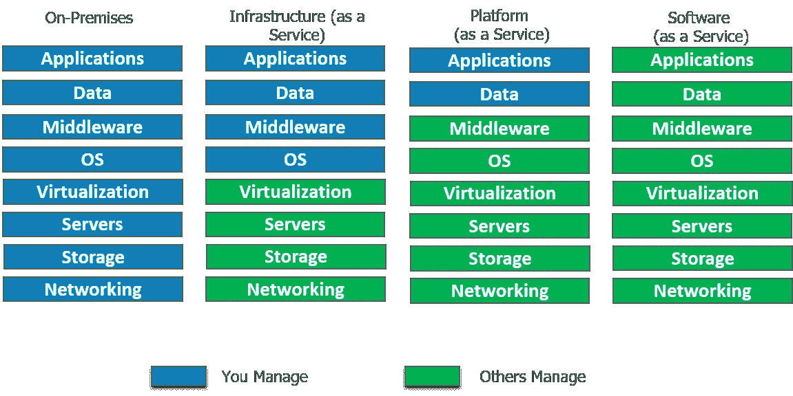

Iaas, Paas and Saas — What is ServiceNow?

## IaaS(基础设施即服务)

*   简而言之，IaaS 在云中给你一个**服务器**，你可以完全控制它。
*   在 Iaas 中，您负责管理从操作系统到您正在运行的应用程序的一切。

## 平台即服务

*   有了 PaaS，您就拥有了灵活性和简单性的结合。
*   灵活，因为它可以根据应用程序的需求进行定制。
*   简单到不需要操作系统维护、版本、补丁。

## SaaS(软件即服务)

*   第三方提供商托管应用程序的软件分发模式。
*   您只需通过互联网访问软件，而不是安装和维护软件。
*   自动更新减轻了内部 IT 人员的负担。

## ServiceNow 在哪里？

ServiceNow 以迎合 ITSM 的 SaaS 模式开始，也冒险进入 PaaS 云模式，在这种模式下，整个组织的业务流程可以通过一个单一的记录系统来管理。ServiceNow 提供了在单一平台上执行数据收集、存储以及应用程序开发所需的基础架构。虽然 ServiceNow 不提供内部 IaaS 部署模型，但它支持集成到 Microsoft Azure，这是一种 Iaas 模型。

它提供**配置管理数据库** (CMDB)以及支持服务感知应用的服务映射。服务映射显示了组织资产之间的依赖关系。这导致了业务环境中急需的*可见性*。

很好，现在让我们尝试解决这篇文章中最重要的问题，什么是 ServiceNow？

# 什么是 ServiceNow？

[ServiceNow](https://www.edureka.co/blog/servicenow-tutorial?utm_source=medium&utm_medium=content-link&utm_campaign=what-is-servicenow) 成立于 2004 年，涉足 ITSM(信息技术服务管理)领域，为 IBM 和惠普等老牌企业提供竞争。今天，它不仅仅局限于 ITSM，尽管它仍然是其收入的主要部分。现在，它已经发展成为五大服务，包括信息技术、安全、人力资源服务、客户服务和商业应用。ServiceNow 是一个集成的**云**解决方案，它将所有这些服务组合在一个单一的记录系统中。

ServiceNow 的副总裁 Dominic Phillips 在他的一个主题演讲中指出，虽然我们在消费领域目睹了如此多的“**颠覆”**，但组织内部的内部**业务流程**却缺乏效率。

在今天的数字时代，优步和 Airbnb 在预订出租车或预定桌子时提供的**便捷访问**是 ServiceNow 希望向其企业内部客户提供的体验。

现在，让我们通过查看 ServiceNow 的架构来了解它的工作原理。

# ServiceNow 架构

如今，大多数云服务产品都运行在古老的多租户架构上，如 AWS、Azure、Salesforce、Oracle 等。多租户架构创建了服务于多个客户的单个实例。这通常处理需要频繁维护的复杂数据库，经常导致客户无法使用资源。这就是为什么 ServiceNow 采用了**多实例**架构。

## **多实例架构:**

为每个雇员创建一个唯一的实例，维护一个单独的资源堆栈。这给了我们处理每个用户具体需求的自由，使我们能够在**客户对客户**的基础上进行交易。例如，可以根据合规性要求以及企业的当前需求来部署客户升级。

在下图中，3 个客户拥有独特的实例，每个实例都有一个独立的资源池。这意味着，虽然硬件是共享的，但软件:应用程序、中间件和数据库都是分开维护的。数据隔离是一个巨大的优势。这就是为什么一个客户的性能不会受到另一个客户实例的影响。很整洁，不是吗？

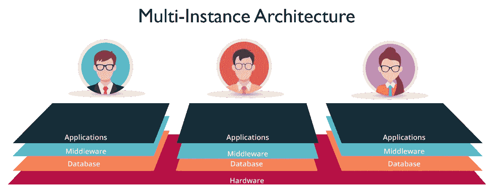

*Multi-Instance Architecture — What is ServiceNow?*

# ServiceNow 应用程序

接下来，在本文中，我们将对 ServiceNow 应用程序进行概述。

## IT 服务台

一份报告发现，每周 45 小时中有 15 小时是在做与工作无关的事情。经查明，这是由于使用了过时的 ITSM 软件。

在 ServiceNow 中，为员工提供了一个自助服务门户，他们可以通过向相关部门员工发送消息来利用 IT 服务。ServiceNow 将社交媒体应用的易用性带到了仍落后于传统系统的 ITSM 市场。

有了 **ConnectChat** ，工作人员可以实时回复。这可以看作是对传统邮件系统的改进，在传统邮件系统中，邮件必须来回发送。这支持跨部门共享文件。员工可以将**事件**文件作为对话的一部分，这样技术人员就可以直接查看事件记录并为请求提供服务。如果用户不确定哪个技术人员在值班，他可以创建一个所有技术人员都是成员的组。**可视化任务板**让你只需一个拖拽的手势就能把任务分配给不同的部门。

## 解决安全威胁

尽管有先进的安全管理机制来检测威胁，但当出现安全漏洞时，大多数公司都面临着解决问题的艰巨任务。

ServiceNow 使用**结构化工作流**，这有助于根据风险的严重性及其对组织的影响确定风险的优先级。

使用电子表格和手动处理，威胁研究通常需要 45 分钟。

然而，自动化工具在平台内部提供这些信息，从而将所涉及的时间减少到 20 秒以下。

## 人力资源服务交付

有没有想过，人力资源部门如何把大部分时间花在重复的任务上，比如员工入职，而实际上他们应该专注于战略任务？

ServiceNow 希望消除所有的手工处理。这些任务跨越 IT、设施、法律和财务等不同部门。ServiceNow 的 **single** 平台可以用来连接 HR **工作流**与所有这些部门。使用其跟踪和趋势分析工具，可以轻松做出决策。人力资源部现在拥有类似消费者的可定制表格，为员工提供满意的服务。

## 客户服务

当务之急是提供不间断的优质服务，同时牢记成本限制。ServiceNow 正在将客户服务转变为一项团队运动。与仅限于客户参与的 CRM(客户关系管理)不同，ServiceNow 客户服务管理(CSM)通过连接正确的**人员、系统和工作流程来运作。**

客户服务不仅限于解决客户问题。每当客户面临问题时，我们都需要找到问题的根源。从长远来看，这将减少案例(票证)数量。ServiceNow 附带了**服务映射**，它提供跨职能信息来发现最初发现错误的初始点。

ServiceNow 使跨工程、现场服务、法律等不同部门的派遣变得容易。以不工作的咖啡机为例。现场代理甚至在开始与客户交谈之前就被告知可能的问题。通过**实时**通知主动通知客户，确保客户满意并快速解决问题。

## 商业应用

ServiceNow 采用拖放方式，无需编写任何代码即可定制业务应用。对于有经验的开发人员来说，您再也不必从头开始，因为您可以使用来自云的信息从可重用的组件、工作流和跨部门的链接障碍中进行选择。

现在，让我们继续阅读本文，了解什么是 PDI。

# 个人开发人员实例(PDI)

PDI 用于演示 ServiceNow 的功能。开发者、客户甚至合作伙伴都可以使用。这个实例背后的动机是，它不会干扰**生产**实例。应用程序的想法可以在 PDI 上测试，但不会添加到最终的应用程序库中。

只要存在常规活动，实例就可以被保留。要被认为是积极的，你需要在 14 天内创建应用程序或编写脚本。现在我们已经了解了 PDI 的，让我们继续探索 ServiceNow 平台。

## 创建个人开发人员实例(PDI)

要请求个人开发人员实例，ServiceNow 开发人员计划将为您提供一个功能齐全的实例，其大小适合单个开发人员使用。让我们研究一下请求个人开发人员实例的两个选项。

**第一步:**登录[https://developer.servicenow.com](https://developer.servicenow.com/)的开发者网站。

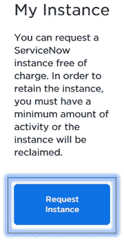

**步骤 2:** 通过执行以下任一操作请求 PDI。

*   从仪表板主页中，单击请求实例。

从开发人员站点上的任何页面，导航到管理>>实例，然后单击请求实例。

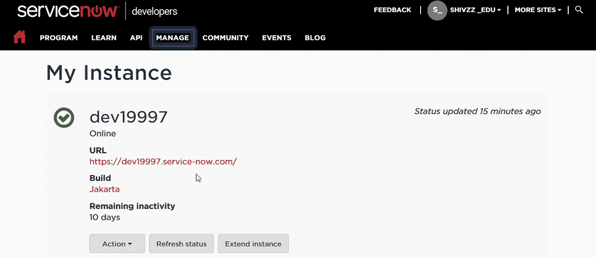

注册成功后，您将获得如上所示的实例副本。您可以点击 URL 并使用您的凭据登录。

ServiceNow 用户界面如下所示。我们以系统管理员身份登录。其主屏幕由以下三个元素组成:

1.  **横幅**:左上角包含 ServiceNow 标志。在右边，你会发现全球搜索引擎，连接聊天，帮助菜单和设置。
2.  **应用导航器**:我们有一个商业应用和模块的列表。
3.  **内容框架:**由不同的数据格式组成，如表格、列表等。

下图是管理员主页的概述。

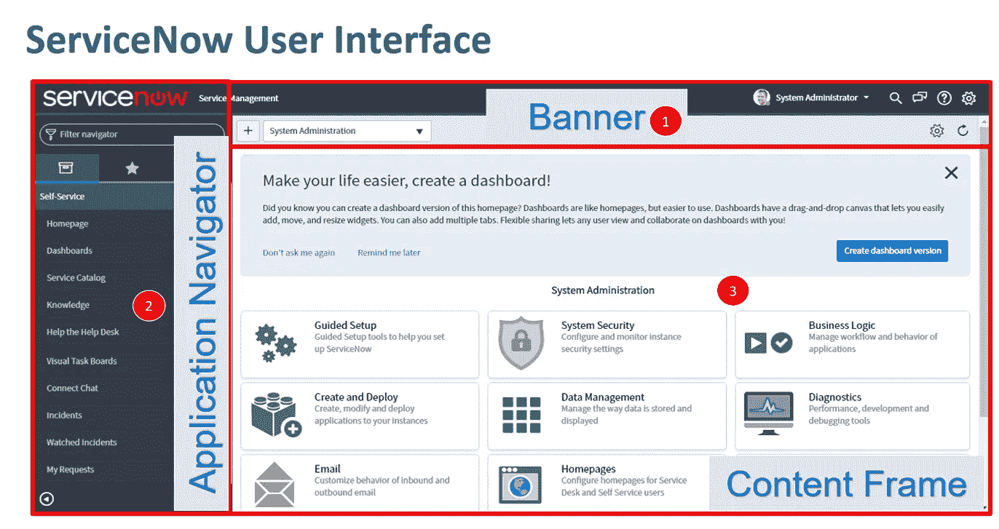

## **用户界面定制**

继续阅读本文，让我们看看如何定制开发人员实例的用户界面。具有管理员角色的用户可以更改 UI 设置。默认情况下，我们使用 UI 16 界面。让我向您展示如何修改标题文本和添加横幅图像。

**第一步:**搜索系统属性。寻找基本配置选项卡。

这使您可以访问**系统配置**设置。

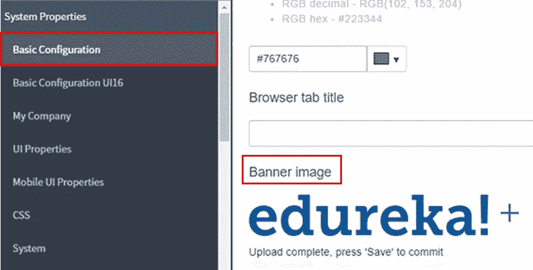

**第 2 步:**您现在可以设置页眉标题并更新横幅图像。

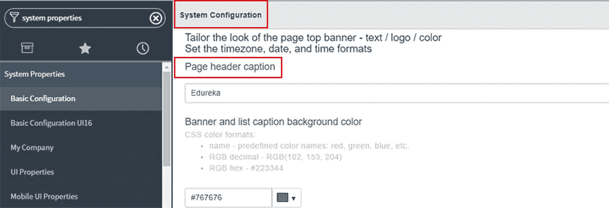

下面是更新后的横幅图片和标题。

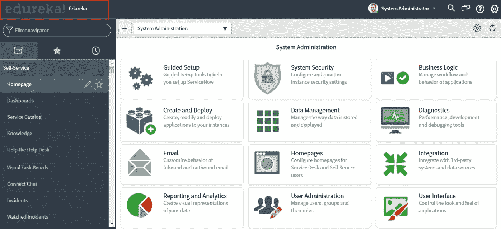

接下来，让我们学习如何在 ServiceNow 中创建报告。

## 创建报告

**步骤 1** :我们可以从现有的表格或数据源创建报表。在我们的示例中，我们将从包含所有事件的现有事件表中生成一个报告。

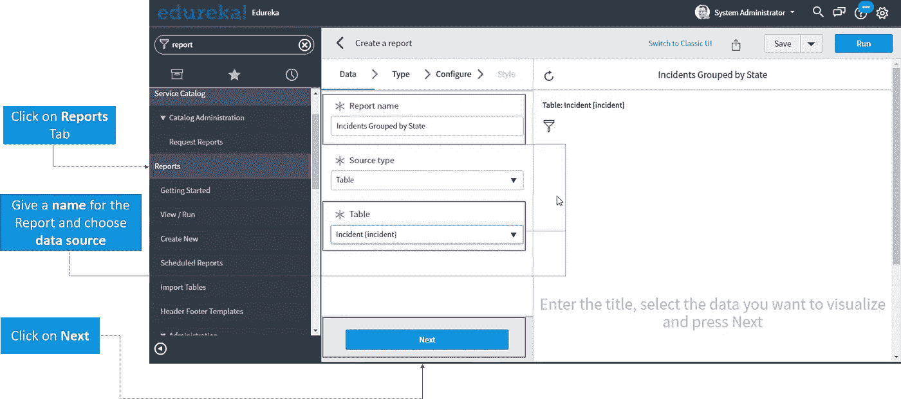

**步骤 2:** 要显示我们的报告，我们可以从条形图、饼图和许多其他选项中进行选择。在我们的例子中，我们将选择条形图选项。

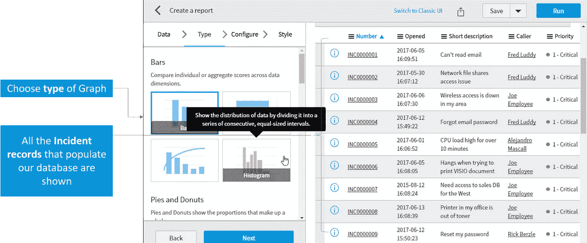

**第三步:**我们根据**状态**参数对报表进行分组。这将事件分为打开、进行中、关闭和已解决状态。

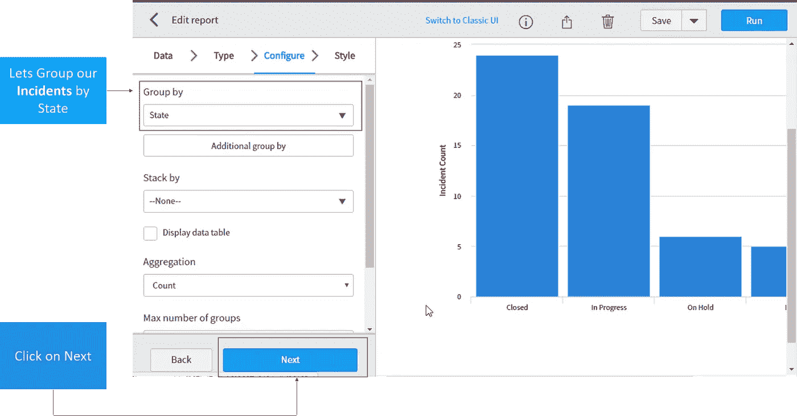

**第四步**:我们可以根据自己的风格要求定制报表。一旦生成，我们的报告可以与其他用户和组共享。

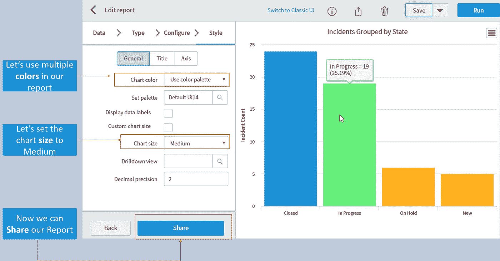

很酷不是吗？现在让我们来分解一下 ServiceNow 的另一个简洁的特性。我们已经提到的一个是工作流。

# 工作流程

工作流提供任务进度。这可以在工作流程的**阶段**字段中看到。工作流用于评估流程中的每个阶段，并自动执行日常任务。这可以与亚马逊订单履行相提并论。ServiceNow 利用了 ITSM 球场上一个主要球员的*缺乏*。这只是他们在 ITSM 吸引消费者的例子之一。

ServiceNow 中工作流的不同阶段如下:等待批准、履行、配置、交付和已完成。每个阶段表示任务是处于**进行中**、**待定**还是**完成**状态。自动向受分配人发送提醒**，突出显示**其任务的当前进度。

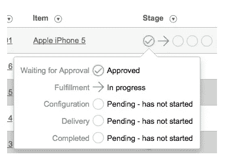

Workflows — What is ServiceNow?

这就把我们带到了本文的结尾。希望这是信息和帮助你。

如果你想查看更多关于人工智能、DevOps、道德黑客等市场最热门技术的文章，那么你可以参考 [Edureka 的官方网站。](https://www.edureka.co/blog/?utm_source=medium&utm_medium=content-link&utm_campaign=what-is-servicenow)

请留意本系列中的其他文章，它们将解释 ServiceNow 的各个其他方面。

> 1. [ServiceNow 教程](/edureka/servicenow-tutorial-55a3ce369e01)
> 
> 2. [ServiceNow ITSM 工具](/edureka/servicenow-itsm-tools-61ef084d3f09)
> 
> 3. [ServiceNow 脚本](/edureka/servicenow-developer-training-3861b03cc7c0)
> 
> 4.[如何获取 ServiceNow 开发者实例？](/edureka/servicenow-developer-instance-5cb073e4949c)

*原载于 2017 年 10 月 25 日 www.edureka.co**的* [*。*](https://www.edureka.co/blog/what-is-servicenow/)