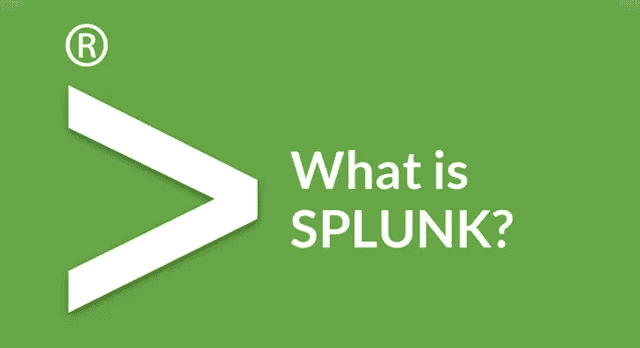
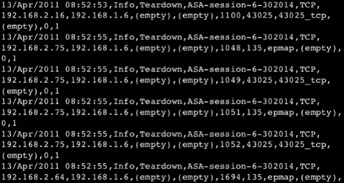
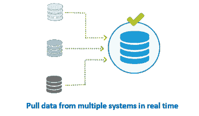
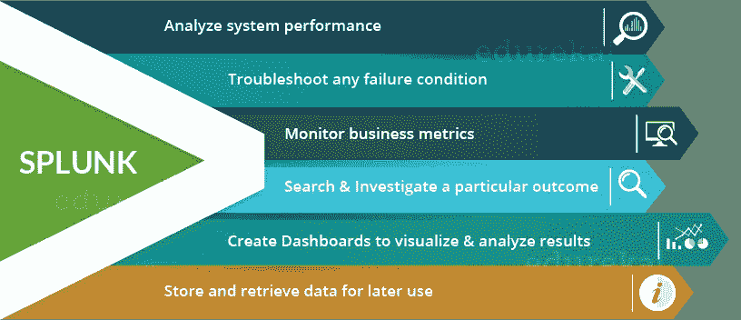
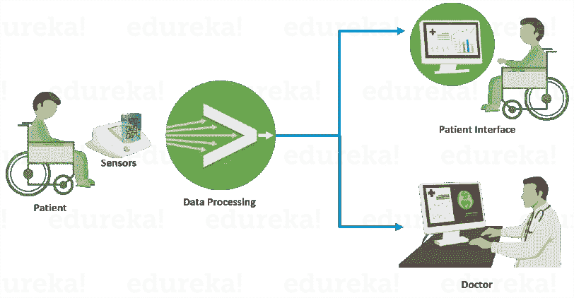

# Splunk 是什么？理解 Splunk 的初学者指南

> 原文：<https://medium.com/edureka/what-is-splunk-26b3cccab039?source=collection_archive---------0----------------------->

What is Splunk — Edureka

您必须意识到在过去十年中机器数据的指数级增长。这部分是因为 It 基础设施中的机器数量不断增加，部分是因为物联网设备的使用越来越多。这些机器数据包含大量有价值的信息，可以提高企业的效率、生产率和可见性。Splunk 成立于 2003 年，目的只有一个:*理解机器生成的日志数据*，从那以后，对 *Splunk* *技能*的需求不断增加。

在这篇博客中，我回答了两个非挥霍无度者问我的常见问题:

*   我们为什么需要使用 Splunk？
*   它如何清除我的问题？

# 对 Splunk 的需求:机器数据挑战

请看下图，了解机器数据的样子。

现在想象一下，如果你是一名系统管理员，试图找出系统硬件中的问题所在，而你偶然发现了如上图所示的日志，你会怎么做？您能找到您的硬件在哪一步让您失败了吗？你也许能弄明白它的可能性微乎其微，但即便如此，也只是在花几个小时理解每个单词的意思之后。简单地告诉你，机器数据是:

*   很难理解
*   以非结构化的形式
*   不适合进行分析/可视化

这就是 Splunk 这样的工具派上用场的地方。您可以将机器数据提供给 Splunk，Splunk 将为您完成繁重的工作(数据处理)。一旦它处理并提取了相关数据，您将能够很容易地定位问题所在。

Splunk 以这种方式开始，但随着大数据的出现，它变得更加突出。由于 Splunk 可以存储和处理大量数据，像我这样的数据分析师开始将[大数据](https://www.edureka.co/blog/big-data-tutorial?utm_source=medium&utm_medium=content-link&utm_campaign=what-is-splunk)输入 Splunk 进行分析。旨在实现可视化的仪表盘是一个新发现，Splunk 很快就被广泛用于大数据领域的分析。

# Splunk 是什么？

[*Splunk*](https://www.edureka.co/blog/splunk-tutorial?utm_source=medium&utm_medium=content-link&utm_campaign=what-is-splunk) *是一个软件平台，用于搜索、分析和可视化从网站、应用程序、传感器、设备等收集的机器生成的数据。它们构成了您的 IT 基础架构和业务。*

如果您有一台持续生成数据的机器，并且您想要实时分析机器状态，那么您将如何做呢？借助 Splunk 可以做到吗？是啊！你可以。下图将帮助您了解 Splunk 如何收集数据。

实时处理是 Splunk 最大的卖点，因为这些年来，我们已经看到存储设备变得越来越好，我们已经看到处理器变得越来越高效，但数据移动却没有。这项技术还没有改进，这是组织内大多数过程的瓶颈。

如果你已经认为 Splunk 是一个很棒的工具，那么请听我说这只是冰山一角。如果您打算为您的企业提供最佳解决方案，无论是系统监控还是数据分析，您都可以放心，这篇博文的剩余部分会让您如痴如醉。

实施 Splunk 的其他好处是:

*   您的输入数据可以是任何格式，例如。csv 或 JSON 或其他格式
*   您可以将 Splunk 配置为在机器状态开始时发出警报/事件通知
*   您可以准确预测扩展基础架构所需的资源
*   您可以为运营智能创建知识对象

对于那些不知道什么是知识对象的人来说，它是一个用户定义的实体，使用它可以通过提取一些有价值的信息来丰富现有的数据。这些知识对象可以是保存的搜索、事件类型、查找、报告、警报等，有助于为您的系统设置智能。

下面的信息图提到了 Splunk 可以使用的一些功能。

为了让您更清楚地了解 Splunk 的工作原理，我将告诉您博世如何使用 Splunk 进行数据分析。他们使用物联网设备(传感器)从远程患者那里收集医疗数据。Splunk 将处理这些数据，任何异常活动都将通过患者界面报告给医生和患者。Splunk 帮助他们实现了以下目标:

*   实时报告健康状况
*   深入研究患者的健康记录并分析模式
*   当患者健康状况恶化时，向医生和患者发出警报/警告

现在，您已经了解了什么是 Splunk 及其在大数据行业的相关性，学习 Splunk 并在分析领域建立职业生涯。到此，我们来结束这篇文章。

如果你想查看更多关于人工智能、DevOps、道德黑客等市场最热门技术的文章，你可以参考 Edureka 的官方网站。

请留意本系列中解释 Splunk 其他各方面的其他文章。

> 1. [Splunk 教程](/edureka/splunk-tutorial-3e1b5a22e6fe)
> 
> 2. [Splunk vs. ELK vs. Sumo 逻辑](/edureka/splunk-vs-elk-vs-sumologic-58138f6cb7f)
> 
> 3. [Splunk 用例:多米诺的成功故事](/edureka/splunk-use-case-da8ac0340f13)
> 
> 4. [Splunk 架构](/edureka/splunk-architecture-c9910b34c745)
> 
> 5. [Splunk 知识对象](/edureka/splunk-events-event-types-and-tags-686244b447b5)
> 
> 6. [Splunk 查找和字段](/edureka/splunk-lookup-and-fields-6751930ce7b3)

*原载于 2016 年 10 月 25 日*[*www.edureka.co*](https://www.edureka.co/blog/what-is-splunk/)*。*